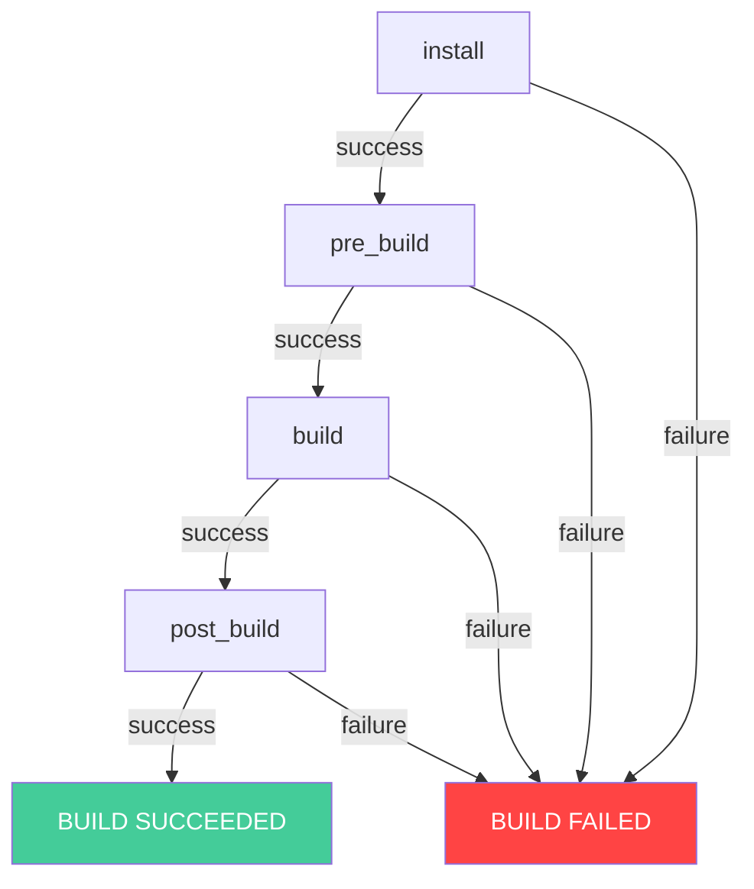
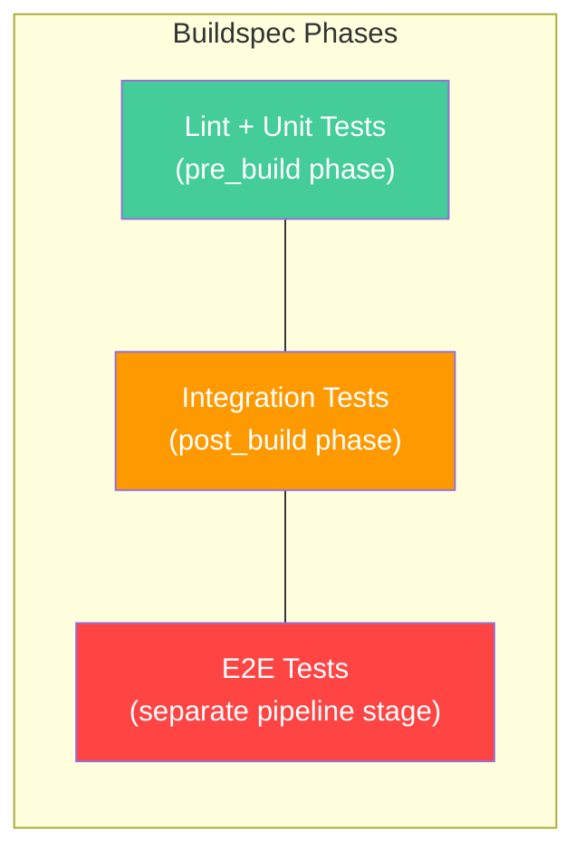

# Outline: Automated Testing in AWS CodeBuild: Building a Multi-Stage Quality Gate

## Target Audience

Developers and DevOps engineers who understand Git and basic AWS CLI usage, and want to set up automated test suites that gate their CI process using AWS-native tooling.

---

## Core Premise

Continuous Integration only works if your tests run automatically and failures actually block bad code from progressing. AWS CodeBuild's buildspec phases give you a natural structure for layering tests — fast unit tests gate the build, integration tests validate the assembled artifact. This post shows how to set that up from scratch, including CodeBuild's test reporting feature for visibility.

---

## Self-Contained Post Requirements

- **All code must be included inline in the post.** Every file the reader needs (`package.json`, `app.js`, test files, `buildspec.yml`, CloudFormation template) must appear in full within the post. No external repository links required to follow along.
- **Diagrams must use mermaid code blocks** embedded directly in the markdown so they render in any mermaid-compatible viewer.
- **A CloudFormation template must be provided** that provisions all prerequisite resources (IAM roles, CodeBuild project, S3 artifact bucket, CodeCommit repository). The reader deploys this stack once, then focuses entirely on writing application code, tests, and the buildspec. The template section should explain every resource it creates and the outputs the reader will reference later.

---

## Post Structure

### 1. Introduction — Why CI Matters

- CI is not a tool — it's the practice of integrating code frequently and validating each integration automatically
- The value: fast feedback, reduced merge conflicts, confidence to deploy
- The cost of skipping CI: "works on my machine" bugs reach production, regressions go unnoticed, deployments become high-stress events
- What this post covers: building a CodeBuild project that runs unit tests, integration tests, and linting across multiple buildspec phases, with test reports for visibility
- What the reader will have by the end: a CodeBuild project with multi-stage test gating and visible test reports in the AWS console

### 2. The Buildspec Phase Model

- Explain how CodeBuild executes a `buildspec.yml` sequentially through phases: `install → pre_build → build → post_build`
- Each phase has a defined purpose:
  - `install`: set up runtimes, install dependencies
  - `pre_build`: fast validation gates (linting, unit tests) — fail here = never build
  - `build`: compile/bundle/package the application
  - `post_build`: heavier validation (integration tests, contract tests) against the built artifact
- The key rule: **a non-zero exit code in any phase stops execution**. No downstream phases run. This is how tests become gates.
- **Mermaid diagram:** flowchart of phase progression with fail/pass branches. Show `install` → decision → `pre_build` → decision → `build` → decision → `post_build` → success, with each decision branching to "BUILD FAILED" on non-zero exit.

### 3. Prerequisites — CloudFormation Template

- Explain: to let the reader focus entirely on CI (writing tests and the buildspec), we provide a CloudFormation template that creates the surrounding infrastructure.
- **The template provisions:**
  - IAM service role for CodeBuild (with permissions for CloudWatch Logs, S3 artifacts, CodeCommit access, and report group creation)
  - CodeCommit repository (empty, ready for the reader to push code)
  - S3 bucket for build artifacts (with versioning)
  - CodeBuild project (configured with source pointing to the CodeCommit repo, using `aws/codebuild/amazonlinux2-x86_64-standard:5.0`, compute type `BUILD_GENERAL1_SMALL`)
- **Template parameters:** none required (uses sensible defaults; region comes from the deploy command)
- **Template outputs:**
  - CodeCommit repository clone URL (SSH)
  - CodeBuild project name
  - S3 artifact bucket name
  - CodeBuild service role ARN
- **Deploy command:**
  ```bash
  aws cloudformation deploy \
    --template-file prerequisites.yaml \
    --stack-name codebuild-multi-stage-lab \
    --capabilities CAPABILITY_NAMED_IAM
  ```
- **Post-deploy verification:** confirm the stack completed, grab outputs with `aws cloudformation describe-stacks`
- **Full CloudFormation YAML must be included inline in the post**

### 4. Project Setup — A Small Node.js API

- Create the project structure:
  - `app.js` — a minimal Express API with 3 routes: `GET /health`, `GET /config/:env`, `GET /add?a=X&b=Y`
  - `package.json` — with scripts for `test:lint`, `test:unit`, `test:integration`, and `test:all`
  - `.eslintrc.json` — basic ESLint config for the lint gate
  - `test/unit/app.test.js` — fast, isolated tests (pure functions, no I/O)
  - `test/integration/api.test.js` — tests that boot the Express server and make HTTP requests against it
- Explain the distinction: unit tests verify individual functions in isolation, integration tests verify that modules work together and respond correctly over HTTP
- Tool choices: mocha + mocha-junit-reporter (produces JUnit XML that CodeBuild reports understand), eslint for linting
- **All files must be provided in full — the reader copies them directly**

### 5. Writing the Buildspec — Tests as Quality Gates

- Full `buildspec.yml` with:
  - `install`: Node.js 18 runtime, `npm ci`
  - `pre_build`: run linting (`npx eslint .`), then unit tests (`npm run test:unit`) — both must pass before build
  - `build`: application packaging step (create a zip of the application for potential deployment)
  - `post_build`: integration tests (`npm run test:integration`)
- The `reports` section:
  - `unit-tests` report group mapped to `test-results/unit.xml` (JUnit XML)
  - `integration-tests` report group mapped to `test-results/integration.xml` (JUnit XML)
- The `artifacts` section: package the application files (excluding `node_modules` and test files)
- Explain design decisions:
  - Why lint + unit tests go in `pre_build` (they're fast — seconds, not minutes — and catch most issues immediately)
  - Why integration tests go in `post_build` (slower, validate the assembled artifact works end-to-end)
  - Why `npm ci` instead of `npm install` (deterministic installs from lockfile, faster in CI, catches lockfile drift)
  - Why linting is a CI gate (consistent code style, catches potential bugs like unused variables or missing returns)
- **Mermaid diagram:** test pyramid mapped to buildspec phases. Show a triangle with layers: "Unit Tests (pre_build) — fast, many" at the base, "Integration Tests (post_build) — slower, fewer" in the middle, "E2E Tests (separate pipeline stage) — slowest, fewest" at the top.

### 6. Push & Run — First Build

- Step-by-step:
  - Clone the CodeCommit repo (URL from CloudFormation output)
  - Copy all project files into the repo
  - `git add . && git commit -m "Initial commit with multi-stage tests" && git push`
  - Trigger the build: `aws codebuild start-build --project-name <from-output>`
  - Poll for completion with `aws codebuild batch-get-builds`
- Walk through the expected output:
  - Build logs showing each phase with timestamps
  - All phases pass → build succeeds
  - Artifacts uploaded to S3

### 7. Reading Test Reports

- Navigate to the CodeBuild console → project → Reports tab
- Explain what's shown:
  - Two report groups: `unit-tests` and `integration-tests`
  - Each report shows: total tests, passed, failed, skipped, duration
  - Drill into individual test cases to see assertion details on failures
- CLI equivalent: `aws codebuild describe-test-cases --report-arn <arn>`
- Mention report retention (30 days by default, configurable, can export to S3 for long-term storage)
- **This is the visibility layer** — anyone on the team can see which tests pass or fail without reading build logs

### 8. Experiment — Breaking a Test to See Gating in Action

- Intentionally break a unit test (change an expected value to something wrong)
- Push and rebuild
- Observe:
  - `pre_build` phase fails (exit code 1 from mocha)
  - `build` and `post_build` phases show status `SKIPPED` — they never execute
  - The build status is `FAILED`
  - The unit-tests report group shows the specific failing test case
- Key insight: **bad code never gets packaged**. The integration tests don't waste time running against a known-broken build.
- Fix the test, push again, confirm all phases pass
- Repeat with a linting error (e.g., declare an unused variable) to show lint gating works the same way

### 9. Connecting to CodePipeline (Enhancement)

- Brief section showing how to wrap the CodeBuild project in a CodePipeline
- Pipeline structure: `Source (CodeCommit)` → `Build (CodeBuild)` → (future: Deploy stage)
- Show the pipeline JSON snippet for the Source and Build stages
- Mention: you can also use two separate CodeBuild actions in the same pipeline (one "Test" action for unit tests, one "Build" action for packaging + integration tests) if you want independent retry/timeout behavior per stage
- Note: this section provides the pipeline JSON but deploying it is optional — the core learning (multi-stage testing) is already complete with just the CodeBuild project

### 10. Going Further — Parallel Test Execution

- For large test suites (hundreds or thousands of tests), sequential execution becomes a bottleneck
- AWS launched parallel test splitting in CodeBuild (January 2025):
  - Uses the `codebuild-tests-run` CLI utility
  - Supports sharding strategies: by file count or by previous execution time
  - Distributes test files across N parallel build environments
  - Reports are automatically merged into a consolidated view (feature added February 2025)
- Brief description of how it works — show the batch configuration snippet and the `codebuild-tests-run` command
- Link to AWS documentation for full setup: [Parallel test execution](https://docs.aws.amazon.com/codebuild/latest/userguide/parallel-test-enable.html)
- When to use: when your test suite takes >5 minutes and the time cost justifies the compute cost of multiple nodes

### 12. Clean Up

- Delete the CloudFormation stack:
  ```bash
  # Empty the S3 bucket first (CloudFormation can't delete non-empty buckets)
  BUCKET=$(aws cloudformation describe-stacks --stack-name codebuild-multi-stage-lab \
    --query 'Stacks[0].Outputs[?OutputKey==`ArtifactBucket`].OutputValue' --output text)
  aws s3 rm s3://$BUCKET --recursive
  aws cloudformation delete-stack --stack-name codebuild-multi-stage-lab
  ```
- Confirm deletion: `aws cloudformation wait stack-delete-complete --stack-name codebuild-multi-stage-lab`
- Note: report groups are retained for 30 days after the project is deleted, then automatically cleaned up

### 13. Conclusion

- Recap: buildspec phases give you a natural test pyramid — fast checks gate slow checks gate deployment
- The exit code is king: any non-zero exit stops the pipeline cold
- CodeBuild test reports give visibility without external tooling (no Jenkins plugins, no third-party dashboards)
- The pattern scales: add more phases, more test types, more report groups as your application grows
- Next: connect this to a full pipeline with deployment strategies (link to future post #4 or #5)

---

## Diagrams (Mermaid)

All diagrams must be included as mermaid code blocks in the final post. Two diagrams are needed:

### Diagram 1 — Buildspec Phase Execution Flow



### Diagram 2 — Test Pyramid Mapped to Buildspec Phases



---

## Code Artifacts (All Included Inline in Post)

The post must be fully self-contained. Every file listed below appears in its entirety within the post body:

1. **`prerequisites.yaml`** — CloudFormation template (IAM role, CodeCommit repo, S3 bucket, CodeBuild project)
2. **`package.json`** — with test/lint scripts and all dependencies
3. **`.eslintrc.json`** — ESLint configuration
4. **`app.js`** — Express API with health, config, and add routes
5. **`test/unit/app.test.js`** — unit tests for pure functions
6. **`test/integration/api.test.js`** — integration tests that hit the running server
7. **`buildspec.yml`** — full multi-phase buildspec with reports section
8. **Pipeline JSON snippet** (Section 9, optional enhancement)

---

## CloudFormation Template Scope

### Resources Created

| Resource | Type | Purpose |
|----------|------|---------|
| CodeBuildServiceRole | `AWS::IAM::Role` | Allows CodeBuild to access logs, S3, CodeCommit, and report groups |
| CodeCommitRepo | `AWS::CodeCommit::Repository` | Source code repository (`multi-stage-testing-lab`) |
| ArtifactBucket | `AWS::S3::Bucket` | Stores build artifacts (versioning enabled) |
| CodeBuildProject | `AWS::CodeBuild::Project` | The build project (Linux, Node.js 18, small compute) |

### Outputs

| Output Key | Value |
|------------|-------|
| RepositoryCloneUrl | CodeCommit HTTPS clone URL |
| ProjectName | CodeBuild project name |
| ArtifactBucket | S3 bucket name |
| ServiceRoleArn | CodeBuild IAM role ARN |

### Design Decisions

- The template does NOT include the application code or buildspec — those are what the reader writes by hand (the learning objective)
- The CodeBuild project is configured to look for `buildspec.yml` in the repository root (default behavior)
- The IAM role includes permissions for `codebuild:CreateReportGroup`, `codebuild:CreateReport`, `codebuild:UpdateReport`, and `codebuild:BatchPutTestCases` so test reports work without manual permission fixes

---

## Tone & Style Notes

- Match the existing blog post: direct, explain *why* before *how*, practical over theoretical
- Use `bash` code blocks for CLI commands, `yaml` for buildspec/CloudFormation, `javascript` for application code, `json` for configuration
- Call out common mistakes as tips (e.g., "if your tests pass locally but fail in CodeBuild, check that you're not relying on environment variables that aren't set in the build environment")
- Keep it focused on CI/testing — deployment strategies are a separate post (#4, #5)
- The CloudFormation template section should be positioned early so the reader deploys it and immediately starts writing code — minimize time spent on infrastructure setup

---

## Sources & References

- [Build specification reference for CodeBuild](https://docs.aws.amazon.com/codebuild/latest/userguide/build-spec-ref.html)
- [Test reports in AWS CodeBuild](https://docs.aws.amazon.com/codebuild/latest/userguide/test-reporting.html)
- [AWS CodeBuild now supports test splitting and parallelism (Jan 2025)](https://aws.amazon.com/about-aws/whats-new/2025/01/aws-codebuild-test-splitting-parallelism/)
- [Accelerating CI with AWS CodeBuild: Parallel test execution now available](https://aws.amazon.com/blogs/aws/accelerating-ci-with-aws-codebuild-parallel-test-execution-now-available/)
- [AWS CodeBuild now supports merging parallel test reports (Feb 2025)](https://aws.amazon.com/about-aws/whats-new/2025/02/aws-codebuild-merging-parallel-test-reports-compute-options/)
