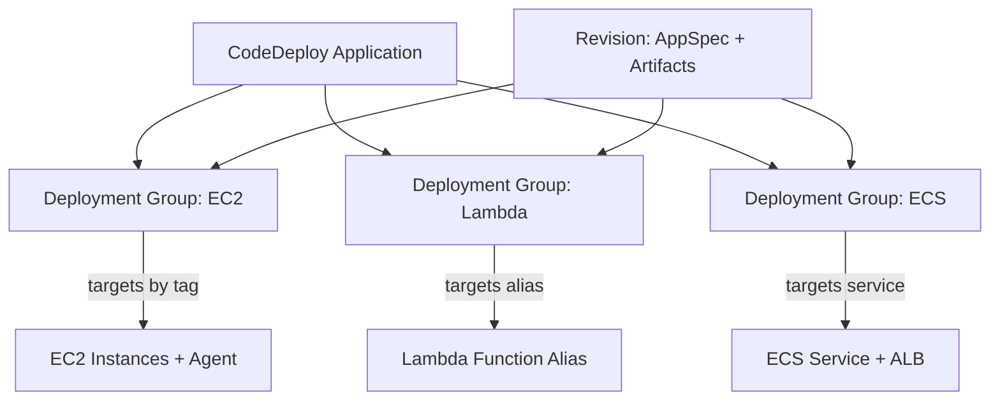
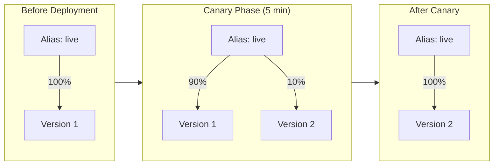
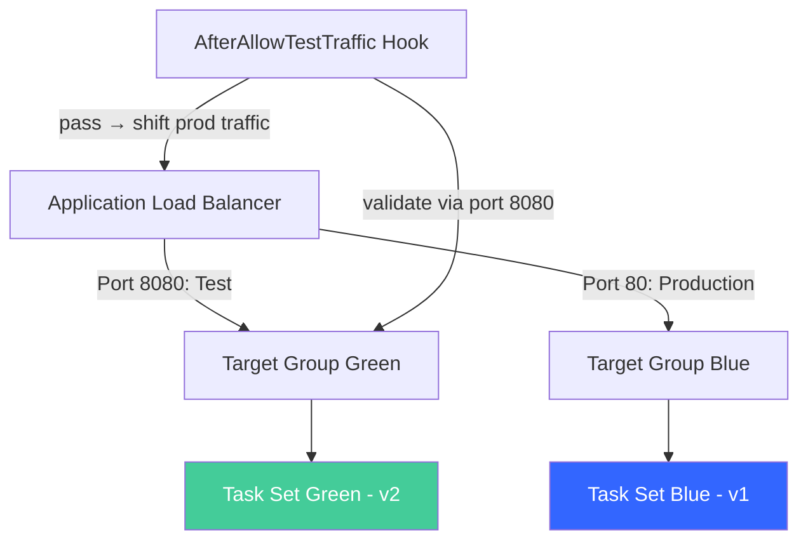

# Outline: Deploy Anywhere with CodeDeploy

## Title Recommendation

The working title "Deploy Anywhere with CodeDeploy" is catchy but undersells the value. It reads slightly generic — "anywhere" could imply geographic distribution rather than compute platform flexibility.

**Recommended title:** **"One Service, Three Compute Platforms: Deploying to EC2, ECS, and Lambda with CodeDeploy"**

Alternative titles considered:
- "CodeDeploy from Zero to Production: EC2, ECS, and Lambda"
- "The Universal Deployer: How CodeDeploy Works Across EC2, ECS, and Lambda"

The recommended title makes the post's unique angle immediately clear: a single deployment service, three fundamentally different compute models, compared side-by-side.

---

## Content Recommendations

1. **Lead with the "why one service" angle.** The most valuable insight isn't that CodeDeploy exists — it's that a single service with a consistent mental model (Application → Deployment Group → Revision + AppSpec) works across three radically different compute platforms. Make this the thesis.

2. **Show the AppSpec differences side-by-side.** The AppSpec file structure differs significantly per platform (files + shell scripts for EC2, Lambda function versions for Lambda, task definitions for ECS). A comparison table or side-by-side code blocks would immediately convey the differences.

3. **Include the ECS native deployment caveat.** Since July 2025, ECS supports native blue/green deployments without CodeDeploy. As of October 2025, ECS also supports native canary and linear strategies. The post should acknowledge this and explain when CodeDeploy for ECS still makes sense (complex lifecycle hooks, integration with CodePipeline V1 action types, organizations already invested in CodeDeploy). Without this, the ECS section feels outdated.

4. **Add a "When NOT to use CodeDeploy" section.** Helps the reader make informed decisions: ECS rolling updates for simple services, SAM/CloudFormation deploy for simple Lambda updates, Elastic Beanstalk for managed platforms.

5. **Keep the EC2 section as the deepest section.** EC2 deployments have the most moving parts (agent installation, IAM roles, lifecycle hooks, S3 bundling) and best demonstrate CodeDeploy's mechanics. Lambda and ECS are comparatively simpler to set up.

6. **End with a comparison table** showing the key differences per platform: AppSpec format, lifecycle hooks, deployment strategies available, rollback mechanism.

---

## Target Audience

DevOps engineers and backend developers who deploy applications to AWS and want to understand how CodeDeploy works across different compute platforms. They know what EC2, ECS, and Lambda are but haven't used CodeDeploy (or have only used it with one platform).

---

## Core Premise

AWS CodeDeploy is a single deployment service that handles three fundamentally different compute platforms — EC2 instances, ECS Fargate services, and Lambda functions — using the same core abstraction: an Application, a Deployment Group, and an AppSpec file that defines what to deploy and how to validate it. This post deploys the same simple web application to all three platforms, showing how CodeDeploy adapts its mechanics (file copying vs. task set replacement vs. alias routing) while maintaining a consistent operational model.

---

## Self-Contained Post Requirements

- **All code must be included inline in the post.** Every file the reader needs (CloudFormation templates, AppSpec files, lifecycle scripts, Lambda code, Dockerfiles, CLI commands) must appear in full. No external repository links required.
- **All code should be preceded by a paragraph briefly explaining what the code does, and must contain in-line comments that reference such an explanation.**
- **Diagrams must use mermaid code blocks** embedded directly in the markdown.
- **A CloudFormation template must be provided** per section that creates the prerequisite infrastructure so the reader can focus on CodeDeploy mechanics rather than setup boilerplate.

---

## Post Structure

### 1. Introduction — One Service, Three Platforms

- The deployment problem: you have applications on EC2, containers on Fargate, and functions on Lambda — do you need three different deployment tools?
- CodeDeploy's value proposition: a single service with a unified model across all three compute platforms
- The core abstraction: Application → Deployment Group → Revision (AppSpec + artifacts)
- What the reader will build: deploy the same "Hello World" web app to EC2, ECS Fargate, and Lambda — observing how CodeDeploy adapts to each platform
- Brief note: ECS now supports native blue/green, canary, and linear deployments without CodeDeploy (since October 2025). This post uses CodeDeploy for ECS to illustrate the unified model and because many production pipelines still rely on it.

### 2. Architecture Overview

- **Mermaid diagram:** CodeDeploy's relationship to each compute platform
  - Shared components: S3 artifact bucket, CodeDeploy service role
  - EC2 path: CodeDeploy Agent on instance → pulls revision from S3 → runs lifecycle hooks
  - ECS path: CodeDeploy orchestrates target group switching on ALB → new task set receives traffic
  - Lambda path: CodeDeploy adjusts alias routing weights → traffic shifts between function versions
- Explain the three-level model:
  - **Application** — logical grouping, tied to a compute platform (EC2/On-premises, Lambda, or ECS)
  - **Deployment Group** — targets (EC2 tag filters, Lambda alias, ECS service) + strategy + alarms
  - **Deployment** — a specific revision pushed to a deployment group

### 3. Part 1 — Deploying to EC2

This is the most detailed section — EC2 deployments have the most moving parts.

#### 3.1 Prerequisites — CloudFormation Template

- Template provisions:
  - EC2 instance (Amazon Linux 2023, t2.micro) with CodeDeploy agent pre-installed via user data
  - IAM instance profile with S3 read access (for pulling revisions)
  - Security group allowing HTTP (port 80)
  - nginx installed and serving a "Version 1.0" page
  - S3 bucket for deployment artifacts
  - CodeDeploy service role with `AWSCodeDeployRole` managed policy
- Outputs: Instance ID, Public IP, S3 bucket name, CodeDeploy role ARN
- Deploy command and verification (`curl` the public IP)

#### 3.2 The CodeDeploy Agent

- What it is: a background process running on EC2 instances that polls CodeDeploy for work
- How it communicates: outbound HTTPS to CodeDeploy service endpoint (no inbound ports needed)
- How CodeDeploy finds instances: tag-based targeting (the deployment group specifies EC2 tag filters)
- Verify the agent is running: `sudo service codedeploy-agent status`

#### 3.3 Create the Application and Deployment Group

- CLI commands to create the CodeDeploy application (compute platform: EC2)
- Create a deployment group targeting instances by tag (`Environment=dev`)
- Explain deployment config: `CodeDeployDefault.AllAtOnce` for this demo (all instances simultaneously)

#### 3.4 Write the AppSpec File

- **appspec.yml** structure for EC2:
  - `version: 0.0`
  - `os: linux`
  - `files:` — what to copy and where
  - `hooks:` — lifecycle event scripts
- Show complete appspec.yml with:
  - `BeforeInstall` — clean up old files
  - `AfterInstall` — configure the deployed files (inject timestamp)
  - `ApplicationStart` — restart nginx
  - `ValidateService` — curl localhost and verify HTTP 200
- Explain the full lifecycle hook order:
  `ApplicationStop → DownloadBundle → BeforeInstall → Install → AfterInstall → ApplicationStart → ValidateService`
- Key insight: `ApplicationStop` runs the *previous* revision's stop script, not the new one

#### 3.5 Bundle, Upload, and Deploy

- Create the deployment directory structure (appspec.yml, html/, scripts/)
- Create lifecycle hook scripts (with inline comments explaining each)
- Zip and upload to S3
- Create the deployment via CLI
- Poll deployment status and observe lifecycle events in order

#### 3.6 Verify and Experiment

- `curl` the instance to confirm new content
- Break the validate script → redeploy → observe failure at `ValidateService` event
- Key takeaway: exit codes drive deployment success/failure. Non-zero = failed event = deployment fails.

### 4. Part 2 — Deploying to Lambda

#### 4.1 Prerequisites — CloudFormation Template

- Template provisions:
  - Lambda function (Node.js, simple HTTP response with version string)
  - Published version + alias (`live`) pointing to version 1
  - Lambda execution role
  - A pre-traffic validation hook function (validates the new version before traffic shifts)
  - CodeDeploy application (compute platform: Lambda) and deployment group with canary config
- Outputs: Function name, Alias ARN, Hook function name, Deployment group name

#### 4.2 How Lambda Deployments Work

- CodeDeploy doesn't copy files or install agents — it adjusts alias routing weights
- Deployment = shifting traffic from one published version to another via the alias
- Strategies: `AllAtOnce`, `Canary10Percent5Minutes`, `Canary10Percent10Minutes`, `Linear10PercentEvery1Minute`, etc.
- Canary = two steps (small percentage → wait → all traffic). Linear = equal increments over time.

#### 4.3 The AppSpec File for Lambda

- Completely different structure from EC2:
  - `Resources:` specifies the function name, alias, current version, and target version
  - `Hooks:` specifies `BeforeAllowTraffic` and `AfterAllowTraffic` validation functions
- Show the complete appspec.yml
- Explain: the hook functions are *separate Lambda functions* that call `PutLifecycleEventHookExecutionStatus` to report success/failure

#### 4.4 Create Version 2 and Deploy

- Update the function code (change version string)
- Publish version 2
- Create the deployment referencing the appspec
- Observe: alias routing weights change during canary window (90/10 split)
- Invoke the function repeatedly during canary to see both versions respond

#### 4.5 Verify and Experiment

- Observe the alias routing config showing `AdditionalVersionWeights`
- After canary interval, all traffic on new version
- Make the pre-traffic hook fail → redeploy → observe immediate rollback (no traffic ever reaches new version)

### 5. Part 3 — Deploying to ECS Fargate

#### 5.1 Prerequisites — CloudFormation Template

- Template provisions:
  - VPC with public subnets (or use default VPC)
  - ECS cluster (Fargate)
  - ECS service with task definition (simple nginx or Node.js container)
  - ALB with two target groups (blue and green) + production listener + test listener
  - ECR repository with a pre-built image
  - CodeDeploy application (compute platform: ECS) and deployment group
- Outputs: Cluster name, Service name, ALB DNS, CodeDeploy app/group names

#### 5.2 How ECS Deployments Work

- CodeDeploy manages blue/green by creating a replacement task set and shifting ALB traffic
- Two target groups: one for current (blue) tasks, one for replacement (green) tasks
- Test listener: allows validation against the green task set before production traffic shifts
- Traffic shifting strategies: `AllAtOnce`, `Canary10Percent5Minutes`, `Linear10PercentEvery1Minute`
- Automatic rollback: if CloudWatch alarms fire during the shift, CodeDeploy switches traffic back to blue

#### 5.3 The AppSpec File for ECS

- Yet another structure:
  - `Resources:` specifies the ECS service, task definition, container name/port, and target groups
  - `Hooks:` specifies Lambda functions for: `BeforeInstall`, `AfterInstall`, `AfterAllowTestTraffic`, `BeforeAllowTraffic`, `AfterAllowTraffic`
- Show the complete appspec.yml
- Key hook: `AfterAllowTestTraffic` — runs validation against the test listener before production traffic shifts

#### 5.4 Deploy a New Task Definition

- Build and push a new container image (v2)
- Register a new task definition revision
- Update the appspec with the new task definition ARN
- Create the deployment
- Observe: new task set spins up, test traffic routes to it, validation runs, then production traffic shifts

#### 5.5 ECS Native Deployments — The Modern Alternative

- Brief section explaining that ECS now supports blue/green, canary, and linear deployments natively (no CodeDeploy needed)
- When to use CodeDeploy for ECS: existing pipelines, complex lifecycle hooks, organizational standardization
- When to use ECS native: new deployments, simpler config, fewer moving parts, tighter ECS integration

### 6. Comparison: CodeDeploy Across Platforms

A summary table comparing the three deployments side by side:

| Aspect | EC2 | Lambda | ECS |
|--------|-----|--------|-----|
| AppSpec focus | Files + lifecycle scripts | Function versions + alias | Task definition + target groups |
| Agent required | Yes (CodeDeploy agent) | No | No |
| Deployment mechanism | File copy + script execution | Alias routing weight adjustment | Task set replacement + ALB target group switch |
| Lifecycle hooks | Shell scripts on the instance | Separate Lambda functions | Separate Lambda functions |
| Rollback mechanism | New deployment of previous revision | Revert alias to previous version | Switch traffic back to original task set |
| Available strategies | AllAtOnce, HalfAtATime, OneAtATime, custom minimum healthy | AllAtOnce, Canary, Linear | AllAtOnce, Canary, Linear |
| Blue/Green support | Yes (via ASG) | Yes (inherent — two versions) | Yes (two target groups) |

### 7. When NOT to Use CodeDeploy

- **Simple Lambda updates:** SAM `sam deploy` or CloudFormation handles gradual deployment via `AutoPublishAlias` + `DeploymentPreference`
- **Simple ECS rolling updates:** ECS rolling update deployment type handles basic rollouts without extra services
- **ECS blue/green without lifecycle hooks:** ECS native blue/green (July 2025+) is simpler and recommended for new deployments
- **Elastic Beanstalk environments:** Beanstalk has its own deployment strategies (rolling, immutable, traffic splitting)
- **When you need CodeDeploy:** unified deployment model across platforms, complex lifecycle hooks, integration with CodePipeline, automatic rollback on CloudWatch alarms, audit trail of deployments

### 8. Clean Up

- Delete resources in reverse order per section
- Reminder: CloudFormation stacks handle most cleanup, but manually-created CodeDeploy resources need explicit deletion
- Check for orphaned resources (target groups, task definitions, Lambda versions)

### 9. Conclusion

- Recap: CodeDeploy's power is its unified model — Application, Deployment Group, AppSpec — adapted to each platform's mechanics
- The AppSpec is the key: it defines *what* to deploy and *how* to validate, regardless of where
- Lifecycle hooks provide safety nets: validate before traffic shifts, roll back automatically if validation fails
- Next steps: combine with CodePipeline for fully automated deployments, add CloudWatch alarms for automatic rollback

---

## Key Diagrams Needed (Mermaid)

### Diagram 1 — CodeDeploy Unified Model

### Diagram 2 — EC2 Deployment Lifecycle

### Diagram 3 — Lambda Canary Traffic Shift

### Diagram 4 — ECS Blue/Green with Test Listener

---

## CloudFormation Templates Scope

### Template 1 — EC2 Deployment Prerequisites

| Resource | Type | Purpose |
|----------|------|---------|
| EC2Instance | `AWS::EC2::Instance` | Target instance with CodeDeploy agent + nginx |
| InstanceProfile + Role | `AWS::IAM::*` | S3 read access for pulling revisions |
| SecurityGroup | `AWS::EC2::SecurityGroup` | HTTP access (port 80) |
| S3Bucket | `AWS::S3::Bucket` | Stores deployment bundles |
| CodeDeployServiceRole | `AWS::IAM::Role` | CodeDeploy service permissions |

### Template 2 — Lambda Deployment Prerequisites

| Resource | Type | Purpose |
|----------|------|---------|
| LambdaFunction | `AWS::Lambda::Function` | Target function (v1) |
| LambdaVersion + Alias | `AWS::Lambda::Version/Alias` | Published version + `live` alias |
| PreTrafficHook | `AWS::Lambda::Function` | Validates new version before traffic shift |
| ExecutionRole | `AWS::IAM::Role` | Lambda execution + CodeDeploy hook permissions |
| CodeDeployApp + Group | `AWS::CodeDeploy::*` | Application + canary deployment group |

### Template 3 — ECS Deployment Prerequisites

| Resource | Type | Purpose |
|----------|------|---------|
| ECSCluster | `AWS::ECS::Cluster` | Fargate cluster |
| TaskDefinition + Service | `AWS::ECS::*` | Running container workload |
| ALB + Listeners | `AWS::ElasticLoadBalancingV2::*` | Production + test listeners, two target groups |
| ECRRepository | `AWS::ECR::Repository` | Container image storage |
| CodeDeployApp + Group | `AWS::CodeDeploy::*` | Application + blue/green deployment group |

---

## Tone & Style Notes

- Match existing posts: direct, practical, explain *why* before *how*
- Use `bash` code blocks for CLI commands, `yaml` for AppSpec/buildspec, `json` for policies, `javascript` for Lambda code
- Avoid mentioning any certification or exam — keep it purely practical
- The EC2 section should be the most detailed (most moving parts). Lambda and ECS sections can be slightly shorter since the reader already understands the CodeDeploy model by then.
- Emphasize the "same mental model, different mechanics" theme throughout
- Keep the ECS native deployment mention honest but brief — the post's purpose is CodeDeploy, not a comparison guide

---

## Sources & References

- [What is CodeDeploy? — AWS Documentation](https://docs.aws.amazon.com/codedeploy/latest/userguide/welcome.html)
- [CodeDeploy AppSpec file reference](https://docs.aws.amazon.com/codedeploy/latest/userguide/reference-appspec-file.html)
- [AppSpec 'hooks' section](https://docs.aws.amazon.com/codedeploy/latest/userguide/reference-appspec-file-structure-hooks.html)
- [Working with deployment configurations in CodeDeploy](https://docs.aws.amazon.com/codedeploy/latest/userguide/deployment-configurations.html)
- [Tutorial: Deploy an Amazon ECS service with a validation test](https://docs.aws.amazon.com/codedeploy/latest/userguide/tutorial-ecs-deployment-with-hooks.html)
- [Choosing between Amazon ECS Blue/Green Native or AWS CodeDeploy — AWS DevOps Blog (Feb 2026)](https://aws.amazon.com/blogs/devops/choosing-between-amazon-ecs-blue-green-native-or-aws-codedeploy-in-aws-cdk/)
- [Migrating from AWS CodeDeploy to Amazon ECS for blue/green deployments — AWS Containers Blog (Sep 2025)](https://aws.amazon.com/blogs/containers/migrating-from-aws-codedeploy-to-amazon-ecs-for-blue-green-deployments/)
- [Gradual deployments in Amazon ECS with linear and canary strategies — AWS Containers Blog (Mar 2026)](https://aws.amazon.com/blogs/containers/gradual-deployments-in-amazon-ecs-with-linear-and-canary-strategies/)
- [AWS CodeDeploy Features](https://aws.amazon.com/codedeploy/features/)
