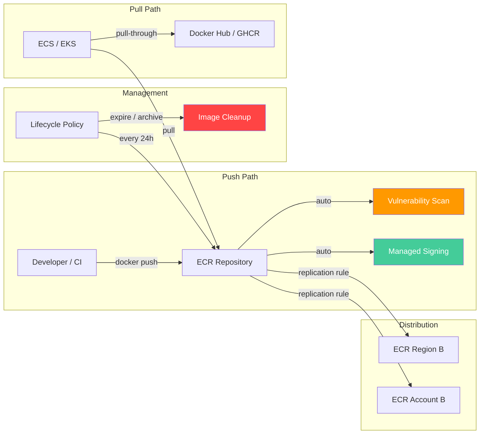
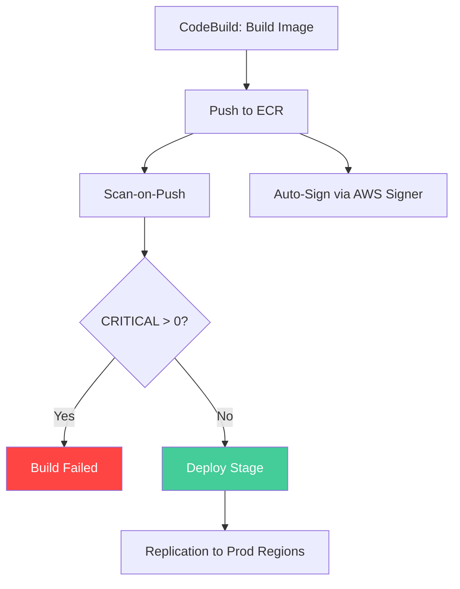
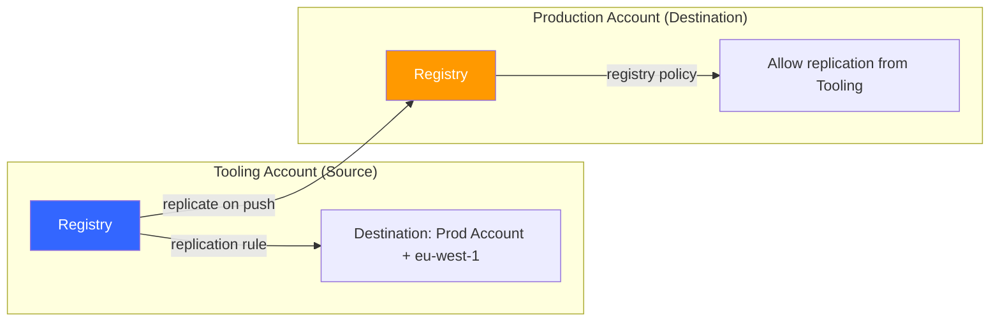

# Outline: Amazon ECR Beyond the Basics: Scanning, Lifecycle Policies, and Multi-Region Replication

## Working Title

**Amazon ECR Beyond the Basics: Scanning, Lifecycle Policies, and Multi-Region Replication**

Alternative titles considered:
- "Securing and Scaling Container Images with Amazon ECR"
- "Hardening Your Container Registry: A Hands-On Guide to ECR's Security and Management Features"

---

## Target Audience

Developers and DevOps engineers who already push container images to ECR and want to operationalize their registry — automated vulnerability scanning, image lifecycle management, supply chain security with image signing, and multi-region/multi-account replication for production workloads.

---

## Core Premise

Most teams use ECR as a dumb storage bucket for Docker images: push, pull, done. But ECR has a full operational layer that most people never configure — vulnerability scanning that catches CVEs before they reach production, lifecycle policies that prevent storage sprawl, pull-through caching that shields you from upstream registry outages, image signing that proves provenance, and replication that makes your images available globally. This post sets up all of these features hands-on and explains when each matters.

---

## Self-Contained Post Requirements

- **All code must be included inline in the post.** Every file the reader needs (CloudFormation template, Dockerfile, policy JSONs, CLI commands) must appear in full. No external repository links required.
- **All code should be preceeded by a paragraph briefly explaining what the code does, and must contain in-line comments that refernce such an explanation**.
- **Diagrams must use mermaid code blocks** embedded directly in the markdown.
- **A CloudFormation template must be provided** that creates the ECR repository with scan-on-push, a lifecycle policy, and a replication configuration. The reader deploys this stack, then explores and extends each feature.

---

## Post Structure

### 1. Introduction — ECR Is More Than a Docker Registry

- Most teams interact with ECR through three commands: `get-login-password`, `docker push`, `docker pull`
- But ECR has a full security and operational layer sitting unused in most accounts
- What this post covers: vulnerability scanning (basic + enhanced), lifecycle policies, tag immutability, pull-through cache, image signing, and cross-region/cross-account replication
- What the reader will have by the end: a production-grade ECR setup with automated scanning, cost-optimized retention, supply chain verification, and global image distribution

### 2. Architecture Overview

- **Mermaid diagram:** shows an ECR registry with the feature layers:
  - Push path: Developer → `docker push` → ECR → Scan-on-Push (Inspector) → Managed Signing (AWS Signer)
  - Lifecycle: Lifecycle Policy engine evaluates rules every 24h → expire/archive
  - Distribution: Replication rules → cross-region ECR / cross-account ECR
  - Pull path: ECS/EKS → Pull-Through Cache (if external) or direct pull (if internal)
- Briefly explain the registry → repository hierarchy: one registry per account per region, many repositories per registry, replication is configured at the registry level

### 3. Prerequisites — CloudFormation Template

- AWS cli configured with enough permissions
- Explanation: to focus on ECR features, we provide a CloudFormation template that creates the baseline setup
- **The template provisions:**
  - An ECR repository (`ecr-deep-dive-app`) with:
    - `scanOnPush: true` (basic scanning enabled by default)
    - `imageTagMutability: IMMUTABLE`
    - `encryptionConfiguration: AES256`
  - A lifecycle policy (expire untagged images after 7 days, keep only last 20 tagged images)
  - An S3 bucket for storing a sample Dockerfile and build artifacts
  - A CodeBuild project that builds and pushes an image to ECR (so the reader can trigger scans without manual Docker builds)
  - IAM roles for CodeBuild (ECR push permissions)
- **Template outputs:**
  - ECR repository URI
  - ECR repository ARN
  - CodeBuild project name
  - S3 bucket name
- **Deploy command:**
  ```bash
  aws cloudformation deploy \
    --template-file prerequisites.yaml \
    --stack-name ecr-deep-dive-lab \
    --capabilities CAPABILITY_NAMED_IAM
  ```
- **Full CloudFormation YAML included inline**

### 4. Vulnerability Scanning — Basic vs. Enhanced

- **Two scanning modes:**
  - **Basic scanning:** on-push only, uses the Common Vulnerabilities and Exposures (CVE) database, scans OS packages only, free, results available via `describe-image-scan-findings`
  - **Enhanced scanning (Amazon Inspector):** continuous scanning (re-scans when new CVEs are published), covers both OS packages AND programming language packages (npm, pip, Maven, Go, etc.), registry-level configuration, costs per image scanned per month
- Step-by-step: push the sample image and review basic scan results
  - `aws ecr describe-image-scan-findings` — show severity breakdown
  - Explain the severity levels: CRITICAL, HIGH, MEDIUM, LOW, INFORMATIONAL, UNDEFINED
- Step-by-step: enable enhanced scanning
  - `aws ecr put-registry-scanning-configuration` with scan type `ENHANCED`
  - Show the difference: language package vulnerabilities now appear
  - Show the continuous re-scan behavior: push once, findings update as new CVEs are published
- **Scan filters:** you can limit enhanced scanning to specific repositories using inclusion filters (useful for cost control — scan production images, skip dev/scratch repos)
- **Inspector integration:** enhanced scanning findings appear in the Amazon Inspector console alongside EC2/Lambda findings, enabling a single-pane vulnerability view
- **New (May 2025):** Inspector maps ECR images to running ECS tasks and EKS pods — you can see which clusters are affected by a vulnerability
- **New (March 2025):** expanded ecosystem support for Go toolchain, Oracle JDK, Apache Tomcat, Apache httpd, WordPress, Node.js
- **Pipeline integration pattern:** in CodeBuild, after pushing the image, query scan findings and fail the build if CRITICAL > 0:
  ```bash
  CRITICAL=$(aws ecr describe-image-scan-findings ... --query 'imageScanFindings.findingSeverityCounts.CRITICAL')
  if [ "$CRITICAL" -gt 0 ]; then exit 1; fi
  ```
- **Exam takeaway:** basic scanning = on-push only, OS packages only, free. Enhanced = continuous, OS + language packages, Inspector-powered, costs money. The exam asks "how do you get notified when a new CVE affects an image you pushed last week?" — answer is enhanced scanning (it re-scans automatically).

### 5. Lifecycle Policies — Automated Image Cleanup

- **The problem:** without lifecycle policies, repositories grow indefinitely. A busy CI pipeline pushing on every commit can generate hundreds of images per week.
- **How lifecycle policies work:**
  - Evaluated once every 24 hours (not real-time)
  - Rules have priorities — lower number = evaluated first
  - Each rule matches images by tag status (tagged, untagged, any) and applies an action
  - Actions: `expire` (delete) or `archive` (move to archive storage class — new Nov 2025)
  - Selection criteria: `sinceImagePushed` (age), `imageCountMoreThan` (count), `sinceImageLastPulled` (usage-based — new with archive)
- **Hands-on: create a multi-rule lifecycle policy**
  - Rule 1 (priority 1): expire untagged images older than 1 day
  - Rule 2 (priority 2): archive tagged images not pulled in 90 days (archive storage class)
  - Rule 3 (priority 3): keep only last 30 images with `v*` tag prefix
  - Rule 4 (priority 10): keep only last 50 images with any tag
- **Preview before applying:**
  - `aws ecr get-lifecycle-policy-preview` — dry-run that shows which images would be affected
  - Always preview first in production repositories
- **Archive storage class (Nov 2025):**
  - New action type in lifecycle policies: archive instead of expire
  - Archived images have a 90-day minimum storage duration
  - Significantly cheaper storage for compliance/retention requirements
  - Can be restored back to standard when needed via `UpdateImageStorageClass` API
  - Lifecycle policies can now use `sinceImageLastPulled` as criteria — archive images nobody uses
- **Tag pattern matching:**
  - Use `tagPatternList` with wildcards: `prod*`, `release-*`, `v*`
  - Combine with `tagPrefixList` for exact prefix matching
- **Exam takeaway:** lifecycle policies evaluate every 24h, not immediately. Rules are evaluated in priority order. Untagged images accumulate fast and should always have a cleanup rule. Know the difference between `sinceImagePushed` (age) and `imageCountMoreThan` (count).

### 6. Tag Immutability and Exceptions

- **Why immutability matters:** prevents overwriting a tagged image (e.g., someone pushes a different `v1.2.3`). In CI/CD, you want tags to be permanent references to specific builds.
- **How to enable:** set `imageTagMutability: IMMUTABLE` on the repository
- **The problem it created:** teams want immutable release tags but still need mutable convenience tags like `latest` or `dev`
- **New (Jul 2025): tag immutability exceptions**
  - You can now provide a list of tag filters that are exempt from immutability
  - Example: all tags immutable EXCEPT `latest` and `dev-*`
  - CLI: `aws ecr put-image-tag-mutability` with exception filters
- **When to keep mutability ON (immutable = false):**
  - Before the exceptions feature (Jul 2025), you had to keep the entire repo mutable if you needed *any* overwritable tag (`latest`, `dev`, `staging`)
  - Now that exceptions exist, most use cases for mutable repos are eliminated — you can be immutable by default and exempt specific tags
  - The remaining cases where full mutability still makes sense:
    - **Development/scratch repositories** where images are rebuilt constantly with the same tag during iteration (e.g., `feature-xyz` tag overwritten 50 times a day)
    - **Repositories where the exception list would be too large or unpredictable** (e.g., dozens of dynamic environment tags generated by CI)
    - **Pull-through cache repositories** — cached images may need tag updates when the upstream publishes a new image under the same tag
  - Rule of thumb: if the repo holds anything that goes to staging or production, use immutable + exceptions. If it's purely ephemeral development work, mutable is fine.
- **Do exceptions remove the need for mutable repos entirely?** Not quite — but they cover 90%+ of the cases that previously forced teams to leave repos mutable. The only remaining gap is repos where the set of overwritable tags is truly dynamic/unpredictable.
- **Exam takeaway:** immutability prevents `ImageTagAlreadyExistsException` — it doesn't prevent deleting images. It's a push-time protection, not a deletion protection.

### 7. Pull-Through Cache Rules

- **The problem:** pulling from Docker Hub, GHCR, or Quay introduces an external dependency. Rate limits (Docker Hub: 100 pulls/6h for anonymous, reduced to 10/h as of Apr 2025), outages, and network latency all affect your builds.
- **How pull-through cache works:**
  - Configure a cache rule mapping a prefix (e.g., `docker-hub/`) to an upstream registry
  - First pull through your ECR URL seeds the cache; subsequent pulls are served locally
  - ECR syncs with upstream at least once every 24 hours to check for updates
- **Supported upstream registries:** Docker Hub, GitHub Container Registry, Quay, Amazon ECR Public, Kubernetes registry (k8s.gcr.io), Azure Container Registry, and private ECR (cross-account)
- **Hands-on:** create a pull-through cache rule for Docker Hub
  ```bash
  aws ecr create-pull-through-cache-rule \
    --ecr-repository-prefix docker-hub \
    --upstream-registry-url registry-1.docker.io \
    --credential-arn arn:aws:secretsmanager:<REGION>:<ACCOUNT_ID>:secret:ecr-pullthroughcache/docker-hub
  ```
  - Pull an image through the cache: `docker pull <ACCOUNT_ID>.dkr.ecr.<REGION>.amazonaws.com/docker-hub/library/nginx:latest`
  - Verify the cached repository was auto-created
- **Integration with lifecycle policies:** cached images follow the same lifecycle rules — set up a retention policy on pull-through repositories to avoid unbounded growth
- **Integration with replication:** pull-through cached images can be replicated cross-region/cross-account like any other ECR image
- **Exam takeaway:** pull-through cache rules are configured at the registry level. They require Secrets Manager for authenticated upstream registries. Cached images are stored in your private registry and count toward your storage costs.

### 8. Managed Image Signing (Nov 2025)

- **The supply chain problem:** how do you know the image you're pulling is the same one your pipeline built? Without signing, anyone with push access could replace an image.
- **How managed signing works:**
  - Configured at the registry level
  - When an image is pushed to ECR, it's automatically signed using AWS Signer
  - The signature is stored as an OCI referrer artifact attached to the image (OCI 1.1 support)
  - No client-side tooling required — signing happens server-side on push
- **Verification at deployment:**
  - EKS: use admission controllers (Kyverno, OPA Gatekeeper) to verify signatures before allowing pod creation
  - General: use `notation verify` with the AWS Signer plugin to validate signatures
- **Comparison with manual signing (AWS Signer + Notation CLI):**
  - Manual: you install Notation, configure the AWS Signer plugin, sign after push, manage signing profiles
  - Managed: zero client setup, automatic on push, centrally governed as registry config
  - Managed signing is the recommended approach for most users
- **Exam takeaway:** image signing proves provenance (who built this image). It complements scanning (which proves the image is safe). Together they form a supply chain security story: build → scan → sign → verify at deploy.

### 9. Cross-Region and Cross-Account Replication

- **Why replicate:**
  - Cross-Region: reduce image pull latency for multi-region deployments, disaster recovery
  - Cross-Account: share images between dev/staging/prod accounts without cross-account pull complexity at runtime
- **How replication works:**
  - Configured at the **registry level** (not per-repository) via `put-replication-configuration`
  - Supports repository filters (only replicate repositories matching a prefix)
  - Replication is near-real-time — images replicate within seconds/minutes of push
  - **Only replicates images pushed after replication is configured** — existing images are NOT backfilled
  - Repositories are auto-created in the destination if they don't exist
- **Cross-Region replication (same account):**
  ```bash
  aws ecr put-replication-configuration --replication-configuration '{
    "rules": [{
      "destinations": [{"region": "eu-west-1", "registryId": "<ACCOUNT_ID>"}],
      "repositoryFilters": [{"filter": "prod", "filterType": "PREFIX_MATCH"}]
    }]
  }'
  ```
  - Verify: push an image, then check `aws ecr describe-images --region eu-west-1`
- **Cross-Account replication:**
  - Source account: configure replication rule with the destination account ID
  - Destination account: **must** add a registry permissions policy allowing the source to replicate
    ```bash
    aws ecr put-registry-policy --policy-text '{...}'
    ```
  - Show both sides of the configuration
- **Replication with KMS encryption:**
  - If repositories use KMS encryption, the destination account needs access to decrypt
  - Or: use AES256 (default) for replicated repositories to avoid KMS cross-account complexity
  - Link to AWS blog on KMS + replication configuration
- **Repository filters:**
  - Limit replication to specific repositories using prefix matching
  - Example: only replicate `prod/*` repositories, skip `dev/*` and `test/*`
  - Reduces cross-region data transfer costs
- **Mermaid diagram:** show replication flow between regions/accounts with filters
- **Exam takeaway:** replication is registry-level, not repo-level. It only works forward (no backfill). Cross-account replication requires a registry permissions policy on the destination. Filters use prefix matching.

### 10. Putting It All Together — Pipeline Integration

- Combine the features into a real pipeline flow:
  1. CodeBuild builds the image and pushes to ECR
  2. Scan-on-push triggers a vulnerability scan
  3. Managed signing auto-signs the image
  4. CodeBuild queries scan results — fail build if CRITICAL vulnerabilities exist
  5. If clean, the pipeline proceeds to deploy
  6. Replication distributes the image to production regions/accounts
  7. Lifecycle policies clean up old dev images automatically
- **Mermaid diagram:** pipeline flow showing each ECR feature as a step
- **Buildspec snippet:** show the post_build phase that gates on scan results
- This bridges post #1 (CodeBuild testing) and post #4 (CodeDeploy) — ECR sits in the middle as the artifact registry

### 11. Clean Up

- Delete the CloudFormation stack
- Remove replication configuration (must be done before stack deletion if destinations exist)
- Remove pull-through cache rules
- Remove registry-level settings (scanning configuration, registry policy)
- Verify deletion across all regions involved

### 12. Conclusion

- Recap: ECR is a full container lifecycle management platform, not just storage
- The security story: scan (find vulnerabilities) + sign (prove provenance) + immutable tags (prevent tampering)
- The operational story: lifecycle policies (control costs) + pull-through cache (eliminate external dependencies) + replication (global availability)

---

## Key Diagrams Needed (Mermaid)

### Diagram 1 — ECR Feature Architecture



### Diagram 2 — Pipeline Integration Flow



### Diagram 3 — Cross-Account Replication Setup



---

## Code Artifacts (All Included Inline in Post)

1. **`prerequisites.yaml`** — CloudFormation template (ECR repo, lifecycle policy, CodeBuild project, IAM roles, S3 bucket)
2. **`Dockerfile`** — Sample multi-stage Node.js Dockerfile (intentionally uses an older base image to demonstrate scanning)
3. **Lifecycle policy JSON** — Multi-rule policy with expire and archive actions
4. **Replication configuration JSON** — Cross-region + cross-account with repository filters
5. **Pull-through cache rule CLI commands**
6. **Registry scanning configuration CLI commands**
7. **Registry permissions policy JSON** (for cross-account replication destination)
8. **Buildspec snippet** — post_build phase that gates deployment on scan results

---

## CloudFormation Template Scope

### Resources Created

| Resource | Type | Purpose |
|----------|------|---------|
| ECRRepository | `AWS::ECR::Repository` | Image repository with scan-on-push, immutable tags, AES256 encryption |
| LifecyclePolicy | (inline on repository) | Expire untagged after 7 days, keep last 20 tagged |
| CodeBuildProject | `AWS::CodeBuild::Project` | Builds and pushes sample Docker image |
| CodeBuildRole | `AWS::IAM::Role` | ECR push, CloudWatch Logs, S3 read |
| ArtifactBucket | `AWS::S3::Bucket` | Stores Dockerfile and build context |

### Outputs

| Output Key | Value |
|------------|-------|
| RepositoryUri | ECR repository URI |
| RepositoryArn | ECR repository ARN |
| ProjectName | CodeBuild project name |
| BucketName | S3 artifact bucket name |

### Design Decisions

- The template creates ONE repository with basic scanning. Enhanced scanning and replication are configured manually by the reader (they're registry-level settings, not repository-level, so they don't fit cleanly in a per-repo CloudFormation resource).
- Tag immutability is enabled by default in the template to demonstrate the feature; the reader will learn to add exceptions.
- The lifecycle policy in the template is intentionally simple — the reader builds a more complex one during the post.

---

## Tone & Style Notes

- Match existing posts: direct, practical, explain *why* before *how*
- Use `bash` code blocks for CLI commands, `json` for policies, `yaml` for CloudFormation/buildspec, `dockerfile` for Dockerfiles
- Call out exam-relevant patterns as "Exam takeaway" callouts
- Keep it focused on ECR — don't re-explain Docker basics or ECS/EKS deployment (those are in posts #4 and #5)
- For features launched after the DOP-C02 exam guide was published (archive storage, managed signing, tag immutability exceptions), note them as "recent additions" that may not appear on the current exam version but are operationally important

---

## Sources & References

- [Amazon ECR User Guide — Image Scanning](https://docs.aws.amazon.com/AmazonECR/latest/userguide/image-scanning-enhanced.html)
- [Amazon ECR User Guide — Lifecycle Policies](https://docs.aws.amazon.com/AmazonECR/latest/userguide/LifecyclePolicies.html)
- [Amazon ECR User Guide — Private Image Replication](https://docs.aws.amazon.com/AmazonECR/latest/userguide/replication-status.html)
- [Amazon ECR User Guide — Pull-Through Cache](https://docs.aws.amazon.com/AmazonECR/latest/userguide/pull-through-cache.html)
- [Amazon ECR User Guide — Managed Signing](https://docs.aws.amazon.com/AmazonECR/latest/userguide/managed-signing.html)
- [Amazon ECR introduces archive storage class (Nov 2025)](https://aws.amazon.com/about-aws/whats-new/2025/11/amazon-ecr-archive-storage-class-container-images/)
- [Amazon ECR now supports managed container image signing (Nov 2025)](https://aws.amazon.com/about-aws/whats-new/2025/11/amazon-ecr-managed-container-image-signing)
- [Amazon ECR now supports exceptions to tag immutability (Jul 2025)](https://aws.amazon.com/about-aws/whats-new/2025/07/amazon-ecr-exceptions-tag-immutability/)
- [Amazon Inspector enhances container security by mapping ECR images to running containers (May 2025)](https://aws.amazon.com/about-aws/whats-new/2025/05/amazon-inspector-container-security-images/)
- [Amazon Inspector expands ECR support for minimal container base images (Mar 2025)](https://aws.amazon.com/about-aws/whats-new/2025/03/amazon-inspector-container-base-images-enhanced-detections/)
- [Cross-Region Replication in Amazon ECR has landed (AWS Containers Blog)](https://aws.amazon.com/blogs/containers/cross-region-replication-in-amazon-ecr-has-landed/)
- [Configuring KMS encryption at rest on ECR repositories with ECR replication (AWS Containers Blog)](https://aws.amazon.com/blogs/containers/configuring-kms-encryption-at-rest-on-ecr-repositories-with-ecr-replication/)
- [Streamline container image signatures with Amazon ECR managed signing (AWS Containers Blog)](https://aws.amazon.com/blogs/containers/streamline-container-image-signatures-with-amazon-ecr-managed-signing/)
- [Diving into OCI Image and Distribution 1.1 Support in Amazon ECR (AWS Open Source Blog)](https://aws.amazon.com/blogs/opensource/diving-into-oci-image-and-distribution-1-1-support-in-amazon-ecr/)
