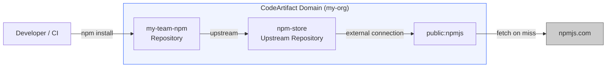
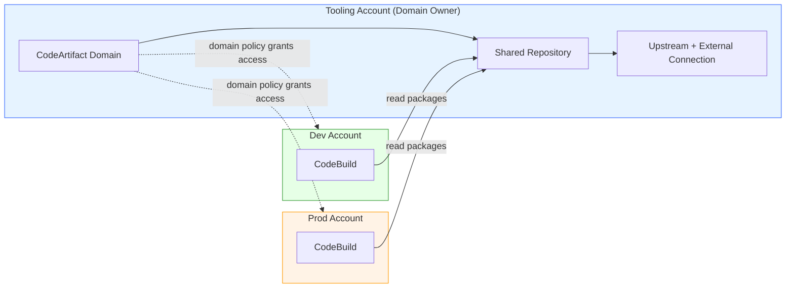

# Outline: Managing Your Software Supply Chain with AWS CodeArtifact

## Title Recommendation

**Suggested title:** "Managing Your Software Supply Chain with AWS CodeArtifact"

The original title "Understanding CodeArtifact" is too generic and passive — it doesn't convey what the reader will *do* or *gain*. The suggested title frames the service in terms of the problem it solves (supply chain management) while staying specific about the tool.

Alternative titles considered:
- "AWS CodeArtifact: One Registry for All Your Packages"
- "Private Package Management in AWS: A Hands-On Guide to CodeArtifact"
- "Stop Depending on Public Registries: Set Up AWS CodeArtifact from Scratch"

---

## Recommendations to Improve the Content

1. **Lead with the problem, not the service.** Start by explaining why teams need a private artifact repository — dependency on public registries creates availability risks (npmjs.com outages), security risks (dependency confusion attacks), and compliance gaps (no audit trail of what was pulled). Then introduce CodeArtifact as the solution.

2. **Include the security angle (package origin controls).** CodeArtifact's package origin controls and package groups are critical features that protect against dependency confusion attacks. Cover how `BLOCK` and `ALLOW` settings on publish and upstream ingestion prevent malicious packages from entering your supply chain.

3. **Show multi-format support beyond npm.** Briefly show how the same domain/repository serves pip and Maven too — this demonstrates the "polyglot" value proposition and matches real-world usage where teams use multiple languages.

4. **Include a CLI-based reproducible setup.** Provide a prerequisites section that sets up the domain, repositories, and upstream connections so the reader can follow along without ambiguity.

5. **Add a CI/CD integration section.** Show how to configure CodeBuild to authenticate to CodeArtifact in the `install` phase of a buildspec. This connects this post to post #1 (CodeBuild) and makes the workflow complete.

6. **Explain token management and expiration.** The `aws codeartifact login` token expires after 12 hours by default. In CI/CD, this matters — the reader needs to know how to handle token refresh in automated environments.

7. **Include a Mermaid diagram.** Show the domain → repository → upstream chain visually. This makes the hierarchy immediately clear before diving into CLI commands.

8. **Cover cross-account sharing via domain policies.** This is a real production concern. Show how a central tooling account owns the domain and other accounts consume packages from it.

---

## Target Audience

Developers and DevOps engineers who install packages from public registries (npm, pip, Maven) in their builds and want to centralize package management — caching public packages, hosting private/internal packages, securing the supply chain against dependency confusion, and sharing packages across teams and AWS accounts.

---

## Core Premise

Every `npm install` in your CI pipeline depends on npmjs.com being up. Every `pip install` trusts that the package you're pulling hasn't been compromised. AWS CodeArtifact eliminates these risks by acting as a managed proxy and private registry — it caches public packages locally (so builds don't break when upstream registries have outages), hosts your internal packages alongside external ones, and gives you IAM-based access control over who can publish and consume packages. This post sets up a complete CodeArtifact workflow from scratch.

---

## Self-Contained Post Requirements

- **All code must be included inline.** Every CLI command, policy JSON, and buildspec snippet appears in full within the post.
- **All code should be preceded by a paragraph explaining what it does, and must contain inline comments referencing that explanation.**
- **Diagrams must use mermaid code blocks** embedded directly in the markdown.
- **No external repository required.** The reader can follow along with just the AWS CLI and a package manager (npm or pip).

---

## Post Structure

### 1. Introduction — Why You Need a Private Package Registry

- The hidden dependency: every build that runs `npm install` or `pip install` depends on a public registry being available, fast, and untampered
- Three problems CodeArtifact solves:
  1. **Availability** — public registry outages break your builds. CodeArtifact caches packages so builds work even when upstream is down.
  2. **Security** — dependency confusion attacks publish malicious packages with internal names to public registries. CodeArtifact's origin controls block this.
  3. **Governance** — no audit trail when developers pull directly from public registries. CodeArtifact logs all access via CloudTrail.
- What this post covers: domain/repository setup, upstream connections, npm and pip integration, package origin controls, CI/CD integration with CodeBuild, cross-account sharing, and token management

### 2. Architecture Overview — The Domain → Repository → Upstream Chain

- **Mermaid diagram** showing the hierarchy:
  - Domain (top-level: deduplicates storage, single encryption key, cross-account policy boundary)
  - Repository (consumer-facing: teams pull from here)
  - Upstream repository (intermediate: connected to external connection)
  - External connection (proxy to public registry: npmjs.com, PyPI, Maven Central)
- Key concepts explained:
  - **Domain:** organizational boundary. All package assets are stored once per domain regardless of how many repositories reference them. One KMS key encrypts everything in the domain. Cross-account access is controlled via domain policies.
  - **Repository:** what developers interact with. Exposes endpoints for npm, pip, Maven, etc. Can have upstream repositories.
  - **Upstream repository:** a repository that another repository pulls from when a package isn't found locally. Creates a chain: your-repo → upstream-repo → external connection → public registry.
  - **External connection:** the bridge to a public registry. One external connection per upstream repository (AWS recommends a dedicated upstream repo per public registry).
  - **Package:** a name + namespace + set of versions. Polyglot — a single repository can hold npm, pip, Maven, NuGet, Cargo, Ruby, Swift, and generic packages simultaneously.
- **Why the chain matters:** when you request a package, CodeArtifact walks the upstream chain. If found at any level, it's cached in every repository in the chain. This means frequently-used packages are served from your direct repository without traversing upstreams.

### 3. Prerequisites

- AWS CLI v2 configured with permissions for CodeArtifact, IAM, and (optionally) CodeBuild
- npm installed locally (for the npm workflow demo)
- pip installed locally (for the pip workflow demo — optional)
- An AWS account — CodeArtifact costs are minimal (storage: $0.05/GB/month, requests: $0.05 per 10,000 requests)
- No CloudFormation template needed for this post — the setup is simple enough to do entirely via CLI, and doing it manually teaches the concepts better

### 4. Step-by-Step: Setting Up CodeArtifact for npm

#### Step 4.1 — Create a domain

- Explain what the domain provides: deduplication, single encryption boundary, cross-account policy attachment point
- CLI command: `aws codeartifact create-domain --domain my-org`
- Note the domain ARN in the output — needed for cross-account policies later

#### Step 4.2 — Create an upstream repository with an external connection

- Explain the pattern: one dedicated upstream repository per public registry
- Create the upstream repo: `aws codeartifact create-repository --domain my-org --repository npm-store`
- Associate the external connection: `aws codeartifact associate-external-connection --domain my-org --repository npm-store --external-connection public:npmjs`
- This repository now proxies npmjs.com — any package request it can't satisfy locally is fetched from npm

#### Step 4.3 — Create the team-facing repository

- This is the repository developers interact with daily
- Create it: `aws codeartifact create-repository --domain my-org --repository my-team-npm`
- Link it to the upstream: `aws codeartifact update-repository --domain my-org --repository my-team-npm --upstreams repositoryName=npm-store`
- Now `my-team-npm → npm-store → npmjs.com` — a two-hop chain

#### Step 4.4 — Configure npm to use CodeArtifact

- Get an auth token: `aws codeartifact login --tool npm --domain my-org --repository my-team-npm`
- Explain what this does: updates `~/.npmrc` with a registry URL and auth token
- The token expires after 12 hours by default (configurable up to 12 hours)
- Install a package: `npm install lodash`
- Verify it was cached: `aws codeartifact list-packages --domain my-org --repository my-team-npm`

#### Step 4.5 — Publish an internal package

- Create a simple internal package (e.g., `@my-org/utils` with a single function)
- Configure npm to publish to CodeArtifact (the `login` command already set this up)
- `npm publish`
- Verify: `aws codeartifact list-package-versions --domain my-org --repository my-team-npm --package utils --namespace my-org --format npm`
- Now the team can `npm install @my-org/utils` from CodeArtifact — internal and external packages from the same registry

### 5. Package Origin Controls — Preventing Dependency Confusion

- **The attack:** an attacker publishes a package named `@your-company/internal-lib` to the public npm registry with a higher version number. Without protection, your builds might pull the malicious public version instead of your internal one.
- **How CodeArtifact prevents this:**
  - **Publish control:** `ALLOW` or `BLOCK` direct publishing of new versions
  - **Upstream control:** `ALLOW` or `BLOCK` ingestion from external connections/upstreams
  - Default behavior: when you publish a package for the first time, CodeArtifact automatically sets Publish=ALLOW, Upstream=BLOCK — meaning the public registry can never inject versions of that package
- Show the CLI: `aws codeartifact put-package-origin-configuration`
- **Package groups (March 2024):** define origin controls for groups of packages using glob patterns
  - Example: block all packages matching `@my-org/*` from being ingested from upstream — they must be published internally
  - CLI: `aws codeartifact create-package-group` with pattern and origin configuration
- **Key takeaway:** CodeArtifact's default origin controls are the built-in defense against dependency confusion. When a public package name conflicts with an internal one, origin controls ensure the internal version always wins.

### 6. Configuring pip (Python) — Same Domain, Different Format

- Show that the same domain and repository can serve Python packages
- Create an external connection for PyPI: `aws codeartifact associate-external-connection --domain my-org --repository pypi-store --external-connection public:pypi`
- Configure pip: `aws codeartifact login --tool pip --domain my-org --repository my-team-python`
- `pip install requests` — verify it's cached in CodeArtifact
- Key point: repositories are polyglot. A single repository can hold both npm and pip packages. But the recommended pattern is separate upstream repositories per public registry, fanning into per-team consumer repositories.

### 7. CI/CD Integration — Using CodeArtifact in CodeBuild

- **The pattern:** add `aws codeartifact login` to the `install` phase of your buildspec
- Full buildspec snippet showing:
  - `install` phase: authenticate to CodeArtifact
  - `pre_build` phase: `npm install` (packages come from CodeArtifact, not npmjs.com directly)
  - If npmjs.com is down, builds still work because packages are cached
- **IAM permissions needed:** the CodeBuild service role needs `codeartifact:GetAuthorizationToken`, `codeartifact:GetRepositoryEndpoint`, `codeartifact:ReadFromRepository`, and `sts:GetServiceBearerToken`
- **Token duration in CI:** the default 12-hour token is fine for build jobs. For long-running processes, consider refreshing the token.
- **Connecting to post #1:** this is where CodeArtifact fits in the pipeline from "CI/CD Explained: Running MultiStage Builds in AWS using CodeBuild"

### 8. Cross-Account Sharing — Domain Policies

- **The scenario:** a central tooling account owns the CodeArtifact domain. Development accounts, staging accounts, and production accounts consume packages from it.
- **Domain policy:** attach a resource policy to the domain that grants read access to other accounts
  ```bash
  aws codeartifact put-domain-permissions-policy --domain my-org --policy-document file://domain-policy.json
  ```
- Show the policy JSON: allow `codeartifact:GetAuthorizationToken`, `codeartifact:GetRepositoryEndpoint`, `codeartifact:ReadFromRepository` for specific account principals
- **Repository policy:** for finer-grained control, attach policies at the repository level
- **Key takeaway:** cross-account CodeArtifact access uses domain policies (or repository policies). The consuming account authenticates with `aws codeartifact login` using a cross-account role or the domain policy grant.

### 9. Operational Considerations

- **Storage and costs:** packages are deduplicated at the domain level. If 10 repositories reference lodash@4.17.21, it's stored once. Pricing is $0.05/GB/month for storage + $0.05 per 10,000 requests.
- **Token management:** tokens expire after 12 hours max. In CI, generate a fresh token at the start of each build. For local development, the `aws codeartifact login` command handles this, but developers need to re-run it daily.
- **VPC endpoints:** for builds running in private subnets (CodeBuild in a VPC, ECS tasks), create a VPC endpoint for CodeArtifact to avoid NAT gateway costs and improve security.
- **CloudTrail integration:** all CodeArtifact API calls are logged in CloudTrail. You can audit who published what, when, and who consumed which packages.
- **Encryption:** all packages are encrypted at rest using the domain's KMS key (or AWS-managed key if you don't specify one). Encryption is transparent — no client-side configuration needed.

### 10. Clean Up

- Delete repositories: `aws codeartifact delete-repository`
- Delete domain: `aws codeartifact delete-domain`
- Restore npm/pip config: `npm config delete registry`, `pip config unset global.index-url`
- Note: deleting the domain deletes all packages stored in it — this is irreversible

### 11. Conclusion

- Recap: CodeArtifact is a fully managed artifact repository that acts as both a cache for public packages and a registry for internal packages
- The value: availability (cached packages survive upstream outages), security (origin controls block dependency confusion), governance (CloudTrail audit trail), and sharing (cross-account via domain policies)
- Where it fits in the pipeline: between your source code and your build — every `npm install` and `pip install` goes through CodeArtifact instead of hitting public registries directly

---

## Key Diagrams Needed (Mermaid)

### Diagram 1 — CodeArtifact Hierarchy and Package Resolution



### Diagram 2 — Cross-Account Architecture



---

## Code Artifacts (All Included Inline in Post)

1. **CLI commands** — create domain, repositories, external connections, upstream links
2. **npm configuration** — `aws codeartifact login` and manual `.npmrc` setup
3. **pip configuration** — `aws codeartifact login --tool pip`
4. **Sample internal package** — minimal `@my-org/utils` package to demonstrate publishing
5. **Package origin control commands** — `put-package-origin-configuration` and `create-package-group`
6. **Buildspec snippet** — CodeBuild integration with CodeArtifact authentication in install phase
7. **Domain policy JSON** — cross-account read access
8. **Repository policy JSON** — finer-grained per-repo access control

---

## Supported Package Formats (Reference)

| Format | External Connection | Namespace Example |
|--------|-------------------|-------------------|
| npm | `public:npmjs` | `@types/node` |
| PyPI | `public:pypi` | (none) |
| Maven | `public:maven-central`, `public:maven-google`, etc. | `com.google.guava` |
| NuGet | `public:nuget-org` | (none) |
| Cargo | `public:crates-io` | (none) |
| Ruby | `public:rubygems-org` | (none) |
| Swift | `public:swift` | scope |
| Generic | (none — internal only) | namespace |

Source: [AWS CodeArtifact supported package formats](https://docs.aws.amazon.com/codeartifact/latest/ug/packages-overview.html)

---

## Tone & Style Notes

- Match existing posts: direct, practical, explain *why* before *how*
- Use `bash` code blocks for CLI commands, `json` for policies, `yaml` for buildspec
- Do NOT mention exams or certifications — keep the tone purely practical/engineering-focused
- Keep it focused on CodeArtifact — don't re-explain npm/pip basics or IAM fundamentals
- Connect to other posts in the series where relevant (CodeBuild in post #1, pipeline context)

---

## Sources & References

- [What is AWS CodeArtifact? (AWS Documentation)](https://docs.aws.amazon.com/codeartifact/latest/ug/welcome.html)
- [AWS CodeArtifact Concepts (AWS Documentation)](https://docs.aws.amazon.com/codeartifact/latest/ug/codeartifact-concepts.html)
- [AWS CodeArtifact Features (AWS)](https://aws.amazon.com/codeartifact/features/)
- [Connect a CodeArtifact repository to a public repository (AWS Documentation)](https://docs.aws.amazon.com/codeartifact/latest/ug/external-connection.html)
- [Editing package origin controls (AWS Documentation)](https://docs.aws.amazon.com/codeartifact/latest/ug/package-origin-controls.html)
- [Package group origin controls (AWS Documentation)](https://docs.aws.amazon.com/codeartifact/latest/ug/package-group-origin-controls.html)
- [Improve the security of your software supply chain with Amazon CodeArtifact package group configuration (AWS Blog, March 2024)](https://aws.amazon.com/blogs/aws/improve-the-security-of-your-software-supply-chain-with-amazon-codeartifact-package-group-configuration)
- [AWS CodeArtifact supported package formats (AWS Documentation)](https://docs.aws.amazon.com/codeartifact/latest/ug/packages-overview.html)
- [AWS CLI — codeartifact reference](https://docs.aws.amazon.com/cli/latest/reference/codeartifact/index.html)
