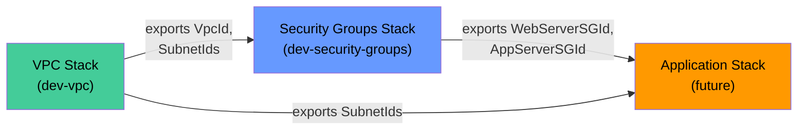
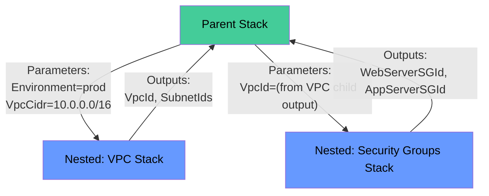

# Advanced CloudFormation: Cross-Stack References and Nested Stacks

A single CloudFormation stack can only take you so far. Real-world infrastructure spans multiple stacks — networking, compute, data, application — each owned by different teams with different release cadences. At some point you hit the walls: 500 resources per stack, team ownership boundaries, and resources with fundamentally different lifecycles that shouldn't be coupled in the same deployment.

CloudFormation provides two composition patterns for multi-stack architectures:

1. **Cross-stack references** — independent stacks sharing values via `Export` and `Fn::ImportValue`. Different lifecycles, different teams, but shared data.
2. **Nested stacks** — a parent stack that deploys child stacks as resources. Same lifecycle, same team, deployed together.

These patterns are not interchangeable. Cross-stack references give you independence at the cost of manual dependency tracking. Nested stacks give you coordinated deployment at the cost of coupling. Choosing wrong creates tight coupling where you want freedom, or fragmentation where you want coordination.

This post assumes you have the VPC stack from the [CloudFormation from Scratch](cloudformation-from-scratch-vpc.md) post deployed with the stack name `dev-vpc`. We'll import its exports to build layered infrastructure on top.

## Cross-Stack References — Export and ImportValue

### How Exports Work

When a stack declares an output with an `Export` block, that value becomes available Region-wide to any other stack in the same account. Think of it as publishing a value to a shared registry that lives at the Region level.

The rules are straightforward:

- Export names must be **unique within a Region** — across all stacks in the account, not just yours
- The naming convention `${AWS::StackName}-ResourceName` prevents collisions because stack names are already unique per account/Region
- Exports are **read-only** — you cannot modify or delete an export that's currently being imported by another stack
- Exports are **same-Region only** — a stack in `us-east-1` cannot import from a stack in `eu-west-1` (for cross-Region, see [Fn::GetStackOutput](https://docs.aws.amazon.com/AWSCloudFormation/latest/TemplateReference/intrinsic-function-reference-getstackoutput.html) or SSM Parameter Store)

Our VPC stack from Post #1 already exports four values:

| Export Name | Value |
|-------------|-------|
| `dev-vpc-VpcId` | The VPC ID |
| `dev-vpc-PublicSubnetIds` | Comma-separated public subnet IDs |
| `dev-vpc-PrivateSubnetIds` | Comma-separated private subnet IDs |
| `dev-vpc-NatGatewayId` | NAT Gateway ID (conditional) |

You can verify these exports exist with:

```bash
aws cloudformation list-exports \
  --query 'Exports[?starts_with(Name, `dev-vpc`)].{Name:Name,Value:Value}' \
  --output table
```

Expected output:

```
-----------------------------------------------------------
|                       ListExports                       |
+----------------------------+----------------------------+
|           Name             |           Value            |
+----------------------------+----------------------------+
|  dev-vpc-VpcId             |  vpc-0a1b2c3d4e5f67890     |
|  dev-vpc-PublicSubnetIds   |  subnet-aaa111,subnet-bbb222 |
|  dev-vpc-PrivateSubnetIds  |  subnet-ccc333,subnet-ddd444 |
+----------------------------+----------------------------+
```

Note that `dev-vpc-NatGatewayId` is absent — we deployed the VPC with `EnableNatGateway=false`, so the conditional output doesn't exist.

### Building a Security Group Stack That Imports the VPC

Now we'll create an independent stack that consumes the VPC exports. This stack defines layered security groups: a public-facing `WebServerSG` allowing HTTP/HTTPS from the internet, and an internal `AppServerSG` that only accepts traffic on port 8080 from the web tier.

The template uses `Fn::ImportValue` to retrieve the VPC ID from the VPC stack's exports. Because export names include the stack name, we use `Fn::Sub` inside `Fn::ImportValue` to build the export name dynamically from a parameter — this lets the same template import from any VPC stack by changing the parameter value:

```yaml
AWSTemplateFormatVersion: '2010-09-09'
Description: >
  Layered security groups that import VPC ID from an existing stack.
  Demonstrates cross-stack references with Fn::ImportValue.

Parameters:
  # The name of the VPC stack whose exports we consume
  # This makes the template flexible — works with any VPC stack that follows the export naming convention
  NetworkStackName:
    Type: String
    Default: dev-vpc
    Description: Name of the VPC stack to import from

Resources:
  # Web-tier security group — allows HTTP and HTTPS from anywhere
  # Uses Fn::ImportValue with Fn::Sub to dynamically resolve the export name
  WebServerSG:
    Type: AWS::EC2::SecurityGroup
    Properties:
      GroupDescription: Allow HTTP/HTTPS from the internet
      VpcId: !ImportValue
        Fn::Sub: '${NetworkStackName}-VpcId'
      SecurityGroupIngress:
        - IpProtocol: tcp
          FromPort: 80
          ToPort: 80
          CidrIp: '0.0.0.0/0'
        - IpProtocol: tcp
          FromPort: 443
          ToPort: 443
          CidrIp: '0.0.0.0/0'
      Tags:
        - Key: Name
          Value: WebServerSG

  # App-tier security group — only accepts traffic from the web tier on port 8080
  # The SourceSecurityGroupId reference creates a chain: internet → WebServerSG → AppServerSG
  AppServerSG:
    Type: AWS::EC2::SecurityGroup
    Properties:
      GroupDescription: Allow port 8080 from web tier only
      VpcId: !ImportValue
        Fn::Sub: '${NetworkStackName}-VpcId'
      SecurityGroupIngress:
        - IpProtocol: tcp
          FromPort: 8080
          ToPort: 8080
          SourceSecurityGroupId: !Ref WebServerSG
      Tags:
        - Key: Name
          Value: AppServerSG

Outputs:
  # Export SG IDs so further downstream stacks can reference them
  WebServerSecurityGroupId:
    Description: Web server security group ID
    Value: !Ref WebServerSG
    Export:
      Name: !Sub '${AWS::StackName}-WebServerSGId'

  AppServerSecurityGroupId:
    Description: App server security group ID
    Value: !Ref AppServerSG
    Export:
      Name: !Sub '${AWS::StackName}-AppServerSGId'
```

Deploy the security group stack:

```bash
aws cloudformation create-stack \
  --stack-name dev-security-groups \
  --template-body file://security-groups.yaml \
  --parameters ParameterKey=NetworkStackName,ParameterValue=dev-vpc

aws cloudformation wait stack-create-complete --stack-name dev-security-groups
```

This creates a dependency chain: the SG stack imports from the VPC stack, and future stacks (ALB, ECS, etc.) can import from the SG stack. Each stack is independently deployable, owned by different teams, and updated on its own schedule.



### The Deletion Dependency

Cross-stack references create an implicit protection mechanism. Try to delete the VPC stack while the SG stack is importing its exports:

```bash
aws cloudformation delete-stack --stack-name dev-vpc
```

This will fail with:

```
An error occurred (ValidationError) when calling the DeleteStack operation:
Export dev-vpc-VpcId cannot be deleted as it is in use by dev-security-groups
```

CloudFormation prevents deleting a stack whose exports are consumed by other stacks. This is a feature, not a bug — it stops someone from accidentally pulling the network out from under running application infrastructure.

You also cannot modify an exported value while it's being imported. If you try to update the VPC stack in a way that changes the exported VPC ID, CloudFormation rejects the update.

To find which stacks are consuming a specific export:

```bash
aws cloudformation list-imports --export-name dev-vpc-VpcId
```

```json
{
    "Imports": [
        "dev-security-groups"
    ]
}
```

To delete the VPC stack, you must first either delete the importing stack or update it to remove the `!ImportValue` references:

```bash
# Delete in dependency order — consumers first, then the provider
aws cloudformation delete-stack --stack-name dev-security-groups
aws cloudformation wait stack-delete-complete --stack-name dev-security-groups

# Now the VPC stack can be deleted
aws cloudformation delete-stack --stack-name dev-vpc
aws cloudformation wait stack-delete-complete --stack-name dev-vpc
```

### Limitations and Alternatives

`Fn::ImportValue` has constraints that matter in practice:

- **Same-Region only** — you cannot import an export from another Region. A VPC stack in `us-east-1` cannot share its outputs with a stack in `eu-west-1` through this mechanism.
- **Same-account only** — cross-account references are not supported.
- **Cannot use inside `!If` or `Fn::If`** — `!ImportValue` doesn't work inside condition expressions. You can't conditionally import a value.
- **Creates hard coupling** — the import/export contract is rigid. Renaming an export requires coordinating with all consumers.

For scenarios where these limitations bite, there are alternatives:

**[Fn::GetStackOutput](https://docs.aws.amazon.com/AWSCloudFormation/latest/TemplateReference/intrinsic-function-reference-getstackoutput.html)** — this intrinsic function references any stack output across accounts and Regions without requiring the source stack to declare an `Export`. It creates a weak reference resolved at deploy time. This is the modern replacement for cross-Region/cross-account sharing:

```yaml
# Reference an output from a stack in another account/Region
VpcId: !GetStackOutput
  StackName: 'arn:aws:cloudformation:us-west-2:111111111111:stack/prod-vpc/abc123'
  OutputKey: VpcId
```

**SSM Parameter Store** — write the value to a parameter in the source account/Region, read it from the target. Works cross-Region and cross-account (with IAM permissions). Adds a runtime dependency on the parameter existing.

**CI/CD pipeline parameters** — the pipeline reads outputs from one stack and passes them as parameters to the next. No CloudFormation coupling at all, but requires pipeline orchestration.

## Nested Stacks — Same Lifecycle Composition

### When to Use Nested Stacks

Nested stacks solve a different problem than cross-stack references. Where cross-stack references connect independent stacks, nested stacks group related resources that should deploy together as a unit.

Use nested stacks when:

- **You have reusable components** — a VPC module, a standard logging setup, or a security baseline that multiple parent stacks include
- **You're hitting the 500-resource limit** — each nested stack gets its own 500-resource quota
- **The same team owns parent and children** — they deploy together, update together, and delete together
- **You want encapsulation** — internal resources of the child are hidden from the parent

The parent-child relationship is key: the parent creates, updates, and deletes children. You don't deploy nested stacks independently — you deploy the parent and it handles the rest.

### Creating a Nested Stack

The parent template uses the `AWS::CloudFormation::Stack` resource type to declare a child. The `TemplateURL` must point to an S3 URL — CloudFormation doesn't support local file paths for nested templates. Parameters flow from parent to child, and outputs flow back via `!GetAtt`.



### Example: VPC + Security Groups as Nested Stacks

The VPC template from Post #1 already works as a nested child — it accepts parameters and produces outputs. But the security groups template needs a small change for nested use: instead of `!ImportValue` (which creates a cross-stack reference), it receives the VPC ID as a parameter from the parent. Save this as `security-groups-nested.yaml`:

```yaml
AWSTemplateFormatVersion: '2010-09-09'
Description: Security groups child template (for nested stack use)

Parameters:
  # VPC ID passed from the parent stack
  VpcId:
    Type: AWS::EC2::VPC::Id
    Description: VPC to create security groups in

Resources:
  WebServerSG:
    Type: AWS::EC2::SecurityGroup
    Properties:
      GroupDescription: Allow HTTP/HTTPS from the internet
      VpcId: !Ref VpcId
      SecurityGroupIngress:
        - IpProtocol: tcp
          FromPort: 80
          ToPort: 80
          CidrIp: '0.0.0.0/0'
        - IpProtocol: tcp
          FromPort: 443
          ToPort: 443
          CidrIp: '0.0.0.0/0'
      Tags:
        - Key: Name
          Value: WebServerSG

  AppServerSG:
    Type: AWS::EC2::SecurityGroup
    Properties:
      GroupDescription: Allow port 8080 from web tier only
      VpcId: !Ref VpcId
      SecurityGroupIngress:
        - IpProtocol: tcp
          FromPort: 8080
          ToPort: 8080
          SourceSecurityGroupId: !Ref WebServerSG
      Tags:
        - Key: Name
          Value: AppServerSG

Outputs:
  WebServerSecurityGroupId:
    Value: !Ref WebServerSG
  AppServerSecurityGroupId:
    Value: !Ref AppServerSG
```

Now upload both child templates to S3. Nested stack templates must be accessible via HTTPS URL — CloudFormation fetches them during deployment:

```bash
# Create an S3 bucket for templates (one-time setup)
aws s3 mb s3://cfn-templates-$(aws sts get-caller-identity --query Account --output text)

# Upload the VPC template from Post #1
aws s3 cp vpc.yaml s3://cfn-templates-$(aws sts get-caller-identity --query Account --output text)/nested/vpc.yaml

# Upload the security groups template
aws s3 cp security-groups-nested.yaml s3://cfn-templates-$(aws sts get-caller-identity --query Account --output text)/nested/security-groups.yaml
```

Now the parent template that wires everything together. It deploys both children as `AWS::CloudFormation::Stack` resources, passes the VPC output from the first child into the second, and surfaces the final outputs:

```yaml
AWSTemplateFormatVersion: '2010-09-09'
Description: >
  Parent stack that deploys VPC and Security Groups as nested stacks.
  Demonstrates same-lifecycle composition.

Parameters:
  Environment:
    Type: String
    AllowedValues: [dev, staging, prod]
    Default: dev
    Description: Target environment

  TemplateBucket:
    Type: String
    Description: S3 bucket containing the nested stack templates

Resources:
  # Nested VPC stack — deploys the full VPC infrastructure
  # Parameters flow from parent to child via the Parameters property
  VPCStack:
    Type: AWS::CloudFormation::Stack
    Properties:
      TemplateURL: !Sub 'https://${TemplateBucket}.s3.amazonaws.com/nested/vpc.yaml'
      Parameters:
        Environment: !Ref Environment
        EnableNatGateway: 'false'

  # Nested Security Groups stack — receives VPC ID from the VPC child's output
  # !GetAtt retrieves outputs from the nested stack using Outputs.OutputName syntax
  SecurityGroupsStack:
    Type: AWS::CloudFormation::Stack
    Properties:
      TemplateURL: !Sub 'https://${TemplateBucket}.s3.amazonaws.com/nested/security-groups.yaml'
      Parameters:
        VpcId: !GetAtt VPCStack.Outputs.VpcId

Outputs:
  VpcId:
    Description: VPC ID from the nested VPC stack
    Value: !GetAtt VPCStack.Outputs.VpcId

  WebServerSGId:
    Description: Web server security group from the nested SG stack
    Value: !GetAtt SecurityGroupsStack.Outputs.WebServerSecurityGroupId
```

Deploy the parent stack:

```bash
ACCOUNT_ID=$(aws sts get-caller-identity --query Account --output text)

aws cloudformation create-stack \
  --stack-name dev-infrastructure \
  --template-body file://parent-stack.yaml \
  --parameters \
    ParameterKey=Environment,ParameterValue=dev \
    ParameterKey=TemplateBucket,ParameterValue=cfn-templates-${ACCOUNT_ID}

aws cloudformation wait stack-create-complete --stack-name dev-infrastructure
```

When you deploy the parent, CloudFormation creates the children in dependency order — `VPCStack` first (because `SecurityGroupsStack` references its output), then `SecurityGroupsStack`. Deleting the parent deletes children in reverse order automatically.

### Nested vs. Cross-Stack — Decision Framework

| Aspect | Cross-Stack References | Nested Stacks |
|--------|----------------------|---------------|
| Lifecycle | Independent — each stack deployed separately | Same — parent controls all children |
| Ownership | Different teams can own different stacks | Same team owns parent and children |
| Deployment | Separate `create-stack` calls | Single parent deployment |
| Deletion order | Manual — you track dependencies | Automatic — parent handles order |
| Template storage | Local or S3 | **Must be in S3** |
| Resource limit | 500 per stack | 500 per stack, but distributed |
| Coupling | Export/import contract | Parameter/output contract |
| Visibility | Each stack visible in console | Children nested under parent |

**Rule of thumb:** If different teams own the stacks or they update on different schedules, use cross-stack references. If the same team owns everything and it deploys as a unit, use nested stacks.

## Stack Policies — Protecting Critical Resources

### What Stack Policies Do

Stack policies prevent accidental replacement or deletion of critical resources during stack updates. Without a policy, `update-stack` can replace any resource — including your production VPC, database, or encryption key — if the update requires it.

A stack policy is a JSON document attached to a stack that specifies which update actions are allowed on which resources. Key behaviors:

- Once set, a stack policy **cannot be removed** — only replaced with a new one
- Without a policy, the default is: all update actions allowed on all resources
- With a policy, the default flips: **all updates are denied** unless explicitly allowed
- Policies are evaluated during `update-stack` and `execute-change-set` operations

### Applying a Stack Policy

Set a stack policy on the VPC stack that allows all modifications but prevents replacement of the VPC resource itself. This protects against CIDR changes that would trigger VPC recreation:

```bash
aws cloudformation set-stack-policy \
  --stack-name dev-vpc \
  --stack-policy-body '{
    "Statement": [
      {
        "Effect": "Allow",
        "Action": "Update:*",
        "Principal": "*",
        "Resource": "*"
      },
      {
        "Effect": "Deny",
        "Action": "Update:Replace",
        "Principal": "*",
        "Resource": "LogicalResourceId/VPC"
      }
    ]
  }'
```

The policy structure:

- **`Effect`** — `Allow` or `Deny`
- **`Action`** — what update action to control: `Update:Modify` (in-place changes), `Update:Replace` (destroy and recreate), `Update:Delete` (remove the resource), or `Update:*` (all)
- **`Principal`** — always `"*"` (stack policies don't support IAM principal filtering)
- **`Resource`** — which logical resources: `LogicalResourceId/VPC` for a specific resource, or `LogicalResourceId/*` for all resources

The statements are evaluated together. If both Allow and Deny apply to the same action on the same resource, **Deny wins** (just like IAM policies). So our policy says: allow all update actions on all resources, except deny replacement of the VPC.

Verify the policy is in place:

```bash
aws cloudformation get-stack-policy --stack-name dev-vpc
```

```json
{
    "StackPolicyBody": "{\"Statement\":[{\"Effect\":\"Allow\",\"Action\":\"Update:*\",\"Principal\":\"*\",\"Resource\":\"*\"},{\"Effect\":\"Deny\",\"Action\":\"Update:Replace\",\"Principal\":\"*\",\"Resource\":\"LogicalResourceId/VPC\"}]}"
}
```

Now if someone tries to change the VPC CIDR (which requires replacement), the update fails:

```
Resource handler returned message: "Action denied by stack policy:
Update:Replace on resource LogicalResourceId/VPC"
```

### Temporarily Overriding a Stack Policy

Sometimes you legitimately need to replace a protected resource — a planned migration, a CIDR block change, or a resource rename. Stack policies support a temporary override that applies only to a single update operation:

```bash
aws cloudformation update-stack \
  --stack-name dev-vpc \
  --template-body file://vpc.yaml \
  --parameters ParameterKey=Environment,ParameterValue=dev \
               ParameterKey=VpcCidr,ParameterValue=10.1.0.0/16 \
  --stack-policy-during-update-body '{
    "Statement": [
      {
        "Effect": "Allow",
        "Action": "Update:*",
        "Principal": "*",
        "Resource": "*"
      }
    ]
  }'
```

The `--stack-policy-during-update-body` temporarily permits all actions for this specific update. Once the update completes (or fails), the original restrictive policy is back in effect. The override is never persisted.

This separation of concerns is deliberate: the stack policy protects against accidents, but doesn't prevent intentional changes by someone who explicitly overrides it. For true prevention, combine stack policies with IAM policies that deny `cloudformation:SetStackPolicy` for non-admin roles.

## Clean Up

Delete resources in dependency order — consumers first, then providers:

```bash
ACCOUNT_ID=$(aws sts get-caller-identity --query Account --output text)

# 1. Delete the nested stack parent (deletes children automatically)
aws cloudformation delete-stack --stack-name dev-infrastructure
aws cloudformation wait stack-delete-complete --stack-name dev-infrastructure

# 2. Delete cross-stack demo stacks in dependency order (consumers first)
aws cloudformation delete-stack --stack-name dev-security-groups
aws cloudformation wait stack-delete-complete --stack-name dev-security-groups

aws cloudformation delete-stack --stack-name dev-vpc
aws cloudformation wait stack-delete-complete --stack-name dev-vpc

# 3. Delete the S3 bucket used for nested stack templates
aws s3 rb s3://cfn-templates-${ACCOUNT_ID} --force
```

## Conclusion

We've covered the two patterns CloudFormation provides for composing infrastructure beyond a single stack:

**Cross-stack references** connect independent stacks within a Region. The VPC stack exports its IDs, the security group stack imports them. Each stack has its own lifecycle, owned by different teams, updated independently. The export/import contract creates a deletion dependency that prevents accidental breakage — and stack policies extend that protection to updates, preventing accidental replacement of critical resources.

**Nested stacks** group related resources under a parent. Same team, same lifecycle, deployed as a unit. The parent handles creation order, parameter passing, and deletion. Templates must live in S3. Use nested stacks for reusable modules and for exceeding the 500-resource limit.

The decision between them comes down to ownership and lifecycle. If different teams own the stacks or they update independently, use cross-stack references. If the same team owns everything and it deploys as a unit, use nested stacks.

### DOP-C02 Exam Tips

- **Deletion dependency** — you cannot delete a stack whose exports are imported by another stack. `list-imports` shows consumers.
- **Export uniqueness** — export names must be unique per Region per account, not per stack.
- **`Fn::ImportValue` limitations** — same-Region only, cannot be used inside `!If` conditions.
- **`Fn::GetStackOutput`** — the newer alternative to `Fn::ImportValue` that works cross-account and cross-Region without requiring exports.
- **Nested stack templates must be in S3** — local paths don't work for `TemplateURL`.
- **Stack policies can't be removed** — only replaced. Default with a policy: deny all unless explicitly allowed.
- **Stack policy override** — `--stack-policy-during-update-body` is temporary, applies to one update only.

