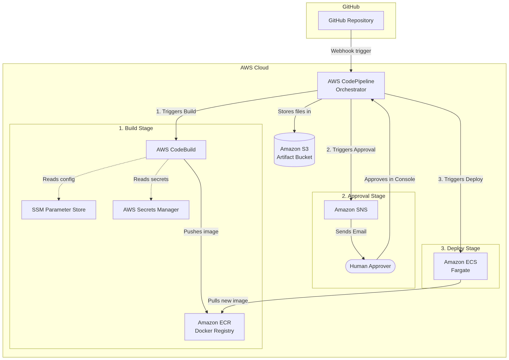
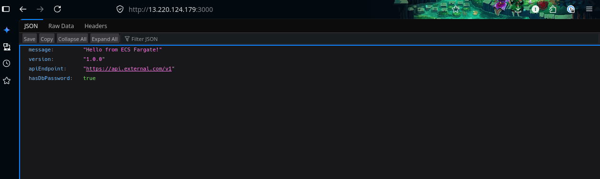

# Building a Complete CI/CD Pipeline in AWS: From GitHub to ECS Fargate

If you want to deliver software faster and with fewer bugs, you need a CI/CD pipeline. **CI (Continuous Integration)** automates the process of building and testing your code every time someone commits a change. **CD (Continuous Deployment/Delivery)** automates releasing that validated code to your servers.

In this post, we are going to build a fully automated, AWS-native CI/CD pipeline. We'll connect a GitHub repository, build a Docker container, pause for a manual human approval, inject secure environment variables, and deploy to [Amazon ECS](https://aws.amazon.com/ecs/) on [AWS Fargate](https://aws.amazon.com/fargate/).

Here is the architecture we will build:



Let's dive in.

## Prerequisites & Application Code

Before starting, make sure you have the AWS CLI v2 installed and configured (`aws configure`).
You also need a VPC with at least one public subnet for the Fargate task to run in — the default VPC that comes with every AWS account works fine.

Create a new GitHub repository called `my-web-app` and add the following two files. This is the application we will be deploying.

To kick things off, we need an actual application to deploy. We'll build a lightweight web server using modern Node.js features like ECMAScript Modules (ESM) and the nullish coalescing operator.

This application uses the built-in `node:http` module to listen for incoming requests and responds with a simple JSON payload. It also reads environment variables, which we will inject securely later via our AWS pipeline, to demonstrate how configurations and secrets are passed to the running container.

**1. `index.mjs`** (A modern Node.js web server using ES Modules):

```javascript
// Using the native ESM import for the built-in HTTP module
import { createServer } from 'node:http';

// Utilizing the nullish coalescing operator (??) to set a fallback port
const port = process.env.PORT ?? 3000;

const server = createServer((req, res) => {
  res.writeHead(200, { 'Content-Type': 'application/json' });
  res.end(JSON.stringify({
    message: 'Hello from ECS Fargate!',
    version: '1.0.0',
    // Reading the environment variables that our AWS pipeline will securely inject
    apiEndpoint: process.env.API_ENDPOINT ?? 'Not Set',
    hasDbPassword: !!process.env.DB_PASSWORD
  }));
});

server.listen(port, () => {
  console.log(`Server running on port ${port}`);
});
```

Next, we need to containerize our application so it can be deployed to ECS Fargate. A Dockerfile provides the blueprint for packaging our app along with its runtime environment into a standardized unit.

We are using the official Alpine Linux version of Node.js 24 as our base image to keep the container size small and secure. The file copies our server code, exposes the necessary network port, and defines the command to start the app.

**2. `Dockerfile`** (To containerize the app using the latest LTS Node.js 24):

```dockerfile
# Start from the secure and lightweight Alpine Linux Node.js 24 image
FROM public.ecr.aws/docker/library/node:24-alpine
WORKDIR /usr/src/app
# Copy our modern index.mjs application code into the container
COPY index.mjs ./
EXPOSE 3000
# Define the command to execute our app using the node runtime
CMD ["node", "index.mjs"]
```

Commit and push these files to your GitHub repository's `main` branch.

## Step 1: Connect AWS to GitHub

For AWS to automatically build and deploy your code whenever you push a commit, it needs secure access to your GitHub repository. [AWS CodeConnections](https://docs.aws.amazon.com/dtconsole/latest/userguide/welcome-connections.html) bridges the gap between third-party source providers and AWS services.

By running the command below, we initiate a connection request to GitHub. This establishes the webhook mechanism that will eventually trigger our [AWS CodePipeline](https://aws.amazon.com/codepipeline/). Remember, this command only starts the process; manual authorization in the AWS Console is strictly required to finalize the handshake.

```bash
# Initiates a connection to GitHub that acts as a secure webhook bridge
aws codestar-connections create-connection \
  --provider-type GitHub \
  --connection-name my-github-connection
# NOTE: The connection is created in a "Pending" state and requires console approval.
```

> **Important:** Go to the **AWS Console** > **CodePipeline** > **Settings** > **Connections**, click your new connection, and click **Update pending connection** to authorize the AWS app in your GitHub account. Take note of the Connection ARN, you will need it later.

## Step 2: Manage Secrets and Environment Variables

Modern applications should never hardcode configuration URLs or sensitive passwords. AWS provides two distinct services for this: [Systems Manager (SSM) Parameter Store](https://docs.aws.amazon.com/systems-manager/latest/userguide/systems-manager-parameter-store.html) for general configuration data, and [Secrets Manager](https://aws.amazon.com/secrets-manager/) for highly sensitive credentials.

In this step, we create one of each. We store the ECR repository name in Parameter Store — CodeBuild will read this at build time to know where to push images. We store a database password in Secrets Manager — ECS will inject this into the running container at runtime.

```bash
# 1. Store the ECR repository name as build-time configuration in Parameter Store
aws ssm put-parameter \
  --name "/myapp/prod/ecr-repo-name" \
  --value "my-web-app" \
  --type String

# 2. Store the API endpoint our app reads at runtime
aws ssm put-parameter \
  --name "/myapp/prod/api-endpoint" \
  --value "https://api.external.com/v1" \
  --type String

# 3. Create a secure, encrypted password JSON object in Secrets Manager
aws secretsmanager create-secret \
  --name myapp/prod/credentials \
  --secret-string '{"db_password":"SuperSecret123!"}'
```

This separation is intentional: Parameter Store values drive the build process and non-sensitive values (although it does support sensitive values too), while Secrets Manager holds sensitive credentials the application needs at runtime. You'll see each used in its appropriate context in the steps ahead.

## Step 3: Set Up the Target Environment (ECS Fargate)

Before we can build or run our Docker container in the cloud, we must provision the foundational infrastructure. 

First, we need a secure place to store the compiled Docker images.

We will create an [Amazon Elastic Container Registry (ECR)](https://aws.amazon.com/ecr/) repository to hold our app's versions. Then, we create an Amazon Elastic Container Service (ECS) cluster, which serves as the logical grouping for our serverless Fargate containers.

```bash
# Create the ECR repository to securely store compiled Docker images
aws ecr create-repository --repository-name my-web-app

# Create the logical ECS cluster to group our serverless deployments
aws ecs create-cluster --cluster-name my-app-cluster
```

Amazon ECS needs exact instructions on how to run your Docker container. This is done using a Task Definition, which acts like a blueprint for your application's operational requirements.

Before creating the task definition, we need an IAM role that grants ECS permission to pull container images from ECR and write logs to CloudWatch on behalf of our task. This is called the ECS Task Execution Role.

```bash
# Create the trust policy that allows ECS to assume this role
aws iam create-role \
  --role-name ecsTaskExecutionRole \
  --assume-role-policy-document '{
    "Version": "2012-10-17",
    "Statement": [{
      "Effect": "Allow",
      "Principal": {"Service": "ecs-tasks.amazonaws.com"},
      "Action": "sts:AssumeRole"
    }]
  }'

# Attach the AWS-managed policy that covers ECR pulls and CloudWatch logs
aws iam attach-role-policy \
  --role-name ecsTaskExecutionRole \
  --policy-arn arn:aws:iam::aws:policy/service-role/AmazonECSTaskExecutionRolePolicy

# Allow the role to read our runtime secrets from SSM and Secrets Manager
aws iam attach-role-policy \
  --role-name ecsTaskExecutionRole \
  --policy-arn arn:aws:iam::aws:policy/AmazonSSMReadOnlyAccess
aws iam attach-role-policy \
  --role-name ecsTaskExecutionRole \
  --policy-arn arn:aws:iam::aws:policy/SecretsManagerReadWrite
```

The JSON file below defines critical runtime parameters such as the required CPU and memory allocation, network mode, and the IAM role the task will assume. It also specifies the ECR image URL and maps the container port so traffic can reach our app. The `secrets` block tells ECS to inject our API endpoint and database password as environment variables when the container starts — this is the correct pattern for passing sensitive configuration to running applications.

**`task-def.json`**:

```json
{
  "family": "my-web-app-task",
  "networkMode": "awsvpc",
  "requiresCompatibilities": ["FARGATE"],
  "cpu": "256",
  "memory": "512",
  "executionRoleArn": "arn:aws:iam::<ACCOUNT_ID>:role/ecsTaskExecutionRole",
  "containerDefinitions": [
    {
      "name": "my-web-app-container",
      "image": "<ACCOUNT_ID>.dkr.ecr.<REGION>.amazonaws.com/my-web-app:latest",
      "portMappings": [{ "containerPort": 3000, "hostPort": 3000, "protocol": "tcp" }],
      "secrets": [
        {
          "name": "API_ENDPOINT",
          "valueFrom": "<your parameter store value arn>"
        },
        {
          "name": "DB_PASSWORD",
          "valueFrom": "<your secret arn>"
        }
      ]
    }
  ]
}
```

> *Make sure to replace `<ACCOUNT_ID>` and `<REGION>` with your actual AWS details.*

With the task definition ready, we register the JSON blueprint with ECS and create the service with zero running tasks (for now). But first, we need a security group that allows inbound traffic on port 3000 so we can reach our app from the internet.

```bash
# Create a security group that allows inbound traffic on port 3000
SG_ID=$(aws ec2 create-security-group \
  --group-name ecs-my-web-app-sg \
  --description "Allow inbound HTTP on port 3000 for ECS task" \
  --query "GroupId" --output text)

aws ec2 authorize-security-group-ingress \
  --group-id $SG_ID \
  --protocol tcp \
  --port 3000 \
  --cidr 0.0.0.0/0
```

We set `--desired-count 0` because the container image doesn't exist in ECR yet — it will be pushed by our first pipeline run. The CodePipeline deploy stage will then update this service with the new image and scale it up.

```bash
# Register the application blueprint parameters defined in our JSON
aws ecs register-task-definition --cli-input-json file://task-def.json

# Create the Fargate service with 0 tasks (no image available yet)
aws ecs create-service \
  --cluster my-app-cluster \
  --service-name my-web-service \
  --task-definition my-web-app-task \
  --desired-count 0 \
  --launch-type FARGATE \
  --network-configuration "awsvpcConfiguration={subnets=[<YOUR_SUBNET_ID>],securityGroups=[$SG_ID],assignPublicIp=ENABLED}"
```

> **Note:** Replace `<YOUR_SUBNET_ID>` with a subnet from your default VPC. You can find your subnet IDs with `aws ec2 describe-subnets --filters "Name=default-for-az,Values=true" --query "Subnets[].SubnetId"`.

## Step 4: The Build Phase (AWS CodeBuild)

[AWS CodeBuild](https://aws.amazon.com/codebuild/) relies on a YAML configuration file to know exactly what steps to execute during the build phase. This file, typically named `buildspec.yml`, lives right alongside your application code.

Our buildspec does several important things: it reads build-time configuration from Parameter Store, logs into our ECR registry, builds the Docker image, pushes it to ECR, and finally generates an `imagedefinitions.json` file. This generated file is critical because it tells CodePipeline exactly which new image tag to deploy.

**`buildspec.yml`**:

```yaml
version: 0.2
env:
  # Pull build-time configuration from Parameter Store
  parameter-store:
    ECR_REPO_NAME: "/myapp/prod/ecr-repo-name"

phases:
  pre_build:
    commands:
      # Derive the AWS Account ID from the built-in CodeBuild ARN
      - "AWS_ACCOUNT_ID=$(echo $CODEBUILD_BUILD_ARN | cut -d: -f5)"
      # Authenticate Docker daemon with Amazon ECR
      - echo Logging in to Amazon ECR...
      - aws ecr get-login-password --region $AWS_DEFAULT_REGION | docker login --username AWS --password-stdin $AWS_ACCOUNT_ID.dkr.ecr.$AWS_DEFAULT_REGION.amazonaws.com
      - REPOSITORY_URI=$AWS_ACCOUNT_ID.dkr.ecr.$AWS_DEFAULT_REGION.amazonaws.com/$ECR_REPO_NAME
      - "COMMIT_HASH=$(echo $CODEBUILD_RESOLVED_SOURCE_VERSION | cut -c 1-7)"
      - IMAGE_TAG=${COMMIT_HASH:=latest}
  build:
    commands:
      # Execute Docker build and tag it
      - echo Building the Docker image...
      - docker build -t $REPOSITORY_URI:latest .
      - docker tag $REPOSITORY_URI:latest $REPOSITORY_URI:$IMAGE_TAG
  post_build:
    commands:
      # Push images to ECR and generate the critical image definitions artifact
      - echo Pushing the Docker images...
      - docker push $REPOSITORY_URI:latest
      - docker push $REPOSITORY_URI:$IMAGE_TAG
      - echo Writing image definitions file...
      - printf '[{"name":"my-web-app-container","imageUri":"%s"}]' $REPOSITORY_URI:$IMAGE_TAG > imagedefinitions.json

artifacts:
  files: imagedefinitions.json
```

Now that we have a build specification, we need to create the CodeBuild project resource in AWS. This project defines the computing environment where the build process will execute.

CodeBuild needs an IAM service role that grants it permission to interact with other AWS services during the build: pulling source from S3, pushing images to ECR, reading parameter store, and writing logs. We create this role and attach a broad policy for simplicity.

```bash
# Create the trust policy that allows CodeBuild to assume this role
aws iam create-role \
  --role-name CodeBuildServiceRole \
  --assume-role-policy-document '{
    "Version": "2012-10-17",
    "Statement": [{
      "Effect": "Allow",
      "Principal": {"Service": "codebuild.amazonaws.com"},
      "Action": "sts:AssumeRole"
    }]
  }'

# Attach policies for ECR, S3, CloudWatch Logs, and SSM access
aws iam attach-role-policy \
  --role-name CodeBuildServiceRole \
  --policy-arn arn:aws:iam::aws:policy/AmazonEC2ContainerRegistryPowerUser
aws iam attach-role-policy \
  --role-name CodeBuildServiceRole \
  --policy-arn arn:aws:iam::aws:policy/AmazonSSMReadOnlyAccess
aws iam attach-role-policy \
  --role-name CodeBuildServiceRole \
  --policy-arn arn:aws:iam::aws:policy/CloudWatchLogsFullAccess
aws iam attach-role-policy \
  --role-name CodeBuildServiceRole \
  --policy-arn arn:aws:iam::aws:policy/AmazonS3FullAccess
```

> **Note:** For production environments, replace these broad managed policies with a custom policy scoped to only the specific resources your build needs.

The command below sets up a standard Linux container environment for our build. We are explicitly enabling `privilegedMode`, which is an absolute requirement because our build process involves running Docker daemon commands to build and push our application image.

```bash
# Create CodeBuild environment configured for pipeline artifact sharing
aws codebuild create-project \
  --name my-app-build \
  --source type=CODEPIPELINE \
  --artifacts type=CODEPIPELINE \
  --environment type=LINUX_CONTAINER,computeType=BUILD_GENERAL1_SMALL,image=aws/codebuild/amazonlinux2-x86_64-standard:5.0,privilegedMode=true \
  --service-role arn:aws:iam::<ACCOUNT_ID>:role/CodeBuildServiceRole
# Note: privilegedMode=true is required to execute Docker-in-Docker commands.
```

## Step 5: Configure Approval Notifications (Amazon SNS)

A robust CI/CD pipeline often includes a manual gate before deploying to a production environment. To notify a human that a deployment is awaiting their sign-off, we use [Amazon Simple Notification Service (SNS)](https://aws.amazon.com/sns/).

Here, we create a dedicated SNS topic for our pipeline and subscribe an email address to it. When the pipeline reaches the approval stage, it will publish a message to this topic, which SNS will then forward to your inbox.

```bash
# Create the dedicated SNS topic for pipeline alerts
aws sns create-topic --name pipeline-approvals

# Subscribe a human approver's email endpoint to the topic
aws sns subscribe \
  --topic-arn arn:aws:sns:<REGION>:<ACCOUNT_ID>:pipeline-approvals \
  --protocol email \
  --notification-endpoint you@example.com
```

> **Check your email!** AWS will send a confirmation link. You must click it to receive alerts.

## Step 6: Orchestrate with AWS CodePipeline

As CodePipeline moves your application code through various stages—from source control to building to deploying—it needs a secure, temporary storage location to pass files (called artifacts) between these environments.

We will create a private [Amazon S3](https://aws.amazon.com/s3/) bucket dedicated specifically for this purpose. For example, it will store the source code pulled from GitHub and hand it over to CodeBuild, and then take the `imagedefinitions.json` from CodeBuild and pass it to ECS.

```bash
# Provision a secure S3 storage bucket to pass artifacts between pipeline stages
aws s3 mb s3://my-pipeline-artifacts-bucket-<YOUR_ACCOUNT_ID>
```

>S3 bucket names are shared across all accounts so make sure you use an unique name!

Now comes the conductor of the orchestra: AWS CodePipeline. To create a pipeline, we define its entire structure—all the stages and actions—in a comprehensive JSON document.

CodePipeline also needs its own IAM service role to orchestrate the other services. This role grants it permission to read/write to S3 artifacts, trigger CodeBuild, deploy to ECS, publish to SNS, and use the CodeStar connection.

```bash
# Create the trust policy that allows CodePipeline to assume this role
aws iam create-role \
  --role-name CodePipelineServiceRole \
  --assume-role-policy-document '{
    "Version": "2012-10-17",
    "Statement": [{
      "Effect": "Allow",
      "Principal": {"Service": "codepipeline.amazonaws.com"},
      "Action": "sts:AssumeRole"
    }]
  }'

# Attach a broad policy covering S3, CodeBuild, ECS, SNS, and CodeStar Connections
aws iam attach-role-policy \
  --role-name CodePipelineServiceRole \
  --policy-arn arn:aws:iam::aws:policy/AmazonS3FullAccess
aws iam attach-role-policy \
  --role-name CodePipelineServiceRole \
  --policy-arn arn:aws:iam::aws:policy/AWSCodeBuildAdminAccess
aws iam attach-role-policy \
  --role-name CodePipelineServiceRole \
  --policy-arn arn:aws:iam::aws:policy/AmazonECS_FullAccess
aws iam attach-role-policy \
  --role-name CodePipelineServiceRole \
  --policy-arn arn:aws:iam::aws:policy/AmazonSNSFullAccess
aws iam put-role-policy \
  --role-name CodePipelineServiceRole \
  --policy-name CodeStarConnectionAccess \
  --policy-document '{
    "Version": "2012-10-17",
    "Statement": [{
      "Effect": "Allow",
      "Action": "codestar-connections:UseConnection",
      "Resource": "*"
    }]
  }'
```

> **Note:** For production environments, replace these broad managed policies with a custom policy scoped to only the specific resources your pipeline interacts with.

The configuration below dictates a strict, four-stage flow. It starts by pulling the latest code via our GitHub connection, passes it to the CodeBuild project, pauses execution to wait for a manual SNS approval, and finally triggers an ECS deployment using the new container image details.

**`pipeline.json`**:

```json
{
  "pipeline": {
    "name": "my-app-pipeline",
    "roleArn": "arn:aws:iam::<ACCOUNT_ID>:role/CodePipelineServiceRole",
    "artifactStore": {
      "type": "S3",
      "location": "my-pipeline-artifacts-bucket-<ACCOUNT_ID>"
    },
    "stages": [
      {
        "name": "Source",
        "actions": [
          {
            "name": "GitHub_Source",
            "actionTypeId": { "category": "Source", "owner": "AWS", "provider": "CodeStarSourceConnection", "version": "1" },
            "outputArtifacts": [{ "name": "SourceArtifact" }],
            "configuration": {
              "ConnectionArn": "arn:aws:codestar-connections:<REGION>:<ACCOUNT_ID>:connection/<CONNECTION_ID>",
              "FullRepositoryId": "your-username/my-web-app",
              "BranchName": "main"
            }
          }
        ]
      },
      {
        "name": "Build",
        "actions": [
          {
            "name": "CodeBuild",
            "actionTypeId": { "category": "Build", "owner": "AWS", "provider": "CodeBuild", "version": "1" },
            "inputArtifacts": [{ "name": "SourceArtifact" }],
            "outputArtifacts": [{ "name": "BuildArtifact" }],
            "configuration": { "ProjectName": "my-app-build" }
          }
        ]
      },
      {
        "name": "Approval",
        "actions": [
          {
            "name": "Manual_Approval",
            "actionTypeId": { "category": "Approval", "owner": "AWS", "provider": "Manual", "version": "1" },
            "configuration": { "NotificationArn": "arn:aws:sns:<REGION>:<ACCOUNT_ID>:pipeline-approvals" }
          }
        ]
      },
      {
        "name": "Deploy",
        "actions": [
          {
            "name": "ECS_Deploy",
            "actionTypeId": { "category": "Deploy", "owner": "AWS", "provider": "ECS", "version": "1" },
            "inputArtifacts": [{ "name": "BuildArtifact" }],
            "configuration": {
              "ClusterName": "my-app-cluster",
              "ServiceName": "my-web-service",
              "FileName": "imagedefinitions.json"
            }
          }
        ]
      }
    ]
  }
}
```

With our structural JSON blueprint complete, it is time to bring the CI/CD orchestrator to life.

We run the CodePipeline creation command, feeding it our JSON file. Once this is executed, AWS will immediately run the pipeline for the first time, attempting to pull your source code and kick off the build process.

```bash
# Feed the JSON definition to AWS CLI to officially create and start the pipeline
aws codepipeline create-pipeline --cli-input-json file://pipeline.json
```

## Testing the Flow

1. **Push Code:** push the new files we created to the `main` branch on GitHub.
2. **Watch the Build:** CodePipeline automatically detects the push and starts CodeBuild.
3. **Approve:** The pipeline will pause. Check your email, click the link to open the AWS Console, and approve the deployment.
4. **Scale Up:** The deploy stage updates the service's task definition with the new image. Since we initially set `desired-count` to 0, scale it up now:

```bash
aws ecs update-service --cluster my-app-cluster --service my-web-service --desired-count 1
```

5. **Verify Deployment:** Once the task is running, grab its public IP:

```bash
# Get the task ARN
TASK_ARN=$(aws ecs list-tasks --cluster my-app-cluster --service-name my-web-service --query "taskArns[0]" --output text)

# Get the ENI ID attached to the task
ENI_ID=$(aws ecs describe-tasks --cluster my-app-cluster --tasks $TASK_ARN --query "tasks[0].attachments[0].details[?name=='networkInterfaceId'].value" --output text)

# Get the public IP of the ENI
PUBLIC_IP=$(aws ec2 describe-network-interfaces --network-interface-ids $ENI_ID --query "NetworkInterfaces[0].Association.PublicIp" --output text)

echo "App running at: http://$PUBLIC_IP:3000"
```

Visit `http://<PUBLIC_IP>:3000` in your browser and you should see the JSON response from your app. From this point on, any subsequent push to `main` will trigger the pipeline and automatically update the running ECS service after approval.




## Clean Up Resources

Cloud resources left running idle can accrue unnecessary costs, especially Fargate tasks running 24/7. When you are done experimenting with this pipeline, it is best practice to tear everything down.

The sequence of commands below cleanly reverses our setup. It scales down and deletes the ECS service, forces the deletion of the ECR repository and its images, removes the pipeline and build project, purges our secrets, and finally empties and deletes the S3 artifact bucket.

```bash
# 1. Compute: Scale down and delete ECS Service and Cluster
aws ecs update-service --cluster my-app-cluster --service my-web-service --desired-count 0
aws ecs delete-service --cluster my-app-cluster --service my-web-service
aws ecs delete-cluster --cluster my-app-cluster

# 2. Networking: Delete the security group
SG_ID=$(aws ec2 describe-security-groups --filters "Name=group-name,Values=ecs-my-web-app-sg" --query "SecurityGroups[0].GroupId" --output text)
aws ec2 delete-security-group --group-id $SG_ID

# 2. Storage: Delete ECR Repository forcefully to clear stored images
aws ecr delete-repository --repository-name my-web-app --force

# 3. Pipeline: Delete CodePipeline and CodeBuild projects
aws codepipeline delete-pipeline --name my-app-pipeline
aws codebuild delete-project --name my-app-build

# 4. Secrets: Delete configuration references and secure passwords
aws ssm delete-parameter --name "/myapp/prod/ecr-repo-name"
aws ssm delete-parameter --name "/myapp/prod/api-endpoint"
aws secretsmanager delete-secret --secret-id myapp/prod/credentials --force-delete-without-recovery

# 5. Storage: Empty and Delete the temporary S3 Artifact Bucket
aws s3 rm s3://my-pipeline-artifacts-bucket-<ACCOUNT_ID> --recursive
aws s3 rb s3://my-pipeline-artifacts-bucket-<ACCOUNT_ID>

# 6. IAM: Detach policies and delete the service roles
aws iam detach-role-policy --role-name ecsTaskExecutionRole --policy-arn arn:aws:iam::aws:policy/service-role/AmazonECSTaskExecutionRolePolicy
aws iam detach-role-policy --role-name ecsTaskExecutionRole --policy-arn arn:aws:iam::aws:policy/AmazonSSMReadOnlyAccess
aws iam detach-role-policy --role-name ecsTaskExecutionRole --policy-arn arn:aws:iam::aws:policy/SecretsManagerReadWrite
aws iam delete-role --role-name ecsTaskExecutionRole

aws iam detach-role-policy --role-name CodeBuildServiceRole --policy-arn arn:aws:iam::aws:policy/AmazonEC2ContainerRegistryPowerUser
aws iam detach-role-policy --role-name CodeBuildServiceRole --policy-arn arn:aws:iam::aws:policy/AmazonSSMReadOnlyAccess
aws iam detach-role-policy --role-name CodeBuildServiceRole --policy-arn arn:aws:iam::aws:policy/CloudWatchLogsFullAccess
aws iam detach-role-policy --role-name CodeBuildServiceRole --policy-arn arn:aws:iam::aws:policy/AmazonS3FullAccess
aws iam delete-role --role-name CodeBuildServiceRole

aws iam detach-role-policy --role-name CodePipelineServiceRole --policy-arn arn:aws:iam::aws:policy/AmazonS3FullAccess
aws iam detach-role-policy --role-name CodePipelineServiceRole --policy-arn arn:aws:iam::aws:policy/AWSCodeBuildAdminAccess
aws iam detach-role-policy --role-name CodePipelineServiceRole --policy-arn arn:aws:iam::aws:policy/AmazonECS_FullAccess
aws iam detach-role-policy --role-name CodePipelineServiceRole --policy-arn arn:aws:iam::aws:policy/AmazonSNSFullAccess
aws iam delete-role-policy --role-name CodePipelineServiceRole --policy-name CodeStarConnectionAccess
aws iam delete-role --role-name CodePipelineServiceRole
```

## Conclusion

You've successfully built a fully native AWS CI/CD pipeline! Building directly in AWS with CodePipeline and CodeBuild means you don't have to manage external access keys, your billing is centralized, and your pipeline runs securely within the AWS network.

Interested on building a CI/CD pipeline for your application? [Let's talk!](mailto:hector@hectorzelaya.dev)