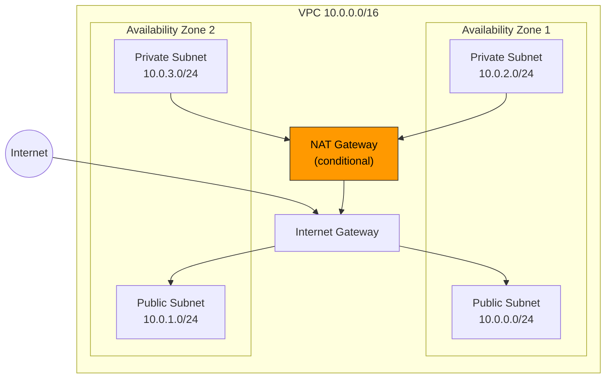
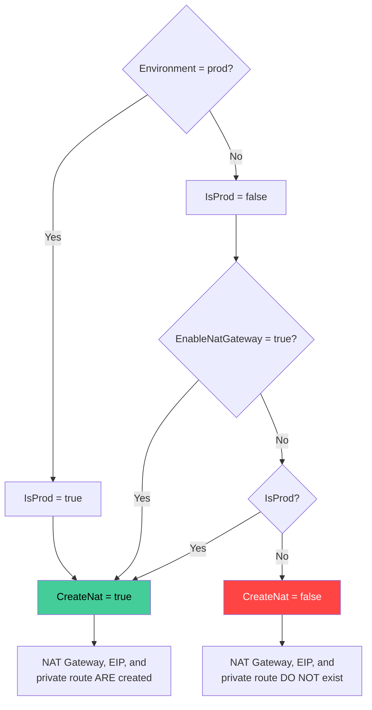

# CloudFormation from Scratch: Building a Production-Ready VPC Step by Step

[CloudFormation](https://aws.amazon.com/cloudformation/) remains the foundation of AWS Infrastructure as Code. [SAM](https://aws.amazon.com/serverless/sam/), [CDK](https://aws.amazon.com/cdk/), and [StackSets](https://docs.aws.amazon.com/AWSCloudFormation/latest/UserGuide/what-is-cfnstacksets.html) all generate CloudFormation templates under the hood. When one of those tools produces a cryptic error, you debug it by reading the generated template. When you need to understand what a stack actually does, you read the template. The abstraction leaks, and when it does, you need to understand what's underneath.

The best way to learn CloudFormation is to build something real. A [VPC](https://aws.amazon.com/vpc/) is the ideal first template. It exercises nearly every template section (Parameters, Mappings, Conditions, Resources, Outputs), uses a broad set of intrinsic functions, and produces tangible infrastructure you can actually route traffic through.

Here's what we'll build:

- A VPC with DNS support enabled
- 2 public subnets across 2 Availability Zones (with auto-assigned public IPs)
- 2 private subnets across 2 Availability Zones
- An Internet Gateway for public subnet traffic
- A NAT Gateway for private subnet outbound traffic — **conditionally created** based on environment
- Route tables wiring everything together
- Exported outputs ready for cross-stack consumption



## Template Anatomy

A CloudFormation template is a YAML (or JSON) file divided into sections. Each section serves a distinct purpose. Only `Resources` is mandatory — everything else adds flexibility, reusability, and conditional logic.

Here are the seven sections in the order they typically appear:

| Section | Required | Purpose |
|---------|----------|---------|
| `AWSTemplateFormatVersion` | No | Declares the template format version (always `"2010-09-09"`) |
| `Description` | No | Human-readable description of what the stack does |
| `Parameters` | No | Input values provided at deploy time |
| `Mappings` | No | Static lookup tables (key-value maps) |
| `Conditions` | No | Boolean logic that controls resource creation |
| `Resources` | **Yes** | The AWS resources to create |
| `Outputs` | No | Values to expose after stack creation (for console, CLI, or cross-stack references) |

Let's start with the skeleton and fill each section as we go:

```yaml
AWSTemplateFormatVersion: '2010-09-09'
Description: >
  Production-ready VPC with public/private subnets across 2 AZs,
  an Internet Gateway, and a conditional NAT Gateway.

Parameters:
  # Inputs provided at deploy time — makes the template reusable across environments

Mappings:
  # Static lookup tables — subnet CIDRs per environment

Conditions:
  # Boolean expressions — control which resources get created

Resources:
  # The actual AWS infrastructure

Outputs:
  # Values exported for other stacks or displayed in the console
```

### Parameters — Making Templates Reusable

Parameters turn a static template into a reusable one. Instead of hardcoding a CIDR block or environment name, you declare parameters and let the deployer provide values at stack creation time.

CloudFormation supports several parameter types:

- **`String`** — free-form text (most common)
- **`Number`** — integer or float
- **`CommaDelimitedList`** — comma-separated values parsed into a list
- **`AWS::SSM::Parameter::Value<T>`** — resolves a value from [SSM Parameter Store](https://docs.aws.amazon.com/systems-manager/latest/userguide/systems-manager-parameter-store.html) at deploy time
- **`AWS::EC2::*` types** — drop-down lists in the console (e.g., `AWS::EC2::VPC::Id`, `AWS::EC2::KeyPair::KeyName`)

Each parameter can be constrained with `AllowedValues`, `AllowedPattern` (regex), `MinLength`, `MaxLength`, `MinValue`, `MaxValue`, and `Default`. The `ConstraintDescription` attribute provides a human-friendly error message when validation fails — without it, the user sees a generic "Parameter value failed constraint" error.

Here are the three parameters for our VPC template:

```yaml
Parameters:
  # The target environment — controls condition evaluation and resource tagging
  Environment:
    Type: String
    AllowedValues:
      - dev
      - staging
      - prod
    Default: dev
    Description: Target environment (controls NAT Gateway creation and tagging)

  # VPC CIDR block — subnet CIDRs are derived from this using !Cidr
  VpcCidr:
    Type: String
    Default: '10.0.0.0/16'
    AllowedPattern: '(\d{1,3}\.){3}\d{1,3}/\d{1,2}'
    ConstraintDescription: Must be a valid CIDR block (e.g., 10.0.0.0/16)
    Description: CIDR block for the VPC (subnets are derived automatically)

  # Explicit toggle for NAT Gateway — allows dev environments to skip it
  EnableNatGateway:
    Type: String
    AllowedValues:
      - 'true'
      - 'false'
    Default: 'false'
    Description: Whether to create a NAT Gateway (always created in prod regardless)
```

### Mappings — Static Lookup Tables

Mappings are two-level key-value structures embedded in the template. You look up values using `!FindInMap [MapName, FirstLevelKey, SecondLevelKey]`. They're resolved at deploy time but their structure is fixed at authoring time — you can't add keys dynamically.

Mappings are ideal for values that are determined by another known key and shouldn't be exposed as parameters (deployers shouldn't need to think about them). In our VPC template, subnet sizing is a good fit: a dev environment is fine with /24 subnets (256 addresses), but production needs /20 subnets (4096 addresses) to accommodate autoscaling groups, ECS tasks, or Lambda ENIs consuming IPs at scale.

```yaml
Mappings:
  # Subnet sizing per environment — controls how !Cidr subdivides the VPC CIDR
  # SubnetBits: host bits per subnet (8 = /24, 12 = /20)
  # SubnetCount: how many subnets to generate
  NetworkConfig:
    dev:
      SubnetBits: '8'
      SubnetCount: '4'
    staging:
      SubnetBits: '8'
      SubnetCount: '4'
    prod:
      SubnetBits: '12'
      SubnetCount: '4'
```

This mapping feeds into `!Cidr` (covered next) to control the subnet structure per environment. The deployer picks an environment, the mapping determines how large the subnets are — nobody has to manually compute CIDR ranges.

**Parameters vs. Mappings vs. Hardcoded — when to use each:**

- **Parameters** — values the deployer chooses at deploy time (environment, VPC CIDR, instance type). They can vary freely per deployment.
- **Mappings** — values fixed at template authoring time, determined by another value (subnet sizing per environment, AMI IDs per region). The deployer can't override them — the template author controls them.
- **Hardcoded** — values that never change and have no reason to vary (DNS settings, route destination `0.0.0.0/0`).

**Mappings vs. SSM Parameter Store references:** Mappings make the template fully self-contained and portable — no external dependencies. SSM references (`AWS::SSM::Parameter::Value<String>`) allow values to change without updating the template, but create a runtime dependency on the parameter existing in the target account/region. Use mappings for template portability; use SSM for values managed by other teams or automation.

### Deriving Subnets Dynamically with `!Cidr`

The `Fn::Cidr` intrinsic function (short form: `!Cidr`) computes subnet CIDRs from the VPC CIDR at deploy time. Combined with the sizing values from our mapping, it gives us subnets that are always valid within the VPC range.

The syntax is:

```yaml
!Cidr [ipBlock, count, cidrBits]
```

Where:

- **`ipBlock`** — the parent CIDR to subdivide (typically the VPC CIDR parameter)
- **`count`** — how many subnet CIDRs to generate (1–256)
- **`cidrBits`** — the number of host bits per subnet. This is the *inverse* of the subnet mask: for a /24 subnet inside a /16 VPC, you need 8 bits (32 - 24 = 8). For a /20 subnet, you need 12 bits (32 - 20 = 12).

You combine it with `!Select` to pick individual subnets by index, and `!FindInMap` to pull the sizing from our mapping:

```yaml
# Derive subnet CIDR using environment-specific sizing from the mapping
CidrBlock: !Select
  - 0
  - !Cidr
    - !GetAtt VPC.CidrBlock
    - !FindInMap [NetworkConfig, !Ref Environment, SubnetCount]
    - !FindInMap [NetworkConfig, !Ref Environment, SubnetBits]
```

With `SubnetBits: '8'` (dev) and a VPC CIDR of `10.0.0.0/16`, this produces /24 subnets:

| Index | Subnet CIDR | Addresses |
|-------|-------------|-----------|
| 0 | `10.0.0.0/24` | 256 |
| 1 | `10.0.1.0/24` | 256 |
| 2 | `10.0.2.0/24` | 256 |
| 3 | `10.0.3.0/24` | 256 |

With `SubnetBits: '12'` (prod), the same VPC produces /20 subnets:

| Index | Subnet CIDR | Addresses |
|-------|-------------|-----------|
| 0 | `10.0.0.0/20` | 4096 |
| 1 | `10.0.16.0/20` | 4096 |
| 2 | `10.0.32.0/20` | 4096 |
| 3 | `10.0.48.0/20` | 4096 |

Two things are guaranteed by construction:

1. **Subnet CIDRs are always derived from the VPC CIDR** — the deployer can set any valid range and the subnets follow
2. **Production gets larger subnets** — without anyone computing CIDR ranges by hand

### Conditions — Conditional Resource Creation

Conditions are boolean expressions evaluated at deploy time. They determine whether resources are created, whether properties are set, and what values outputs produce.

The key insight: a resource with a `Condition:` attribute that evaluates to `false` **doesn't exist** in the resulting stack. It's not created, not deleted, not skipped — it's entirely absent. CloudFormation doesn't even validate its properties if the condition is false.

CloudFormation provides five condition functions:

| Function | Purpose | Example |
|----------|---------|---------|
| `!Equals [a, b]` | True if both values are identical | `!Equals [!Ref Environment, prod]` |
| `!Not [condition]` | Negates a condition | `!Not [!Equals [!Ref Env, dev]]` |
| `!And [cond1, cond2, ...]` | True if ALL conditions are true (2-10) | `!And [Condition: IsProd, Condition: IsUsEast1]` |
| `!Or [cond1, cond2, ...]` | True if ANY condition is true (2-10) | `!Or [Condition: IsProd, !Equals [...]]` |
| `!If [condName, trueVal, falseVal]` | Returns one of two values | `!If [IsProd, 3, 1]` |

`!If` works differently depending on where it appears:

- **In resource properties** — selects between two values for that property
- **At the resource level (using `Condition:`)** — controls whether the entire resource is created

Our template defines two conditions. `IsProd` checks if we're deploying to production. `CreateNat` evaluates to true if either the environment is prod OR the deployer explicitly requested a NAT Gateway — this way, production always gets a NAT while other environments can opt in:

```yaml
Conditions:
  # True when deploying to production — used to force NAT creation
  IsProd: !Equals
    - !Ref Environment
    - prod

  # True when NAT Gateway should be created:
  # either we're in prod (always needs NAT) or the deployer explicitly enabled it
  CreateNat: !Or
    - !Equals
      - !Ref EnableNatGateway
      - 'true'
    - !Equals
      - !Ref Environment
      - prod
```

The condition evaluation flow:



### Intrinsic Functions Reference

Before we dive into the Resources section, here's a quick reference of all the intrinsic functions we'll use in this template. These are the building blocks CloudFormation provides for computing values at deploy time:

| Function | What it does | Example |
|----------|-------------|---------|
| `!Ref` | Returns the resource ID (physical) or parameter value | `!Ref VpcCidr` → `"10.0.0.0/16"` |
| `!GetAtt` | Returns a specific attribute of a resource | `!GetAtt VPC.CidrBlock` |
| `!Sub` | String interpolation — substitutes `${Var}` with values | `!Sub '${Environment}-vpc'` |
| `!Join` | Concatenates a list with a delimiter | `!Join [',', [a, b]]` → `"a,b"` |
| `!Select` | Picks an item from a list by zero-based index | `!Select [0, !GetAZs '']` |
| `!FindInMap` | Looks up a value from the Mappings section | `!FindInMap [NetworkConfig, !Ref Environment, SubnetBits]` |
| `!Cidr` | Splits a CIDR block into an array of subnets | `!Cidr [!GetAtt VPC.CidrBlock, 4, 8]` |
| `!GetAZs` | Returns the list of AZs for a region | `!GetAZs ''` (empty string = current region) |
| `!Equals` | Condition: true if two values match | `!Equals [!Ref Env, prod]` |
| `!Or` | Condition: true if any sub-condition is true | `!Or [Condition: A, Condition: B]` |
| `!And` | Condition: true if all sub-conditions are true | `!And [Condition: A, Condition: B]` |
| `!Not` | Condition: negation | `!Not [Condition: IsProd]` |
| `!If` | Returns one of two values based on a condition | `!If [IsProd, 3, 1]` |

**`!Ref` vs. `!GetAtt`:** `!Ref` returns the primary identifier of a resource (usually the physical ID). `!GetAtt` returns a specific named attribute. For example, `!Ref NatEIP` returns the Elastic IP allocation ID, while `!GetAtt NatEIP.PublicIp` returns the actual IP address.

**`!Sub` vs. `!Join`:** Prefer `!Sub` when you're building a string with variable substitutions — it reads like a template literal. Use `!Join` when you're concatenating a dynamic list of values (like subnet IDs).

CloudFormation also provides **pseudo-parameters** — built-in references you never declare:

- `AWS::StackName` — the name of the current stack
- `AWS::Region` — the region the stack is deployed in
- `AWS::AccountId` — the 12-digit AWS account ID
- `AWS::StackId` — the full ARN of the stack

## Resources and Outputs

Now for the core of the template — the actual infrastructure. We'll build the VPC layer by layer: VPC and Internet Gateway first, then subnets, route tables, the conditional NAT Gateway, and finally the outputs.

### VPC and Internet Gateway

The VPC is the network container. We enable DNS support (required for private hosted zones and VPC endpoints) and DNS hostnames (assigns DNS names to instances with public IPs). The Internet Gateway provides the path between the VPC and the public internet — it must be explicitly attached to the VPC via a `VPCGatewayAttachment`.

The `!Sub` function builds Name tags using the `Environment` parameter. This gives resources readable names in the console like `prod-vpc` or `dev-igw`:

```yaml
Resources:
  # The VPC itself — DNS settings enabled for endpoint and hostname resolution
  VPC:
    Type: AWS::EC2::VPC
    Properties:
      CidrBlock: !Ref VpcCidr
      EnableDnsSupport: true
      EnableDnsHostnames: true
      Tags:
        - Key: Name
          Value: !Sub '${Environment}-vpc'

  # Internet Gateway — provides internet access for public subnets
  InternetGateway:
    Type: AWS::EC2::InternetGateway
    Properties:
      Tags:
        - Key: Name
          Value: !Sub '${Environment}-igw'

  # Attach the IGW to the VPC — without this, the IGW exists but isn't connected
  AttachGateway:
    Type: AWS::EC2::VPCGatewayAttachment
    Properties:
      VpcId: !Ref VPC
      InternetGatewayId: !Ref InternetGateway
```

### Subnets

We create four subnets — two public and two private — distributed across two Availability Zones for high availability.

Public subnets set `MapPublicIpOnLaunch: true`, which means every [EC2](https://aws.amazon.com/ec2/) instance launched in them automatically gets a public IPv4 address. Private subnets omit this property (defaults to `false`), so instances there are only reachable from within the VPC or through the NAT Gateway.

Each subnet's CIDR is derived dynamically: `!Cidr` splits the VPC CIDR using the sizing from our `NetworkConfig` mapping, and `!Select` picks a specific subnet by index. `!GetAZs ''` returns the list of AZs for the current region — `!Select [0, ...]` picks the first, `!Select [1, ...]` picks the second:

```yaml
  # --- Public Subnets ---
  # Instances here get public IPs and route to the internet via the IGW

  PublicSubnet1:
    Type: AWS::EC2::Subnet
    Properties:
      VpcId: !Ref VPC
      CidrBlock: !Select
        - 0
        - !Cidr
          - !GetAtt VPC.CidrBlock
          - !FindInMap [NetworkConfig, !Ref Environment, SubnetCount]
          - !FindInMap [NetworkConfig, !Ref Environment, SubnetBits]
      AvailabilityZone: !Select [0, !GetAZs '']
      MapPublicIpOnLaunch: true
      Tags:
        - Key: Name
          Value: !Sub '${Environment}-public-1'

  PublicSubnet2:
    Type: AWS::EC2::Subnet
    Properties:
      VpcId: !Ref VPC
      CidrBlock: !Select
        - 1
        - !Cidr
          - !GetAtt VPC.CidrBlock
          - !FindInMap [NetworkConfig, !Ref Environment, SubnetCount]
          - !FindInMap [NetworkConfig, !Ref Environment, SubnetBits]
      AvailabilityZone: !Select [1, !GetAZs '']
      MapPublicIpOnLaunch: true
      Tags:
        - Key: Name
          Value: !Sub '${Environment}-public-2'

  # --- Private Subnets ---
  # No public IPs — outbound internet access requires a NAT Gateway

  PrivateSubnet1:
    Type: AWS::EC2::Subnet
    Properties:
      VpcId: !Ref VPC
      CidrBlock: !Select
        - 2
        - !Cidr
          - !GetAtt VPC.CidrBlock
          - !FindInMap [NetworkConfig, !Ref Environment, SubnetCount]
          - !FindInMap [NetworkConfig, !Ref Environment, SubnetBits]
      AvailabilityZone: !Select [0, !GetAZs '']
      Tags:
        - Key: Name
          Value: !Sub '${Environment}-private-1'

  PrivateSubnet2:
    Type: AWS::EC2::Subnet
    Properties:
      VpcId: !Ref VPC
      CidrBlock: !Select
        - 3
        - !Cidr
          - !GetAtt VPC.CidrBlock
          - !FindInMap [NetworkConfig, !Ref Environment, SubnetCount]
          - !FindInMap [NetworkConfig, !Ref Environment, SubnetBits]
      AvailabilityZone: !Select [1, !GetAZs '']
      Tags:
        - Key: Name
          Value: !Sub '${Environment}-private-2'
```

### Route Tables and Routes

Route tables define where traffic goes. Each subnet must be associated with a route table — if you don't explicitly associate one, it uses the VPC's "main" route table (which only has the local route). We create explicit route tables for clarity and control.

The public route table has a default route (`0.0.0.0/0`) pointing to the Internet Gateway. Note the `DependsOn: AttachGateway` — this is one of the rare cases where an explicit dependency is necessary. CloudFormation normally resolves dependencies automatically from `!Ref` and `!GetAtt`, but here the route references the IGW *directly* while the attachment is a separate resource. Without `DependsOn`, CloudFormation might try to create the route before the IGW is attached to the VPC, which fails:

```yaml
  # --- Public Route Table ---
  # Routes internet traffic through the Internet Gateway

  PublicRouteTable:
    Type: AWS::EC2::RouteTable
    Properties:
      VpcId: !Ref VPC
      Tags:
        - Key: Name
          Value: !Sub '${Environment}-public-rt'

  # Default route — all non-local traffic goes to the Internet Gateway
  PublicRoute:
    Type: AWS::EC2::Route
    DependsOn: AttachGateway
    Properties:
      RouteTableId: !Ref PublicRouteTable
      DestinationCidrBlock: '0.0.0.0/0'
      GatewayId: !Ref InternetGateway

  # Associate both public subnets with the public route table
  PublicSubnet1RouteTableAssociation:
    Type: AWS::EC2::SubnetRouteTableAssociation
    Properties:
      SubnetId: !Ref PublicSubnet1
      RouteTableId: !Ref PublicRouteTable

  PublicSubnet2RouteTableAssociation:
    Type: AWS::EC2::SubnetRouteTableAssociation
    Properties:
      SubnetId: !Ref PublicSubnet2
      RouteTableId: !Ref PublicRouteTable

  # --- Private Route Table ---
  # Local routes only (unless NAT Gateway is created)

  PrivateRouteTable:
    Type: AWS::EC2::RouteTable
    Properties:
      VpcId: !Ref VPC
      Tags:
        - Key: Name
          Value: !Sub '${Environment}-private-rt'

  # Associate both private subnets with the private route table
  PrivateSubnet1RouteTableAssociation:
    Type: AWS::EC2::SubnetRouteTableAssociation
    Properties:
      SubnetId: !Ref PrivateSubnet1
      RouteTableId: !Ref PrivateRouteTable

  PrivateSubnet2RouteTableAssociation:
    Type: AWS::EC2::SubnetRouteTableAssociation
    Properties:
      SubnetId: !Ref PrivateSubnet2
      RouteTableId: !Ref PrivateRouteTable
```

### NAT Gateway (Conditional)

A NAT Gateway allows instances in private subnets to reach the internet (for package updates, API calls, etc.) without being directly reachable from the internet. It lives in a public subnet and translates private IPs to its own Elastic IP for outbound traffic.

**Cost awareness:** A NAT Gateway costs [$0.045/hour](https://aws.amazon.com/vpc/pricing/) (~$32.85/month) plus $0.045 per GB of data processed — even with zero traffic, you're paying the hourly rate. This is why we condition its creation. A dev environment that only needs internal communication shouldn't pay for a NAT Gateway that never gets used.

Every resource in this section has `Condition: CreateNat`. When the condition evaluates to `false`, none of these resources exist — no EIP, no NAT Gateway, no private route to the NAT. The private subnets simply have no outbound internet access:

```yaml
  # --- NAT Gateway (Conditional) ---
  # Only created when CreateNat condition is true (prod, or explicitly enabled)

  # Elastic IP for the NAT Gateway — NAT requires a static public IP
  NatEIP:
    Type: AWS::EC2::EIP
    Condition: CreateNat
    Properties:
      Domain: vpc
      Tags:
        - Key: Name
          Value: !Sub '${Environment}-nat-eip'

  # NAT Gateway — placed in the first public subnet
  # Uses !GetAtt to retrieve the AllocationId from the EIP
  # (Ref returns the EIP allocation ID too, but GetAtt is explicit about what you're getting)
  NatGateway:
    Type: AWS::EC2::NatGateway
    Condition: CreateNat
    Properties:
      AllocationId: !GetAtt NatEIP.AllocationId
      SubnetId: !Ref PublicSubnet1
      Tags:
        - Key: Name
          Value: !Sub '${Environment}-nat'

  # Route from private subnets to internet via NAT Gateway
  PrivateRoute:
    Type: AWS::EC2::Route
    Condition: CreateNat
    Properties:
      RouteTableId: !Ref PrivateRouteTable
      DestinationCidrBlock: '0.0.0.0/0'
      NatGatewayId: !Ref NatGateway
```

Notice the difference between `GatewayId` (used for Internet Gateways in the public route) and `NatGatewayId` (used for NAT Gateways in the private route). CloudFormation requires you to specify exactly which type of target you're routing to.

### Outputs and Exports

Outputs serve two purposes: they display useful information after stack creation (visible in the console and CLI), and when combined with `Export`, they make values available to other stacks via `Fn::ImportValue`.

Export names must be unique within a region — if two stacks try to export the same name, the second one fails. The convention `${AWS::StackName}-OutputName` prevents collisions because stack names are already unique per account/region.

The `!Join` function combines multiple subnet IDs into a comma-separated string — useful for passing to other resources that accept comma-delimited subnet lists (like [ALB](https://aws.amazon.com/elasticloadbalancing/) target groups or [ECS](https://aws.amazon.com/ecs/) services).

Conditional outputs work the same as conditional resources: add `Condition: CreateNat` and the output only appears when the NAT Gateway exists:

```yaml
Outputs:
  # VPC ID — the most commonly imported value
  VpcId:
    Description: VPC ID
    Value: !Ref VPC
    Export:
      Name: !Sub '${AWS::StackName}-VpcId'

  # Public subnet IDs as comma-separated string
  PublicSubnetIds:
    Description: Public subnet IDs (comma-separated)
    Value: !Join
      - ','
      - - !Ref PublicSubnet1
        - !Ref PublicSubnet2
    Export:
      Name: !Sub '${AWS::StackName}-PublicSubnetIds'

  # Private subnet IDs as comma-separated string
  PrivateSubnetIds:
    Description: Private subnet IDs (comma-separated)
    Value: !Join
      - ','
      - - !Ref PrivateSubnet1
        - !Ref PrivateSubnet2
    Export:
      Name: !Sub '${AWS::StackName}-PrivateSubnetIds'

  # NAT Gateway ID — only exists when the condition is true
  NatGatewayId:
    Condition: CreateNat
    Description: NAT Gateway ID
    Value: !Ref NatGateway
    Export:
      Name: !Sub '${AWS::StackName}-NatGatewayId'
```

Once exported, another stack can consume these values without any hardcoded IDs:

```yaml
# In another template — imports the VPC ID from the network stack
Resources:
  MySecurityGroup:
    Type: AWS::EC2::SecurityGroup
    Properties:
      VpcId: !ImportValue network-stack-VpcId
```

This is how teams separate concerns: the networking team owns the VPC stack, application teams import its outputs. The export/import contract creates an explicit dependency — CloudFormation won't let you delete a stack that has exports consumed by other stacks.

### The Complete Template

Here's the full template assembled. Save this as `vpc.yaml`:

```yaml
AWSTemplateFormatVersion: '2010-09-09'
Description: >
  Production-ready VPC with public/private subnets across 2 AZs,
  an Internet Gateway, and a conditional NAT Gateway.

Parameters:
  Environment:
    Type: String
    AllowedValues:
      - dev
      - staging
      - prod
    Default: dev
    Description: Target environment (controls NAT Gateway creation and tagging)

  VpcCidr:
    Type: String
    Default: '10.0.0.0/16'
    AllowedPattern: '(\d{1,3}\.){3}\d{1,3}/\d{1,2}'
    ConstraintDescription: Must be a valid CIDR block (e.g., 10.0.0.0/16)
    Description: CIDR block for the VPC (subnets are derived automatically)

  EnableNatGateway:
    Type: String
    AllowedValues:
      - 'true'
      - 'false'
    Default: 'false'
    Description: Whether to create a NAT Gateway (always created in prod regardless)

Mappings:
  NetworkConfig:
    dev:
      SubnetBits: '8'
      SubnetCount: '4'
    staging:
      SubnetBits: '8'
      SubnetCount: '4'
    prod:
      SubnetBits: '12'
      SubnetCount: '4'

Conditions:
  IsProd: !Equals
    - !Ref Environment
    - prod
  CreateNat: !Or
    - !Equals
      - !Ref EnableNatGateway
      - 'true'
    - !Equals
      - !Ref Environment
      - prod

Resources:
  VPC:
    Type: AWS::EC2::VPC
    Properties:
      CidrBlock: !Ref VpcCidr
      EnableDnsSupport: true
      EnableDnsHostnames: true
      Tags:
        - Key: Name
          Value: !Sub '${Environment}-vpc'

  InternetGateway:
    Type: AWS::EC2::InternetGateway
    Properties:
      Tags:
        - Key: Name
          Value: !Sub '${Environment}-igw'

  AttachGateway:
    Type: AWS::EC2::VPCGatewayAttachment
    Properties:
      VpcId: !Ref VPC
      InternetGatewayId: !Ref InternetGateway

  PublicSubnet1:
    Type: AWS::EC2::Subnet
    Properties:
      VpcId: !Ref VPC
      CidrBlock: !Select
        - 0
        - !Cidr
          - !GetAtt VPC.CidrBlock
          - !FindInMap [NetworkConfig, !Ref Environment, SubnetCount]
          - !FindInMap [NetworkConfig, !Ref Environment, SubnetBits]
      AvailabilityZone: !Select [0, !GetAZs '']
      MapPublicIpOnLaunch: true
      Tags:
        - Key: Name
          Value: !Sub '${Environment}-public-1'

  PublicSubnet2:
    Type: AWS::EC2::Subnet
    Properties:
      VpcId: !Ref VPC
      CidrBlock: !Select
        - 1
        - !Cidr
          - !GetAtt VPC.CidrBlock
          - !FindInMap [NetworkConfig, !Ref Environment, SubnetCount]
          - !FindInMap [NetworkConfig, !Ref Environment, SubnetBits]
      AvailabilityZone: !Select [1, !GetAZs '']
      MapPublicIpOnLaunch: true
      Tags:
        - Key: Name
          Value: !Sub '${Environment}-public-2'

  PrivateSubnet1:
    Type: AWS::EC2::Subnet
    Properties:
      VpcId: !Ref VPC
      CidrBlock: !Select
        - 2
        - !Cidr
          - !GetAtt VPC.CidrBlock
          - !FindInMap [NetworkConfig, !Ref Environment, SubnetCount]
          - !FindInMap [NetworkConfig, !Ref Environment, SubnetBits]
      AvailabilityZone: !Select [0, !GetAZs '']
      Tags:
        - Key: Name
          Value: !Sub '${Environment}-private-1'

  PrivateSubnet2:
    Type: AWS::EC2::Subnet
    Properties:
      VpcId: !Ref VPC
      CidrBlock: !Select
        - 3
        - !Cidr
          - !GetAtt VPC.CidrBlock
          - !FindInMap [NetworkConfig, !Ref Environment, SubnetCount]
          - !FindInMap [NetworkConfig, !Ref Environment, SubnetBits]
      AvailabilityZone: !Select [1, !GetAZs '']
      Tags:
        - Key: Name
          Value: !Sub '${Environment}-private-2'

  PublicRouteTable:
    Type: AWS::EC2::RouteTable
    Properties:
      VpcId: !Ref VPC
      Tags:
        - Key: Name
          Value: !Sub '${Environment}-public-rt'

  PublicRoute:
    Type: AWS::EC2::Route
    DependsOn: AttachGateway
    Properties:
      RouteTableId: !Ref PublicRouteTable
      DestinationCidrBlock: '0.0.0.0/0'
      GatewayId: !Ref InternetGateway

  PublicSubnet1RouteTableAssociation:
    Type: AWS::EC2::SubnetRouteTableAssociation
    Properties:
      SubnetId: !Ref PublicSubnet1
      RouteTableId: !Ref PublicRouteTable

  PublicSubnet2RouteTableAssociation:
    Type: AWS::EC2::SubnetRouteTableAssociation
    Properties:
      SubnetId: !Ref PublicSubnet2
      RouteTableId: !Ref PublicRouteTable

  PrivateRouteTable:
    Type: AWS::EC2::RouteTable
    Properties:
      VpcId: !Ref VPC
      Tags:
        - Key: Name
          Value: !Sub '${Environment}-private-rt'

  PrivateSubnet1RouteTableAssociation:
    Type: AWS::EC2::SubnetRouteTableAssociation
    Properties:
      SubnetId: !Ref PrivateSubnet1
      RouteTableId: !Ref PrivateRouteTable

  PrivateSubnet2RouteTableAssociation:
    Type: AWS::EC2::SubnetRouteTableAssociation
    Properties:
      SubnetId: !Ref PrivateSubnet2
      RouteTableId: !Ref PrivateRouteTable

  NatEIP:
    Type: AWS::EC2::EIP
    Condition: CreateNat
    Properties:
      Domain: vpc
      Tags:
        - Key: Name
          Value: !Sub '${Environment}-nat-eip'

  NatGateway:
    Type: AWS::EC2::NatGateway
    Condition: CreateNat
    Properties:
      AllocationId: !GetAtt NatEIP.AllocationId
      SubnetId: !Ref PublicSubnet1
      Tags:
        - Key: Name
          Value: !Sub '${Environment}-nat'

  PrivateRoute:
    Type: AWS::EC2::Route
    Condition: CreateNat
    Properties:
      RouteTableId: !Ref PrivateRouteTable
      DestinationCidrBlock: '0.0.0.0/0'
      NatGatewayId: !Ref NatGateway

Outputs:
  VpcId:
    Description: VPC ID
    Value: !Ref VPC
    Export:
      Name: !Sub '${AWS::StackName}-VpcId'

  PublicSubnetIds:
    Description: Public subnet IDs (comma-separated)
    Value: !Join
      - ','
      - - !Ref PublicSubnet1
        - !Ref PublicSubnet2
    Export:
      Name: !Sub '${AWS::StackName}-PublicSubnetIds'

  PrivateSubnetIds:
    Description: Private subnet IDs (comma-separated)
    Value: !Join
      - ','
      - - !Ref PrivateSubnet1
        - !Ref PrivateSubnet2
    Export:
      Name: !Sub '${AWS::StackName}-PrivateSubnetIds'

  NatGatewayId:
    Condition: CreateNat
    Description: NAT Gateway ID
    Value: !Ref NatGateway
    Export:
      Name: !Sub '${AWS::StackName}-NatGatewayId'
```

## Deploying

Make sure you have the [AWS CLI v2 installed and configured](https://docs.aws.amazon.com/cli/latest/userguide/getting-started-install.html) with credentials that have permissions for VPC, EC2, and CloudFormation operations.

### Validate the Template

The `validate-template` command performs syntax validation — it checks that the YAML is well-formed, resource types are recognized, and intrinsic functions are used correctly. It does **not** catch semantic errors (like invalid CIDR overlaps or insufficient IAM permissions). Think of it as a linter, not a test suite:

```bash
aws cloudformation validate-template --template-body file://vpc.yaml
```

Expected output on success:

```json
{
    "Parameters": [
        {
            "ParameterKey": "Environment",
            "DefaultValue": "dev",
            "NoEcho": false,
            "Description": "Target environment (controls NAT Gateway creation and tagging)"
        },
        {
            "ParameterKey": "VpcCidr",
            "DefaultValue": "10.0.0.0/16",
            "NoEcho": false,
            "Description": "CIDR block for the VPC (subnets are derived automatically)"
        },
        {
            "ParameterKey": "EnableNatGateway",
            "DefaultValue": "false",
            "NoEcho": false,
            "Description": "Whether to create a NAT Gateway (always created in prod regardless)"
        }
    ],
    "Description": "Production-ready VPC with public/private subnets across 2 AZs, an Internet Gateway, and a conditional NAT Gateway.\n"
}
```

### Deploy a Dev Stack (No NAT)

Create the stack with default parameters. This deploys the VPC, subnets, IGW, and route tables — but skips the NAT Gateway because `Environment=dev` and `EnableNatGateway=false`:

```bash
# Deploy the dev VPC — no NAT Gateway (condition evaluates to false)
aws cloudformation create-stack \
  --stack-name dev-vpc \
  --template-body file://vpc.yaml \
  --parameters \
    ParameterKey=Environment,ParameterValue=dev \
    ParameterKey=EnableNatGateway,ParameterValue=false

# Wait for the stack to complete (typically 1-2 minutes)
aws cloudformation wait stack-create-complete --stack-name dev-vpc
```

Check the stack outputs to see what was created:

```bash
aws cloudformation describe-stacks \
  --stack-name dev-vpc \
  --query 'Stacks[0].Outputs[*].{Key:OutputKey,Value:OutputValue}' \
  --output table
```

Expected output — note that `NatGatewayId` is absent because the condition was false:

```
-----------------------------------------------------
|                  DescribeStacks                    |
+-------------------+-------------------------------+
|       Key         |            Value              |
+-------------------+-------------------------------+
|  VpcId            |  vpc-0a1b2c3d4e5f67890        |
|  PublicSubnetIds  |  subnet-aaa111,subnet-bbb222  |
|  PrivateSubnetIds |  subnet-ccc333,subnet-ddd444  |
+-------------------+-------------------------------+
```

List the resources that were created to confirm no NAT-related resources exist:

```bash
aws cloudformation list-stack-resources \
  --stack-name dev-vpc \
  --query 'StackResourceSummaries[*].{LogicalId:LogicalResourceId,Type:ResourceType,Status:ResourceStatus}' \
  --output table
```

You'll see 12 resources: VPC, IGW, attachment, 4 subnets, 2 route tables, 1 route, and 4 associations. No EIP, no NAT Gateway, no private route.

### Deploy a Prod Stack (With NAT)

Now deploy the same template with `Environment=prod`. The `CreateNat` condition will evaluate to `true` because of the production environment, and you'll see the NAT Gateway appear:

```bash
# Deploy the prod VPC — NAT Gateway is automatically created
aws cloudformation create-stack \
  --stack-name prod-vpc \
  --template-body file://vpc.yaml \
  --parameters \
    ParameterKey=Environment,ParameterValue=prod

# NAT Gateway provisioning takes longer — typically 2-3 minutes
aws cloudformation wait stack-create-complete --stack-name prod-vpc
```

Check outputs — now `NatGatewayId` appears:

```bash
aws cloudformation describe-stacks \
  --stack-name prod-vpc \
  --query 'Stacks[0].Outputs[*].{Key:OutputKey,Value:OutputValue}' \
  --output table
```

```
-----------------------------------------------------
|                  DescribeStacks                    |
+-------------------+-------------------------------+
|       Key         |            Value              |
+-------------------+-------------------------------+
|  VpcId            |  vpc-9a8b7c6d5e4f32100        |
|  PublicSubnetIds  |  subnet-eee555,subnet-fff666  |
|  PrivateSubnetIds |  subnet-ggg777,subnet-hhh888  |
|  NatGatewayId     |  nat-0123456789abcdef0        |
+-------------------+-------------------------------+
```

**Delete the prod stack immediately to avoid charges** — the NAT Gateway starts billing the moment it's created:

```bash
aws cloudformation delete-stack --stack-name prod-vpc
aws cloudformation wait stack-delete-complete --stack-name prod-vpc
```

### Change Sets — Previewing Updates

Direct stack updates are risky. If you modify a property that requires resource replacement, CloudFormation will destroy the old resource and create a new one — that's a VPC deletion in our case, which cascades to everything inside it.

[Change sets](https://docs.aws.amazon.com/AWSCloudFormation/latest/UserGuide/using-cfn-updating-stacks-changesets.html) solve this by previewing what CloudFormation *will* do before it does it. The workflow is: create a change set → review it → execute or discard.

Let's add a tag to the VPC and preview the change. Modify the VPC resource's Tags:

```yaml
  VPC:
    Type: AWS::EC2::VPC
    Properties:
      CidrBlock: !Ref VpcCidr
      EnableDnsSupport: true
      EnableDnsHostnames: true
      Tags:
        - Key: Name
          Value: !Sub '${Environment}-vpc'
        - Key: ManagedBy
          Value: CloudFormation
```

Create a change set against the existing dev stack:

```bash
# Create a change set — does NOT modify the stack yet
aws cloudformation create-change-set \
  --stack-name dev-vpc \
  --template-body file://vpc.yaml \
  --change-set-name add-managed-by-tag \
  --parameters \
    ParameterKey=Environment,ParameterValue=dev \
    ParameterKey=EnableNatGateway,ParameterValue=false

# Wait for the change set to finish computing
aws cloudformation wait change-set-create-complete \
  --stack-name dev-vpc \
  --change-set-name add-managed-by-tag
```

Review what will happen:

```bash
aws cloudformation describe-change-set \
  --stack-name dev-vpc \
  --change-set-name add-managed-by-tag \
  --query 'Changes[*].ResourceChange.{Action:Action,LogicalId:LogicalResourceId,Replacement:Replacement}' \
  --output table
```

Expected output:

```
---------------------------------------------------
|              DescribeChangeSet                   |
+--------+-------------------+--------------------+
| Action |    LogicalId      |   Replacement      |
+--------+-------------------+--------------------+
| Modify |  VPC              |   Never            |
+--------+-------------------+--------------------+
```

The `Replacement` field is what matters:

| Value | Meaning | Risk |
|-------|---------|------|
| `Never` | In-place update — resource keeps its physical ID | Safe |
| `Conditionally` | Might require replacement depending on other changes | Review carefully |
| `True` | Resource will be destroyed and recreated (new physical ID) | Dangerous for stateful resources |

Adding a tag is a `Never` replacement — safe to apply. Execute the change set:

```bash
aws cloudformation execute-change-set \
  --stack-name dev-vpc \
  --change-set-name add-managed-by-tag
```

**Always use change sets in production.** Direct `update-stack` applies changes immediately with no preview. A typo in a CIDR block could trigger VPC replacement — deleting all subnets, route tables, and everything in them. Change sets catch this before any damage is done.

### Cleanup

Delete the dev stack when you're done experimenting:

```bash
aws cloudformation delete-stack --stack-name dev-vpc
aws cloudformation wait stack-delete-complete --stack-name dev-vpc
```

CloudFormation deletes resources in reverse dependency order. The stack deletion is free — you only pay for the resources while they exist.

## Conclusion and Next Steps

We've written a complete CloudFormation template from scratch, using every major template section:

- **Parameters** made the template reusable across environments and CIDR ranges
- **Mappings** controlled subnet sizing per environment — production gets /20 subnets, dev gets /24
- **`!Cidr`** derived subnet CIDRs dynamically from the VPC CIDR — no hardcoded values, no mismatch possible
- **Conditions** gave us conditional resource creation — a single template that adapts to dev, staging, and prod
- **Resources** defined the actual VPC infrastructure with proper dependency management
- **Outputs** exported values for cross-stack consumption

This VPC is ready to serve as a network foundation. Other stacks can `!ImportValue` its VPC ID and subnet IDs to deploy application infrastructure (ALBs, ECS clusters, [RDS](https://aws.amazon.com/rds/) instances) without knowing or caring about the network details.