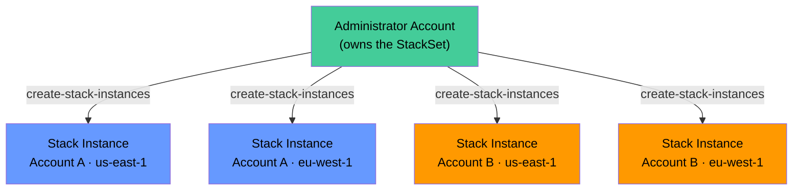
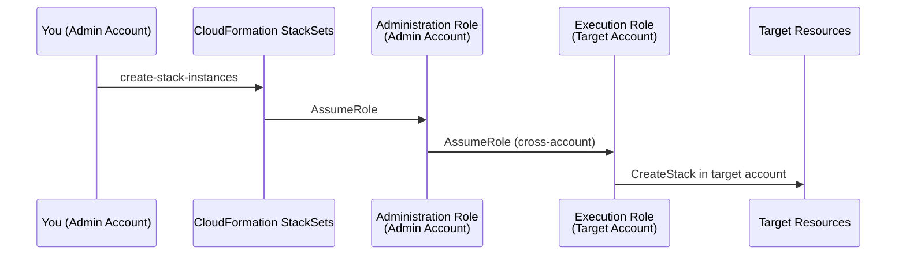

# CloudFormation StackSets: Multi-Account, Multi-Region Deployment

Most organizations don't run everything in a single AWS account. They separate environments into dedicated accounts — dev, staging, production — and split workloads by team or business unit. Then they need security baselines, compliance guardrails, and operational tooling deployed consistently across all of them.

Doing this manually doesn't scale. Running `create-stack` in 50 accounts across 4 Regions means 200 CLI commands, 200 sets of credentials, and 200 places where something can drift out of sync. [StackSets](https://docs.aws.amazon.com/AWSCloudFormation/latest/UserGuide/what-is-cfnstacksets.html) solves this: you define a template once, specify your targets, and CloudFormation handles the orchestration.

This post covers:

- How StackSets works — the concepts and terminology
- The two permission models (self-managed vs. service-managed with Organizations)
- Deploying a security baseline across Regions with a hands-on walkthrough
- Deployment controls — concurrency, failure tolerance, and Region ordering
- Auto-deployment to new accounts joining an Organization

## StackSets Concepts

A StackSet is a container that holds a CloudFormation template plus deployment configuration. From that single definition, you create **stack instances** — one stack per account per Region. The StackSet orchestrates creation, updates, and deletion across all targets.

Key terminology:

- **StackSet** — the template + configuration that defines what to deploy and where
- **Stack instance** — one CloudFormation stack deployed to one account in one Region. It's a regular stack — you can see it in the target account's CloudFormation console
- **Operation** — a create, update, or delete action against stack instances. Operations are asynchronous and report per-instance status
- **Administrator account** — the account that owns the StackSet and initiates operations
- **Target accounts** — the accounts that receive stack instances



The lifecycle is straightforward:

1. **Create a StackSet** — registers the template and configuration. Nothing deploys yet.
2. **Create stack instances** — tells StackSets which accounts and Regions to target. This triggers actual stack creation in each target.
3. **Update the StackSet** — changes the template or parameters. StackSets propagates the update to all existing stack instances.
4. **Delete stack instances** — removes stacks from specific targets.
5. **Delete the StackSet** — only possible after all stack instances are gone.

One important detail: the StackSet itself lives in the administrator account's Region (wherever you run the `create-stack-set` command). But the stack instances can live in any Region in any target account. The administrator Region is just the control plane.

## Permission Models

StackSets needs permission to create resources in target accounts. CloudFormation supports two models for granting that access.

### Self-Managed Permissions

You manually create IAM roles that form a trust chain between the administrator account and each target account. More setup, but explicit control over who can deploy where.

The trust chain has two roles:

1. **`AWSCloudFormationStackSetAdministrationRole`** — lives in the administrator account. CloudFormation assumes this role to initiate operations.
2. **`AWSCloudFormationStackSetExecutionRole`** — lives in each target account. The administration role assumes this role to create resources in the target.



**In the administrator account** — deploy this template to create the administration role. It trusts the CloudFormation service and has permission to assume the execution role in any account:

```yaml
AWSTemplateFormatVersion: '2010-09-09'
Description: StackSet administration role (deploy in the admin account)

Resources:
  AdministrationRole:
    Type: AWS::IAM::Role
    Properties:
      RoleName: AWSCloudFormationStackSetAdministrationRole
      AssumeRolePolicyDocument:
        Version: '2012-10-17'
        Statement:
          - Effect: Allow
            Principal:
              Service: cloudformation.amazonaws.com
            Action: sts:AssumeRole
      Policies:
        - PolicyName: AssumeExecutionRole
          PolicyDocument:
            Version: '2012-10-17'
            Statement:
              - Effect: Allow
                Action: sts:AssumeRole
                Resource: 'arn:aws:iam::*:role/AWSCloudFormationStackSetExecutionRole'
```

Deploy it:

```bash
aws cloudformation create-stack \
  --stack-name stackset-admin-role \
  --template-body file://stackset-admin-role.yaml \
  --capabilities CAPABILITY_NAMED_IAM

aws cloudformation wait stack-create-complete --stack-name stackset-admin-role
```

**In each target account** — deploy this template. The execution role trusts the administrator account and has the permissions needed to create whatever resources the StackSet template defines:

```yaml
AWSTemplateFormatVersion: '2010-09-09'
Description: StackSet execution role (deploy in each target account)

Parameters:
  AdministratorAccountId:
    Type: String
    Description: The AWS account ID of the StackSet administrator account

Resources:
  ExecutionRole:
    Type: AWS::IAM::Role
    Properties:
      RoleName: AWSCloudFormationStackSetExecutionRole
      AssumeRolePolicyDocument:
        Version: '2012-10-17'
        Statement:
          - Effect: Allow
            Principal:
              AWS: !Sub 'arn:aws:iam::${AdministratorAccountId}:root'
            Action: sts:AssumeRole
      ManagedPolicyArns:
        # AdministratorAccess for the lab — scope this down in production
        # to only the permissions your StackSet template needs
        - arn:aws:iam::aws:policy/AdministratorAccess
```

```bash
# Run this in each target account (or use a different profile per account)
aws cloudformation create-stack \
  --stack-name stackset-execution-role \
  --template-body file://stackset-execution-role.yaml \
  --parameters ParameterKey=AdministratorAccountId,ParameterValue=111111111111 \
  --capabilities CAPABILITY_NAMED_IAM

aws cloudformation wait stack-create-complete --stack-name stackset-execution-role
```

**Security note:** The `Resource: 'arn:aws:iam::*:role/AWSCloudFormationStackSetExecutionRole'` in the administration role means it can assume the execution role in *any* account that has one. In production, restrict this to specific account IDs:

```yaml
Resource:
  - 'arn:aws:iam::222222222222:role/AWSCloudFormationStackSetExecutionRole'
  - 'arn:aws:iam::333333333333:role/AWSCloudFormationStackSetExecutionRole'
```

Similarly, the execution role's `AdministratorAccess` is too broad for production. Scope it to only the resource types your StackSet template actually creates (S3, IAM, Config, etc.).

**For single-account testing:** If you only have one account, you can deploy both roles in the same account. The administrator account is also a target account — it works fine. This is how we'll run the lab below.

### Service-Managed Permissions (Organizations)

If you use [AWS Organizations](https://aws.amazon.com/organizations/), service-managed permissions eliminate the manual role setup entirely. AWS creates and manages the necessary roles automatically through a feature called trusted access.

Enable trusted access from the Organizations management account:

```bash
aws organizations enable-aws-service-access \
  --service-principal member.org.stacksets.cloudformation.amazonaws.com
```

With service-managed permissions, the experience changes significantly:

- You target **Organizational Units (OUs)** instead of individual account IDs — deploy to all accounts in an OU with one command
- AWS **auto-creates IAM roles** in target accounts — no pre-provisioning needed
- **Auto-deployment** to new accounts is available — when a new account joins a target OU, it automatically receives the stack instance
- You don't need to know account IDs in advance — the OU is the targeting mechanism

The tradeoff: you need Organizations, and the management account (or a delegated administrator) must initiate operations. You also lose fine-grained control over the IAM trust — AWS manages the roles for you.

### Which to Choose

| Factor | Self-Managed | Service-Managed |
|--------|-------------|-----------------|
| Setup | Manual role creation in each account | One-time trusted access enablement |
| Targeting | Specific account IDs | Organizational Units (OUs) |
| New accounts | Must manually add roles + create instances | Auto-deploys when account joins OU |
| IAM control | Full control over role permissions | AWS manages roles |
| Organizations required | No | Yes |
| Cross-organization | Supported (any account with the execution role) | Not supported (must be same org) |

**Recommendation:** Use service-managed if you have Organizations — it's less operational overhead and scales automatically. Use self-managed when you don't have Organizations, need cross-organization deployment, or need explicit control over the IAM trust boundary.

## Deploying a Security Baseline Across Regions

Let's put this into practice. We'll deploy a security baseline — an encrypted S3 bucket for audit logs — to two Regions in the same account using self-managed permissions. This simulates what an organization would do across dozens of accounts.

### The Template

The template creates an S3 bucket with encryption, versioning, and all public access blocked. It uses `AWS::Region` in the bucket name to avoid naming collisions across Regions (S3 bucket names are globally unique):

```yaml
AWSTemplateFormatVersion: '2010-09-09'
Description: >
  Security baseline — encrypted S3 bucket for audit logs.
  Deployed via StackSets to multiple Regions.

Resources:
  # One audit log bucket per Region — data residency compliant
  # The bucket name includes Region to ensure uniqueness across targets
  AuditLogBucket:
    Type: AWS::S3::Bucket
    Properties:
      BucketName: !Sub 'audit-logs-${AWS::AccountId}-${AWS::Region}'
      VersioningConfiguration:
        Status: Enabled
      BucketEncryption:
        ServerSideEncryptionConfiguration:
          - ServerSideEncryptionByDefault:
              SSEAlgorithm: AES256
      PublicAccessBlockConfiguration:
        BlockPublicAcls: true
        BlockPublicPolicy: true
        IgnorePublicAcls: true
        RestrictPublicBuckets: true
      Tags:
        - Key: Purpose
          Value: SecurityAuditLogs
        - Key: ManagedBy
          Value: StackSets

Outputs:
  BucketName:
    Description: Name of the audit log bucket
    Value: !Ref AuditLogBucket

  BucketArn:
    Description: ARN of the audit log bucket
    Value: !GetAtt AuditLogBucket.Arn
```

Save this as `security-baseline.yaml`.

### Creating the StackSet

Creating a StackSet registers the template and configuration but doesn't deploy anything. No resources are created yet:

```bash
aws cloudformation create-stack-set \
  --stack-set-name security-baseline \
  --template-body file://security-baseline.yaml \
  --permission-model SELF_MANAGED \
  --description "Security audit log buckets deployed to all target Regions"
```

Verify it exists:

```bash
aws cloudformation describe-stack-set \
  --stack-set-name security-baseline \
  --query 'StackSet.{Name:StackSetName,Status:Status,PermissionModel:PermissionModel}' \
  --output table
```

```
-------------------------------------------------------------
|                    DescribeStackSet                        |
+-------------------+-----------------+---------------------+
|       Name        | PermissionModel |       Status        |
+-------------------+-----------------+---------------------+
|  security-baseline|  SELF_MANAGED   |  ACTIVE             |
+-------------------+-----------------+---------------------+
```

### Creating Stack Instances

Now deploy stack instances to two Regions. This is where actual resources get created:

```bash
ACCOUNT_ID=$(aws sts get-caller-identity --query Account --output text)

aws cloudformation create-stack-instances \
  --stack-set-name security-baseline \
  --accounts $ACCOUNT_ID \
  --regions us-east-1 eu-west-1
```

This command returns immediately with an operation ID. StackSets operations are asynchronous — the actual stack creation happens in the background.

Monitor the operation:

```bash
# Get the latest operation ID
OPERATION_ID=$(aws cloudformation list-stack-set-operations \
  --stack-set-name security-baseline \
  --query 'Summaries[0].OperationId' \
  --output text)

# Poll for status
aws cloudformation describe-stack-set-operation \
  --stack-set-name security-baseline \
  --operation-id $OPERATION_ID \
  --query 'StackSetOperation.{Action:Action,Status:Status,EndTimestamp:EndTimestamp}' \
  --output table
```

Wait for `SUCCEEDED`:

```
-----------------------------------------------------------
|              DescribeStackSetOperation                   |
+--------+----------------------------+-------------------+
| Action |       EndTimestamp         |      Status       |
+--------+----------------------------+-------------------+
| CREATE | 2025-01-15T10:23:45.123Z  | SUCCEEDED         |
+--------+----------------------------+-------------------+
```

Verify the stack instances:

```bash
aws cloudformation list-stack-instances \
  --stack-set-name security-baseline \
  --query 'Summaries[*].{Account:Account,Region:Region,Status:Status}' \
  --output table
```

```
---------------------------------------------------
|              ListStackInstances                  |
+--------------+----------------+------------------+
|   Account    |    Region      |     Status       |
+--------------+----------------+------------------+
|  123456789012|  us-east-1     |  CURRENT         |
|  123456789012|  eu-west-1     |  CURRENT         |
+--------------+----------------+------------------+
```

`CURRENT` means the stack instance is in sync with the StackSet's latest template. Other statuses you might see:

| Status | Meaning |
|--------|---------|
| `CURRENT` | In sync with the StackSet template |
| `OUTDATED` | Stack instance hasn't received the latest StackSet update yet |
| `INOPERABLE` | Stack is in a failed state (e.g., `CREATE_FAILED`, `DELETE_FAILED`) |

You can also see the individual stacks in the target account. Switch to each Region and look for a stack named `StackSet-security-baseline-<unique-id>`:

```bash
# Check us-east-1
aws cloudformation list-stacks \
  --region us-east-1 \
  --stack-status-filter CREATE_COMPLETE \
  --query 'StackSummaries[?starts_with(StackName, `StackSet-security-baseline`)].StackName' \
  --output text
```

### Updating the StackSet

When you update the StackSet template, the change propagates to all stack instances. Let's add a lifecycle rule to transition objects to Glacier after 90 days.

Update the template (add a `LifecycleConfiguration` to the bucket):

```yaml
      LifecycleConfiguration:
        Rules:
          - Id: ArchiveToGlacier
            Status: Enabled
            Transitions:
              - StorageClass: GLACIER
                TransitionInDays: 90
```

Push the update:

```bash
aws cloudformation update-stack-set \
  --stack-set-name security-baseline \
  --template-body file://security-baseline.yaml
```

This triggers an update operation across all existing stack instances. The same monitoring commands work:

```bash
OPERATION_ID=$(aws cloudformation list-stack-set-operations \
  --stack-set-name security-baseline \
  --query 'Summaries[0].OperationId' \
  --output text)

aws cloudformation describe-stack-set-operation \
  --stack-set-name security-baseline \
  --operation-id $OPERATION_ID \
  --query 'StackSetOperation.{Action:Action,Status:Status}' \
  --output table
```

During the update, stack instances transition to `OUTDATED` until they receive the new template, then back to `CURRENT` once updated successfully.

## Deployment Controls

In a lab with 2 stack instances, deployment happens almost instantly. In production with 200 accounts across 4 Regions, you need control over how fast changes roll out and how many failures you can tolerate before the operation stops.

StackSets provides two categories of controls:

### Concurrency — How Fast

- **`MaxConcurrentCount`** — deploy to this many targets at once (absolute number)
- **`MaxConcurrentPercentage`** — deploy to this percentage of targets at once

These are mutually exclusive — specify one or the other.

### Failure Tolerance — When to Stop

- **`FailureToleranceCount`** — stop the operation if more than N targets fail (absolute number)
- **`FailureTolerancePercentage`** — stop if more than N% of targets fail

Also mutually exclusive.

### Region Ordering

StackSets processes Regions in the order you specify. Within each Region, it deploys to accounts up to the concurrency limit. It finishes all accounts in one Region before moving to the next.

This gives you a natural canary strategy: put your least-critical Region first. If the deployment succeeds there, it rolls forward. If it fails, it stops before touching higher-priority Regions.

### Putting It Together

Example: deploy an update to 200 accounts across 4 Regions, 10 accounts at a time, stopping if more than 5 failures occur:

```bash
aws cloudformation create-stack-instances \
  --stack-set-name security-baseline \
  --accounts 111111111111 222222222222 333333333333 \
  --regions us-east-1 us-west-2 eu-west-1 ap-southeast-1 \
  --operation-preferences '{
    "MaxConcurrentCount": 10,
    "FailureToleranceCount": 5,
    "RegionConcurrencyType": "SEQUENTIAL"
  }'
```

The `RegionConcurrencyType` field controls whether Regions are processed one at a time (`SEQUENTIAL`) or in parallel (`PARALLEL`):

- **`SEQUENTIAL`** (default) — finish all accounts in Region 1 before starting Region 2. Safer — a failure in one Region stops the operation before it touches others.
- **`PARALLEL`** — deploy to all Regions simultaneously. Faster, but a bad template reaches all Regions at once.

Common deployment strategies:

| Scenario | MaxConcurrent | FailureTolerance | RegionConcurrency | Behavior |
|----------|--------------|-----------------|-------------------|----------|
| Ultra-conservative | 1 | 0 | SEQUENTIAL | One at a time, stops at first failure |
| Balanced | 10 | 5 | SEQUENTIAL | 10 at a time per Region, stops after 5 total failures |
| Fast with guardrails | 25% | 10% | SEQUENTIAL | Quarter of targets per Region, tolerates 10% failure rate |
| Maximum speed | 100% | 20% | PARALLEL | All targets in all Regions at once, tolerates up to 20% |

For production, the balanced approach is usually right. Ultra-conservative is too slow for large organizations. Maximum speed is appropriate for non-critical resources where you're confident in the template (e.g., tagging policies).

## Auto-Deployment with Organizations

The most powerful StackSets feature is automatic deployment. With service-managed permissions and auto-deployment enabled, StackSets watches your Organization structure and reacts:

- **New account joins a target OU** → StackSets automatically creates a stack instance in it
- **Account leaves a target OU** → StackSets optionally deletes the stack instance

This means your security baseline, compliance rules, and operational tooling are deployed to every account the moment it's created. No tickets, no manual steps, no drift.

### Setting Up Auto-Deployment

Create a service-managed StackSet with auto-deployment enabled:

```bash
aws cloudformation create-stack-set \
  --stack-set-name org-security-baseline \
  --template-body file://security-baseline.yaml \
  --permission-model SERVICE_MANAGED \
  --auto-deployment Enabled=true,RetainStacksOnAccountRemoval=false
```

The `AutoDeployment` settings:

- **`Enabled=true`** — activates automatic deployment to new accounts
- **`RetainStacksOnAccountRemoval`**:
  - `false` — when an account leaves the OU, delete the stack instance and its resources. Clean removal.
  - `true` — when an account leaves the OU, disassociate the stack instance from the StackSet but leave the resources running. The resources become unmanaged.

Deploy to an entire OU:

```bash
aws cloudformation create-stack-instances \
  --stack-set-name org-security-baseline \
  --deployment-targets OrganizationalUnitIds=ou-abc123def456 \
  --regions us-east-1 eu-west-1
```

From this point forward, any new account placed in `ou-abc123def456` (or any of its child OUs) automatically receives stack instances in both `us-east-1` and `eu-west-1`. No further commands needed.

### What Organizations Typically Auto-Deploy

This pattern is how mature AWS organizations enforce guardrails at scale:

- **[AWS CloudTrail](https://aws.amazon.com/cloudtrail/)** — logging in every account from day one
- **[AWS Config](https://aws.amazon.com/config/) rules** — compliance checks automatically active
- **S3 public access blocks** — account-level public access prevention
- **IAM password policies** — consistent password requirements
- **[GuardDuty](https://aws.amazon.com/guardduty/)** — threat detection enabled immediately
- **VPC Flow Logs** — network monitoring baseline
- **IAM permission boundaries** — limiting what roles in new accounts can do

### Delegated Administrator

By default, only the Organizations management account can create service-managed StackSets. But the management account should have minimal workloads — it's a security-critical account.

You can designate a **delegated administrator** account — a separate account (like your "tooling" or "security" account) that can manage StackSets on behalf of the organization:

```bash
# Run from the management account
aws organizations register-delegated-administrator \
  --account-id 444444444444 \
  --service-principal member.org.stacksets.cloudformation.amazonaws.com
```

Now account `444444444444` can create and manage service-managed StackSets without needing management account credentials. This is the recommended pattern for organizations that want to keep the management account locked down.

## Parameter Overrides

Sometimes you need the same template deployed everywhere but with slightly different configuration per account or Region. StackSets supports parameter overrides at the stack instance level.

For example, your security baseline might need different retention periods per account tier:

```bash
# Deploy to production accounts with 365-day retention
aws cloudformation create-stack-instances \
  --stack-set-name security-baseline \
  --accounts 111111111111 222222222222 \
  --regions us-east-1 \
  --parameter-overrides ParameterKey=RetentionDays,ParameterValue=365

# Deploy to dev accounts with 30-day retention
aws cloudformation create-stack-instances \
  --stack-set-name security-baseline \
  --accounts 333333333333 444444444444 \
  --regions us-east-1 \
  --parameter-overrides ParameterKey=RetentionDays,ParameterValue=30
```

Parameter overrides persist through StackSet updates — when you update the template, the overridden parameter values remain unless you explicitly change them. This makes it safe to customize per-account settings without worrying about them being clobbered.

## Troubleshooting Failed Operations

When a stack instance fails, StackSets reports the failure but doesn't automatically retry. Common failure patterns and their fixes:

**`OUTDATED` status after an update:**
The instance didn't receive the update. Usually caused by hitting the failure tolerance limit — instances that weren't yet attempted remain `OUTDATED`. Retry the update.

**`INOPERABLE` status:**
The underlying stack is in a terminal state (`CREATE_FAILED`, `UPDATE_ROLLBACK_COMPLETE` with issues). You need to fix the root cause, then retry:

```bash
# Check what went wrong in a specific instance
aws cloudformation describe-stack-instance \
  --stack-set-name security-baseline \
  --stack-instance-account 123456789012 \
  --stack-instance-region us-east-1 \
  --query 'StackInstance.{Status:Status,StatusReason:StatusReason}' \
  --output table
```

**Common causes of failure:**
- **Missing execution role** — the target account doesn't have `AWSCloudFormationStackSetExecutionRole`
- **Insufficient permissions** — the execution role doesn't have permissions for the resource types in the template
- **Resource naming conflicts** — a resource with the same name already exists (common with S3 buckets)
- **Service quotas** — the target account hit a limit (e.g., max S3 buckets)
- **Region not enabled** — the target account hasn't opted in to the target Region

## Clean Up

Delete resources in the correct order — instances first, then the StackSet, then the roles:

```bash
ACCOUNT_ID=$(aws sts get-caller-identity --query Account --output text)

# 1. Delete stack instances (this deletes the actual stacks and their resources)
aws cloudformation delete-stack-instances \
  --stack-set-name security-baseline \
  --accounts $ACCOUNT_ID \
  --regions us-east-1 eu-west-1 \
  --no-retain-stacks

# 2. Wait for the delete operation to complete
OPERATION_ID=$(aws cloudformation list-stack-set-operations \
  --stack-set-name security-baseline \
  --query 'Summaries[?Action==`DELETE`]|[0].OperationId' \
  --output text)

# Poll until SUCCEEDED
aws cloudformation describe-stack-set-operation \
  --stack-set-name security-baseline \
  --operation-id $OPERATION_ID \
  --query 'StackSetOperation.Status' \
  --output text

# 3. Delete the StackSet (only works after all instances are gone)
aws cloudformation delete-stack-set --stack-set-name security-baseline

# 4. Delete the IAM roles
aws cloudformation delete-stack --stack-name stackset-admin-role
aws cloudformation delete-stack --stack-name stackset-execution-role
```

The `--no-retain-stacks` flag is critical. Without it, StackSets disassociates the stack instances from the StackSet but **leaves the actual stacks and their resources running** in the target accounts. You'd still be paying for the S3 buckets. With `--no-retain-stacks`, the underlying stacks are deleted along with all their resources.

## Conclusion

StackSets turns CloudFormation from a single-account tool into an organizational deployment platform. The core workflow is simple: create a StackSet, point it at accounts and Regions, let CloudFormation handle the rest.

The two permission models serve different organizational contexts. Self-managed gives you explicit IAM trust chains and works without Organizations. Service-managed integrates with Organizations for automatic role provisioning and OU-level targeting — including auto-deployment to new accounts.

Deployment controls (concurrency, failure tolerance, Region ordering) give you the safety knobs for production rollouts. Start conservative, widen the blast radius as you gain confidence in a template.

The pattern that ties it all together: service-managed StackSets with auto-deployment targeting your organization's root OU. Every account, present and future, receives your security baseline automatically. That's how you enforce guardrails at scale without a human in the loop.

### DOP-C02 Exam Tips

- **Self-managed vs. service-managed** — self-managed uses explicit IAM roles (`AWSCloudFormationStackSetAdministrationRole` + `AWSCloudFormationStackSetExecutionRole`). Service-managed uses Organizations trusted access with automatic role creation.
- **Auto-deployment** — only available with service-managed permissions. Deploys to new accounts joining a target OU.
- **`--no-retain-stacks`** — required on `delete-stack-instances` to actually delete the underlying stacks. Without it, resources persist.
- **`MaxConcurrentCount` / `FailureToleranceCount`** — control deployment speed and rollback threshold. Know both the count and percentage variants.
- **Region ordering** — StackSets deploys to Regions in the order specified. `SEQUENTIAL` finishes one Region before starting the next.
- **`OUTDATED` vs. `CURRENT`** — `OUTDATED` means a stack instance hasn't received the latest template update yet.
- **Delegated administrator** — allows a non-management account to manage service-managed StackSets.
- **Parameter overrides** — per-instance parameter values that persist through StackSet updates.
