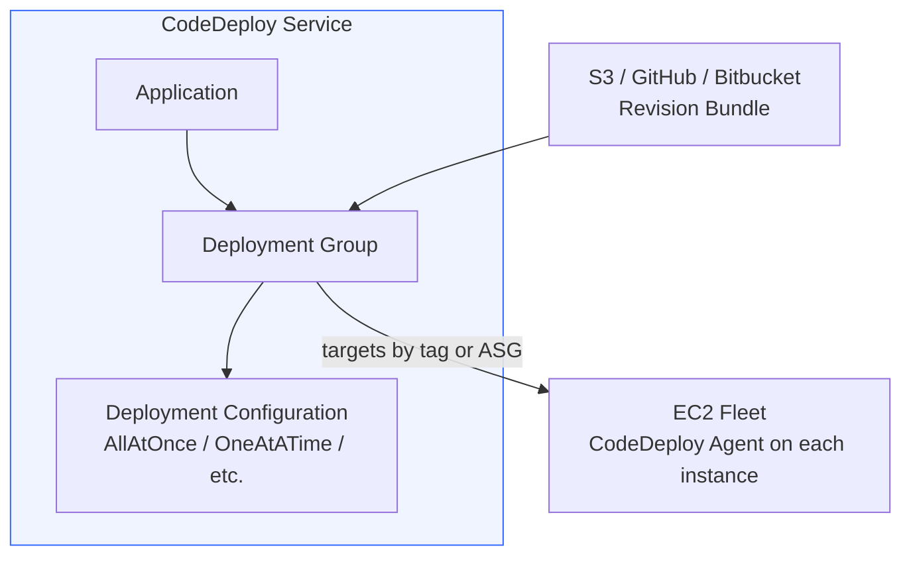
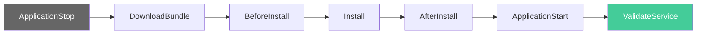
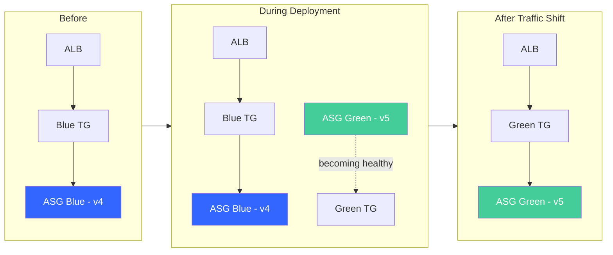

# CodeDeploy on EC2: From First Deployment to Blue/Green

Deploying code to production needs to be fast (for delivering value) and safe (for not breaking things). These goals pull in opposite directions, and the gap between them is where deployment automation lives. AWS CodeDeploy is one answer to this problem — a managed service that orchestrates file copying, validation scripts, traffic shifting, and automatic rollback across EC2 instances, on-premises servers, Lambda functions, and ECS services.

This post covers CodeDeploy on EC2 end-to-end: how the agent, AppSpec, and lifecycle hooks work, then deploys the same application using every available strategy — AllAtOnce, OneAtATime, HalfAtATime, and Blue/Green with Auto Scaling Groups. By the end, you'll understand the mechanics and know when to pick each strategy.

> **Note:** CodeDeploy also supports Lambda and ECS. On-premises servers use the same mechanics as EC2 — same AppSpec, hooks, agent — with the only differences being manual registration and no blue/green support.

## How CodeDeploy Works

CodeDeploy organizes deployments around three concepts:

1. **Application** — a named container tied to a compute platform (EC2/On-Premises, Lambda, or ECS). You can't mix platforms in one application.
2. **Deployment Group** — defines what to deploy to (EC2 instances matched by tags or an ASG), which deployment strategy to use, and optional CloudWatch alarms for automatic rollback.
3. **Revision** — the AppSpec file plus your application artifacts. For EC2, this is a zip or tar bundle stored in S3 (or pulled from GitHub/Bitbucket).

The **AppSpec file** is the contract between your application and CodeDeploy. It declares which files to copy to the instance and which scripts to run at each lifecycle event. The **deployment configuration** controls how aggressively instances are updated — all at once, one at a time, or somewhere in between.



The CodeDeploy **agent** runs on each EC2 instance as a background process. It polls the CodeDeploy service over outbound HTTPS — no inbound ports needed. When a deployment targets the instance (matched by tags), the agent downloads the revision, unpacks it, and executes the lifecycle hook scripts defined in the AppSpec.

## Prerequisites

To follow along, you'll need:

- [AWS CLI v2](https://docs.aws.amazon.com/cli/latest/userguide/getting-started-install.html) installed and configured with credentials that have permissions for EC2, Auto Scaling, Elastic Load Balancing, IAM, S3, CloudWatch, and CodeDeploy. `AdministratorAccess` works for learning — scope it down for production.
- A VPC with at least two public subnets in different Availability Zones. The default one works.
- An AWS account — estimated cost is ~$2–3 USD (3 × t2.micro instances, ALB running for a few hours)
- Basic familiarity with EC2 and load balancers

## Setting Up the Lab — CloudFormation Template

This template creates a fleet of 3 EC2 instances behind an Application Load Balancer, with the CodeDeploy agent pre-installed and nginx serving a placeholder page. The instances run in an Auto Scaling Group — needed later for the blue/green strategy.

**`ec2-prerequisites.yaml`**:

```yaml
AWSTemplateFormatVersion: '2010-09-09'
Description: >
  CodeDeploy EC2 lab prerequisites.
  Creates an ASG with 3 instances behind an ALB, CodeDeploy agent installed,
  nginx serving v1, S3 bucket for artifacts, and all IAM roles.

Parameters:
  LatestAmiId:
    Type: AWS::SSM::Parameter::Value<AWS::EC2::Image::Id>
    Default: /aws/service/ami-amazon-linux-latest/al2023-ami-kernel-default-x86_64
  VpcId:
    Type: AWS::EC2::VPC::Id
    Description: Your default VPC ID
  SubnetIds:
    Type: List<AWS::EC2::Subnet::Id>
    Description: At least two public subnets

Resources:
  # S3 bucket for deployment revision bundles
  DeploymentBucket:
    Type: AWS::S3::Bucket
    Properties:
      BucketName: !Sub 'codedeploy-lab-${AWS::AccountId}'
      VersioningConfiguration:
        Status: Enabled

  # IAM role for EC2 instances — S3 access for pulling revisions
  EC2Role:
    Type: AWS::IAM::Role
    Properties:
      RoleName: CodeDeployEC2Role
      AssumeRolePolicyDocument:
        Version: '2012-10-17'
        Statement:
          - Effect: Allow
            Principal:
              Service: ec2.amazonaws.com
            Action: sts:AssumeRole
      ManagedPolicyArns:
        - arn:aws:iam::aws:policy/AmazonSSMManagedInstanceCore
      Policies:
        - PolicyName: S3DeploymentAccess
          PolicyDocument:
            Version: '2012-10-17'
            Statement:
              - Effect: Allow
                Action:
                  - s3:GetObject
                  - s3:GetObjectVersion
                  - s3:ListBucket
                Resource:
                  - !Sub 'arn:aws:s3:::codedeploy-lab-${AWS::AccountId}'
                  - !Sub 'arn:aws:s3:::codedeploy-lab-${AWS::AccountId}/*'

  EC2InstanceProfile:
    Type: AWS::IAM::InstanceProfile
    Properties:
      Roles: [!Ref EC2Role]

  # CodeDeploy service role
  CodeDeployServiceRole:
    Type: AWS::IAM::Role
    Properties:
      RoleName: CodeDeployEC2ServiceRole
      AssumeRolePolicyDocument:
        Version: '2012-10-17'
        Statement:
          - Effect: Allow
            Principal:
              Service: codedeploy.amazonaws.com
            Action: sts:AssumeRole
      ManagedPolicyArns:
        - arn:aws:iam::aws:policy/service-role/AWSCodeDeployRole
      Policies:
        # Additional permissions required for blue/green deployments
        # with Auto Scaling Groups that use launch templates
        - PolicyName: BlueGreenLaunchTemplateAccess
          PolicyDocument:
            Version: '2012-10-17'
            Statement:
              - Effect: Allow
                Action:
                  - ec2:RunInstances
                  - ec2:CreateTags
                  - iam:PassRole
                Resource: '*'

  # Security groups
  ALBSecurityGroup:
    Type: AWS::EC2::SecurityGroup
    Properties:
      GroupDescription: ALB - allow HTTP from internet
      VpcId: !Ref VpcId
      SecurityGroupIngress:
        - IpProtocol: tcp
          FromPort: 80
          ToPort: 80
          CidrIp: 0.0.0.0/0

  InstanceSecurityGroup:
    Type: AWS::EC2::SecurityGroup
    Properties:
      GroupDescription: Instances - allow HTTP from ALB
      VpcId: !Ref VpcId
      SecurityGroupIngress:
        - IpProtocol: tcp
          FromPort: 80
          ToPort: 80
          SourceSecurityGroupId: !Ref ALBSecurityGroup

  # Application Load Balancer
  ALB:
    Type: AWS::ElasticLoadBalancingV2::LoadBalancer
    Properties:
      Name: codedeploy-lab-alb
      Subnets: !Ref SubnetIds
      SecurityGroups: [!Ref ALBSecurityGroup]

  TargetGroup:
    Type: AWS::ElasticLoadBalancingV2::TargetGroup
    Properties:
      Name: codedeploy-lab-tg
      Port: 80
      Protocol: HTTP
      VpcId: !Ref VpcId
      TargetType: instance
      HealthCheckPath: /

  Listener:
    Type: AWS::ElasticLoadBalancingV2::Listener
    Properties:
      LoadBalancerArn: !Ref ALB
      Port: 80
      Protocol: HTTP
      DefaultActions:
        - Type: forward
          TargetGroupArn: !Ref TargetGroup

  # Launch template with CodeDeploy agent + nginx
  LaunchTemplate:
    Type: AWS::EC2::LaunchTemplate
    Properties:
      LaunchTemplateName: codedeploy-lab-lt
      LaunchTemplateData:
        ImageId: !Ref LatestAmiId
        InstanceType: t2.micro
        IamInstanceProfile:
          Arn: !GetAtt EC2InstanceProfile.Arn
        SecurityGroupIds: [!Ref InstanceSecurityGroup]
        TagSpecifications:
          - ResourceType: instance
            Tags:
              - Key: Name
                Value: CodeDeployLab
              - Key: Environment
                Value: dev
        UserData:
          Fn::Base64: !Sub |
            #!/bin/bash
            yum update -y
            yum install -y ruby wget nginx
            # Install CodeDeploy agent
            cd /home/ec2-user
            wget https://aws-codedeploy-${AWS::Region}.s3.${AWS::Region}.amazonaws.com/latest/install
            chmod +x ./install && ./install auto
            # Start nginx with v1 page
            systemctl start nginx && systemctl enable nginx
            echo "<h1>Version 1.0 - Original</h1>" > /usr/share/nginx/html/index.html

  # Auto Scaling Group — 3 instances for demonstrating rolling strategies
  ASG:
    Type: AWS::AutoScaling::AutoScalingGroup
    Properties:
      AutoScalingGroupName: codedeploy-lab-asg
      LaunchTemplate:
        LaunchTemplateId: !Ref LaunchTemplate
        Version: !GetAtt LaunchTemplate.LatestVersionNumber
      MinSize: 3
      MaxSize: 6
      DesiredCapacity: 3
      VPCZoneIdentifier: !Ref SubnetIds
      TargetGroupARNs: [!Ref TargetGroup]
      HealthCheckType: ELB
      HealthCheckGracePeriod: 120

Outputs:
  ALBDns:
    Description: ALB DNS name — use this to verify deployments
    Value: !GetAtt ALB.DNSName
  BucketName:
    Description: S3 bucket for deployment bundles
    Value: !Ref DeploymentBucket
  CodeDeployRoleArn:
    Description: CodeDeploy service role ARN
    Value: !GetAtt CodeDeployServiceRole.Arn
  ASGName:
    Description: Auto Scaling Group name
    Value: !Ref ASG
  TargetGroupName:
    Description: Target group name (for blue/green config)
    Value: !GetAtt TargetGroup.TargetGroupName
```

Deploy the stack:

```bash
aws cloudformation deploy \
  --template-file ec2-prerequisites.yaml \
  --stack-name codedeploy-ec2-lab \
  --capabilities CAPABILITY_NAMED_IAM \
  --parameter-overrides \
    VpcId=<YOUR_VPC_ID> \
    SubnetIds=<SUBNET_1>,<SUBNET_2>
```

Wait for the instances to become healthy (2–3 minutes for user data to complete), then verify:

```bash
ALB_DNS=$(aws cloudformation describe-stacks \
  --stack-name codedeploy-ec2-lab \
  --query 'Stacks[0].Outputs[?OutputKey==`ALBDns`].OutputValue' \
  --output text)

curl http://$ALB_DNS
# Expected: <h1>Version 1.0 - Original</h1>
```

Store variables for later use:

```bash
BUCKET=$(aws cloudformation describe-stacks --stack-name codedeploy-ec2-lab \
  --query 'Stacks[0].Outputs[?OutputKey==`BucketName`].OutputValue' --output text)
CODEDEPLOY_ROLE=$(aws cloudformation describe-stacks --stack-name codedeploy-ec2-lab \
  --query 'Stacks[0].Outputs[?OutputKey==`CodeDeployRoleArn`].OutputValue' --output text)
ASG_NAME=$(aws cloudformation describe-stacks --stack-name codedeploy-ec2-lab \
  --query 'Stacks[0].Outputs[?OutputKey==`ASGName`].OutputValue' --output text)
```

## The AppSpec File and Lifecycle Hooks

Before deploying with any strategy, we need a revision bundle. The AppSpec file tells CodeDeploy what files to copy and what scripts to run at each stage of the deployment.

The full lifecycle hook order for an in-place EC2 deployment:



- **ApplicationStop** — runs the *previous* revision's stop script (skipped on first deploy)
- **DownloadBundle** / **Install** — handled by the agent (no user scripts). Install copies files from the `files:` section.
- **BeforeInstall** through **ValidateService** — your scripts. If any exits non-zero, the deployment fails at that event.

Create the directory structure for the deployment bundle — this will hold the AppSpec, the application files, and the lifecycle hook scripts:

```bash
mkdir -p deploy-bundle/scripts deploy-bundle/html
```

**`deploy-bundle/appspec.yml`** — the deployment contract:

```yaml
version: 0.0
os: linux

files:
  - source: /html/index.html
    destination: /usr/share/nginx/html/

hooks:
  BeforeInstall:
    - location: scripts/before_install.sh
      timeout: 120
      runas: root
  AfterInstall:
    - location: scripts/after_install.sh
      timeout: 120
      runas: root
  ApplicationStart:
    - location: scripts/start_server.sh
      timeout: 60
      runas: root
  ValidateService:
    - location: scripts/validate.sh
      timeout: 60
      runas: root
```

**`deploy-bundle/html/index.html`**:

```html
<h1>Version 2.0 - Deployed via CodeDeploy</h1>
<p>Deployed at: DEPLOY_TIMESTAMP</p>
```

**`deploy-bundle/scripts/before_install.sh`** — clean up before new files arrive:

```bash
#!/bin/bash
echo "[BeforeInstall] Removing old deployment..."
rm -f /usr/share/nginx/html/index.html
```

**`deploy-bundle/scripts/after_install.sh`** — configure deployed files:

```bash
#!/bin/bash
echo "[AfterInstall] Injecting deployment timestamp..."
sed -i "s/DEPLOY_TIMESTAMP/$(date)/" /usr/share/nginx/html/index.html
```

**`deploy-bundle/scripts/start_server.sh`** — restart the application:

```bash
#!/bin/bash
echo "[ApplicationStart] Restarting nginx..."
systemctl restart nginx
```

**`deploy-bundle/scripts/validate.sh`** — the safety gate. Non-zero exit = failed deployment:

```bash
#!/bin/bash
echo "[ValidateService] Checking nginx health..."
systemctl is-active nginx || exit 1
HTTP_CODE=$(curl -s -o /dev/null -w "%{http_code}" http://localhost)
if [ "$HTTP_CODE" != "200" ]; then
  echo "[ValidateService] FAILED — HTTP $HTTP_CODE"
  exit 1
fi
echo "[ValidateService] SUCCESS"
```

Make scripts executable and bundle:

```bash
chmod +x deploy-bundle/scripts/*.sh
cd deploy-bundle && zip -r ../app-v2.zip . && cd ..
aws s3 cp app-v2.zip s3://$BUCKET/app-v2.zip
```

## Creating the CodeDeploy Application

The application is a named container that scopes everything else. Create one for the EC2/On-Premises platform:

```bash
aws deploy create-application \
  --application-name codedeploy-lab \
  --compute-platform Server
```

Now we'll create different deployment groups with different strategies and deploy against the same fleet. This lets you compare the behavior directly.

## Strategy 1: AllAtOnce

AllAtOnce deploys to every instance simultaneously. It's the fastest strategy — and the riskiest. If the new version is broken, your entire fleet is affected at once.

Create a deployment group using `CodeDeployDefault.AllAtOnce`:

```bash
aws deploy create-deployment-group \
  --application-name codedeploy-lab \
  --deployment-group-name all-at-once-group \
  --service-role-arn $CODEDEPLOY_ROLE \
  --auto-scaling-groups $ASG_NAME \
  --deployment-config-name CodeDeployDefault.AllAtOnce
```

Deploy:

```bash
DEPLOY_ID=$(aws deploy create-deployment \
  --application-name codedeploy-lab \
  --deployment-group-name all-at-once-group \
  --s3-location bucket=$BUCKET,key=app-v2.zip,bundleType=zip \
  --description "v2 - AllAtOnce" \
  --query 'deploymentId' --output text)

echo "Deployment: $DEPLOY_ID"
```

Watch it complete:

```bash
while true; do
  STATUS=$(aws deploy get-deployment --deployment-id $DEPLOY_ID \
    --query 'deploymentInfo.status' --output text)
  echo "$(date +%H:%M:%S) $STATUS"
  if [ "$STATUS" != "InProgress" ] && [ "$STATUS" != "Created" ]; then break; fi
  sleep 5
done
```

All 3 instances update simultaneously. Verify:

```bash
curl http://$ALB_DNS
# <h1>Version 2.0 - Deployed via CodeDeploy</h1>
```

**When to use AllAtOnce:** Dev/test environments where speed matters and downtime is acceptable. Never for production services with availability requirements.

**Success criteria:** The deployment succeeds if deployment to *at least one* instance succeeds. This surprises people — even if 2 of 3 instances fail, AllAtOnce reports success if one worked.

## Strategy 2: OneAtATime

OneAtATime deploys to a single instance, waits for success, then moves to the next. If any instance fails (except the last), the entire deployment stops. This gives you minimum blast radius — at most one instance runs unvalidated code at any time.

Create a new deployment bundle (v3) so we can see the change:

```bash
echo '<h1>Version 3.0 - OneAtATime</h1><p>Deployed at: DEPLOY_TIMESTAMP</p>' \
  > deploy-bundle/html/index.html
cd deploy-bundle && zip -r ../app-v3.zip . && cd ..
aws s3 cp app-v3.zip s3://$BUCKET/app-v3.zip
```

Create the deployment group:

```bash
aws deploy create-deployment-group \
  --application-name codedeploy-lab \
  --deployment-group-name one-at-a-time-group \
  --service-role-arn $CODEDEPLOY_ROLE \
  --auto-scaling-groups $ASG_NAME \
  --deployment-config-name CodeDeployDefault.OneAtATime
```

Deploy and observe the sequential behavior:

```bash
DEPLOY_ID=$(aws deploy create-deployment \
  --application-name codedeploy-lab \
  --deployment-group-name one-at-a-time-group \
  --s3-location bucket=$BUCKET,key=app-v3.zip,bundleType=zip \
  --description "v3 - OneAtATime" \
  --query 'deploymentId' --output text)

# Watch instances deploy one by one
while true; do
  aws deploy get-deployment --deployment-id $DEPLOY_ID \
    --query 'deploymentInfo.{Status:status,Overview:deploymentOverview}' --output json
  STATUS=$(aws deploy get-deployment --deployment-id $DEPLOY_ID \
    --query 'deploymentInfo.status' --output text)
  if [ "$STATUS" != "InProgress" ] && [ "$STATUS" != "Created" ]; then break; fi
  sleep 10
done
```

During the deployment, `curl http://$ALB_DNS` returns a mix of v2 and v3 responses as instances update one by one.

**When to use OneAtATime:** Production environments where you want maximum safety and can tolerate slow deployments. Good for small fleets (3–5 instances) where the time cost is acceptable.

**Success criteria:** All instances must succeed — except the very last one. If only the final instance fails, the deployment still reports success (to avoid failing an otherwise complete rollout over one outlier).

## Strategy 3: HalfAtATime

HalfAtATime deploys to up to 50% of instances simultaneously, waits for that batch to succeed, then deploys to the remaining 50%. It balances speed and safety — you're never exposing your entire fleet at once, but you deploy faster than one-by-one.

```bash
echo '<h1>Version 4.0 - HalfAtATime</h1><p>Deployed at: DEPLOY_TIMESTAMP</p>' \
  > deploy-bundle/html/index.html
cd deploy-bundle && zip -r ../app-v4.zip . && cd ..
aws s3 cp app-v4.zip s3://$BUCKET/app-v4.zip
```

```bash
aws deploy create-deployment-group \
  --application-name codedeploy-lab \
  --deployment-group-name half-at-a-time-group \
  --service-role-arn $CODEDEPLOY_ROLE \
  --auto-scaling-groups $ASG_NAME \
  --deployment-config-name CodeDeployDefault.HalfAtATime
```

```bash
DEPLOY_ID=$(aws deploy create-deployment \
  --application-name codedeploy-lab \
  --deployment-group-name half-at-a-time-group \
  --s3-location bucket=$BUCKET,key=app-v4.zip,bundleType=zip \
  --description "v4 - HalfAtATime" \
  --query 'deploymentId' --output text)
```

With 3 instances, HalfAtATime deploys to 1 instance first (50% of 3, rounded down), then the remaining 2. With a larger fleet (say 10 instances), you'd see 5 deploy, then 5.

**When to use HalfAtATime:** Production fleets where you want faster deployments than OneAtATime but still want to limit blast radius to half your capacity.

## Custom Deployment Configurations

The predefined configs (AllAtOnce, HalfAtATime, OneAtATime) rarely match real-world requirements exactly. Create a custom configuration that keeps at least 75% of instances healthy at all times:

```bash
aws deploy create-deployment-config \
  --deployment-config-name Custom75Percent \
  --minimum-healthy-hosts type=FLEET_PERCENT,value=75 \
  --compute-platform Server
```

With this config on a 12-instance fleet, CodeDeploy deploys to at most 3 instances at a time (12 × 25% = 3 can be unhealthy simultaneously).

You can also use `HOST_COUNT` for absolute numbers:

```bash
aws deploy create-deployment-config \
  --deployment-config-name CustomKeep5Healthy \
  --minimum-healthy-hosts type=HOST_COUNT,value=5 \
  --compute-platform Server
```

This ensures at least 5 instances are always healthy regardless of fleet size.

## Strategy 4: Blue/Green with Auto Scaling Group

Blue/Green is fundamentally different from the in-place strategies above. Instead of updating existing instances, CodeDeploy:

1. Provisions a **new ASG** (green) from the same launch template
2. Deploys the revision to the green instances
3. Waits for green instances to pass health checks
4. Switches the ALB to route traffic from the blue target group to green
5. After a configurable wait period, terminates the original (blue) instances

The key advantage: **instant rollback**. Since the blue instances remain running during the wait period, CodeDeploy can switch traffic back in seconds — no redeployment needed.



Create v5 for the blue/green deployment:

```bash
echo '<h1>Version 5.0 - Blue/Green</h1><p>Deployed at: DEPLOY_TIMESTAMP</p>' \
  > deploy-bundle/html/index.html
cd deploy-bundle && zip -r ../app-v5.zip . && cd ..
aws s3 cp app-v5.zip s3://$BUCKET/app-v5.zip
```

Create a deployment group configured for blue/green. This requires specifying how traffic rerouting and instance termination should work:

> **Note on deployment config in blue/green:** The `--deployment-config-name` controls how the revision is installed on the *green* instances — not how traffic shifts. Traffic at the ALB always switches in one step (blue target group → green target group). `AllAtOnce` is the typical choice here because green instances aren't serving traffic yet, so there's no risk in installing simultaneously. You'd use `OneAtATime` only if your lifecycle hooks are expensive and you want to validate on one green instance before committing to the rest.

```bash
aws deploy create-deployment-group \
  --application-name codedeploy-lab \
  --deployment-group-name blue-green-group \
  --service-role-arn $CODEDEPLOY_ROLE \
  --auto-scaling-groups $ASG_NAME \
  --deployment-config-name CodeDeployDefault.AllAtOnce \
  --deployment-style deploymentType=BLUE_GREEN,deploymentOption=WITH_TRAFFIC_CONTROL \
  --blue-green-deployment-configuration '{
    "terminateBlueInstancesOnDeploymentSuccess": {
      "action": "TERMINATE",
      "terminationWaitTimeInMinutes": 5
    },
    "deploymentReadyOption": {
      "actionOnTimeout": "CONTINUE_DEPLOYMENT",
      "waitTimeInMinutes": 0
    },
    "greenFleetProvisioningOption": {
      "action": "COPY_AUTO_SCALING_GROUP"
    }
  }' \
  --load-balancer-info '{"targetGroupInfoList": [{"name": "codedeploy-lab-tg"}]}'
```

Key configuration options:

- **`greenFleetProvisioningOption: COPY_AUTO_SCALING_GROUP`** — CodeDeploy creates a new ASG by copying the blue one (same launch template, capacity, etc.)
- **`deploymentReadyOption: CONTINUE_DEPLOYMENT`** — automatically shift traffic once green is healthy (vs. waiting for manual approval)
- **`terminateBlueInstancesOnDeploymentSuccess: TERMINATE` with 5 min wait** — keeps blue instances alive for 5 minutes after traffic shifts (rollback window), then terminates them

Deploy:

```bash
DEPLOY_ID=$(aws deploy create-deployment \
  --application-name codedeploy-lab \
  --deployment-group-name blue-green-group \
  --s3-location bucket=$BUCKET,key=app-v5.zip,bundleType=zip \
  --description "v5 - Blue/Green" \
  --query 'deploymentId' --output text)

echo "Blue/Green deployment: $DEPLOY_ID"
```

This takes longer than in-place — CodeDeploy must provision new instances, install the agent, deploy the revision, and wait for health checks. Watch the progress:

```bash
while true; do
  STATUS=$(aws deploy get-deployment --deployment-id $DEPLOY_ID \
    --query 'deploymentInfo.status' --output text)
  echo "$(date +%H:%M:%S) $STATUS"
  if [ "$STATUS" != "InProgress" ] && [ "$STATUS" != "Created" ] && \
     [ "$STATUS" != "Ready" ]; then break; fi
  sleep 15
done
```

Once complete, verify:

```bash
curl http://$ALB_DNS
# <h1>Version 5.0 - Blue/Green</h1>
```

After some time, the original blue ASG is terminated automatically.

**When to use Blue/Green:**
- Production services that require zero downtime
- When instant rollback is non-negotiable
- When you want to eliminate configuration drift (fresh instances every deployment)

**Tradeoffs:**
- 2× instance cost during deployment (both blue and green running simultaneously)
- Slower than in-place (new instances must launch and become healthy)
- Requires an ASG — not available for on-premises instances or individually tagged EC2 instances

## Automatic Rollback with CloudWatch Alarms

Deployment strategies control *how* traffic shifts. Alarms control *when to abort*. By attaching CloudWatch alarms to a deployment group, CodeDeploy automatically triggers a rollback if the alarm fires during deployment.

Create a CloudWatch alarm on the ALB's 5xx error rate:

```bash
aws cloudwatch put-metric-alarm \
  --alarm-name codedeploy-lab-5xx \
  --namespace AWS/ApplicationELB \
  --metric-name HTTPCode_Target_5XX_Count \
  --statistic Sum \
  --period 60 \
  --threshold 5 \
  --comparison-operator GreaterThanThreshold \
  --evaluation-periods 1 \
  --dimensions Name=LoadBalancer,Value=$(aws elbv2 describe-load-balancers \
    --names codedeploy-lab-alb --query 'LoadBalancers[0].LoadBalancerArn' \
    --output text | sed 's|.*:loadbalancer/||')
```

Update a deployment group to use this alarm:

```bash
aws deploy update-deployment-group \
  --application-name codedeploy-lab \
  --current-deployment-group-name one-at-a-time-group \
  --alarm-configuration enabled=true,alarms=[{name=codedeploy-lab-5xx}]
```

Now, if you deploy a version that causes 5xx errors, CodeDeploy will:
1. Detect the alarm entering `ALARM` state
2. Stop the deployment
3. Create a new deployment with the previous revision (rollback)

**Key detail:** A CodeDeploy rollback is a *new deployment of the previous revision* — not an undo. It goes through the full lifecycle hooks again. For blue/green, rollback means switching the ALB back to the blue target group (instant, no redeployment needed).

**Important:** The alarm must be in `OK` state when the deployment starts. If it's already in `ALARM`, CodeDeploy ignores it.

## Choosing a Strategy

| Strategy | Downtime | Rollback Speed | Cost | Best For |
|----------|----------|----------------|------|----------|
| AllAtOnce | Possible | Slow (full redeploy) | 1× | Dev/test, speed priority |
| OneAtATime | None (rolling) | Medium (stop + redeploy) | 1× | Small production fleets, max safety |
| HalfAtATime | None (rolling) | Medium (stop + redeploy) | 1× | Larger fleets, balanced speed/safety |
| Custom (75%+) | None (rolling) | Medium | 1× | Specific SLA requirements |
| Blue/Green | None | Instant (ALB switch) | 2× during deploy | Zero-tolerance production, no drift |

Decision shortcut:
- **Need instant rollback?** → Blue/Green
- **Cost-sensitive, still need safety?** → OneAtATime or custom minimum healthy
- **Dev environment?** → AllAtOnce
- **On-premises?** → In-place only (Blue/Green requires ASG)

## Clean Up

```bash
# Delete deployment groups and application
aws deploy delete-deployment-group --application-name codedeploy-lab --deployment-group-name all-at-once-group
aws deploy delete-deployment-group --application-name codedeploy-lab --deployment-group-name one-at-a-time-group
aws deploy delete-deployment-group --application-name codedeploy-lab --deployment-group-name half-at-a-time-group
aws deploy delete-deployment-group --application-name codedeploy-lab --deployment-group-name blue-green-group
aws deploy delete-application --application-name codedeploy-lab

# Delete custom deployment configs
aws deploy delete-deployment-config --deployment-config-name Custom75Percent
aws deploy delete-deployment-config --deployment-config-name CustomKeep5Healthy

# Delete CloudWatch alarm
aws cloudwatch delete-alarms --alarm-names codedeploy-lab-5xx

# Blue/green deployments create ASGs outside CloudFormation.
# These must be deleted manually or the stack deletion will hang
# (the security group can't be deleted while instances reference it).
aws autoscaling describe-auto-scaling-groups \
  --query 'AutoScalingGroups[?contains(AutoScalingGroupName, `CodeDeploy`)].AutoScalingGroupName' \
  --output text | xargs -I {} aws autoscaling delete-auto-scaling-group \
  --auto-scaling-group-name {} --force-delete

# Wait for orphaned instances to terminate before deleting the stack
sleep 60

# Delete the CloudFormation stack (handles EC2, ALB, ASG, IAM, S3)
aws s3 rm s3://$BUCKET --recursive
aws s3api delete-objects --bucket $BUCKET \
  --delete "$(aws s3api list-object-versions --bucket $BUCKET \
    --query '{Objects: Versions[].{Key:Key,VersionId:VersionId}}' --output json)" 2>/dev/null
aws s3api delete-objects --bucket $BUCKET \
  --delete "$(aws s3api list-object-versions --bucket $BUCKET \
    --query '{Objects: DeleteMarkers[].{Key:Key,VersionId:VersionId}}' --output json)" 2>/dev/null
aws cloudformation delete-stack --stack-name codedeploy-ec2-lab
aws cloudformation wait stack-delete-complete --stack-name codedeploy-ec2-lab
```

## Conclusion

CodeDeploy on EC2 gives you a spectrum of deployment safety:

- **AllAtOnce** — fast but risky. Entire fleet at risk simultaneously.
- **OneAtATime** — slow but safe. At most one instance running untested code at any moment.
- **HalfAtATime** — balanced. Never more than 50% of capacity exposed.
- **Blue/Green** — zero downtime, instant rollback, fresh instances. The gold standard for production — at the cost of double capacity during deployment.

The AppSpec file and lifecycle hooks are the same regardless of strategy. The strategy only controls *how many instances update simultaneously* (in-place) or *whether you provision a parallel fleet* (blue/green).

CloudWatch alarms close the loop: if something goes wrong during deployment, CodeDeploy automatically rolls back without human intervention. This is what makes CodeDeploy production-grade — not just orchestration, but automated safety.

If you're working through deployment strategy decisions for your own systems, feel free to [reach out](mailto:hector@agilityfeat.com) — always happy to talk shop.
