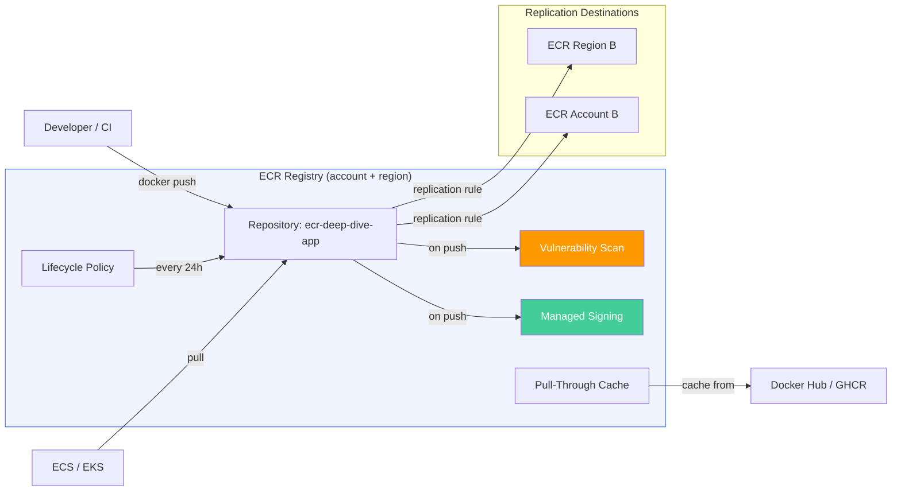
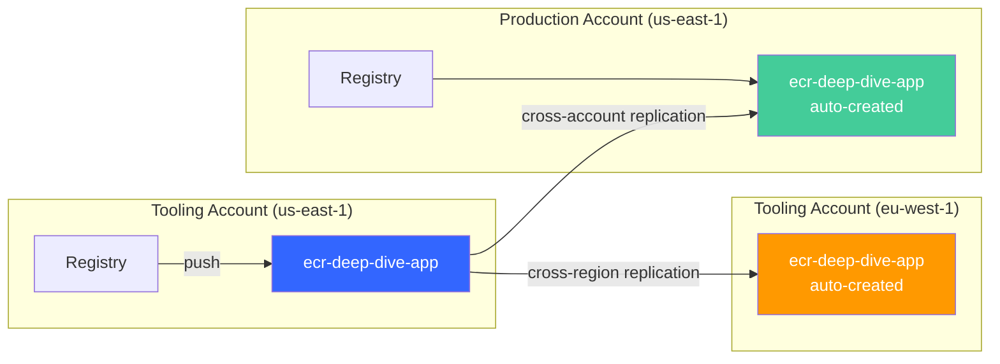
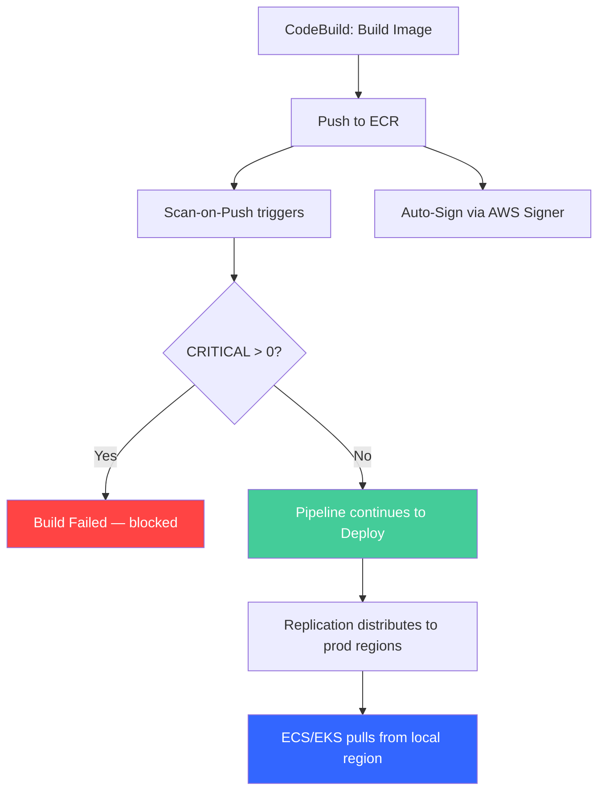

# Amazon ECR Beyond the Basics: Scanning, Lifecycle Policies, and Multi-Region Replication

Most teams interact with Amazon ECR through three commands: `get-login-password`, `docker push`, `docker pull`. Push an image, pull it somewhere else, done. But ECR has an entire operational and security layer that most accounts never touch — vulnerability scanning that catches CVEs before they reach production, lifecycle policies that prevent storage costs from spiraling, pull-through caching that shields your builds from upstream outages, image signing that proves provenance, and replication that distributes your images globally.

This post sets up each of these features hands-on. By the end you'll have a production-grade ECR configuration with automated scanning, cost-optimized retention, supply chain verification via image signing, and multi-region distribution — all from CLI commands you can run today.

## Architecture Overview

Before diving in, here's how ECR's features fit together. The registry is the top-level container (one per account per region), repositories live inside it, and most of the advanced features are configured at the registry level — not per repository:



Key hierarchy:

- **Registry** — one per account per region. Scanning, replication, pull-through cache, and managed signing are configured here.
- **Repository** — one per application/service. Lifecycle policies and tag immutability are configured here.
- **Image** — tagged or untagged. The actual container image layers and manifests.

## Prerequisites — CloudFormation Template

Before starting, make sure you have the [AWS CLI v2 installed and configured](https://docs.aws.amazon.com/cli/latest/userguide/getting-started-install.html) with permissions for CloudFormation, ECR, CodeBuild, S3, and IAM. An account with `AdministratorAccess` works for learning — scope it down for production.

You'll also need [Docker installed locally](https://docs.docker.com/get-docker/) if you want to build and push images manually. Alternatively, the CloudFormation template includes a CodeBuild project that handles builds for you.

To keep you focused on ECR's features rather than setup boilerplate, we'll deploy a CloudFormation template that provisions the baseline infrastructure:

**`prerequisites.yaml`**:

```yaml
AWSTemplateFormatVersion: '2010-09-09'
Description: >
  Prerequisites for the ECR deep dive lab.
  Creates an ECR repository, CodeBuild project, S3 bucket, and IAM roles.

Resources:
  # ECR repository with security best practices enabled by default
  ECRRepository:
    Type: AWS::ECR::Repository
    Properties:
      RepositoryName: ecr-deep-dive-app
      # Scan every image on push for OS-level vulnerabilities
      ImageScanningConfiguration:
        ScanOnPush: true
      # Prevent image tags from being overwritten — enforces build traceability
      ImageTagMutability: IMMUTABLE
      # Use AES256 encryption (free, simpler than KMS for learning)
      EncryptionConfiguration:
        EncryptionType: AES256
      # Basic lifecycle policy: expire untagged images after 7 days,
      # keep only the last 20 tagged images
      LifecyclePolicy:
        LifecyclePolicyText: |
          {
            "rules": [
              {
                "rulePriority": 1,
                "description": "Expire untagged images after 7 days",
                "selection": {
                  "tagStatus": "untagged",
                  "countType": "sinceImagePushed",
                  "countUnit": "days",
                  "countNumber": 7
                },
                "action": { "type": "expire" }
              },
              {
                "rulePriority": 2,
                "description": "Keep only last 20 tagged images",
                "selection": {
                  "tagStatus": "tagged",
                  "tagPrefixList": ["v"],
                  "countType": "imageCountMoreThan",
                  "countNumber": 20
                },
                "action": { "type": "expire" }
              }
            ]
          }

  # S3 bucket to store the Dockerfile and build context for CodeBuild
  ArtifactBucket:
    Type: AWS::S3::Bucket
    Properties:
      BucketName: !Sub 'ecr-deep-dive-${AWS::AccountId}'
      VersioningConfiguration:
        Status: Enabled

  # IAM role for CodeBuild — allows pushing images to ECR and writing logs
  CodeBuildServiceRole:
    Type: AWS::IAM::Role
    Properties:
      RoleName: ECRDeepDiveCodeBuildRole
      AssumeRolePolicyDocument:
        Version: '2012-10-17'
        Statement:
          - Effect: Allow
            Principal:
              Service: codebuild.amazonaws.com
            Action: sts:AssumeRole
      Policies:
        - PolicyName: ECRDeepDivePolicy
          PolicyDocument:
            Version: '2012-10-17'
            Statement:
              # Allow CodeBuild to push and pull images from ECR
              - Sid: ECRAccess
                Effect: Allow
                Action:
                  - ecr:GetDownloadUrlForLayer
                  - ecr:BatchGetImage
                  - ecr:BatchCheckLayerAvailability
                  - ecr:PutImage
                  - ecr:InitiateLayerUpload
                  - ecr:UploadLayerPart
                  - ecr:CompleteLayerUpload
                  - ecr:DescribeImageScanFindings
                Resource: !GetAtt ECRRepository.Arn
              # ECR login requires registry-level permission
              - Sid: ECRAuth
                Effect: Allow
                Action:
                  - ecr:GetAuthorizationToken
                Resource: '*'
              # Allow writing build logs to CloudWatch
              - Sid: CloudWatchLogs
                Effect: Allow
                Action:
                  - logs:CreateLogGroup
                  - logs:CreateLogStream
                  - logs:PutLogEvents
                Resource:
                  - !Sub 'arn:aws:logs:${AWS::Region}:${AWS::AccountId}:log-group:/aws/codebuild/ecr-deep-dive-build'
                  - !Sub 'arn:aws:logs:${AWS::Region}:${AWS::AccountId}:log-group:/aws/codebuild/ecr-deep-dive-build:*'
              # Allow reading build context from S3
              - Sid: S3Access
                Effect: Allow
                Action:
                  - s3:GetObject
                  - s3:GetObjectVersion
                Resource:
                  - !Sub 'arn:aws:s3:::ecr-deep-dive-${AWS::AccountId}/*'

  # CodeBuild project that builds a Docker image and pushes it to ECR
  CodeBuildProject:
    Type: AWS::CodeBuild::Project
    Properties:
      Name: ecr-deep-dive-build
      Description: Builds and pushes a sample Docker image to ECR for scanning demos
      ServiceRole: !GetAtt CodeBuildServiceRole.Arn
      Artifacts:
        Type: NO_ARTIFACTS
      Environment:
        Type: LINUX_CONTAINER
        ComputeType: BUILD_GENERAL1_SMALL
        Image: aws/codebuild/amazonlinux2-x86_64-standard:5.0
        # Privileged mode is required for Docker builds inside CodeBuild
        PrivilegedMode: true
        EnvironmentVariables:
          - Name: REPOSITORY_URI
            Value: !GetAtt ECRRepository.RepositoryUri
          - Name: AWS_ACCOUNT_ID
            Value: !Ref AWS::AccountId
      Source:
        Type: S3
        Location: !Sub 'ecr-deep-dive-${AWS::AccountId}/build-context.zip'
      TimeoutInMinutes: 15

Outputs:
  RepositoryUri:
    Description: ECR repository URI for pushing images
    Value: !GetAtt ECRRepository.RepositoryUri
  RepositoryArn:
    Description: ECR repository ARN
    Value: !GetAtt ECRRepository.Arn
  ProjectName:
    Description: CodeBuild project name
    Value: !Ref CodeBuildProject
  BucketName:
    Description: S3 bucket for build context
    Value: !Ref ArtifactBucket
```

The template creates:

| Resource | Type | Purpose |
|----------|------|---------|
| ECRRepository | `AWS::ECR::Repository` | Image repository with scan-on-push, immutable tags, AES256 encryption, lifecycle policy |
| ArtifactBucket | `AWS::S3::Bucket` | Stores Dockerfile and build context for CodeBuild |
| CodeBuildServiceRole | `AWS::IAM::Role` | Grants CodeBuild permission to push to ECR, read from S3, write logs |
| CodeBuildProject | `AWS::CodeBuild::Project` | Builds Docker images and pushes them to ECR (privileged mode for Docker-in-Docker) |

Deploy the stack. The `--capabilities CAPABILITY_NAMED_IAM` flag is required because the template creates a named IAM role:

```bash
# Deploy the prerequisite infrastructure
aws cloudformation deploy \
  --template-file prerequisites.yaml \
  --stack-name ecr-deep-dive-lab \
  --capabilities CAPABILITY_NAMED_IAM
```

Once complete, retrieve the outputs — you'll reference these throughout the post:

```bash
# Grab stack outputs: repository URI, project name, bucket name
aws cloudformation describe-stacks \
  --stack-name ecr-deep-dive-lab \
  --query 'Stacks[0].Outputs[*].{Key:OutputKey,Value:OutputValue}' \
  --output table
```

Now let's create a sample application to push. This Dockerfile intentionally uses `node:18` (not the latest) from the [ECR Public Gallery](https://gallery.ecr.aws/docker/library/node) so that the vulnerability scan has real CVEs to find — Node 18's Debian base and older OpenSSL/zlib libraries carry dozens of known vulnerabilities. The multi-stage build keeps the final image small while giving us both OS and language-level packages for the scanner to examine:

**`Dockerfile`**:

```dockerfile
# Stage 1: Install dependencies (includes dev tools the scanner will flag)
# Using ECR Public Gallery instead of Docker Hub — no rate limits, AWS-hosted
FROM public.ecr.aws/docker/library/node:18 AS builder

WORKDIR /app
COPY package.json package-lock.json ./
RUN npm ci --production

# Stage 2: Production image — slim base with only runtime dependencies
# node:18-slim still carries OS-level CVEs that ECR basic scanning will detect
FROM public.ecr.aws/docker/library/node:18-slim

WORKDIR /app
# Copy only production node_modules from the builder stage
COPY --from=builder /app/node_modules ./node_modules
COPY app.js ./

EXPOSE 3000

# Health check so ECS/EKS can monitor container health
HEALTHCHECK --interval=30s --timeout=3s --retries=3 \
  CMD wget -qO- http://localhost:3000/health || exit 1

CMD ["node", "app.js"]
```

Create a minimal application for the container. This is just enough to have a running process with a health endpoint:

**`app.js`**:

```javascript
const http = require('http');

// Simple HTTP server with a health endpoint for container health checks
const server = http.createServer((req, res) => {
  if (req.url === '/health') {
    res.writeHead(200, { 'Content-Type': 'application/json' });
    res.end(JSON.stringify({ status: 'ok', version: '1.0.0' }));
  } else {
    res.writeHead(200, { 'Content-Type': 'text/plain' });
    res.end('ECR Deep Dive Lab - v1.0.0\n');
  }
});

server.listen(3000, () => {
  console.log('Server running on port 3000');
});
```

Create `package.json` for the application:

**`package.json`**:

```json
{
  "name": "ecr-deep-dive-app",
  "version": "1.0.0",
  "main": "app.js",
  "scripts": {
    "start": "node app.js"
  },
  "dependencies": {
    "express": "^4.18.2"
  }
}
```

The buildspec tells CodeBuild how to build the Docker image, tag it with both a version and `latest`, push both tags, then wait for the scan results. The `post_build` phase queries scan findings and fails the build if any CRITICAL vulnerabilities are found — this is the pipeline integration pattern we'll explore in detail later:

**`buildspec.yml`**:

```yaml
version: 0.2

phases:
  pre_build:
    commands:
      # Authenticate Docker to ECR so we can push images
      - echo "Logging in to ECR..."
      - aws ecr get-login-password --region $AWS_DEFAULT_REGION | docker login --username AWS --password-stdin $REPOSITORY_URI

  build:
    commands:
      # Build the Docker image using the multi-stage Dockerfile
      - echo "Building Docker image..."
      - docker build -t $REPOSITORY_URI:v1.0.0 .
      - docker tag $REPOSITORY_URI:v1.0.0 $REPOSITORY_URI:latest

  post_build:
    commands:
      # post_build always runs, even if build fails — guard against pushing a broken image
      - |
        if [ "$CODEBUILD_BUILD_SUCCEEDING" != "1" ]; then
          echo "Build failed — skipping push"
          exit 1
        fi
      # Push both tags to ECR — this triggers scan-on-push
      - echo "Pushing image to ECR..."
      - docker push $REPOSITORY_URI:v1.0.0
      - docker push $REPOSITORY_URI:latest
      # Wait for the scan to complete (basic scan takes ~30 seconds)
      - echo "Waiting for scan results..."
      - sleep 30
      - |
        CRITICAL=$(aws ecr describe-image-scan-findings \
          --repository-name ecr-deep-dive-app \
          --image-id imageTag=v1.0.0 \
          --query 'imageScanFindings.findingSeverityCounts.CRITICAL // `0`' \
          --output text 2>/dev/null || echo "0")
        echo "Critical vulnerabilities found: $CRITICAL"
        if [ "$CRITICAL" -gt 0 ]; then
          echo "CRITICAL vulnerabilities detected — failing build"
          exit 1
        fi
```

Package these files and upload them to S3 so CodeBuild can use them as source. The zip contains everything CodeBuild needs to build the Docker image:

```bash
# Create a build context zip containing all project files
zip build-context.zip Dockerfile app.js package.json package-lock.json buildspec.yml

# Upload to the S3 bucket created by the stack
BUCKET=$(aws cloudformation describe-stacks \
  --stack-name ecr-deep-dive-lab \
  --query 'Stacks[0].Outputs[?OutputKey==`BucketName`].OutputValue' \
  --output text)

aws s3 cp build-context.zip s3://$BUCKET/build-context.zip
```

Trigger a build to push your first image:

```bash
# Start the CodeBuild project — it will build and push the image to ECR
BUILD_ID=$(aws codebuild start-build \
  --project-name ecr-deep-dive-build \
  --query 'build.id' --output text)

echo "Build started: $BUILD_ID"

# Poll until complete
while true; do
  STATUS=$(aws codebuild batch-get-builds --ids "$BUILD_ID" \
    --query 'builds[0].buildStatus' --output text)
  echo "$(date +%H:%M:%S) Status: $STATUS"
  if [ "$STATUS" != "IN_PROGRESS" ]; then break; fi
  sleep 10
done
```

With an image in the repository, we can now explore each feature.

## Vulnerability Scanning — Basic vs. Enhanced

ECR offers two scanning modes, and understanding the difference is critical for production operations.

### Basic Scanning

Basic scanning runs once per push — when you push an image, ECR scans it for known OS package vulnerabilities using the open-source [Clair](https://github.com/quay/clair) CVE database. It's free, automatic (if `scanOnPush` is enabled), and covers operating system packages only (apt, yum, apk).

Since we already pushed an image with `scanOnPush: true`, the scan has already run. Query the results to see what it found. This command retrieves the severity breakdown for our v1.0.0 image:

```bash
# Check scan results for our pushed image
aws ecr describe-image-scan-findings \
  --repository-name ecr-deep-dive-app \
  --image-id imageTag=v1.0.0 \
  --query '{
    Status: imageScanStatus.status,
    SeverityCounts: imageScanFindings.findingSeverityCounts,
    TotalFindings: length(imageScanFindings.findings)
  }'
```

You'll see output like:

```json
{
  "Status": "COMPLETE",
  "SeverityCounts": {
    "CRITICAL": 2,
    "HIGH": 15,
    "MEDIUM": 42,
    "LOW": 12,
    "INFORMATIONAL": 3
  },
  "TotalFindings": 74
}
```

The numbers will vary depending on when you run this — new CVEs are published constantly. The important thing: basic scanning found OS-level vulnerabilities in our `node:18-slim` base image. But it missed anything in our `node_modules/` — that's where enhanced scanning comes in.

### Enhanced Scanning (Amazon Inspector)

Enhanced scanning is powered by [Amazon Inspector](https://aws.amazon.com/inspector/). It scans both OS packages AND programming language packages (npm, pip, Maven, Go modules, etc.), and it does so continuously — meaning images are re-scanned automatically when new vulnerabilities are disclosed, not just at push time.

Enhanced scanning is configured at the registry level — it applies to all repositories (or a filtered subset). Enable it with this command, which switches your entire registry from basic to enhanced scanning:

```bash
# Enable enhanced scanning at the registry level
# This converts all repositories from basic to Inspector-powered scanning
aws ecr put-registry-scanning-configuration \
  --scan-type ENHANCED \
  --rules '[{"scanFrequency": "CONTINUOUS_SCAN", "repositoryFilters": [{"filter": "*", "filterType": "WILDCARD"}]}]'
```

The `CONTINUOUS_SCAN` frequency means Inspector re-scans existing images when new CVEs are published. You can also use `SCAN_ON_PUSH` for enhanced scanning that only triggers on push (saves cost if continuous isn't needed).

To limit enhanced scanning to specific repositories (useful for cost control — skip dev/scratch repos), use repository filters:

```bash
# Only apply enhanced scanning to repositories matching "prod-*"
aws ecr put-registry-scanning-configuration \
  --scan-type ENHANCED \
  --rules '[{"scanFrequency": "CONTINUOUS_SCAN", "repositoryFilters": [{"filter": "prod-*", "filterType": "WILDCARD"}]}]'
```

After enabling enhanced scanning, findings appear in both the ECR console and the Amazon Inspector console. Inspector gives you a unified view across ECR images, EC2 instances, and Lambda functions — one dashboard for all vulnerabilities in your account.

**What enhanced scanning adds over basic:**

| Capability | Basic | Enhanced |
|-----------|-------|----------|
| OS package vulnerabilities | ✅ | ✅ |
| Language package vulnerabilities (npm, pip, Maven, Go) | ❌ | ✅ |
| Continuous re-scanning | ❌ | ✅ |
| Inspector dashboard integration | ❌ | ✅ |
| Maps images to running ECS tasks / EKS pods | ❌ | ✅ |
| Cost | Free | Per image/month |

### Pipeline Integration — Gating on Scan Results

The buildspec we created earlier already includes a scan gate in `post_build`. The pattern is straightforward: push the image, wait for the scan, query findings, fail the build if critical vulnerabilities exist. Here's the key snippet isolated for clarity. This queries the scan findings API and exits with a non-zero code if any CRITICAL vulnerabilities are found — which fails the CodeBuild phase and stops the pipeline:

```bash
# Wait for scan to complete, then gate on results
CRITICAL=$(aws ecr describe-image-scan-findings \
  --repository-name ecr-deep-dive-app \
  --image-id imageTag=v1.0.0 \
  --query 'imageScanFindings.findingSeverityCounts.CRITICAL // `0`' \
  --output text)

# Fail the build if any CRITICAL vulnerabilities exist
if [ "$CRITICAL" -gt 0 ]; then
  echo "ERROR: $CRITICAL critical vulnerabilities found — blocking deployment"
  aws ecr describe-image-scan-findings \
    --repository-name ecr-deep-dive-app \
    --image-id imageTag=v1.0.0 \
    --query 'imageScanFindings.findings[?severity==`CRITICAL`].{CVE:name,Package:attributes[?key==`package_name`].value|[0],Description:description}' \
    --output table
  exit 1
fi

echo "Scan passed — no critical vulnerabilities"
```

For enhanced scanning, findings are available through the Inspector API instead. The `aws ecr describe-image-scan-findings` command still works, but Inspector's `list-findings` gives you richer data including CVSS scores and remediation guidance.

**Why fail the build if the image is already pushed?** The image exists in ECR regardless — the scan gate doesn't prevent storage, it prevents *deployment*. In a CodePipeline (Source → Build → Deploy), a failed Build stage stops the Deploy stage from ever running. The vulnerable image sits in the registry undeployed until a lifecycle policy cleans it up. If you want to go further and prevent the image from being pullable at all, you'd need a separate EventBridge rule that deletes or quarantines images when Inspector reports critical findings — but most teams just let the pipeline gate handle it.

## Lifecycle Policies — Automated Image Cleanup

Without lifecycle policies, repositories grow indefinitely. A busy CI pipeline pushing on every commit generates hundreds of images per week — most of which will never be pulled again. At $0.10/GB/month for standard storage, costs creep up silently.

### How Lifecycle Policies Work

Lifecycle policies are evaluated once every 24 hours (not in real-time). Each policy contains rules with priorities, and rules are evaluated in priority order (lower number = evaluated first). A rule matches images by tag status and applies an action — either **expire** (delete) or **archive** (move to cheaper archive storage).

Selection criteria include:

- **`sinceImagePushed`** — match images older than N days since push
- **`imageCountMoreThan`** — match when total image count exceeds N (keeps newest, expires oldest)
- **`sinceImageLastPulled`** — match images not pulled in N days (usage-based, available with archive action)

The CloudFormation template already set up a basic two-rule policy. Let's replace it with a more sophisticated version. This policy handles four scenarios: cleaning up untagged build artifacts, archiving stale images for compliance, retaining recent release images, and capping total images to prevent runaway growth:

```bash
# Apply a multi-rule lifecycle policy covering common production scenarios
aws ecr put-lifecycle-policy \
  --repository-name ecr-deep-dive-app \
  --lifecycle-policy-text '{
    "rules": [
      {
        "rulePriority": 1,
        "description": "Expire untagged images after 1 day (build artifacts, failed pushes)",
        "selection": {
          "tagStatus": "untagged",
          "countType": "sinceImagePushed",
          "countUnit": "days",
          "countNumber": 1
        },
        "action": { "type": "expire" }
      },
      {
        "rulePriority": 2,
        "description": "Archive images not pulled in 90 days (compliance retention)",
        "selection": {
          "tagStatus": "tagged",
          "tagPatternList": ["v*"],
          "countType": "sinceImageLastPulled",
          "countUnit": "days",
          "countNumber": 90
        },
        "action": { "type": "archive" }
      },
      {
        "rulePriority": 3,
        "description": "Keep only last 30 release images",
        "selection": {
          "tagStatus": "tagged",
          "tagPatternList": ["v*"],
          "countType": "imageCountMoreThan",
          "countNumber": 30
        },
        "action": { "type": "expire" }
      },
      {
        "rulePriority": 10,
        "description": "Safety net: keep max 50 images total regardless of tag",
        "selection": {
          "tagStatus": "any",
          "countType": "imageCountMoreThan",
          "countNumber": 50
        },
        "action": { "type": "expire" }
      }
    ]
  }'
```

### Previewing Before Applying

In production, always preview a lifecycle policy before applying it. The preview dry-run shows exactly which images would be affected without actually deleting anything. This command starts a preview evaluation and returns the images that match each rule:

```bash
# Start a lifecycle policy preview (dry-run)
aws ecr start-lifecycle-policy-preview \
  --repository-name ecr-deep-dive-app \
  --lifecycle-policy-text '{...}'  # same JSON as above

# Check preview results (may take a few seconds to evaluate)
aws ecr get-lifecycle-policy-preview \
  --repository-name ecr-deep-dive-app \
  --query 'previewResults[*].{Tag:imageTags[0],Rule:appliedRulePriority,Action:action.type}'
```

### Archive Storage Class

The `archive` action in rule 2 above uses ECR's archive storage class — significantly cheaper storage for images you need to retain (compliance, audit trail) but rarely pull. Key constraints:

- Archived images have a **90-day minimum storage duration** — you can't archive and immediately delete
- Archived images cannot be pulled directly — they must be restored to standard first
- Restoration takes time (minutes, not instant)
- Lifecycle policies can use `sinceImageLastPulled` as criteria specifically for the archive action — this lets you automatically archive images nobody is using

To manually archive or restore an image outside of lifecycle policies, use the `UpdateImageStorageClass` API:

```bash
# Manually archive a specific image
aws ecr update-image-storage-class \
  --repository-name ecr-deep-dive-app \
  --image-id imageTag=v0.5.0 \
  --image-storage-class ARCHIVE

# Restore an archived image back to standard storage
aws ecr update-image-storage-class \
  --repository-name ecr-deep-dive-app \
  --image-id imageTag=v0.5.0 \
  --image-storage-class STANDARD
```

### Tag Pattern Matching

Lifecycle rules support two ways to match tags:

- **`tagPrefixList`** — exact prefix matching: `["v", "release"]` matches tags starting with `v` or `release`
- **`tagPatternList`** — glob-style wildcards: `["v*", "release-*"]` gives you more flexibility

Use patterns when your tagging scheme is complex. For example, `prod-*` matches `prod-us-east-1`, `prod-eu-west-1` but not `dev-us-east-1`.

> **Key points:** Lifecycle policies evaluate every 24 hours, not immediately. Rules are evaluated in priority order. Untagged images accumulate fast and should always have a cleanup rule. `sinceImagePushed` is age-based, `imageCountMoreThan` is count-based. A rule with `tagStatus: any` must have the highest `rulePriority` value.

## Tag Immutability and Exceptions

Tag immutability prevents overwriting a tagged image. When enabled, pushing a `v1.2.3` tag that already exists fails with `ImageTagAlreadyExistsException` instead of silently replacing the previous image. This guarantees that a tag always points to the same image digest — critical for deployment traceability.

Our CloudFormation template already enabled immutability. Verify it:

```bash
# Check the current tag mutability setting
aws ecr describe-repositories \
  --repository-names ecr-deep-dive-app \
  --query 'repositories[0].imageTagMutability'
```

Output: `"IMMUTABLE"`

### The Problem Immutability Created

Before immutability exceptions existed, it was all-or-nothing. If you needed `latest` to be overwritable (a common pattern for "always pull the newest" in dev environments), you had to disable immutability for the entire repository — losing protection on release tags too.

### Tag Immutability Exceptions

ECR now supports exceptions — a list of tag filters that are exempt from the immutability rule. This lets you keep release tags locked while allowing convenience tags to be overwritten.

Enable immutability with exceptions for `latest` and any tag matching `dev-*`. This means release tags like `v1.0.0` are permanently locked, but `latest` and `dev-feature-xyz` can be overwritten on each push:

```bash
# Set immutable with exceptions for 'latest' and 'dev-*' tags
aws ecr put-image-tag-mutability \
  --repository-name ecr-deep-dive-app \
  --image-tag-mutability IMMUTABLE \
  --image-tag-mutability-exceptions tagFilters='["latest","dev-*"]'
```

### When to Keep Mutability ON (Immutable = False)

Before exceptions existed, you had to keep entire repos mutable if you needed any overwritable tag. Now that exceptions exist, most of those cases are covered. But there are still scenarios where full mutability makes sense:

- **Development/scratch repositories** where images are rebuilt constantly with the same tag during iteration (e.g., `feature-xyz` tag overwritten 50 times a day). The exception list would be too long and change too often.
- **Repositories where the exception list would be unpredictable** — dozens of dynamic environment tags generated by CI that you can't enumerate in advance.
- **Pull-through cache repositories** — cached images may need tag updates when the upstream publishes a new image under the same tag. Immutability would block the cache sync.

**Rule of thumb:** if the repository holds anything that goes to staging or production, use immutable + exceptions. If it's purely ephemeral development work, mutable is fine.

## Pull-Through Cache Rules

Pulling from Docker Hub, GitHub Container Registry, or Quay introduces an external dependency into your builds. Docker Hub's anonymous rate limit is 10 pulls per hour. An outage at any upstream registry can stop your entire CI pipeline. Pull-through cache eliminates this dependency.

### How It Works

Configure a cache rule that maps a local prefix (e.g., `docker-hub/`) to an upstream registry. When you pull `<your-ecr>/docker-hub/library/nginx:latest`, ECR checks if it has a cached copy:

- **First pull:** ECR fetches from the upstream, stores it in your private registry, then serves it to you
- **Subsequent pulls:** served directly from your ECR cache — no upstream call
- **Sync frequency:** ECR checks the upstream at least once every 24 hours for updates

Supported upstream registries: Docker Hub, GitHub Container Registry, Quay, Amazon ECR Public, Kubernetes registry (registry.k8s.io), Azure Container Registry, and private ECR (cross-account).

### Setting Up a Pull-Through Cache

The simplest setup uses ECR Public Gallery as the upstream — it's unauthenticated, so no credentials are needed. Create the cache rule mapping a local prefix to the ECR Public registry:

```bash
# Create a pull-through cache rule for ECR Public Gallery
# No credentials needed — ECR Public is unauthenticated
aws ecr create-pull-through-cache-rule \
  --ecr-repository-prefix ecr-public \
  --upstream-registry-url public.ecr.aws
```

Now pull an image through the cache. This first pull seeds the cache — ECR fetches nginx from ECR Public and stores it locally:

```bash
# Authenticate Docker to your ECR registry
aws ecr get-login-password --region <REGION> | \
  docker login --username AWS --password-stdin <ACCOUNT_ID>.dkr.ecr.<REGION>.amazonaws.com

# Pull nginx through the cache — first pull fetches from ECR Public, subsequent pulls are local
docker pull <ACCOUNT_ID>.dkr.ecr.<REGION>.amazonaws.com/ecr-public/nginx/nginx:latest
```

Verify the cached repository was auto-created by ECR:

```bash
# List repositories — you'll see 'ecr-public/nginx/nginx' was created automatically
aws ecr describe-repositories \
  --query 'repositories[?starts_with(repositoryName, `ecr-public`)].repositoryName'
```

For upstream registries that require authentication (Docker Hub, GitHub Container Registry), you'll need to store credentials in Secrets Manager first:

```bash
# Example: Docker Hub pull-through cache (requires credentials)
aws secretsmanager create-secret \
  --name ecr-pullthroughcache/docker-hub \
  --secret-string '{"username":"your-dockerhub-username","accessToken":"your-access-token"}'

aws ecr create-pull-through-cache-rule \
  --ecr-repository-prefix docker-hub \
  --upstream-registry-url registry-1.docker.io \
  --credential-arn arn:aws:secretsmanager:<REGION>:<ACCOUNT_ID>:secret:ecr-pullthroughcache/docker-hub-<RANDOM>
```

### Integration with Other ECR Features

Pull-through cached images are regular ECR images. They benefit from:

- **Lifecycle policies** — set up retention rules on pull-through repos to avoid unbounded growth. Without this, every unique image you pull gets cached forever.
- **Replication** — cached images can be replicated cross-region/cross-account like any other image.
- **Scanning** — cached images are scanned on pull (if basic scanning is enabled) or continuously (if enhanced scanning is active).

> **Key points:** Pull-through cache rules are configured at the registry level. They require Secrets Manager for authenticated upstream registries (Docker Hub, GHCR). Cached images are stored in your private registry and count toward your storage costs. ECR auto-creates repositories for cached images.

## Managed Image Signing

How do you know the image you're pulling is the same one your pipeline built? Without signing, anyone with push access could replace an image (if mutability is on) or push a malicious image to a different tag. Image signing provides cryptographic proof of provenance.

### How Managed Signing Works

ECR managed signing is configured at the registry level. Once enabled, every image pushed to ECR is automatically signed using [AWS Signer](https://docs.aws.amazon.com/signer/latest/developerguide/Welcome.html) — no client-side tooling required. The signature is stored as an [OCI referrer artifact](https://github.com/opencontainers/image-spec/blob/main/manifest.md#guidelines-for-referrers) attached to the image (leveraging OCI Image Spec 1.1 support).

Enable managed signing for your registry. This configures ECR to automatically generate a cryptographic signature via AWS Signer every time an image is pushed:

```bash
# Enable managed signing at the registry level
# Every image pushed after this will be automatically signed
aws ecr put-registry-configuration \
  --managed-signing '{"status": "ENABLED"}'
```

After enabling, push a new image and verify the signature was created:

```bash
# Push a new version (this will be auto-signed)
docker build -t <REPOSITORY_URI>:v2.0.0 .
docker push <REPOSITORY_URI>:v2.0.0

# List referrers (signatures) attached to the image
aws ecr list-image-referrers \
  --repository-name ecr-deep-dive-app \
  --image-id imageTag=v2.0.0
```

### Verifying Signatures at Deployment

Signing is only useful if you verify. The typical verification points:

- **EKS:** Use admission controllers like [Kyverno](https://kyverno.io/) or [OPA Gatekeeper](https://github.com/open-policy-agent/gatekeeper) to reject pods that reference unsigned images. Kyverno has native support for AWS Signer signature verification.
- **General:** Use the [Notation CLI](https://notaryproject.dev/) with the AWS Signer plugin to verify signatures before deploying:

```bash
# Verify a signature using Notation (client-side verification)
notation verify <REPOSITORY_URI>:v2.0.0
```

### Managed vs. Manual Signing

Before managed signing launched, you had to install Notation locally, configure the AWS Signer plugin, manually sign after each push, and manage signing profiles. Managed signing eliminates all of this — it happens automatically on push, centrally governed as a registry configuration.

| Aspect | Manual (Notation + Signer) | Managed |
|--------|---------------------------|---------|
| Client tooling required | Yes (Notation CLI + plugin) | No |
| When signing happens | After push (manual step) | On push (automatic) |
| Configuration scope | Per-developer or per-pipeline | Registry-level (centralized) |
| Signing profile management | Manual | Automatic |

Managed signing is the recommended approach for most teams. Use manual signing only if you need to sign images in registries other than ECR, or if you need custom signing logic.

> **The big picture:** Image signing proves provenance (who built this image and was it tampered with). It complements scanning (which proves the image is safe from known vulnerabilities). Together they form the supply chain security story: build → scan → sign → verify at deploy.

## Cross-Region and Cross-Account Replication

Replication solves two problems:

- **Cross-Region:** reduces image pull latency for multi-region deployments and provides DR (if your primary region goes down, images exist in the secondary)
- **Cross-Account:** shares images between dev/staging/prod accounts without needing cross-account pull permissions at runtime — each account has its own copy

### How Replication Works

Replication is configured at the **registry level** (not per-repository) via `put-replication-configuration`. Key behaviors:

- Replication is near-real-time — images typically replicate within seconds of push
- **Only images pushed after replication is configured are replicated** — existing images are NOT backfilled
- Repositories are auto-created in the destination if they don't exist
- You can filter which repositories get replicated using prefix matching
- A single registry can have up to 10 replication rules with up to 25 destinations each



### Cross-Region Replication (Same Account)

This is the simplest setup — replicate images to another region within the same account. Configure the replication rule with the destination region and your own account ID. The `repositoryFilters` field limits replication to repositories whose names start with "ecr-deep-dive" (prevents replicating everything):

```bash
# Configure cross-region replication to eu-west-1
# Only replicates repositories matching the "ecr-deep-dive" prefix
aws ecr put-replication-configuration \
  --replication-configuration '{
    "rules": [
      {
        "destinations": [
          {
            "region": "eu-west-1",
            "registryId": "<ACCOUNT_ID>"
          }
        ],
        "repositoryFilters": [
          {
            "filter": "ecr-deep-dive",
            "filterType": "PREFIX_MATCH"
          }
        ]
      }
    ]
  }'
```

After configuring replication, push a new image and verify it appears in the destination region:

```bash
# Push a new tagged image (triggers replication)
docker tag <REPOSITORY_URI>:v1.0.0 <REPOSITORY_URI>:v1.0.1
docker push <REPOSITORY_URI>:v1.0.1

# Wait a few seconds, then check the destination region
aws ecr describe-images \
  --repository-name ecr-deep-dive-app \
  --region eu-west-1 \
  --query 'imageDetails[*].{Tags:imageTags,Pushed:imagePushedAt}'
```

### Cross-Account Replication

Cross-account requires configuration on both sides:

1. **Source account:** add the destination account ID to the replication rule
2. **Destination account:** add a registry permissions policy explicitly allowing the source to replicate

**In the source account** — configure replication targeting the production account. This tells ECR to replicate matching images to the specified account and region:

```bash
# Source account: replicate to production account in us-east-1
aws ecr put-replication-configuration \
  --replication-configuration '{
    "rules": [
      {
        "destinations": [
          {
            "region": "us-east-1",
            "registryId": "<PROD_ACCOUNT_ID>"
          }
        ],
        "repositoryFilters": [
          {
            "filter": "ecr-deep-dive",
            "filterType": "PREFIX_MATCH"
          }
        ]
      }
    ]
  }'
```

**In the destination (production) account** — add a registry permissions policy that allows the source account to replicate into it. Without this policy, replication silently fails. This is the destination account explicitly opting-in to receive replicated images:

```bash
# Destination account: allow the tooling account to replicate here
aws ecr put-registry-policy \
  --policy-text '{
    "Version": "2012-10-17",
    "Statement": [
      {
        "Sid": "AllowReplicationFromTooling",
        "Effect": "Allow",
        "Principal": {
          "AWS": "arn:aws:iam::<TOOLING_ACCOUNT_ID>:root"
        },
        "Action": [
          "ecr:CreateRepository",
          "ecr:ReplicateImage"
        ],
        "Resource": "arn:aws:ecr:us-east-1:<PROD_ACCOUNT_ID>:repository/*"
      }
    ]
  }'
```

### Replication with KMS Encryption

If your repositories use KMS encryption (instead of the default AES256), cross-account replication requires the destination account to have decrypt access to the KMS key. This adds complexity — the simpler approach is to use AES256 encryption for repositories that will be replicated. If you must use KMS, you'll need to:

1. Add the destination account to the KMS key policy (grant `kms:Decrypt` + `kms:DescribeKey`)
2. Or configure the destination to use a different KMS key (ECR re-encrypts on replication)

For most teams, AES256 is the right default for replicated repos.

### Repository Filters

Filters use prefix matching only — no wildcards or regex. This means your repository naming convention matters. A common pattern:

- `prod-*` repositories → replicate to production account and DR region
- `shared-*` repositories → replicate to all accounts
- `dev-*` repositories → no replication (saves data transfer costs)

To replicate everything (no filter), omit the `repositoryFilters` field entirely.

## Putting It All Together — Pipeline Integration

Here's how all the features work together in a real CI/CD pipeline:



The flow:

1. **CodeBuild** builds the Docker image and pushes to ECR
2. **Scan-on-push** triggers automatically — Inspector analyzes the image for vulnerabilities
3. **Managed signing** generates a cryptographic signature on push — no extra step needed
4. **CodeBuild's post_build phase** queries scan results and fails the build if CRITICAL vulnerabilities exist
5. **If clean**, the pipeline proceeds to the deploy stage
6. **Replication** automatically distributes the image to production regions/accounts (near-real-time)
7. **ECS/EKS** in production pulls from its local region's ECR — low latency, no cross-region dependency at runtime
8. **Lifecycle policies** run every 24 hours, cleaning up old dev images and archiving stale ones

Meanwhile, **pull-through cache** ensures that any base images your Dockerfile references (like `node:18-slim` from Docker Hub) are cached locally — so your builds don't depend on Docker Hub being available.

This is the complete picture: ECR handles security (scan + sign), distribution (replicate), cost management (lifecycle), and reliability (pull-through cache) — all without external tooling.

## Clean Up

Remove everything in reverse order. Registry-level settings must be cleaned up before deleting the stack, since CloudFormation doesn't manage them.

First, remove registry-level configurations. These were set up manually outside the CloudFormation stack:

```bash
# Remove replication configuration (set to empty rules)
aws ecr put-replication-configuration \
  --replication-configuration '{"rules": []}'

# Remove replication config from destination region if cross-region was set up
aws ecr put-replication-configuration \
  --replication-configuration '{"rules": []}' \
  --region eu-west-1
```

Remove pull-through cache rules and any auto-created repositories:

```bash
# Delete pull-through cache rules
aws ecr delete-pull-through-cache-rule --ecr-repository-prefix ecr-public
aws ecr delete-pull-through-cache-rule --ecr-repository-prefix docker-hub 2>/dev/null

# Delete any auto-created pull-through cache repositories
aws ecr delete-repository --repository-name ecr-public/nginx/nginx --force 2>/dev/null
```

Revert scanning to basic (or leave as-is if you want enhanced scanning on other repos):

```bash
# Revert to basic scanning
aws ecr put-registry-scanning-configuration \
  --scan-type BASIC \
  --rules '[]'
```

Delete the replicated repository in the destination region (if it was auto-created by replication):

```bash
# Delete the replicated repo in eu-west-1
aws ecr delete-repository \
  --repository-name ecr-deep-dive-app \
  --region eu-west-1 \
  --force 2>/dev/null
```

If you set up cross-account replication, remove the registry policy in the destination account:

```bash
# In the destination (production) account: remove the registry permissions policy
aws ecr delete-registry-policy
```

Delete the Secrets Manager secret if you set up the Docker Hub pull-through cache:

```bash
# Only needed if you created the Docker Hub cache rule
aws secretsmanager delete-secret \
  --secret-id ecr-pullthroughcache/docker-hub \
  --force-delete-without-recovery 2>/dev/null
```

Finally, delete the CloudFormation stack. Empty the S3 bucket first since CloudFormation cannot delete non-empty buckets:

```bash
# Get the bucket name from stack outputs
BUCKET=$(aws cloudformation describe-stacks \
  --stack-name ecr-deep-dive-lab \
  --query 'Stacks[0].Outputs[?OutputKey==`BucketName`].OutputValue' \
  --output text)

# Delete all objects in the bucket
aws s3 rm s3://$BUCKET --recursive

# Delete the CloudFormation stack (ECR repo, CodeBuild project, IAM role, S3 bucket)
aws cloudformation delete-stack --stack-name ecr-deep-dive-lab

# Wait for deletion to complete
aws cloudformation wait stack-delete-complete --stack-name ecr-deep-dive-lab
```

## Conclusion

ECR is a full container lifecycle management platform — not just storage. The features covered in this post break into two categories:

**Security:** vulnerability scanning catches CVEs before deployment (basic for free, enhanced for depth). Image signing proves provenance. Tag immutability prevents tampering. Together they form a verifiable supply chain: build → scan → sign → verify.

**Operations:** lifecycle policies control storage costs automatically. Pull-through cache eliminates external registry dependencies. Replication distributes images globally with near-zero latency at pull time. These features require minimal setup but prevent real production incidents — registry outages, ballooning costs, slow deployments in distant regions.

The key architectural insight: most ECR features are configured at the **registry level**, not per-repository. Scanning, replication, pull-through cache, and signing are all registry-wide settings. Only lifecycle policies and tag immutability are per-repository. This means you set them up once and every new repository benefits automatically.
