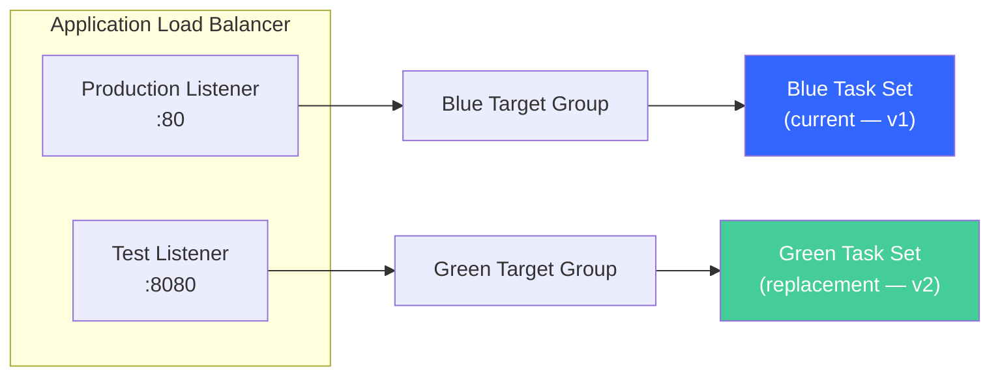

# ECS Deployment Strategies: CodeDeploy Blue/Green vs. Native Canary and Linear

ECS offers three deployment strategies. The **rolling update** is the default — ECS launches new tasks, waits for health checks, then drains old ones. Simple, but it provides no instant rollback and no test traffic validation. **CodeDeploy blue/green** is the original advanced option — full lifecycle hooks, a test listener for pre-production validation, and alarm-based rollback. It works, but requires setting up a separate CodeDeploy application, deployment group, AppSpec file, and service role. **ECS-native blue/green** (July 2025) provides the same capabilities — Lambda lifecycle hooks, test listeners, canary/linear traffic shifting — with significantly less configuration and tighter ECS integration.

This post deploys the same application using both CodeDeploy and ECS-native approaches, compares the mechanics, and provides a decision framework for choosing between them.

## Prerequisites

To follow along, you'll need:

- [AWS CLI v2](https://docs.aws.amazon.com/cli/latest/userguide/getting-started-install.html) configured with credentials that have permissions for ECS, EC2, ELB, IAM, CodeDeploy, CloudWatch, and Lambda
- An AWS account — estimated cost is ~$1–2 USD (Fargate tasks running for a few hours, ALB)
- A VPC with at least two public subnets in different Availability Zones (the default VPC works)
- Docker installed locally (for building container images)

## ECS Deployment Concepts

Before diving into strategies, a few concepts that both approaches share:

**Task sets** are groups of tasks within a service. Blue/green deployments maintain two task sets simultaneously — the blue (current) set serving production traffic, and the green (replacement) set being validated.

**Target groups** are how an ALB routes traffic to tasks. Two target groups enable blue/green switching — one for the current tasks, one for the replacement.

**Production listener** routes real user traffic (typically port 80/443).

**Test listener** routes to the replacement task set on a separate port (e.g., 8080). This allows you to validate the new version before any real users see it.

**Deployment controller** determines who manages deployments: `ECS` (rolling update or native blue/green/canary/linear), `CODE_DEPLOY` (CodeDeploy-managed), or `EXTERNAL`.



During deployment, the test listener routes to the green task set. After validation passes, the production listener switches from the blue target group to the green target group.

## Approach 1 — CodeDeploy Blue/Green

### Prerequisites — CloudFormation Template

This template provisions the full infrastructure: an ECS Fargate service running nginx, an ALB with two target groups and two listeners (production on port 80, test on port 8080), and all CodeDeploy resources including a lifecycle hook Lambda function.

**`ecs-codedeploy-prerequisites.yaml`**:

```yaml
AWSTemplateFormatVersion: '2010-09-09'
Description: >
  ECS CodeDeploy blue/green lab. Creates Fargate service with ALB,
  two target groups, test listener, CodeDeploy application and deployment group.

Parameters:
  VpcId:
    Type: AWS::EC2::VPC::Id
  SubnetIds:
    Type: List<AWS::EC2::Subnet::Id>
    Description: At least two public subnets

Resources:
  # ECS Cluster
  Cluster:
    Type: AWS::ECS::Cluster
    Properties:
      ClusterName: ecs-deploy-lab

  # Task execution role — allows ECS to pull images and write logs
  TaskExecutionRole:
    Type: AWS::IAM::Role
    Properties:
      RoleName: ecs-deploy-lab-execution-role
      AssumeRolePolicyDocument:
        Version: '2012-10-17'
        Statement:
          - Effect: Allow
            Principal:
              Service: ecs-tasks.amazonaws.com
            Action: sts:AssumeRole
      ManagedPolicyArns:
        - arn:aws:iam::aws:policy/service-role/AmazonECSTaskExecutionRolePolicy

  # Security groups
  ALBSecurityGroup:
    Type: AWS::EC2::SecurityGroup
    Properties:
      GroupDescription: ALB - allow HTTP on port 80 and 8080
      VpcId: !Ref VpcId
      SecurityGroupIngress:
        - IpProtocol: tcp
          FromPort: 80
          ToPort: 80
          CidrIp: 0.0.0.0/0
        - IpProtocol: tcp
          FromPort: 8080
          ToPort: 8080
          CidrIp: 0.0.0.0/0

  TaskSecurityGroup:
    Type: AWS::EC2::SecurityGroup
    Properties:
      GroupDescription: ECS tasks - allow HTTP from ALB
      VpcId: !Ref VpcId
      SecurityGroupIngress:
        - IpProtocol: tcp
          FromPort: 80
          ToPort: 80
          SourceSecurityGroupId: !Ref ALBSecurityGroup

  # Application Load Balancer
  ALB:
    Type: AWS::ElasticLoadBalancingV2::LoadBalancer
    Properties:
      Name: ecs-deploy-lab-alb
      Subnets: !Ref SubnetIds
      SecurityGroups: [!Ref ALBSecurityGroup]

  # Two target groups — blue (initial) and green (replacement during deployment)
  BlueTargetGroup:
    Type: AWS::ElasticLoadBalancingV2::TargetGroup
    Properties:
      Name: ecs-deploy-lab-blue
      Port: 80
      Protocol: HTTP
      VpcId: !Ref VpcId
      TargetType: ip
      HealthCheckPath: /

  GreenTargetGroup:
    Type: AWS::ElasticLoadBalancingV2::TargetGroup
    Properties:
      Name: ecs-deploy-lab-green
      Port: 80
      Protocol: HTTP
      VpcId: !Ref VpcId
      TargetType: ip
      HealthCheckPath: /

  # Production listener — port 80, routes to blue target group
  ProductionListener:
    Type: AWS::ElasticLoadBalancingV2::Listener
    Properties:
      LoadBalancerArn: !Ref ALB
      Port: 80
      Protocol: HTTP
      DefaultActions:
        - Type: forward
          TargetGroupArn: !Ref BlueTargetGroup

  # Test listener — port 8080, routes to green target group during deployment
  TestListener:
    Type: AWS::ElasticLoadBalancingV2::Listener
    Properties:
      LoadBalancerArn: !Ref ALB
      Port: 8080
      Protocol: HTTP
      DefaultActions:
        - Type: forward
          TargetGroupArn: !Ref BlueTargetGroup

  # Task definition — nginx serving a simple page (v1)
  TaskDefinition:
    Type: AWS::ECS::TaskDefinition
    Properties:
      Family: ecs-deploy-lab
      Cpu: '256'
      Memory: '512'
      NetworkMode: awsvpc
      RequiresCompatibilities: [FARGATE]
      ExecutionRoleArn: !GetAtt TaskExecutionRole.Arn
      ContainerDefinitions:
        - Name: app
          # Using the public nginx image from Amazon ECR Public Gallery
          Image: public.ecr.aws/nginx/nginx:1.27
          PortMappings:
            - ContainerPort: 80
          Essential: true
          LogConfiguration:
            LogDriver: awslogs
            Options:
              awslogs-group: !Ref LogGroup
              awslogs-region: !Ref AWS::Region
              awslogs-stream-prefix: ecs

  LogGroup:
    Type: AWS::Logs::LogGroup
    Properties:
      LogGroupName: /ecs/deploy-lab
      RetentionInDays: 7

  # ECS Service — deployment controller set to CODE_DEPLOY
  Service:
    Type: AWS::ECS::Service
    DependsOn: ProductionListener
    Properties:
      ServiceName: deploy-lab-service
      Cluster: !Ref Cluster
      TaskDefinition: !Ref TaskDefinition
      DesiredCount: 2
      LaunchType: FARGATE
      # CODE_DEPLOY deployment controller — CodeDeploy manages blue/green
      DeploymentController:
        Type: CODE_DEPLOY
      NetworkConfiguration:
        AwsvpcConfiguration:
          AssignPublicIp: ENABLED
          Subnets: !Ref SubnetIds
          SecurityGroups: [!Ref TaskSecurityGroup]
      LoadBalancers:
        - ContainerName: app
          ContainerPort: 80
          TargetGroupArn: !Ref BlueTargetGroup

  # CodeDeploy service role — allows CodeDeploy to manipulate ECS services and ALB
  CodeDeployServiceRole:
    Type: AWS::IAM::Role
    Properties:
      RoleName: ecs-deploy-lab-codedeploy-role
      AssumeRolePolicyDocument:
        Version: '2012-10-17'
        Statement:
          - Effect: Allow
            Principal:
              Service: codedeploy.amazonaws.com
            Action: sts:AssumeRole
      ManagedPolicyArns:
        - arn:aws:iam::aws:policy/AWSCodeDeployRoleForECS

  # CodeDeploy application — compute platform ECS
  CodeDeployApplication:
    Type: AWS::CodeDeploy::Application
    Properties:
      ApplicationName: ecs-deploy-lab
      ComputePlatform: ECS

  # CodeDeploy deployment group — wires together service, target groups, listeners
  DeploymentGroup:
    Type: AWS::CodeDeploy::DeploymentGroup
    Properties:
      ApplicationName: !Ref CodeDeployApplication
      DeploymentGroupName: ecs-deploy-lab-dg
      ServiceRoleArn: !GetAtt CodeDeployServiceRole.Arn
      DeploymentConfigName: CodeDeployDefault.ECSAllAtOnce
      # Blue/green deployment style
      DeploymentStyle:
        DeploymentType: BLUE_GREEN
        DeploymentOption: WITH_TRAFFIC_CONTROL
      # Wire up ECS service + target groups + listeners
      ECSServices:
        - ClusterName: !Ref Cluster
          ServiceName: !GetAtt Service.Name
      LoadBalancerInfo:
        TargetGroupPairInfoList:
          - TargetGroups:
              - Name: ecs-deploy-lab-blue
              - Name: ecs-deploy-lab-green
            ProdTrafficRoute:
              ListenerArns:
                - !Ref ProductionListener
            TestTrafficRoute:
              ListenerArns:
                - !Ref TestListener
      # Keep blue task set alive for 5 minutes after traffic shifts (rollback window)
      BlueGreenDeploymentConfiguration:
        TerminateBlueInstancesOnDeploymentSuccess:
          Action: TERMINATE
          TerminationWaitTimeInMinutes: 5
        DeploymentReadyOption:
          ActionOnTimeout: CONTINUE_DEPLOYMENT
          WaitTimeInMinutes: 0

  # Lambda hook function role
  HookFunctionRole:
    Type: AWS::IAM::Role
    Properties:
      RoleName: ecs-deploy-lab-hook-role
      AssumeRolePolicyDocument:
        Version: '2012-10-17'
        Statement:
          - Effect: Allow
            Principal:
              Service: lambda.amazonaws.com
            Action: sts:AssumeRole
      ManagedPolicyArns:
        - arn:aws:iam::aws:policy/service-role/AWSLambdaBasicExecutionRole
      Policies:
        - PolicyName: CodeDeployHookPermissions
          PolicyDocument:
            Version: '2012-10-17'
            Statement:
              - Effect: Allow
                Action: codedeploy:PutLifecycleEventHookExecutionStatus
                Resource: '*'

  # AfterAllowTestTraffic hook — validates the green task set via test listener
  TestTrafficHook:
    Type: AWS::Lambda::Function
    Properties:
      FunctionName: CodeDeployHook_ecs-deploy-lab-test-traffic
      Runtime: nodejs20.x
      Handler: index.handler
      Role: !GetAtt HookFunctionRole.Arn
      Timeout: 30
      Environment:
        Variables:
          TEST_URL: !Sub 'http://${ALB.DNSName}:8080'
      Code:
        ZipFile: |
          const { CodeDeployClient, PutLifecycleEventHookExecutionStatusCommand } = require("@aws-sdk/client-codedeploy");
          const codedeploy = new CodeDeployClient();

          exports.handler = async (event) => {
            const deploymentId = event.DeploymentId;
            const lifecycleEventHookExecutionId = event.LifecycleEventHookExecutionId;
            let status = "Failed";

            try {
              // Hit the test listener to validate the green task set
              const response = await fetch(process.env.TEST_URL);
              if (response.ok) {
                console.log("Test traffic validation passed — HTTP", response.status);
                status = "Succeeded";
              } else {
                console.error("Test traffic validation failed — HTTP", response.status);
              }
            } catch (err) {
              console.error("Test traffic validation error:", err);
            }

            // Report result to CodeDeploy
            await codedeploy.send(new PutLifecycleEventHookExecutionStatusCommand({
              deploymentId,
              lifecycleEventHookExecutionId,
              status,
            }));

            return { statusCode: 200, body: status };
          };

Outputs:
  ALBDns:
    Description: ALB DNS — use to verify deployments
    Value: !GetAtt ALB.DNSName
  TestListenerUrl:
    Description: Test listener URL (port 8080)
    Value: !Sub 'http://${ALB.DNSName}:8080'
  ClusterName:
    Value: !Ref Cluster
  ServiceName:
    Value: !GetAtt Service.Name
  TaskDefinitionArn:
    Value: !Ref TaskDefinition
  CodeDeployApp:
    Value: !Ref CodeDeployApplication
  DeploymentGroup:
    Value: !Ref DeploymentGroup
```

Deploy the stack and wait for the service to stabilize:

```bash
aws cloudformation deploy \
  --template-file ecs-codedeploy-prerequisites.yaml \
  --stack-name ecs-codedeploy-lab \
  --capabilities CAPABILITY_NAMED_IAM \
  --parameter-overrides \
    VpcId=<YOUR_VPC_ID> \
    SubnetIds=<SUBNET_1>,<SUBNET_2>
```

Store outputs for later use:

```bash
ALB_DNS=$(aws cloudformation describe-stacks --stack-name ecs-codedeploy-lab \
  --query 'Stacks[0].Outputs[?OutputKey==`ALBDns`].OutputValue' --output text)

# Verify v1 is serving traffic
curl http://$ALB_DNS
```

### The AppSpec File for ECS

The ECS AppSpec declares which task definition to deploy and how to wire it to the load balancer. The `Hooks` section references Lambda functions to run at each lifecycle stage.

```yaml
# appspec.yaml
version: 0.0
Resources:
  - TargetService:
      Type: AWS::ECS::Service
      Properties:
        # New task definition ARN (updated for each deployment)
        TaskDefinition: "arn:aws:ecs:us-east-1:111222333444:task-definition/ecs-deploy-lab:2"
        LoadBalancerInfo:
          ContainerName: "app"       # Must match container name in task definition
          ContainerPort: 80          # Must match container port mapping
Hooks:
  # Runs after test listener routes to green — validate before production shift
  - AfterAllowTestTraffic: "CodeDeployHook_ecs-deploy-lab-test-traffic"
```

The available lifecycle hooks for ECS CodeDeploy deployments, in execution order:

1. **BeforeInstall** — before the replacement task set is created
2. **AfterInstall** — after the replacement task set is created and tasks are healthy
3. **AfterAllowTestTraffic** — after the test listener routes to the green task set (this is where you validate)
4. **BeforeAllowTraffic** — before production traffic shifts to green
5. **AfterAllowTraffic** — after production traffic is fully on green

`AfterAllowTestTraffic` is the most important hook — it's your chance to validate the new version using real infrastructure (ALB, networking, container config) without affecting production users.

### The AfterAllowTestTraffic Hook Function

The hook function (already included in the CloudFormation template above) hits the test listener URL, checks for an HTTP 200 response, and reports the result to CodeDeploy. If it reports `Failed`, production traffic stays on blue and the green task set is terminated.

The hook receives a `DeploymentId` and `LifecycleEventHookExecutionId` from CodeDeploy and must call `PutLifecycleEventHookExecutionStatus` to report `Succeeded` or `Failed`. If the hook doesn't report back within its timeout, CodeDeploy treats it as a failure.

### Deploy v2 with CodeDeploy

To trigger a blue/green deployment, register a new task definition revision and create a CodeDeploy deployment referencing it.

First, register a new task definition that uses a different image (simulating a code change). For this lab, we'll switch from nginx 1.27 to nginx 1.27-alpine:

```bash
# Get the current task definition and update the image
TASK_DEF_ARN=$(aws cloudformation describe-stacks --stack-name ecs-codedeploy-lab \
  --query 'Stacks[0].Outputs[?OutputKey==`TaskDefinitionArn`].OutputValue' --output text)

# Register a new revision with the updated image
aws ecs describe-task-definition --task-definition ecs-deploy-lab \
  --query 'taskDefinition.{containerDefinitions:containerDefinitions,family:family,cpu:cpu,memory:memory,networkMode:networkMode,requiresCompatibilities:requiresCompatibilities,executionRoleArn:executionRoleArn}' \
  --output json | \
  jq '.containerDefinitions[0].image = "public.ecr.aws/nginx/nginx:1.27-alpine"' | \
  xargs -0 -I {} aws ecs register-task-definition --cli-input-json '{}'

# Alternatively, register directly:
NEW_TASK_DEF=$(aws ecs register-task-definition \
  --family ecs-deploy-lab \
  --cpu '256' --memory '512' \
  --network-mode awsvpc \
  --requires-compatibilities FARGATE \
  --execution-role-arn $(aws iam get-role --role-name ecs-deploy-lab-execution-role --query 'Role.Arn' --output text) \
  --container-definitions '[{
    "name": "app",
    "image": "public.ecr.aws/nginx/nginx:1.27-alpine",
    "portMappings": [{"containerPort": 80}],
    "essential": true,
    "logConfiguration": {
      "logDriver": "awslogs",
      "options": {
        "awslogs-group": "/ecs/deploy-lab",
        "awslogs-region": "'$(aws configure get region)'",
        "awslogs-stream-prefix": "ecs"
      }
    }
  }]' \
  --query 'taskDefinition.taskDefinitionArn' --output text)

echo "New task definition: $NEW_TASK_DEF"
```

Now create the AppSpec content and trigger the deployment:

```bash
# Create the deployment with inline AppSpec referencing the new task definition
DEPLOY_ID=$(aws deploy create-deployment \
  --application-name ecs-deploy-lab \
  --deployment-group-name ecs-deploy-lab-dg \
  --revision '{
    "revisionType": "AppSpecContent",
    "appSpecContent": {
      "content": "{\"version\": 0.0, \"Resources\": [{\"TargetService\": {\"Type\": \"AWS::ECS::Service\", \"Properties\": {\"TaskDefinition\": \"'"$NEW_TASK_DEF"'\", \"LoadBalancerInfo\": {\"ContainerName\": \"app\", \"ContainerPort\": 80}}}}], \"Hooks\": [{\"AfterAllowTestTraffic\": \"CodeDeployHook_ecs-deploy-lab-test-traffic\"}]}"
    }
  }' \
  --query 'deploymentId' --output text)

echo "Deployment: $DEPLOY_ID"
```

Watch the deployment progress through each lifecycle stage:

```bash
# Poll deployment status
while true; do
  STATUS=$(aws deploy get-deployment --deployment-id $DEPLOY_ID \
    --query 'deploymentInfo.status' --output text)
  echo "$(date +%H:%M:%S) $STATUS"
  if [ "$STATUS" != "InProgress" ] && [ "$STATUS" != "Created" ]; then break; fi
  sleep 10
done
```

During the deployment, you can observe the blue/green behavior. Once the green task set is up and the test listener routes to it:

```bash
# Test listener shows v2 (alpine nginx returns slightly different headers)
curl -I http://$ALB_DNS:8080

# Production listener still shows v1 until the hook passes and traffic shifts
curl -I http://$ALB_DNS:80
```

The deployment sequence:
1. Green task set spins up with the new task definition
2. Tasks pass ALB health checks
3. Test listener (port 8080) switches to the green target group
4. `AfterAllowTestTraffic` hook fires → Lambda validates via test listener
5. Hook reports `Succeeded` → production listener (port 80) shifts to green
6. 5-minute wait period → blue task set terminates

### Traffic Shifting Options with CodeDeploy

The deployment configuration controls how production traffic shifts from blue to green *after* hooks pass:

- **`CodeDeployDefault.ECSAllAtOnce`** — instant switch. All traffic moves to green in one step.
- **`CodeDeployDefault.ECSCanary10Percent5Minutes`** — 10% to green for 5 minutes. If no alarms fire, remaining 90% shifts.
- **`CodeDeployDefault.ECSCanary10Percent15Minutes`** — same but with 15-minute observation window.
- **`CodeDeployDefault.ECSLinear10PercentEvery1Minute`** — 10% every minute over 10 minutes.
- **`CodeDeployDefault.ECSLinear10PercentEvery3Minutes`** — 10% every 3 minutes over 30 minutes.

All options still use the test listener and hooks for pre-validation. The traffic shifting strategy only affects what happens *after* hooks succeed.

To change the strategy, update the deployment group:

```bash
# Switch to canary — 10% for 5 minutes, then the rest
aws deploy update-deployment-group \
  --application-name ecs-deploy-lab \
  --current-deployment-group-name ecs-deploy-lab-dg \
  --deployment-config-name CodeDeployDefault.ECSCanary10Percent5Minutes
```

### Automatic Rollback

Attach a CloudWatch alarm to the deployment group. If it fires during the deployment, CodeDeploy switches production traffic back to blue immediately:

```bash
# Create an alarm on the green target group's 5xx rate
aws cloudwatch put-metric-alarm \
  --alarm-name ecs-deploy-lab-5xx \
  --namespace AWS/ApplicationELB \
  --metric-name HTTPCode_Target_5XX_Count \
  --statistic Sum \
  --period 60 \
  --threshold 5 \
  --comparison-operator GreaterThanThreshold \
  --evaluation-periods 1 \
  --dimensions Name=LoadBalancer,Value=$(aws elbv2 describe-load-balancers \
    --names ecs-deploy-lab-alb --query 'LoadBalancers[0].LoadBalancerArn' \
    --output text | sed 's|.*:loadbalancer/||')

# Attach alarm to deployment group
aws deploy update-deployment-group \
  --application-name ecs-deploy-lab \
  --current-deployment-group-name ecs-deploy-lab-dg \
  --alarm-configuration enabled=true,alarms=[{name=ecs-deploy-lab-5xx}] \
  --auto-rollback-configuration enabled=true,events=DEPLOYMENT_FAILURE,DEPLOYMENT_STOP_ON_ALARM
```

Rollback is instant because the blue task set remains alive during the termination wait period. CodeDeploy simply switches the production listener back to the blue target group — no new tasks need to launch.

## Approach 2 — ECS Native Blue/Green

### How It Differs from CodeDeploy

ECS native blue/green (launched July 2025) provides the same deployment safety without a separate CodeDeploy application. The key differences:

- **Deployment controller**: `ECS` (not `CODE_DEPLOY`)
- **No AppSpec file** — deployment configuration is part of the ECS service definition
- **No CodeDeploy application/group/role** — significantly less infrastructure to manage
- **Native lifecycle hooks** — ECS invokes Lambda functions directly at 8 lifecycle stages (vs. CodeDeploy's 5)
- **Pause hooks** — deployment can pause and wait for `ContinueServiceDeployment` API call (useful for manual approvals or external CI/CD integration)
- **Same result** — test listener validation, canary/linear traffic shifting, alarm-based rollback

The ECS native lifecycle stages, in order:

1. `RECONCILE_SERVICE` — service configuration reconciled
2. `PRE_SCALE_UP` — before green task set scales up
3. `POST_SCALE_UP` — green task set is healthy
4. `TEST_TRAFFIC_SHIFT` — test listener shifts to green
5. `POST_TEST_TRAFFIC_SHIFT` — after test traffic is on green (validate here)
6. `PRE_PRODUCTION_TRAFFIC_SHIFT` — before production traffic moves (recurring for canary/linear)
7. `PRODUCTION_TRAFFIC_SHIFT` — production traffic shifts (recurring for canary/linear)
8. `POST_PRODUCTION_TRAFFIC_SHIFT` — after all production traffic is on green

### Prerequisites — CloudFormation Template (Native)

This template provisions the same infrastructure but without any CodeDeploy resources. The lifecycle hook is configured directly on the ECS service:

**`ecs-native-prerequisites.yaml`**:

```yaml
AWSTemplateFormatVersion: '2010-09-09'
Description: >
  ECS native blue/green lab. Creates Fargate service with ALB,
  two target groups, test listener, and native deployment configuration.

Parameters:
  VpcId:
    Type: AWS::EC2::VPC::Id
  SubnetIds:
    Type: List<AWS::EC2::Subnet::Id>
    Description: At least two public subnets

Resources:
  Cluster:
    Type: AWS::ECS::Cluster
    Properties:
      ClusterName: ecs-native-deploy-lab

  TaskExecutionRole:
    Type: AWS::IAM::Role
    Properties:
      RoleName: ecs-native-deploy-lab-execution-role
      AssumeRolePolicyDocument:
        Version: '2012-10-17'
        Statement:
          - Effect: Allow
            Principal:
              Service: ecs-tasks.amazonaws.com
            Action: sts:AssumeRole
      ManagedPolicyArns:
        - arn:aws:iam::aws:policy/service-role/AmazonECSTaskExecutionRolePolicy

  ALBSecurityGroup:
    Type: AWS::EC2::SecurityGroup
    Properties:
      GroupDescription: ALB - allow HTTP on port 80 and 8080
      VpcId: !Ref VpcId
      SecurityGroupIngress:
        - IpProtocol: tcp
          FromPort: 80
          ToPort: 80
          CidrIp: 0.0.0.0/0
        - IpProtocol: tcp
          FromPort: 8080
          ToPort: 8080
          CidrIp: 0.0.0.0/0

  TaskSecurityGroup:
    Type: AWS::EC2::SecurityGroup
    Properties:
      GroupDescription: ECS tasks - allow HTTP from ALB
      VpcId: !Ref VpcId
      SecurityGroupIngress:
        - IpProtocol: tcp
          FromPort: 80
          ToPort: 80
          SourceSecurityGroupId: !Ref ALBSecurityGroup

  ALB:
    Type: AWS::ElasticLoadBalancingV2::LoadBalancer
    Properties:
      Name: ecs-native-lab-alb
      Subnets: !Ref SubnetIds
      SecurityGroups: [!Ref ALBSecurityGroup]

  BlueTargetGroup:
    Type: AWS::ElasticLoadBalancingV2::TargetGroup
    Properties:
      Name: ecs-native-lab-blue
      Port: 80
      Protocol: HTTP
      VpcId: !Ref VpcId
      TargetType: ip
      HealthCheckPath: /

  GreenTargetGroup:
    Type: AWS::ElasticLoadBalancingV2::TargetGroup
    Properties:
      Name: ecs-native-lab-green
      Port: 80
      Protocol: HTTP
      VpcId: !Ref VpcId
      TargetType: ip
      HealthCheckPath: /

  ProductionListener:
    Type: AWS::ElasticLoadBalancingV2::Listener
    Properties:
      LoadBalancerArn: !Ref ALB
      Port: 80
      Protocol: HTTP
      DefaultActions:
        - Type: forward
          TargetGroupArn: !Ref BlueTargetGroup

  TestListener:
    Type: AWS::ElasticLoadBalancingV2::Listener
    Properties:
      LoadBalancerArn: !Ref ALB
      Port: 8080
      Protocol: HTTP
      DefaultActions:
        - Type: forward
          TargetGroupArn: !Ref BlueTargetGroup

  LogGroup:
    Type: AWS::Logs::LogGroup
    Properties:
      LogGroupName: /ecs/native-deploy-lab
      RetentionInDays: 7

  TaskDefinition:
    Type: AWS::ECS::TaskDefinition
    Properties:
      Family: ecs-native-deploy-lab
      Cpu: '256'
      Memory: '512'
      NetworkMode: awsvpc
      RequiresCompatibilities: [FARGATE]
      ExecutionRoleArn: !GetAtt TaskExecutionRole.Arn
      ContainerDefinitions:
        - Name: app
          Image: public.ecr.aws/nginx/nginx:1.27
          PortMappings:
            - ContainerPort: 80
          Essential: true
          LogConfiguration:
            LogDriver: awslogs
            Options:
              awslogs-group: !Ref LogGroup
              awslogs-region: !Ref AWS::Region
              awslogs-stream-prefix: ecs

  # ECS Service — deployment controller ECS with blue/green configuration
  Service:
    Type: AWS::ECS::Service
    DependsOn: ProductionListener
    Properties:
      ServiceName: native-deploy-lab-service
      Cluster: !Ref Cluster
      TaskDefinition: !Ref TaskDefinition
      DesiredCount: 2
      LaunchType: FARGATE
      # ECS deployment controller — supports rolling, blue/green, canary, linear
      DeploymentController:
        Type: ECS
      DeploymentConfiguration:
        # Blue/green strategy with 5-minute bake time
        DeploymentType: BLUE_GREEN
        BlueGreenDeploymentConfiguration:
          ProductionListenerArn: !Ref ProductionListener
          TestListenerArn: !Ref TestListener
          TargetGroups:
            - !Ref BlueTargetGroup
            - !Ref GreenTargetGroup
          TerminationWaitTimeInMinutes: 5
        # Circuit breaker for automatic rollback on health check failures
        DeploymentCircuitBreaker:
          Enable: true
          Rollback: true
      NetworkConfiguration:
        AwsvpcConfiguration:
          AssignPublicIp: ENABLED
          Subnets: !Ref SubnetIds
          SecurityGroups: [!Ref TaskSecurityGroup]
      LoadBalancers:
        - ContainerName: app
          ContainerPort: 80
          TargetGroupArn: !Ref BlueTargetGroup

Outputs:
  ALBDns:
    Value: !GetAtt ALB.DNSName
  ClusterName:
    Value: !Ref Cluster
  ServiceName:
    Value: !GetAtt Service.Name
```

Notice what's missing compared to the CodeDeploy template: no `AWS::CodeDeploy::Application`, no `AWS::CodeDeploy::DeploymentGroup`, no CodeDeploy service role. The deployment configuration lives directly on the ECS service.

Deploy the stack:

```bash
aws cloudformation deploy \
  --template-file ecs-native-prerequisites.yaml \
  --stack-name ecs-native-lab \
  --capabilities CAPABILITY_NAMED_IAM \
  --parameter-overrides \
    VpcId=<YOUR_VPC_ID> \
    SubnetIds=<SUBNET_1>,<SUBNET_2>

# Store outputs
NATIVE_ALB=$(aws cloudformation describe-stacks --stack-name ecs-native-lab \
  --query 'Stacks[0].Outputs[?OutputKey==`ALBDns`].OutputValue' --output text)

curl http://$NATIVE_ALB
```

### Deploy v2 with ECS Native

With ECS native blue/green, you trigger a deployment by updating the service's task definition. No AppSpec, no `create-deployment` — just `update-service`:

```bash
# Register a new task definition revision (same as before — switch to alpine)
NEW_TASK_DEF=$(aws ecs register-task-definition \
  --family ecs-native-deploy-lab \
  --cpu '256' --memory '512' \
  --network-mode awsvpc \
  --requires-compatibilities FARGATE \
  --execution-role-arn $(aws iam get-role --role-name ecs-native-deploy-lab-execution-role --query 'Role.Arn' --output text) \
  --container-definitions '[{
    "name": "app",
    "image": "public.ecr.aws/nginx/nginx:1.27-alpine",
    "portMappings": [{"containerPort": 80}],
    "essential": true,
    "logConfiguration": {
      "logDriver": "awslogs",
      "options": {
        "awslogs-group": "/ecs/native-deploy-lab",
        "awslogs-region": "'$(aws configure get region)'",
        "awslogs-stream-prefix": "ecs"
      }
    }
  }]' \
  --query 'taskDefinition.taskDefinitionArn' --output text)

# Update the service — this triggers the blue/green deployment
aws ecs update-service \
  --cluster ecs-native-deploy-lab \
  --service native-deploy-lab-service \
  --task-definition "$NEW_TASK_DEF"
```

ECS handles the rest: creates the green task set, waits for health checks, routes test traffic, and shifts production traffic. Monitor the deployment:

```bash
# Watch the service deployment status
aws ecs describe-services \
  --cluster ecs-native-deploy-lab \
  --services native-deploy-lab-service \
  --query 'services[0].deployments[*].{Status:status,TaskDef:taskDefinition,DesiredCount:desiredCount,RunningCount:runningCount}'
```

During deployment, test both listeners:

```bash
# Test listener (8080) shows green task set
curl -I http://$NATIVE_ALB:8080

# Production listener (80) still shows blue until traffic shifts
curl -I http://$NATIVE_ALB:80
```

### ECS Native Canary and Linear

To use gradual traffic shifting instead of all-at-once, update the service's deployment configuration. ECS native supports canary and linear strategies directly:

```bash
# Update to canary — 10% for 5 minutes, then 100%
aws ecs update-service \
  --cluster ecs-native-deploy-lab \
  --service native-deploy-lab-service \
  --deployment-configuration '{
    "deploymentType": "BLUE_GREEN",
    "blueGreenDeploymentConfiguration": {
      "productionListenerArn": "<PROD_LISTENER_ARN>",
      "testListenerArn": "<TEST_LISTENER_ARN>",
      "targetGroups": ["<BLUE_TG_ARN>", "<GREEN_TG_ARN>"],
      "terminationWaitTimeInMinutes": 5,
      "trafficShiftingConfiguration": {
        "type": "CANARY",
        "canaryConfiguration": {
          "initialTrafficPercentage": 10,
          "intervalInSeconds": 300,
          "numberOfIntervals": 1
        }
      }
    },
    "deploymentCircuitBreaker": {
      "enable": true,
      "rollback": true
    }
  }'
```

For linear deployments, replace the traffic shifting configuration:

```json
"trafficShiftingConfiguration": {
  "type": "LINEAR",
  "linearConfiguration": {
    "trafficPercentageStep": 10,
    "intervalInSeconds": 60
  }
}
```

CloudWatch alarms can be attached at the ECS service level for automatic rollback during the canary/linear observation windows.

## Comparison: Choosing Between Approaches

| Aspect | CodeDeploy Blue/Green | ECS Native Blue/Green | ECS Rolling Update |
|--------|----------------------|----------------------|-------------------|
| Setup complexity | High (CodeDeploy app, group, role, AppSpec, hooks) | Medium (ECS service config) | Low (just min/max percent) |
| Lifecycle hooks | Yes — Lambda at 5 CodeDeploy stages | Yes — Lambda + pause hooks at 8 ECS stages | No |
| Test listener | Yes | Yes | No |
| Custom validation code | Yes (`AfterAllowTestTraffic`) | Yes (`POST_TEST_TRAFFIC_SHIFT` Lambda hook) | No |
| Traffic strategies | AllAtOnce, Canary, Linear | AllAtOnce, Canary, Linear | Rolling (min healthy %) |
| Rollback speed | Instant (ALB switch) | Instant (ALB switch) | Slow (must launch old tasks again) |
| CodePipeline integration | CodeDeploy deploy action | ECS deploy action | ECS deploy action |
| When to use | Existing CodeDeploy pipelines, need consistency | Most new production deployments | Dev/test, simple services |

Decision framework:
- Already have CodeDeploy pipelines and want to keep consistency? → CodeDeploy
- New deployment, want lifecycle hooks with less configuration? → ECS Native
- Dev environment, minimal config? → Rolling Update

## Clean Up

Check for orphaned resources before deleting stacks:

```bash
# Check for lingering task definitions (these persist even after stack deletion)
aws ecs list-task-definitions --family-prefix ecs-deploy-lab
aws ecs list-task-definitions --family-prefix ecs-native-deploy-lab

# Deregister all revisions (optional — they don't incur cost)
for arn in $(aws ecs list-task-definitions --family-prefix ecs-deploy-lab --query 'taskDefinitionArns[]' --output text); do
  aws ecs deregister-task-definition --task-definition $arn > /dev/null
done
```

Delete the CloudFormation stacks:

```bash
# Delete CodeDeploy approach stack
aws cloudformation delete-stack --stack-name ecs-codedeploy-lab
aws cloudformation wait stack-delete-complete --stack-name ecs-codedeploy-lab

# Delete ECS native approach stack
aws cloudformation delete-stack --stack-name ecs-native-lab
aws cloudformation wait stack-delete-complete --stack-name ecs-native-lab

# Delete the CloudWatch alarm
aws cloudwatch delete-alarms --alarm-names ecs-deploy-lab-5xx
```

## Conclusion

ECS provides three deployment strategies — rolling update for simplicity, CodeDeploy blue/green for full lifecycle hook control with established pipelines, and ECS-native blue/green/canary/linear for the same safety with less configuration overhead.

The test listener pattern is the key safety mechanism for both blue/green approaches: validate the new version on port 8080 using real infrastructure before any production user on port 80 is affected. CodeDeploy uses `AfterAllowTestTraffic` hooks; ECS native uses `POST_TEST_TRAFFIC_SHIFT` Lambda hooks. Same concept, different wiring.

For new deployments, ECS native is the simpler path — fewer resources to manage, native lifecycle hooks, and pause hooks for manual approval workflows. CodeDeploy remains relevant for teams with existing pipelines and deployment groups they don't want to migrate.
