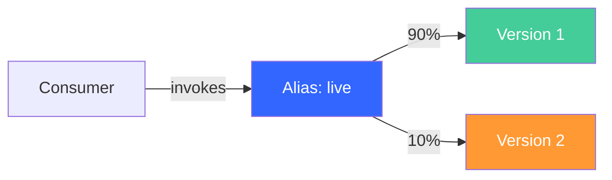
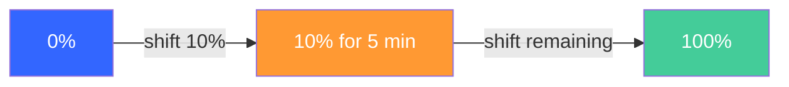
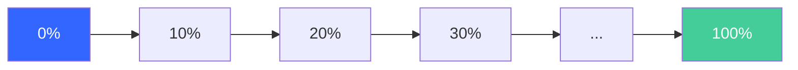

# Deploying Lambda Functions Safely: SAM, CodeDeploy, Canary Strategies, and Automatic Rollback

Lambda deployments are unlike anything else on AWS. No servers, no agents, no file copies — deployment means publishing a new version of your function and shifting traffic to it. The risk: without safeguards, traffic shifts are instantaneous and all-or-nothing. One broken version = 100% of traffic affected.

The solution is gradual traffic shifting with validation and automatic rollback. There are three ways to do this on AWS: raw CodeDeploy, SAM `DeploymentPreference`, and CodePipeline V2's native Lambda deploy action.

## Prerequisites

To follow along, you'll need:

- [AWS CLI v2](https://docs.aws.amazon.com/cli/latest/userguide/getting-started-install.html) installed and configured with credentials that have permissions for Lambda, IAM, CodeDeploy, and CloudWatch
- [AWS SAM CLI](https://docs.aws.amazon.com/serverless-application-model/latest/developerguide/install-sam-cli.html) installed
- An AWS account
- Node.js 20+ (for the Lambda function and hook code)

## Lambda Versions, Aliases, and Routing Weights

Before getting into deployment strategies, you need to understand three primitives.

**Versions** are immutable snapshots of your function's code and configuration. Once published, a version never changes. Each version gets a numeric identifier (1, 2, 3...) and its own ARN.

**Aliases** are named pointers to a version. For example, an alias called `live` might point to version 5. Consumers invoke the alias ARN instead of a specific version — this gives you a stable endpoint that you can retarget without updating callers.

**Routing config** is the mechanism that makes gradual deployments possible. An alias can split traffic between two versions using `AdditionalVersionWeights`. For example, you can route 90% of invocations to version 1 and 10% to version 2.



This is the primitive that CodeDeploy uses — it adjusts `AdditionalVersionWeights` over time, gradually shifting traffic from the old version to the new one.

## Approach 1 — Raw CodeDeploy (Understanding the Mechanics)

Using CodeDeploy directly gives you full visibility into how Lambda traffic shifting works. This approach has more moving parts than SAM, but understanding it makes everything else click.

### Setup

Create a Lambda function, publish version 1, and create an alias:

```bash
# Create the execution role
aws iam create-role \
  --role-name lambda-deploy-lab-role \
  --assume-role-policy-document '{
    "Version": "2012-10-17",
    "Statement": [{
      "Effect": "Allow",
      "Principal": {"Service": "lambda.amazonaws.com"},
      "Action": "sts:AssumeRole"
    }]
  }'

aws iam attach-role-policy \
  --role-name lambda-deploy-lab-role \
  --policy-arn arn:aws:iam::aws:policy/service-role/AWSLambdaBasicExecutionRole

ROLE_ARN=$(aws iam get-role --role-name lambda-deploy-lab-role \
  --query 'Role.Arn' --output text)

# Wait for role propagation
sleep 10
```

Create the function code:

```bash
mkdir -p lambda-deploy-lab && cd lambda-deploy-lab

cat > index.mjs << 'EOF'
export const handler = async (event) => {
  return {
    statusCode: 200,
    body: JSON.stringify({ version: "1.0", message: "Hello from v1" })
  };
};
EOF

zip function.zip index.mjs
```

Create the function and publish version 1:

```bash
aws lambda create-function \
  --function-name deploy-lab-function \
  --runtime nodejs20.x \
  --handler index.handler \
  --role $ROLE_ARN \
  --zip-file fileb://function.zip

aws lambda publish-version \
  --function-name deploy-lab-function \
  --query 'Version' --output text
# Returns: 1
```

Create the `live` alias pointing to version 1:

```bash
aws lambda create-alias \
  --function-name deploy-lab-function \
  --name live \
  --function-version 1
```

Now create the CodeDeploy application and deployment group:

```bash
# CodeDeploy service role for Lambda
aws iam create-role \
  --role-name codedeploy-lambda-role \
  --assume-role-policy-document '{
    "Version": "2012-10-17",
    "Statement": [{
      "Effect": "Allow",
      "Principal": {"Service": "codedeploy.amazonaws.com"},
      "Action": "sts:AssumeRole"
    }]
  }'

aws iam attach-role-policy \
  --role-name codedeploy-lambda-role \
  --policy-arn arn:aws:iam::aws:policy/service-role/AWSCodeDeployRoleForLambda

CODEDEPLOY_ROLE=$(aws iam get-role --role-name codedeploy-lambda-role \
  --query 'Role.Arn' --output text)

sleep 10

# Create CodeDeploy application (Lambda platform)
aws deploy create-application \
  --application-name lambda-deploy-lab \
  --compute-platform Lambda

# Create deployment group with Canary10Percent5Minutes
aws deploy create-deployment-group \
  --application-name lambda-deploy-lab \
  --deployment-group-name canary-group \
  --service-role-arn $CODEDEPLOY_ROLE \
  --deployment-config-name CodeDeployDefault.LambdaCanary10Percent5Minutes \
  --deployment-style deploymentType=BLUE_GREEN,deploymentOption=WITH_TRAFFIC_CONTROL
```

### The AppSpec File for Lambda

The Lambda AppSpec has a different structure than EC2. It declares which function, alias, and versions are involved, plus optional hooks that reference *other Lambda functions* for validation.

```yaml
# appspec.yaml
version: 0.0
Resources:
  - deploy-lab-function:
      Type: AWS::Lambda::Function
      Properties:
        Name: deploy-lab-function
        Alias: live
        CurrentVersion: 1
        TargetVersion: 2
Hooks:
  - BeforeAllowTraffic: deploy-lab-pretraffic-hook
```

Key differences from EC2 AppSpec:

- `Resources` names the function, alias, and both versions (current and target)
- `Hooks` references Lambda function names — not script files on disk
- Only two hook events exist: `BeforeAllowTraffic` and `AfterAllowTraffic`

### The Pre-Traffic Hook Function

The hook is a separate Lambda function that CodeDeploy invokes before shifting any traffic. It must invoke the new version, validate the response, and report success or failure back to CodeDeploy by calling `PutLifecycleEventHookExecutionStatus`.

```bash
cat > pretraffic-hook.mjs << 'EOF'
import { LambdaClient, InvokeCommand } from "@aws-sdk/client-lambda";
import { CodeDeployClient, PutLifecycleEventHookExecutionStatusCommand } from "@aws-sdk/client-codedeploy";

const lambda = new LambdaClient();
const codedeploy = new CodeDeployClient();

export const handler = async (event) => {
  const deploymentId = event.DeploymentId;
  const lifecycleEventHookExecutionId = event.LifecycleEventHookExecutionId;
  let status = "Failed";

  try {
    // Invoke the NEW version of the function directly
    const result = await lambda.send(new InvokeCommand({
      FunctionName: "deploy-lab-function",
      InvocationType: "RequestResponse",
      // Invoke the specific version that's about to receive traffic
      Qualifier: "live",
    }));

    const payload = JSON.parse(Buffer.from(result.Payload).toString());
    const body = JSON.parse(payload.body);

    // Validate the response
    if (payload.statusCode === 200 && body.version) {
      console.log("Validation passed:", body);
      status = "Succeeded";
    } else {
      console.error("Validation failed — unexpected response:", payload);
    }
  } catch (err) {
    console.error("Validation failed — invocation error:", err);
  }

  // Report result to CodeDeploy
  await codedeploy.send(new PutLifecycleEventHookExecutionStatusCommand({
    deploymentId,
    lifecycleEventHookExecutionId,
    status,
  }));

  return { statusCode: 200, body: status };
};
EOF

zip pretraffic-hook.zip pretraffic-hook.mjs
```

Create the hook function with appropriate permissions:

```bash
# Create a role for the hook function
aws iam create-role \
  --role-name lambda-hook-role \
  --assume-role-policy-document '{
    "Version": "2012-10-17",
    "Statement": [{
      "Effect": "Allow",
      "Principal": {"Service": "lambda.amazonaws.com"},
      "Action": "sts:AssumeRole"
    }]
  }'

aws iam attach-role-policy \
  --role-name lambda-hook-role \
  --policy-arn arn:aws:iam::aws:policy/service-role/AWSLambdaBasicExecutionRole

# Inline policy for invoking the target function and reporting to CodeDeploy
aws iam put-role-policy \
  --role-name lambda-hook-role \
  --policy-name hook-permissions \
  --policy-document '{
    "Version": "2012-10-17",
    "Statement": [
      {
        "Effect": "Allow",
        "Action": "lambda:InvokeFunction",
        "Resource": "*"
      },
      {
        "Effect": "Allow",
        "Action": "codedeploy:PutLifecycleEventHookExecutionStatus",
        "Resource": "*"
      }
    ]
  }'

HOOK_ROLE_ARN=$(aws iam get-role --role-name lambda-hook-role \
  --query 'Role.Arn' --output text)

sleep 10

aws lambda create-function \
  --function-name deploy-lab-pretraffic-hook \
  --runtime nodejs20.x \
  --handler pretraffic-hook.handler \
  --role $HOOK_ROLE_ARN \
  --zip-file fileb://pretraffic-hook.zip \
  --timeout 60
```

If the hook reports `Failed`, CodeDeploy rolls back immediately — no traffic ever reaches the new version.

### Deploy with Canary

Publish version 2 of the function:

```bash
cat > index.mjs << 'EOF'
export const handler = async (event) => {
  return {
    statusCode: 200,
    body: JSON.stringify({ version: "2.0", message: "Hello from v2" })
  };
};
EOF

zip function.zip index.mjs

aws lambda update-function-code \
  --function-name deploy-lab-function \
  --zip-file fileb://function.zip

aws lambda wait function-updated --function-name deploy-lab-function

aws lambda publish-version \
  --function-name deploy-lab-function \
  --query 'Version' --output text
# Returns: 2
```

Create the AppSpec file and trigger the deployment:

```bash
cat > appspec.yaml << 'EOF'
version: 0.0
Resources:
  - deploy-lab-function:
      Type: AWS::Lambda::Function
      Properties:
        Name: deploy-lab-function
        Alias: live
        CurrentVersion: 1
        TargetVersion: 2
Hooks:
  - BeforeAllowTraffic: deploy-lab-pretraffic-hook
EOF

# CodeDeploy for Lambda requires the AppSpec as JSON content (not a file in S3)
APPSPEC_CONTENT=$(python3 -c "
import yaml, json
with open('appspec.yaml') as f:
    data = yaml.safe_load(f)
print(json.dumps({'version': 1, 'content': json.dumps(data)}))
")

# Or use the revision directly:
DEPLOY_ID=$(aws deploy create-deployment \
  --application-name lambda-deploy-lab \
  --deployment-group-name canary-group \
  --revision '{"revisionType": "AppSpecContent", "appSpecContent": {"content": "{\"version\": 0.0, \"Resources\": [{\"deploy-lab-function\": {\"Type\": \"AWS::Lambda::Function\", \"Properties\": {\"Name\": \"deploy-lab-function\", \"Alias\": \"live\", \"CurrentVersion\": \"1\", \"TargetVersion\": \"2\"}}}], \"Hooks\": [{\"BeforeAllowTraffic\": \"deploy-lab-pretraffic-hook\"}]}"}}' \
  --query 'deploymentId' --output text)

echo "Deployment: $DEPLOY_ID"
```

Watch the deployment progress:

```bash
while true; do
  STATUS=$(aws deploy get-deployment --deployment-id $DEPLOY_ID \
    --query 'deploymentInfo.status' --output text)
  echo "$(date +%H:%M:%S) $STATUS"
  if [ "$STATUS" != "InProgress" ] && [ "$STATUS" != "Created" ]; then break; fi
  sleep 10
done
```

During the canary phase, check the alias routing:

```bash
aws lambda get-alias \
  --function-name deploy-lab-function \
  --name live \
  --query '{Version: FunctionVersion, RoutingConfig: RoutingConfig}'
```

You'll see `AdditionalVersionWeights` showing 10% routed to version 2. Invoke the function multiple times and you'll get a mix of v1 and v2 responses:

```bash
for i in $(seq 1 20); do
  aws lambda invoke --function-name deploy-lab-function --qualifier live \
    --output text /dev/stdout 2>/dev/null | jq -r '.body' | jq -r '.version'
done | sort | uniq -c
```

After 5 minutes, the canary period completes and the alias shifts 100% to version 2.

### Automatic Rollback

Two layers of protection exist:

1. **Pre-traffic hooks** catch functional failures before any traffic shifts
2. **CloudWatch alarms** catch runtime failures during the canary period

Attach an alarm to the deployment group:

```bash
# Create alarm on Lambda Errors metric
aws cloudwatch put-metric-alarm \
  --alarm-name deploy-lab-errors \
  --namespace AWS/Lambda \
  --metric-name Errors \
  --statistic Sum \
  --period 60 \
  --threshold 1 \
  --comparison-operator GreaterThanOrEqualToThreshold \
  --evaluation-periods 1 \
  --dimensions Name=FunctionName,Value=deploy-lab-function Name=Resource,Value=deploy-lab-function:live

# Update deployment group to use the alarm
aws deploy update-deployment-group \
  --application-name lambda-deploy-lab \
  --current-deployment-group-name canary-group \
  --alarm-configuration enabled=true,alarms=[{name=deploy-lab-errors}] \
  --auto-rollback-configuration enabled=true,events=DEPLOYMENT_FAILURE,DEPLOYMENT_STOP_ON_ALARM
```

Now deploy a broken version 3:

```bash
cat > index.mjs << 'EOF'
export const handler = async (event) => {
  throw new Error("Intentionally broken for rollback demo");
};
EOF

zip function.zip index.mjs
aws lambda update-function-code --function-name deploy-lab-function --zip-file fileb://function.zip
aws lambda wait function-updated --function-name deploy-lab-function
aws lambda publish-version --function-name deploy-lab-function --query 'Version' --output text
# Returns: 3
```

If the pre-traffic hook catches the error, the deployment rolls back immediately and no traffic ever reaches version 3. If the hook passes but invocations during the canary phase trigger errors, the alarm fires and CodeDeploy rolls back mid-shift — reverting the alias to point 100% back to version 2.

## Approach 2 — SAM DeploymentPreference (The Real-World Workflow)

SAM automates everything from the previous section:

- `AutoPublishAlias` detects code changes, publishes a new version, and creates/updates the alias
- `DeploymentPreference` creates the CodeDeploy application, deployment group, and triggers the deployment
- `Alarms` attaches CloudWatch alarms to the deployment group
- `Hooks` wires pre/post-traffic validation functions

### Complete SAM Template

**`template.yaml`**:

```yaml
AWSTemplateFormatVersion: '2010-09-09'
Transform: AWS::Serverless-2016-10-31
Description: Lambda safe deployment with SAM DeploymentPreference

Globals:
  Function:
    Runtime: nodejs20.x
    Timeout: 10

Resources:
  MyFunction:
    Type: AWS::Serverless::Function
    Properties:
      FunctionName: sam-deploy-lab-function
      Handler: src/app.handler
      AutoPublishAlias: live
      DeploymentPreference:
        Type: Canary10Percent5Minutes
        Alarms:
          - !Ref FunctionErrorsAlarm
        Hooks:
          PreTraffic: !Ref PreTrafficHook

  PreTrafficHook:
    Type: AWS::Serverless::Function
    Properties:
      FunctionName: CodeDeployHook_sam-deploy-lab-pretraffic
      Handler: src/pretraffic.handler
      Policies:
        - Version: '2012-10-17'
          Statement:
            - Effect: Allow
              Action:
                - codedeploy:PutLifecycleEventHookExecutionStatus
              Resource: '*'
            - Effect: Allow
              Action:
                - lambda:InvokeFunction
              Resource: !Sub '${MyFunction.Arn}:*'
      Environment:
        Variables:
          TARGET_FUNCTION: !Ref MyFunction
          TARGET_ALIAS: live

  FunctionErrorsAlarm:
    Type: AWS::CloudWatch::Alarm
    Properties:
      AlarmName: sam-deploy-lab-errors
      Namespace: AWS/Lambda
      MetricName: Errors
      Statistic: Sum
      Period: 60
      EvaluationPeriods: 1
      Threshold: 1
      ComparisonOperator: GreaterThanOrEqualToThreshold
      Dimensions:
        - Name: FunctionName
          Value: !Ref MyFunction
        - Name: Resource
          Value: !Sub '${MyFunction}:live'
```

> **Note:** SAM requires hook function names to start with `CodeDeployHook_`. This prefix is added to the IAM permissions that SAM's auto-generated CodeDeploy role uses.

Create the function code:

```bash
mkdir -p sam-deploy-lab/src && cd sam-deploy-lab
```

**`src/app.mjs`**:

```javascript
export const handler = async (event) => {
  return {
    statusCode: 200,
    body: JSON.stringify({ version: "1.0", message: "Hello from SAM v1" }),
  };
};
```

**`src/pretraffic.mjs`**:

```javascript
import { LambdaClient, InvokeCommand } from "@aws-sdk/client-lambda";
import { CodeDeployClient, PutLifecycleEventHookExecutionStatusCommand } from "@aws-sdk/client-codedeploy";

const lambda = new LambdaClient();
const codedeploy = new CodeDeployClient();

export const handler = async (event) => {
  const deploymentId = event.DeploymentId;
  const lifecycleEventHookExecutionId = event.LifecycleEventHookExecutionId;
  let status = "Failed";

  try {
    const functionName = process.env.TARGET_FUNCTION;
    const result = await lambda.send(new InvokeCommand({
      FunctionName: functionName,
      InvocationType: "RequestResponse",
      Qualifier: process.env.TARGET_ALIAS,
    }));

    const payload = JSON.parse(Buffer.from(result.Payload).toString());
    const body = JSON.parse(payload.body);

    if (payload.statusCode === 200 && body.version) {
      console.log("Validation passed:", body);
      status = "Succeeded";
    } else {
      console.error("Validation failed:", payload);
    }
  } catch (err) {
    console.error("Hook invocation error:", err);
  }

  await codedeploy.send(new PutLifecycleEventHookExecutionStatusCommand({
    deploymentId,
    lifecycleEventHookExecutionId,
    status,
  }));

  return { statusCode: 200, body: status };
};
```

### Deploy and Observe

First deployment — creates everything:

```bash
sam build
sam deploy --guided
# Stack name: sam-deploy-lab
# Confirm changes, allow IAM role creation
```

Now change the function code and redeploy:

```bash
# Update src/app.mjs to return version "2.0"
sed -i 's/1.0/2.0/' src/app.mjs
sed -i 's/v1/v2/' src/app.mjs

sam build && sam deploy
```

SAM automatically publishes a new version, creates a CodeDeploy deployment, and starts the canary shift. You can observe the deployment in the CodeDeploy console or via CLI:

```bash
# Find the active deployment
aws deploy list-deployments \
  --application-name ServerlessDeploymentApplication \
  --deployment-group-name sam-deploy-lab-MyFunctionDeploymentGroup \
  --include-only-statuses InProgress \
  --query 'deployments[0]' --output text
```

The developer workflow is: change code → `sam deploy` → everything else is automated.

### Available Deployment Types

**Canary** — shifts a percentage of traffic, waits, then shifts the rest:

- `Canary10Percent5Minutes`
- `Canary10Percent10Minutes`
- `Canary10Percent15Minutes`
- `Canary10Percent30Minutes`



**Linear** — shifts traffic in equal increments at regular intervals:

- `Linear10PercentEvery1Minute`
- `Linear10PercentEvery2Minutes`
- `Linear10PercentEvery3Minutes`
- `Linear10PercentEvery10Minutes`



**AllAtOnce** — shifts 100% immediately. No gradual deployment. Useful for non-production environments.

**Custom** — create a custom CodeDeploy deployment config and reference it by name in the `Type` field.

## Approach 3 — CodePipeline V2 Lambda Deploy Action

CodePipeline V2 introduced a native Lambda deploy action (May 2025) that handles traffic shifting without a separate CodeDeploy application.

The action configuration supports:

- `FunctionName` — the Lambda function to deploy
- `FunctionAlias` — the alias to shift traffic on
- `DeployStrategy` — `AllAtOnce`, `Canary10Percent5Minutes`, `Linear10PercentEvery1Minute`, etc.
- `Alarms` — comma-separated CloudWatch alarm names for automatic rollback
- `PublishedTargetVersion` — the version to deploy (or deploy from source artifact)

Example pipeline action declaration:

```yaml
- Name: Deploy
  ActionTypeId:
    Category: Deploy
    Owner: AWS
    Provider: Lambda
    Version: '1'
  Configuration:
    FunctionName: my-function
    FunctionAlias: live
    DeployStrategy: Canary10Percent5Minutes
    Alarms: my-function-errors,my-function-throttles
  InputArtifacts:
    - Name: SourceArtifact
```

CodePipeline manages the traffic shifting directly — no CodeDeploy application, no AppSpec, no deployment groups. The action updates the function code from the source artifact, publishes a new version, and shifts traffic according to the strategy.

**When to use this approach:** You already have a CodePipeline V2 pipeline and want fewer moving parts. The pipeline owns the deployment lifecycle.

**When to use SAM instead:** You manage infrastructure as code and want the deployment strategy declared alongside your function definition. SAM keeps everything in one template.

## Comparison: When to Use What

| Approach | Complexity | Automation Level | Best For |
|----------|-----------|-----------------|----------|
| Raw CodeDeploy | High — manual version publishing, AppSpec authoring, hook wiring | Low | Understanding mechanics, custom orchestration |
| SAM DeploymentPreference | Low — ~10 lines of config | High — auto-publishes, auto-deploys | Most production workloads |
| CodePipeline V2 Lambda action | Medium — pipeline config | Medium | Existing CodePipeline V2 workflows |

## Clean Up

```bash
# SAM stack
sam delete --stack-name sam-deploy-lab

# Raw CodeDeploy resources
aws deploy delete-deployment-group \
  --application-name lambda-deploy-lab \
  --deployment-group-name canary-group
aws deploy delete-application --application-name lambda-deploy-lab

aws cloudwatch delete-alarms --alarm-names deploy-lab-errors

aws lambda delete-function --function-name deploy-lab-function
aws lambda delete-function --function-name deploy-lab-pretraffic-hook

aws iam detach-role-policy --role-name lambda-deploy-lab-role \
  --policy-arn arn:aws:iam::aws:policy/service-role/AWSLambdaBasicExecutionRole
aws iam delete-role --role-name lambda-deploy-lab-role

aws iam detach-role-policy --role-name codedeploy-lambda-role \
  --policy-arn arn:aws:iam::aws:policy/service-role/AWSCodeDeployRoleForLambda
aws iam delete-role --role-name codedeploy-lambda-role

aws iam delete-role-policy --role-name lambda-hook-role --policy-name hook-permissions
aws iam detach-role-policy --role-name lambda-hook-role \
  --policy-arn arn:aws:iam::aws:policy/service-role/AWSLambdaBasicExecutionRole
aws iam delete-role --role-name lambda-hook-role
```

## Conclusion

Lambda deployments are about controlling traffic flow between immutable versions. CodeDeploy provides the mechanics: canary/linear shifting, pre-traffic hooks, alarm-based rollback. SAM wraps CodeDeploy into a declarative experience — `AutoPublishAlias` + `DeploymentPreference` handles everything from version publishing to traffic shifting to automatic rollback.

The safety pattern: pre-traffic hook validates the new version functionally (can it handle a request?), CloudWatch alarm monitors runtime behavior during the canary window (is it erroring under real traffic?). Two layers of protection — one catches broken deploys before traffic shifts, the other catches issues that only surface under load.
