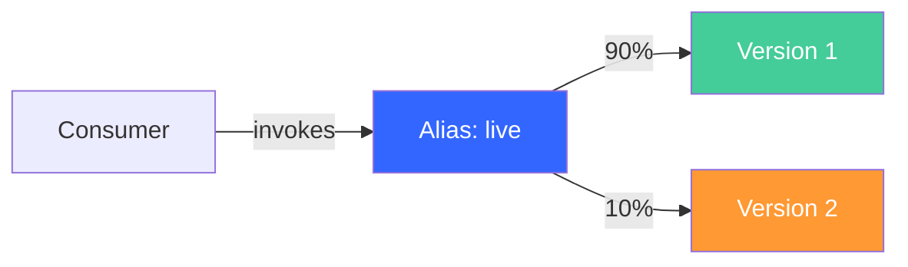
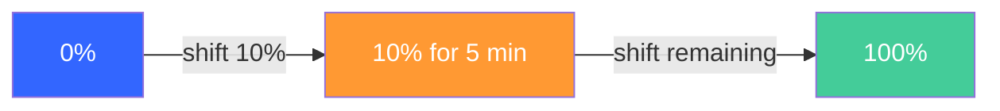
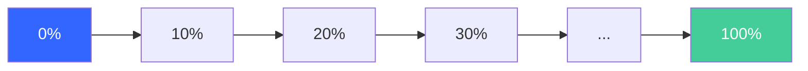

# Deploying Lambda Functions Safely: SAM, CodeDeploy, Canary Strategies, and Automatic Rollback

Lambda deployments are unlike anything else on AWS. No servers to manage, no agents to install, no files to be copied — deployment means publishing a new version of your function and shifting traffic to it. The risk: without safeguards, traffic shifts are instantaneous and all-or-nothing. One broken version = 100% of traffic affected. The solution is gradual traffic shifting with validation and automatic rollback. 

In this post we'l take a look at three ways to do this: raw CodeDeploy, SAM `DeploymentPreference`, and CodePipeline V2's native Lambda deploy action.

## Prerequisites

To follow along, you'll need:

- [AWS CLI v2](https://docs.aws.amazon.com/cli/latest/userguide/getting-started-install.html) installed and configured with credentials that have permissions for Lambda, IAM, CodeDeploy, and CloudWatch
- [AWS SAM CLI](https://docs.aws.amazon.com/serverless-application-model/latest/developerguide/install-sam-cli.html) installed
- An AWS account
- Node.js 20+ (for the Lambda function and hook code)

## Lambda Versions, Aliases, and Routing Weights

Before getting into deployment strategies, you need to understand three primitives.

**Versions** are immutable snapshots of your function's code and configuration. Once published, a version never changes. Each version gets a numeric identifier (1, 2, 3...) and its own ARN.

**Aliases** are named pointers to a version. For example, an alias called `live` might point to version 5. Consumers invoke the alias ARN instead of a specific version — this gives you a stable endpoint that you can retarget without updating callers.

**Routing config** is the mechanism that makes gradual deployments possible. An alias can split traffic between two versions using `AdditionalVersionWeights`. For example, you can route 90% of invocations to version 1 and 10% to version 2.



This is the primitive that CodeDeploy uses — it adjusts `AdditionalVersionWeights` over time, gradually shifting traffic from the old version to the new one.

## Approach 1 — Raw CodeDeploy (Understanding the Mechanics)

Using CodeDeploy directly gives you full visibility into how Lambda traffic shifting works. This approach has more moving parts than SAM, but understanding it makes everything else click.

### Setup

Start by creating an IAM execution role for the Lambda function. The role grants basic permissions (CloudWatch Logs) via the `AWSLambdaBasicExecutionRole` managed policy:

```bash
# Create the execution role — Lambda needs this to write logs
aws iam create-role \
  --role-name lambda-deploy-lab-role \
  --assume-role-policy-document '{
    "Version": "2012-10-17",
    "Statement": [{
      "Effect": "Allow",
      "Principal": {"Service": "lambda.amazonaws.com"},
      "Action": "sts:AssumeRole"
    }]
  }'

# Attach the basic execution policy (CloudWatch Logs access)
aws iam attach-role-policy \
  --role-name lambda-deploy-lab-role \
  --policy-arn arn:aws:iam::aws:policy/service-role/AWSLambdaBasicExecutionRole

# Store the role ARN for later use
ROLE_ARN=$(aws iam get-role --role-name lambda-deploy-lab-role \
  --query 'Role.Arn' --output text)
```

Write a minimal Lambda handler that returns a version identifier in the response. This version field is what the pre-traffic hook will validate later:

```bash
mkdir -p lambda-deploy-lab && cd lambda-deploy-lab

cat > index.mjs << 'EOF'
export const handler = async (event) => {
  return {
    statusCode: 200,
    // The "version" field lets the pre-traffic hook verify which version is responding
    body: JSON.stringify({ version: "1.0", message: "Hello from v1" })
  };
};
EOF

# Bundle into a zip — Lambda requires deployment packages as archives
zip function.zip index.mjs
```

Create the function and immediately publish version 1. Publishing freezes the current code and config into an immutable snapshot:

```bash
# Create the function from the zip bundle
aws lambda create-function \
  --function-name deploy-lab-function \
  --runtime nodejs20.x \
  --handler index.handler \
  --role $ROLE_ARN \
  --zip-file fileb://function.zip

# Publish version 1 — creates an immutable snapshot of the current code
aws lambda publish-version \
  --function-name deploy-lab-function \
  --query 'Version' --output text
# Returns: 1
```

Create the `live` alias pointing to version 1. Consumers will invoke this alias — it provides a stable ARN that you retarget during deployments:

```bash
# Create alias "live" → version 1 (consumers invoke the alias, not a version number)
aws lambda create-alias \
  --function-name deploy-lab-function \
  --name live \
  --function-version 1
```

Now let's test our alias:

```bash
# Invoke the function through the "live" alias to verify the setup
aws lambda invoke --function-name deploy-lab-function --qualifier live \
  --output text /dev/stdout 2>/dev/null | jq .

# Expected: {"statusCode":200,"body":"{\"version\":\"1.0\",\"message\":\"Hello from v1\"}"}
```

Next, let's create the CodeDeploy resources. CodeDeploy needs its own service role (with permissions to modify Lambda aliases) and an application configured for the Lambda compute platform:

```bash
# CodeDeploy service role — allows CodeDeploy to manipulate Lambda aliases
aws iam create-role \
  --role-name codedeploy-lambda-role \
  --assume-role-policy-document '{
    "Version": "2012-10-17",
    "Statement": [{
      "Effect": "Allow",
      "Principal": {"Service": "codedeploy.amazonaws.com"},
      "Action": "sts:AssumeRole"
    }]
  }'

# This managed policy grants: lambda:UpdateAlias, lambda:GetAlias,
# lambda:GetProvisionedConcurrencyConfig, cloudwatch:DescribeAlarms, sns:Publish,
# and lambda:InvokeFunction ONLY on functions matching "CodeDeployHook_*"
aws iam attach-role-policy \
  --role-name codedeploy-lambda-role \
  --policy-arn arn:aws:iam::aws:policy/service-role/AWSCodeDeployRoleForLambda

CODEDEPLOY_ROLE=$(aws iam get-role --role-name codedeploy-lambda-role \
  --query 'Role.Arn' --output text)

# Create the CodeDeploy application — must specify Lambda as the compute platform
aws deploy create-application \
  --application-name lambda-deploy-lab \
  --compute-platform Lambda

# Create deployment group with canary strategy: 10% traffic for 5 minutes, then 100%
# Lambda deployments are always BLUE_GREEN with traffic control
aws deploy create-deployment-group \
  --application-name lambda-deploy-lab \
  --deployment-group-name canary-group \
  --service-role-arn $CODEDEPLOY_ROLE \
  --deployment-config-name CodeDeployDefault.LambdaCanary10Percent5Minutes \
  --deployment-style deploymentType=BLUE_GREEN,deploymentOption=WITH_TRAFFIC_CONTROL
```

### The AppSpec File for Lambda

The Lambda AppSpec has a different structure than EC2. It declares which function, alias, and versions are involved, plus optional hooks that reference *other Lambda functions* for validation.

```yaml
# appspec.yaml
version: 0.0
Resources:
  - deploy-lab-function:
      Type: AWS::Lambda::Function
      Properties:
        Name: deploy-lab-function    # The function to deploy
        Alias: live                  # The alias CodeDeploy will shift traffic on
        CurrentVersion: 1            # Where traffic is now
        TargetVersion: 2             # Where traffic should go
Hooks:
  # Reference a Lambda function by name — CodeDeploy invokes it before traffic shifts
  - BeforeAllowTraffic: CodeDeployHook_deploy-lab-pretraffic
```

Key differences from EC2 AppSpec:

- `Resources` names the function, alias, and both versions (current and target)
- `Hooks` references Lambda function names — not script files on disk
- Only two hook events exist: `BeforeAllowTraffic` and `AfterAllowTraffic`

> **Important:** The `AWSCodeDeployRoleForLambda` managed policy only grants `lambda:InvokeFunction` on functions matching `CodeDeployHook_*`. Hook functions must use this prefix or you'll get a permissions error when CodeDeploy tries to invoke them.

### The Pre-Traffic Hook Function

The hook is a separate Lambda function that CodeDeploy invokes before shifting any traffic. It must:

1. Invoke the new version
2. Validate the response
3. Report success or failure back to CodeDeploy by calling `PutLifecycleEventHookExecutionStatus`

```bash
cat > pretraffic-hook.mjs << 'EOF'
import { LambdaClient, InvokeCommand } from "@aws-sdk/client-lambda";
import { CodeDeployClient, PutLifecycleEventHookExecutionStatusCommand } from "@aws-sdk/client-codedeploy";

const lambda = new LambdaClient();
const codedeploy = new CodeDeployClient();

export const handler = async (event) => {
  // CodeDeploy passes these identifiers — needed to report back the hook result
  const deploymentId = event.DeploymentId;
  const lifecycleEventHookExecutionId = event.LifecycleEventHookExecutionId;

  // Default to Failed — only set Succeeded if validation passes
  let status = "Failed";

  try {
    // Step 1: Invoke the function through the alias
    // During BeforeAllowTraffic, the alias still points to the current version
    // This validates that the function is reachable and returns a well-formed response
    const result = await lambda.send(new InvokeCommand({
      FunctionName: "deploy-lab-function",
      InvocationType: "RequestResponse",
      Qualifier: "live",
    }));

    const payload = JSON.parse(Buffer.from(result.Payload).toString());
    const body = JSON.parse(payload.body);

    // Step 2: Validate — check that the response has the expected structure
    if (payload.statusCode === 200 && body.version) {
      console.log("Validation passed:", body);
      status = "Succeeded";
    } else {
      console.error("Validation failed — unexpected response:", payload);
    }
  } catch (err) {
    // Catches invocation errors (e.g., function doesn't exist, timeout)
    console.error("Validation failed — invocation error:", err);
  }

  // Step 3: Report result to CodeDeploy — this determines whether traffic shifts proceed
  await codedeploy.send(new PutLifecycleEventHookExecutionStatusCommand({
    deploymentId,
    lifecycleEventHookExecutionId,
    status,
  }));

  return { statusCode: 200, body: status };
};
EOF

zip pretraffic-hook.zip pretraffic-hook.mjs
```

Deploy the hook function. It needs its own execution role with permissions to invoke the target Lambda function and to report lifecycle status back to CodeDeploy:

```bash
# Create execution role for the hook function
aws iam create-role \
  --role-name lambda-hook-role \
  --assume-role-policy-document '{
    "Version": "2012-10-17",
    "Statement": [{
      "Effect": "Allow",
      "Principal": {"Service": "lambda.amazonaws.com"},
      "Action": "sts:AssumeRole"
    }]
  }'

# Basic execution permissions (CloudWatch Logs)
aws iam attach-role-policy \
  --role-name lambda-hook-role \
  --policy-arn arn:aws:iam::aws:policy/service-role/AWSLambdaBasicExecutionRole

# The hook needs two additional permissions:
# 1. lambda:InvokeFunction — to call the new version and validate it
# 2. codedeploy:PutLifecycleEventHookExecutionStatus — to report pass/fail
aws iam put-role-policy \
  --role-name lambda-hook-role \
  --policy-name hook-permissions \
  --policy-document '{
    "Version": "2012-10-17",
    "Statement": [
      {
        "Effect": "Allow",
        "Action": "lambda:InvokeFunction",
        "Resource": "*"
      },
      {
        "Effect": "Allow",
        "Action": "codedeploy:PutLifecycleEventHookExecutionStatus",
        "Resource": "*"
      }
    ]
  }'

# Save the Hook's function ARN for later
HOOK_ROLE_ARN=$(aws iam get-role --role-name lambda-hook-role \
  --query 'Role.Arn' --output text)

# Create the hook function with a 60-second timeout (gives it time to invoke + validate)
aws lambda create-function \
  --function-name CodeDeployHook_deploy-lab-pretraffic \
  --runtime nodejs20.x \
  --handler pretraffic-hook.handler \
  --role $HOOK_ROLE_ARN \
  --zip-file fileb://pretraffic-hook.zip \
  --timeout 60
```

If the hook reports `Failed`, CodeDeploy rolls back immediately — no traffic ever reaches the new version.

### Deploy with Canary

Update the function code to return version 2.0, then publish it as a new immutable version:

```bash
# Change the return version in the function
cat > index.mjs << 'EOF'
export const handler = async (event) => {
  return {
    statusCode: 200,
    body: JSON.stringify({ version: "2.0", message: "Hello from v2" })
  };
};
EOF

# ZIP the function
zip function.zip index.mjs

# Update the function's $LATEST code
aws lambda update-function-code \
  --function-name deploy-lab-function \
  --zip-file fileb://function.zip

# Wait for the update to propagate (required before publishing)
aws lambda wait function-updated --function-name deploy-lab-function

# Publish version 2 — this is the version CodeDeploy will shift traffic to
aws lambda publish-version \
  --function-name deploy-lab-function \
  --query 'Version' --output text
# Returns: 2
```

Trigger the deployment. For Lambda, CodeDeploy accepts the AppSpec as inline JSON content (not an S3 file like EC2):

```bash
# Create the deployment — AppSpec is passed inline as JSON matching the structure shown above
DEPLOY_ID=$(aws deploy create-deployment \
  --application-name lambda-deploy-lab \
  --deployment-group-name canary-group \
  --revision '{"revisionType": "AppSpecContent", "appSpecContent": {"content": "{\"version\": 0.0, \"Resources\": [{\"deploy-lab-function\": {\"Type\": \"AWS::Lambda::Function\", \"Properties\": {\"Name\": \"deploy-lab-function\", \"Alias\": \"live\", \"CurrentVersion\": \"1\", \"TargetVersion\": \"2\"}}}], \"Hooks\": [{\"BeforeAllowTraffic\": \"CodeDeployHook_deploy-lab-pretraffic\"}]}"}}' \
  --query 'deploymentId' --output text)

echo "Deployment: $DEPLOY_ID"
```

Poll the deployment status until it completes. The canary phase lasts 5 minutes — during that time, 10% of traffic hits version 2:

```bash
# Poll deployment status every 10 seconds until it finishes
while true; do
  STATUS=$(aws deploy get-deployment --deployment-id $DEPLOY_ID \
    --query 'deploymentInfo.status' --output text)
  echo "$(date +%H:%M:%S) $STATUS"
  # Exit loop when deployment is no longer in progress
  if [ "$STATUS" != "InProgress" ] && [ "$STATUS" != "Created" ]; then break; fi
  sleep 10
done
```

During the canary phase, inspect the alias to see the traffic split. The `RoutingConfig` field shows how traffic is distributed between versions:

```bash
# Check the alias routing configuration — shows the weight split between versions
aws lambda get-alias \
  --function-name deploy-lab-function \
  --name live \
  --query '{Version: FunctionVersion, RoutingConfig: RoutingConfig}'
```

You'll see `AdditionalVersionWeights` showing 10% routed to version 2. Invoke the function 20 times to observe the traffic split in action — roughly 18 calls will hit v1 and 2 will hit v2:

```bash
# Invoke 20 times via the alias and tally which version responds
for i in $(seq 1 20); do
  aws lambda invoke --function-name deploy-lab-function --qualifier live \
    /tmp/lambda-response.json > /dev/null 2>&1
  jq -r '.body | fromjson | .version' /tmp/lambda-response.json
done | sort | uniq -c
# Expected: ~18 responses from "1.0", ~2 from "2.0"
```

After 5 minutes, the canary period completes and the alias shifts 100% to version 2.

### Automatic Rollback

Two layers of protection exist:

1. **Pre-traffic hooks** catch functional failures before any traffic shifts
2. **CloudWatch alarms** catch runtime failures during the canary period

Create a CloudWatch alarm that fires when the Lambda function produces errors. Then update the deployment group to use this alarm and enable automatic rollback:

```bash
# Create alarm: fires if the function produces >= 1 error in a 60-second window
aws cloudwatch put-metric-alarm \
  --alarm-name deploy-lab-errors \
  --namespace AWS/Lambda \
  --metric-name Errors \
  --statistic Sum \
  --period 60 \
  --threshold 1 \
  --comparison-operator GreaterThanOrEqualToThreshold \
  --evaluation-periods 1 \
  --dimensions Name=FunctionName,Value=deploy-lab-function Name=Resource,Value=deploy-lab-function:live

# Attach alarm to deployment group and enable auto-rollback on alarm or failure
aws deploy update-deployment-group \
  --application-name lambda-deploy-lab \
  --current-deployment-group-name canary-group \
  --alarm-configuration enabled=true,alarms=[{name=deploy-lab-errors}] \
  --auto-rollback-configuration enabled=true,events=DEPLOYMENT_FAILURE,DEPLOYMENT_STOP_ON_ALARM
```

Now deploy a broken version to see rollback in action. This version throws an error on every invocation:

```bash
# Create a deliberately broken handler that always throws
cat > index.mjs << 'EOF'
export const handler = async (event) => {
  throw new Error("Intentionally broken for rollback demo");
};
EOF

zip function.zip index.mjs

# Update, wait, and publish version 3
aws lambda update-function-code --function-name deploy-lab-function --zip-file fileb://function.zip
aws lambda wait function-updated --function-name deploy-lab-function
aws lambda publish-version --function-name deploy-lab-function --query 'Version' --output text
# Returns: 3
```

Now set `CurrentVersion` and `TargetVersion` to 2 and 3 respectively and trigger the deployment. The hook invokes via the alias (which still points to v2 during `BeforeAllowTraffic`), so it passes. But once CodeDeploy shifts 10% of traffic to v3, those invocations throw errors, the CloudWatch alarm fires, and CodeDeploy rolls back automatically:

```bash
# Trigger deployment — hook will pass (validates via alias → v2), alarm will catch v3 errors
DEPLOY_ID=$(aws deploy create-deployment \
  --application-name lambda-deploy-lab \
  --deployment-group-name canary-group \
  --revision '{"revisionType": "AppSpecContent", "appSpecContent": {"content": "{\"version\": 0.0, \"Resources\": [{\"deploy-lab-function\": {\"Type\": \"AWS::Lambda::Function\", \"Properties\": {\"Name\": \"deploy-lab-function\", \"Alias\": \"live\", \"CurrentVersion\": \"2\", \"TargetVersion\": \"3\"}}}], \"Hooks\": [{\"BeforeAllowTraffic\": \"CodeDeployHook_deploy-lab-pretraffic\"}]}"}}' \
  --query 'deploymentId' --output text)

echo "Deployment: $DEPLOY_ID"

# Poll — expect: BeforeAllowTraffic succeeds, then alarm fires during AllowTraffic
while true; do
  STATUS=$(aws deploy get-deployment --deployment-id $DEPLOY_ID \
    --query 'deploymentInfo.status' --output text)
  echo "$(date +%H:%M:%S) $STATUS"
  # Exit loop when deployment is no longer in progress
  if [ "$STATUS" != "InProgress" ] && [ "$STATUS" != "Created" ]; then break; fi
  sleep 10
done
```

The deployment fails during `AllowTraffic` — the alarm detects errors from the 10% of traffic hitting v3 and triggers a rollback. The alias reverts to pointing 100% at version 2. This is the second layer of protection: the alarm catches issues that only surface under real traffic, even when the hook can't detect them in isolation.

## Approach 2 — SAM DeploymentPreference (The Real-World Workflow)

Serverless Application Model (SAM) automates everything from the previous section:

- `AutoPublishAlias` detects code changes, publishes a new version, and creates/updates the alias
- `DeploymentPreference` creates the CodeDeploy application, deployment group, and triggers the deployment
- `Alarms` attaches CloudWatch alarms to the deployment group
- `Hooks` wires pre/post-traffic validation functions

### Complete SAM Workflow

Create the project directory:

```bash
mkdir -p sam-deploy-lab/src && cd sam-deploy-lab
```

The SAM template below defines: the main function with `AutoPublishAlias` and `DeploymentPreference`, a pre-traffic hook function with the required `CodeDeployHook_` prefix, and a CloudWatch alarm for runtime error detection:

**`template.yaml`**:

```yaml
AWSTemplateFormatVersion: '2010-09-09'
Transform: AWS::Serverless-2016-10-31
Description: Lambda safe deployment with SAM DeploymentPreference

Globals:
  Function:
    Runtime: nodejs20.x
    Timeout: 10

Resources:
  # Main function — AutoPublishAlias creates/updates the "live" alias on each deploy
  MyFunction:
    Type: AWS::Serverless::Function
    Properties:
      FunctionName: sam-deploy-lab-function
      Handler: src/app.handler
      AutoPublishAlias: live  # SAM auto-publishes a new version and updates this alias
      DeploymentPreference:
        Type: Canary10Percent5Minutes  # 10% traffic for 5 min, then 100%
        Alarms:
          - !Ref FunctionErrorsAlarm  # Rollback if this alarm fires during deployment
        Hooks:
          PreTraffic: !Ref PreTrafficHook  # Validate before any traffic shifts

  # Hook function — must start with "CodeDeployHook_" for SAM's auto-generated IAM to work
  PreTrafficHook:
    Type: AWS::Serverless::Function
    Properties:
      FunctionName: CodeDeployHook_sam-deploy-lab-pretraffic
      Handler: src/pretraffic.handler
      Policies:
        - Version: '2012-10-17'
          Statement:
            - Effect: Allow
              Action:
                - codedeploy:PutLifecycleEventHookExecutionStatus
              Resource: '*'
            - Effect: Allow
              Action:
                - lambda:InvokeFunction
              Resource: !Sub '${MyFunction.Arn}:*'
      Environment:
        Variables:
          TARGET_FUNCTION: !Ref MyFunction  # Resolves to the function name
          TARGET_ALIAS: live

  # Alarm — triggers automatic rollback if errors occur during canary
  FunctionErrorsAlarm:
    Type: AWS::CloudWatch::Alarm
    Properties:
      AlarmName: sam-deploy-lab-errors
      Namespace: AWS/Lambda
      MetricName: Errors
      Statistic: Sum
      Period: 60
      EvaluationPeriods: 1
      Threshold: 1
      ComparisonOperator: GreaterThanOrEqualToThreshold
      Dimensions:
        - Name: FunctionName
          Value: !Ref MyFunction
        - Name: Resource
          Value: !Sub '${MyFunction}:live'  # Scoped to the alias, not $LATEST
```

> **Note:** SAM requires hook function names to start with `CodeDeployHook_`. This prefix is added to the IAM permissions that SAM's auto-generated CodeDeploy role uses.

Now let's create the Lambda main function:

**`src/app.mjs`** — the main function, identical to the v1 we used in the raw CodeDeploy section:

```javascript
export const handler = async (event) => {
  return {
    statusCode: 200,
    // Same version field the hook validates against
    body: JSON.stringify({ version: "1.0", message: "Hello from SAM v1" }),
  };
};
```

**`src/pretraffic.mjs`** — the hook function. Same logic as before but using environment variables for the function name and alias (injected by SAM from the template):

```javascript
import { LambdaClient, InvokeCommand } from "@aws-sdk/client-lambda";
import { CodeDeployClient, PutLifecycleEventHookExecutionStatusCommand } from "@aws-sdk/client-codedeploy";

const lambda = new LambdaClient();
const codedeploy = new CodeDeployClient();

export const handler = async (event) => {
  // CodeDeploy passes these identifiers for reporting back
  const deploymentId = event.DeploymentId;
  const lifecycleEventHookExecutionId = event.LifecycleEventHookExecutionId;
  let status = "Failed";

  try {
    // Use environment variables instead of hardcoded names (set in template.yaml)
    const functionName = process.env.TARGET_FUNCTION;
    const result = await lambda.send(new InvokeCommand({
      FunctionName: functionName,
      InvocationType: "RequestResponse",
      Qualifier: process.env.TARGET_ALIAS,
    }));

    const payload = JSON.parse(Buffer.from(result.Payload).toString());
    const body = JSON.parse(payload.body);

    // Validate: check for expected response structure
    if (payload.statusCode === 200 && body.version) {
      console.log("Validation passed:", body);
      status = "Succeeded";
    } else {
      console.error("Validation failed:", payload);
    }
  } catch (err) {
    console.error("Hook invocation error:", err);
  }

  // Report pass/fail to CodeDeploy — determines whether traffic shift proceeds
  await codedeploy.send(new PutLifecycleEventHookExecutionStatusCommand({
    deploymentId,
    lifecycleEventHookExecutionId,
    status,
  }));

  return { statusCode: 200, body: status };
};
```

### Deploy and Observe

Build and deploy the stack for the first time. The `--guided` flag walks you through configuration (stack name, region, IAM confirmation):

```bash
# Build resolves dependencies and prepares deployment artifacts
sam build

# First deploy uses --guided to set stack name, region, and confirm IAM resource creation
sam deploy --guided
# Stack name: sam-deploy-lab
# Confirm changes, allow IAM role creation
```

Now change the function code and redeploy. SAM detects the code change, publishes a new version, and triggers a CodeDeploy canary deployment automatically:

```bash
# Bump the version string in the handler
sed -i 's/1.0/2.0/' src/app.mjs
sed -i 's/v1/v2/' src/app.mjs

# Build and deploy — SAM handles version publishing and traffic shifting
sam build && sam deploy
```

SAM automatically publishes a new version, creates a CodeDeploy deployment, and starts the canary shift. You can observe the deployment in the CodeDeploy console,

The developer workflow is: change code → `sam deploy` → everything else is automated.

### Available Deployment Types

**Canary** — shifts a percentage of traffic, waits, then shifts the rest:

- `Canary10Percent5Minutes`
- `Canary10Percent10Minutes`
- `Canary10Percent15Minutes`
- `Canary10Percent30Minutes`



**Linear** — shifts traffic in equal increments at regular intervals:

- `Linear10PercentEvery1Minute`
- `Linear10PercentEvery2Minutes`
- `Linear10PercentEvery3Minutes`
- `Linear10PercentEvery10Minutes`



**AllAtOnce** — shifts 100% immediately. No gradual deployment. Useful for non-production environments.

**Custom** — create a custom CodeDeploy deployment config and reference it by name in the `Type` field.

## Approach 3 — CodePipeline V2 Lambda Deploy Action

CodePipeline V2 introduced a native Lambda deploy action (May 2025) that handles traffic shifting without a separate CodeDeploy application.

The action configuration supports:

- `FunctionName` — the Lambda function to deploy
- `FunctionAlias` — the alias to shift traffic on
- `DeployStrategy` — `AllAtOnce`, `Canary10Percent5Minutes`, `Linear10PercentEvery1Minute`, etc.
- `Alarms` — comma-separated CloudWatch alarm names for automatic rollback
- `PublishedTargetVersion` — the version to deploy (or deploy from source artifact)

A CodePipeline V2 action declaration for Lambda deploy with canary traffic shifting. No AppSpec, no CodeDeploy application — the action handles everything internally:

```yaml
# Pipeline action — deploys to the "live" alias with canary strategy
# Rolls back automatically if either alarm fires during traffic shifting
- Name: Deploy
  ActionTypeId:
    Category: Deploy
    Owner: AWS
    Provider: Lambda
    Version: '1'
  Configuration:
    FunctionName: my-function        # Target Lambda function
    FunctionAlias: live              # Alias to shift traffic on
    DeployStrategy: Canary10Percent5Minutes  # Same strategies as CodeDeploy
    Alarms: my-function-errors,my-function-throttles  # Comma-separated alarm names
  InputArtifacts:
    - Name: SourceArtifact           # Zip with function code
```

CodePipeline manages the traffic shifting directly — no CodeDeploy application, no AppSpec, no deployment groups. The action updates the function code from the source artifact, publishes a new version, and shifts traffic according to the strategy.

**When to use this approach:** You already have a CodePipeline V2 pipeline and want fewer moving parts. The pipeline owns the deployment lifecycle.

**When to use SAM instead:** You manage infrastructure as code and want the deployment strategy declared alongside your function definition. SAM keeps everything in one template.

## Comparison: When to Use What

| Approach | Complexity | Automation Level | Best For |
|----------|-----------|-----------------|----------|
| Raw CodeDeploy | High — manual version publishing, AppSpec authoring, hook wiring | Low | Understanding mechanics, custom orchestration |
| SAM DeploymentPreference | Low — ~10 lines of config | High — auto-publishes, auto-deploys | Most production workloads |
| CodePipeline V2 Lambda action | Medium — pipeline config | Medium | Existing CodePipeline V2 workflows |

## Clean Up

Remove all resources created during the lab. SAM resources are deleted with `sam delete`, and the raw CodeDeploy resources require individual cleanup:

```bash
# Delete the SAM stack (removes function, hook, alarm, CodeDeploy resources)
sam delete --stack-name sam-deploy-lab

# Delete raw CodeDeploy resources from Approach 1
aws deploy delete-deployment-group \
  --application-name lambda-deploy-lab \
  --deployment-group-name canary-group
aws deploy delete-application --application-name lambda-deploy-lab

# Delete the CloudWatch alarm
aws cloudwatch delete-alarms --alarm-names deploy-lab-errors

# Delete Lambda functions
aws lambda delete-function --function-name deploy-lab-function
aws lambda delete-function --function-name CodeDeployHook_deploy-lab-pretraffic

# Delete IAM roles (must detach policies first)
aws iam detach-role-policy --role-name lambda-deploy-lab-role \
  --policy-arn arn:aws:iam::aws:policy/service-role/AWSLambdaBasicExecutionRole
aws iam delete-role --role-name lambda-deploy-lab-role

aws iam detach-role-policy --role-name codedeploy-lambda-role \
  --policy-arn arn:aws:iam::aws:policy/service-role/AWSCodeDeployRoleForLambda
aws iam delete-role --role-name codedeploy-lambda-role

aws iam delete-role-policy --role-name lambda-hook-role --policy-name hook-permissions
aws iam detach-role-policy --role-name lambda-hook-role \
  --policy-arn arn:aws:iam::aws:policy/service-role/AWSLambdaBasicExecutionRole
aws iam delete-role --role-name lambda-hook-role
```

## Conclusion

Lambda deployments are about controlling traffic flow between immutable versions. CodeDeploy provides the mechanics: canary/linear shifting, pre-traffic hooks, alarm-based rollback. SAM wraps CodeDeploy into a declarative experience — `AutoPublishAlias` + `DeploymentPreference` handles everything from version publishing to traffic shifting to automatic rollback.

The safety pattern: pre-traffic hook validates the new version functionally (can it handle a request?), CloudWatch alarm monitors runtime behavior during the canary window (is it erroring under real traffic?). Two layers of protection — one catches broken deploys before traffic shifts, the other catches issues that only surface under load.
