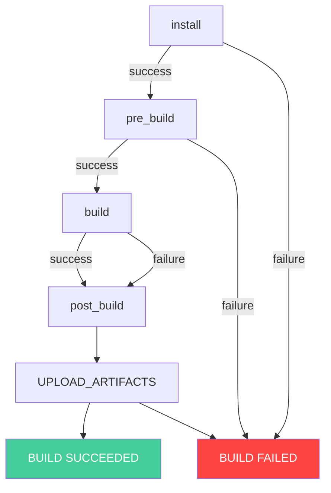
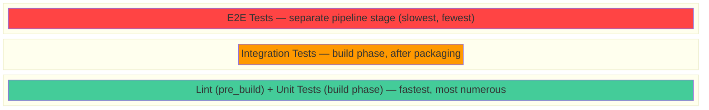

# Automated Testing in AWS CodeBuild: Building a Multi-Stage Quality Gate - PUBLISHED

If your tests don't run automatically, they don't exist. That's the uncomfortable truth about software quality. Tests sitting in a `test/` folder that only run when someone remembers to type `npm test` will eventually stop catching bugs — because someone will forget, or skip them "just this once," or merge before they finish.

**Continuous Integration (CI)** solves this by making test execution involuntary. Every commit triggers a build. Every build runs the tests. If the tests fail, the code doesn't progress. No exceptions, no shortcuts.

In this post, we are going to build a multi-stage testing pipeline using [AWS CodeBuild](https://aws.amazon.com/codebuild/). We'll structure our tests across buildspec phases so that fast checks (linting, unit tests) gate slow checks (integration tests), and use CodeBuild's built-in test reporting to give the entire team visibility into what passed and what broke.

Here's what you'll have by the end: a CodeBuild project that automatically runs lint, unit tests, and integration tests in sequence — stopping the moment anything fails — with detailed test reports visible in the AWS console.

## The Buildspec Phase Model

CodeBuild executes your build instructions from a file called `buildspec.yml`. This file is organized into sequential **phases**, and understanding how these phases work is the key to building effective quality gates.

The four phases execute in this order:

1. **`install`** — Set up runtimes and install dependencies
2. **`pre_build`** — Run setup commands and fast checks (login to registries, lint). If this fails, everything stops.
3. **`build`** — Run tests, compile, bundle, or package the application.
4. **`post_build`** — Cleanup, notifications, or post-processing. **Always runs after `build`, even if `build` fails.**
5. **`UPLOAD_ARTIFACTS`** — Collects build artifacts and test reports. **Always runs after `post_build`.** 

Within a phase, commands run sequentially and a non-zero exit code stops the remaining commands in that phase.



This maps naturally to the testing pyramid — a layered approach where each level gets progressively slower, more expensive, and fewer in number:



## Prerequisites — CloudFormation Template

Before starting, make sure you have the [AWS CLI v2 installed and configured](https://docs.aws.amazon.com/cli/latest/userguide/getting-started-install.html) (`aws configure`) with permissions for CloudFormation, CodeBuild, CodeCommit, S3, and IAM. An account with `AdministratorAccess` works for learning purposes — scope it down for production use.

You'll also need an [SSH key configured for CodeCommit](https://docs.aws.amazon.com/codecommit/latest/userguide/setting-up-ssh-unixes.html) so you can push code to the repository we'll create.

To keep you focused on the CI flow (writing tests and the buildspec), we'll use a CloudFormation template that provisions all the surrounding infrastructure in one shot.

**`prerequisites.yaml`**:

```yaml
AWSTemplateFormatVersion: '2010-09-09'
Description: >
  Prerequisites for the multi-stage CodeBuild testing lab.
  Creates a CodeCommit repo, S3 artifact bucket, IAM role, and CodeBuild project.

Resources:
  # S3 bucket to store build artifacts produced by CodeBuild
  ArtifactBucket:
    Type: AWS::S3::Bucket
    Properties:
      BucketName: !Sub 'codebuild-testing-lab-${AWS::AccountId}'
      VersioningConfiguration:
        Status: Enabled

  # IAM role that CodeBuild assumes during builds — scoped to only what's needed
  CodeBuildServiceRole:
    Type: AWS::IAM::Role
    Properties:
      RoleName: CodeBuildTestingLabRole
      AssumeRolePolicyDocument:
        Version: '2012-10-17'
        Statement:
          - Effect: Allow
            Principal:
              Service: codebuild.amazonaws.com
            Action: sts:AssumeRole
      Policies:
        - PolicyName: CodeBuildTestingLabPolicy
          PolicyDocument:
            Version: '2012-10-17'
            Statement:
              # Allow CodeBuild to write build logs to CloudWatch
              - Sid: CloudWatchLogs
                Effect: Allow
                Action:
                  - logs:CreateLogGroup
                  - logs:CreateLogStream
                  - logs:PutLogEvents
                Resource:
                  - !Sub 'arn:aws:logs:${AWS::Region}:${AWS::AccountId}:log-group:/aws/codebuild/multi-stage-testing-lab'
                  - !Sub 'arn:aws:logs:${AWS::Region}:${AWS::AccountId}:log-group:/aws/codebuild/multi-stage-testing-lab:*'
              # Allow CodeBuild to read/write artifacts to the S3 bucket
              - Sid: S3Artifacts
                Effect: Allow
                Action:
                  - s3:GetObject
                  - s3:GetObjectVersion
                  - s3:PutObject
                Resource:
                  - !Sub 'arn:aws:s3:::codebuild-testing-lab-${AWS::AccountId}/*'
              # Allow CodeBuild to pull source code from the CodeCommit repository
              - Sid: CodeCommitAccess
                Effect: Allow
                Action:
                  - codecommit:GitPull
                Resource:
                  - !GetAtt CodeCommitRepo.Arn
              # Allow CodeBuild to create and populate test report groups
              - Sid: TestReports
                Effect: Allow
                Action:
                  - codebuild:CreateReportGroup
                  - codebuild:CreateReport
                  - codebuild:UpdateReport
                  - codebuild:BatchPutTestCases
                  - codebuild:BatchPutCodeCoverages
                Resource:
                  - !Sub 'arn:aws:codebuild:${AWS::Region}:${AWS::AccountId}:report-group/multi-stage-testing-lab-*'

  # Empty CodeCommit repository — we'll push application code here later
  CodeCommitRepo:
    Type: AWS::CodeCommit::Repository
    Properties:
      RepositoryName: multi-stage-testing-lab
      RepositoryDescription: Application code for the multi-stage CodeBuild testing lab

  # CodeBuild project configured to pull from CodeCommit and use the standard Amazon Linux image
  CodeBuildProject:
    Type: AWS::CodeBuild::Project
    Properties:
      Name: multi-stage-testing-lab
      Description: Multi-stage testing lab with unit and integration test gates
      ServiceRole: !GetAtt CodeBuildServiceRole.Arn
      Artifacts:
        Type: S3
        Location: !Ref ArtifactBucket
        Packaging: ZIP
      Environment:
        Type: LINUX_CONTAINER
        ComputeType: BUILD_GENERAL1_SMALL
        Image: aws/codebuild/amazonlinux2-x86_64-standard:5.0
      Source:
        Type: CODECOMMIT
        Location: !GetAtt CodeCommitRepo.CloneUrlHttp
      SourceVersion: refs/heads/main
      TimeoutInMinutes: 10

Outputs:
  RepositoryCloneUrl:
    Description: CodeCommit SSH clone URL
    Value: !GetAtt CodeCommitRepo.CloneUrlSsh
  ProjectName:
    Description: CodeBuild project name
    Value: !Ref CodeBuildProject
  ArtifactBucket:
    Description: S3 bucket for build artifacts
    Value: !Ref ArtifactBucket
  ServiceRoleArn:
    Description: CodeBuild IAM service role ARN
    Value: !GetAtt CodeBuildServiceRole.Arn
```

The template creates:

| Resource | Type | Purpose |
|----------|------|---------|
| CodeBuildServiceRole | `AWS::IAM::Role` | Allows CodeBuild to write logs, access S3, pull from CodeCommit, and create test reports |
| CodeCommitRepo | `AWS::CodeCommit::Repository` | Empty Git repository for your application code |
| ArtifactBucket | `AWS::S3::Bucket` | Stores build artifacts (versioning enabled) |
| CodeBuildProject | `AWS::CodeBuild::Project` | The build project (Amazon Linux, Node.js 22, small compute) |

Deploy the stack with the following command. The `--capabilities CAPABILITY_NAMED_IAM` flag is required because the template creates a named IAM role:

```bash
# Deploy the prerequisite infrastructure stack
aws cloudformation deploy \
  --template-file prerequisites.yaml \
  --stack-name codebuild-multi-stage-lab \
  --capabilities CAPABILITY_NAMED_IAM
```

Once complete, retrieve the stack outputs — these are the values you'll reference throughout the rest of the post (clone URL, project name, bucket name, role ARN):

```bash
# Retrieve the stack outputs for use in later steps
aws cloudformation describe-stacks \
  --stack-name codebuild-multi-stage-lab \
  --query 'Stacks[0].Outputs[*].{Key:OutputKey,Value:OutputValue}' \
  --output table
```

You should see the CodeCommit clone URL, project name, artifact bucket, and role ARN. The infrastructure is ready — now we write the application and tests.

## Project Setup — A Small Node.js API

We'll build a minimal Express API with three routes. This gives us enough surface area to demonstrate meaningful test boundaries: pure functions that can be unit-tested in isolation, and HTTP endpoints that require integration tests.

Create a working directory and initialize a Git repository. This will become the project you push to CodeCommit:

```bash
# Create the project directory and initialize Git
mkdir multi-stage-testing-lab && cd multi-stage-testing-lab
git init
```

> After creating all the files below, run `npm install` once locally to generate `package-lock.json`. This lockfile must be committed — `npm ci` in the buildspec requires it for deterministic installs. If you're curious about how npm's [lifecycle scripts](https://agilityfeat.com/blog/understanding-npm-lifecycle-scripts/) interact during install and build, it's worth understanding before debugging CI failures.

The `package.json` defines our dependencies and test scripts. We have separate scripts for linting, unit tests, and integration tests — each producing JUnit XML output that CodeBuild's reporting feature can consume. The `mocha-junit-reporter` outputs structured XML, and `supertest` lets our integration tests make HTTP requests against the Express app without manually starting a server.

**`package.json`**:

```json
{
  "name": "multi-stage-testing-lab",
  "version": "1.0.0",
  "description": "A small API demonstrating multi-stage test gating in CodeBuild",
  "main": "app.js",
  "scripts": {
    "start": "node app.js",
    "test:lint": "eslint .",
    "test:unit": "mocha --reporter mocha-junit-reporter --reporter-options mochaFile=./test-results/unit.xml test/unit/**/*.test.js",
    "test:integration": "mocha --reporter mocha-junit-reporter --reporter-options mochaFile=./test-results/integration.xml test/integration/**/*.test.js",
    "test:all": "npm run test:lint && npm run test:unit && npm run test:integration"
  },
  "dependencies": {
    "express": "^4.18.2"
  },
  "devDependencies": {
    "eslint": "^8.56.0",
    "mocha": "^10.2.0",
    "mocha-junit-reporter": "^2.2.1",
    "assert": "^2.1.0",
    "supertest": "^6.3.3"
  }
}
```

The ESLint configuration sets up a basic lint gate. It enables the Node.js and ES2021 environments, recognizes mocha globals (`describe`, `it`), and enforces a few rules that catch real bugs — unused variables, undefined references, and missing semicolons:

**`.eslintrc.json`**:

```json
{
  "env": {
    "node": true,
    "es2021": true,
    "mocha": true
  },
  "extends": "eslint:recommended",
  "parserOptions": {
    "ecmaVersion": "latest"
  },
  "rules": {
    "no-unused-vars": "error",
    "no-undef": "error",
    "semi": ["error", "always"],
    "no-console": "off"
  }
}
```

The application file defines two pure functions (`add` and `getConfig`) that we can unit-test in isolation, and three HTTP routes that exercise those functions through Express's request/response lifecycle. The conditional server start at the bottom ensures tests can import the app object without binding to a port — avoiding conflicts when tests run in parallel or in CI:

**`app.js`**:

```javascript
const express = require('express');
const app = express();

// --- Pure functions (unit-testable in isolation) ---

// Adds two values, coercing strings to numbers
function add(a, b) {
  return Number(a) + Number(b);
}

// Returns environment-specific configuration, or null if unknown
function getConfig(env) {
  const configs = {
    dev: { debug: true, logLevel: 'verbose' },
    staging: { debug: true, logLevel: 'info' },
    prod: { debug: false, logLevel: 'error' }
  };
  return configs[env] || null;
}

// --- HTTP routes ---

// Health check endpoint — returns uptime for monitoring
app.get('/health', (req, res) => {
  res.json({ status: 'ok', uptime: process.uptime() });
});

// Configuration endpoint — returns settings for the given environment
app.get('/config/:env', (req, res) => {
  const config = getConfig(req.params.env);
  if (!config) {
    return res.status(404).json({ error: `Unknown environment: ${req.params.env}` });
  }
  res.json(config);
});

// Addition endpoint — accepts query params a and b, returns their sum
app.get('/add', (req, res) => {
  const { a, b } = req.query;
  if (a === undefined || b === undefined) {
    return res.status(400).json({ error: 'Parameters a and b are required' });
  }
  const result = add(a, b);
  if (isNaN(result)) {
    return res.status(400).json({ error: 'Parameters a and b must be numbers' });
  }
  res.json({ result });
});

// Export the app (for integration tests) and pure functions (for unit tests)
module.exports = { app, add, getConfig };

// Only start the server if run directly — not when imported by tests
if (require.main === module) {
  const port = process.env.PORT || 3000;
  app.listen(port, () => {
    console.log(`Server running on port ${port}`);
  });
}
```

## Unit Tests

Unit tests verify our pure functions in isolation — no HTTP, no network, no dependencies. They run in milliseconds. Each test imports the functions directly and checks return values with strict equality assertions:

**`test/unit/app.test.js`**:

```javascript
const assert = require('assert');
const { add, getConfig } = require('../../app');

describe('Unit Tests', function () {

  describe('add()', function () {
    // Verify basic arithmetic with positive numbers
    it('should add two positive numbers', function () {
      assert.strictEqual(add(2, 3), 5);
    });

    // Verify negative number handling
    it('should handle negative numbers', function () {
      assert.strictEqual(add(-1, 1), 0);
    });

    // Verify zero edge case
    it('should handle zero', function () {
      assert.strictEqual(add(0, 0), 0);
    });

    // Verify string-to-number coercion (query params come as strings)
    it('should coerce string numbers', function () {
      assert.strictEqual(add('10', '5'), 15);
    });

    // Verify NaN is returned for non-numeric input
    it('should return NaN for non-numeric input', function () {
      assert.strictEqual(isNaN(add('abc', 'def')), true);
    });
  });

  describe('getConfig()', function () {
    // Verify each known environment returns correct config
    it('should return dev config', function () {
      const config = getConfig('dev');
      assert.strictEqual(config.debug, true);
      assert.strictEqual(config.logLevel, 'verbose');
    });

    it('should return prod config', function () {
      const config = getConfig('prod');
      assert.strictEqual(config.debug, false);
      assert.strictEqual(config.logLevel, 'error');
    });

    it('should return staging config', function () {
      const config = getConfig('staging');
      assert.strictEqual(config.debug, true);
      assert.strictEqual(config.logLevel, 'info');
    });

    // Verify unknown environments return null (not undefined or throw)
    it('should return null for unknown environments', function () {
      assert.strictEqual(getConfig('unknown'), null);
    });

    it('should return null for undefined input', function () {
      assert.strictEqual(getConfig(undefined), null);
    });
  });

});
```

## Integration Tests

Integration tests boot the Express app and make real HTTP requests against it using `supertest`. They verify that routing, query parsing, error handling, and response formatting all work together. Each test checks both the HTTP status code and the response body structure:

**`test/integration/api.test.js`**:

```javascript
const assert = require('assert');
const request = require('supertest');
const { app } = require('../../app');

describe('Integration Tests', function () {

  describe('GET /health', function () {
    // Verify the health endpoint returns 200 with status and uptime
    it('should return status ok', async function () {
      const res = await request(app).get('/health').expect(200);
      assert.strictEqual(res.body.status, 'ok');
      assert.strictEqual(typeof res.body.uptime, 'number');
    });
  });

  describe('GET /config/:env', function () {
    // Verify known environments return correct configuration
    it('should return dev config', async function () {
      const res = await request(app).get('/config/dev').expect(200);
      assert.strictEqual(res.body.debug, true);
      assert.strictEqual(res.body.logLevel, 'verbose');
    });

    it('should return prod config', async function () {
      const res = await request(app).get('/config/prod').expect(200);
      assert.strictEqual(res.body.debug, false);
    });

    // Verify unknown environments return 404 with a descriptive error
    it('should return 404 for unknown environment', async function () {
      const res = await request(app).get('/config/banana').expect(404);
      assert.strictEqual(res.body.error, 'Unknown environment: banana');
    });
  });

  describe('GET /add', function () {
    // Verify successful addition via query parameters
    it('should add two numbers', async function () {
      const res = await request(app).get('/add?a=10&b=5').expect(200);
      assert.strictEqual(res.body.result, 15);
    });

    it('should handle negative numbers', async function () {
      const res = await request(app).get('/add?a=-3&b=7').expect(200);
      assert.strictEqual(res.body.result, 4);
    });

    // Verify missing parameters return 400 with a helpful message
    it('should return 400 when parameters are missing', async function () {
      const res = await request(app).get('/add?a=5').expect(400);
      assert.strictEqual(res.body.error, 'Parameters a and b are required');
    });

    // Verify non-numeric input returns 400
    it('should return 400 for non-numeric input', async function () {
      const res = await request(app).get('/add?a=foo&b=bar').expect(400);
      assert.strictEqual(res.body.error, 'Parameters a and b must be numbers');
    });
  });

});
```

The distinction matters: if a unit test fails, you know the logic itself is broken. If an integration test fails but unit tests pass, you know the issue is in routing, middleware, or how components interact — not in the core logic.

## Writing the Buildspec — Tests as Quality Gates

This is where everything comes together. The buildspec structures our tests across phases based on CodeBuild's actual execution model: 

* The `install` phase sets up the Node.js runtime and installs dependencies from the lockfile. 
* The `pre_build` phase runs lint — if it fails, everything stops (hard gate, no reports needed). 
* The `build` phase runs unit tests, then packages the application, then runs integration tests. As mentioned before, commands within a phase execute sequentially — if unit tests fail, packaging and integration tests are skipped. But `post_build` and `UPLOAD_ARTIFACTS` still run, so test reports are always collected. 
* The `post_build` phase handles notifications — it always runs after `build`, so it uses `CODEBUILD_BUILD_SUCCEEDING` to check whether the build passed or failed. 
* The `reports` section maps JUnit XML output files to CodeBuild report groups for dashboard visibility:

**`buildspec.yml`**:

```yaml
version: 0.2

phases:
  install:
    runtime-versions:
      nodejs: 22
    commands:
      # Install all dependencies (including devDependencies for testing)
      - echo "=== Installing dependencies ==="
      - npm ci

  pre_build:
    commands:
      # Run lint — catches syntax errors and style violations instantly
      # If lint fails here, nothing else runs (hard stop)
      - echo "=== Running lint (fast gate) ==="
      - npx eslint .
      - echo "Lint passed — proceeding to build"

  build:
    commands:
      # Run unit tests first — if they fail, remaining commands in this
      # phase don't execute (packaging and integration tests are skipped)
      - echo "=== Running unit tests ==="
      - npm run test:unit
      - echo "Unit tests passed"
      # Package the application with production-only dependencies
      - echo "=== Building application ==="
      - mkdir -p dist
      - cp app.js package.json package-lock.json dist/
      - cd dist && npm ci --production && cd ..
      - echo "Build complete"
      # Run integration tests against the assembled application
      - echo "=== Running integration tests ==="
      - npm run test:integration
      - echo "All tests passed"

  post_build:
    commands:
      # post_build ALWAYS runs after build — even if build failed.
      # Use it for cleanup or notifications, not for tests.
      # Check the CODEBUILD_BUILD_SUCCEEDING variable to branch logic.
      - |
        if [ "$CODEBUILD_BUILD_SUCCEEDING" = "1" ]; then
          echo "=== Build succeeded — ready for deployment ==="
        else
          echo "=== Build failed — check test reports for details ==="
        fi

# Package the dist/ directory as the build artifact
artifacts:
  files:
    - '**/*'
  base-directory: dist

# Map JUnit XML files to CodeBuild report groups for dashboard visibility
reports:
  unit-tests:
    files:
      - 'unit.xml'
    base-directory: test-results
    file-format: JUNITXML
  integration-tests:
    files:
      - 'integration.xml'
    base-directory: test-results
    file-format: JUNITXML
```

## Push & Run — First Build

Add the CodeCommit repository as a remote using the SSH URL from the CloudFormation output, commit your project files, and push. This initial push gives CodeBuild source code to work with:

```bash
# Add the empty repo as remote using the SSH URL from stack outputs
git remote add origin <CODECOMMIT_SSH_URL>

# Copy all the files you created into the repo (or create them directly here)
# Then commit and push to the main branch:
git add .
git commit -m "Initial commit with multi-stage tests"
git push -u origin main
```

Trigger the build manually using the project name from the CloudFormation output. The command returns a build ID you'll use to track progress:

```bash
# Start a build and capture the build ID for polling
BUILD_ID=$(aws codebuild start-build \
  --project-name multi-stage-testing-lab \
  --query 'build.id' --output text)

echo "Build started: $BUILD_ID"
```

Poll the build status until it completes. This loop queries the current phase and overall status every 5 seconds:

```bash
# Poll build status — shows which phase is active and whether the build has completed
while true; do
  STATUS=$(aws codebuild batch-get-builds --ids "$BUILD_ID" \
    --query 'builds[0].buildStatus' --output text)
  PHASE=$(aws codebuild batch-get-builds --ids "$BUILD_ID" \
    --query 'builds[0].currentPhase' --output text)
  echo "$(date +%H:%M:%S) Phase: $PHASE | Status: $STATUS"
  if [ "$STATUS" != "IN_PROGRESS" ]; then break; fi
  sleep 5
done
```

You should see the build progress through each phase and complete with `SUCCEEDED`. The output will look something like:

```
14:32:05 Phase: INSTALL | Status: IN_PROGRESS
14:32:18 Phase: PRE_BUILD | Status: IN_PROGRESS
14:32:22 Phase: BUILD | Status: IN_PROGRESS
14:32:30 Phase: POST_BUILD | Status: IN_PROGRESS
14:32:35 Phase: COMPLETED | Status: SUCCEEDED
```

## Reading Test Reports

After the build completes, navigate to the **CodeBuild console → multi-stage-testing-lab → Build history → (click your build) → Reports tab**.

You'll see two report groups:

- **unit-tests** — showing all 10 unit test cases with pass/fail status and duration
- **integration-tests** — showing all 8 integration test cases

Each report displays:
- Total test count, passed, failed, skipped
- Execution duration
- Individual test cases you can drill into for assertion details

Reports are retained for 30 days by default. For longer retention, you can configure the report group to export results to an S3 bucket.

This is the visibility layer — anyone on the team can see exactly which tests pass or fail, without digging through build logs.


*CodeBuild test report showing pass/fail results for unit and integration tests.*

## Experiment — Breaking a Test to See Gating in Action

Let's prove the quality gate works. Edit `test/unit/app.test.js` and break an assertion by changing the expected value to something incorrect:

```javascript
// Change the expected result from 5 to 999 — this will fail the unit test gate
it('should add two positive numbers', function () {
  assert.strictEqual(add(2, 3), 999); // This will fail
});
```

Push the change and trigger a new build. This commits the broken test and starts a build so we can observe the gating behavior:

```bash
# Commit the broken test and push to trigger a new build
git add .
git commit -m "Break a unit test to demonstrate gating"
git push

# Start a new build to observe the failure
BUILD_ID=$(aws codebuild start-build \
  --project-name multi-stage-testing-lab \
  --query 'build.id' --output text)
```

Once the build finishes, query the phase results:

```bash
# Check phase-by-phase results
aws codebuild batch-get-builds --ids "$BUILD_ID" \
  --query 'builds[0].phases[*].{Phase:phaseType,Status:phaseStatus,Duration:durationInSeconds}'
```

You'll see `BUILD` with status `FAILED`, while `POST_BUILD` and `UPLOAD_ARTIFACTS` show `SUCCEEDED`. This is CodeBuild's design — `post_build` and report collection always run after `build`.

The important part is what happened *within* the `build` phase: unit tests failed, so the remaining commands (packaging into `dist/`, integration tests) never executed. The application was never packaged. Integration tests never ran. That's the gate — sequential commands within a phase stop on failure.

Meanwhile, because `UPLOAD_ARTIFACTS` ran, the unit test report is visible in the dashboard showing exactly which test case failed and the assertion mismatch (`expected 999, got 5`).


*The test report showing the failed unit test*

Now fix the test, push again, and confirm the full build passes. You can repeat this experiment with a linting error (declare a variable you never use) to see the `pre_build` hard-stop behavior — when lint fails in `pre_build`, no other phases run at all.

**This is the core value of CI:** bad code is stopped automatically, immediately, with clear feedback about what went wrong.

## Production Considerations

The CodeBuild project works standalone, but for production use there are two enhancements worth considering: wrapping it in a pipeline for automatic triggering, and parallelizing tests for faster feedback.

### Connecting to CodePipeline

In a real workflow you'd wrap the CodeBuild project in a [CodePipeline](https://aws.amazon.com/codepipeline/) that triggers automatically on every push and chains into deployment stages. For containerized workloads, you'd take the build artifact and [deploy it to ECS Fargate with a full CI/CD pipeline](https://agilityfeat.com/blog/how-to-deploy-containerized-mvp-on-aws-ecs-fargate-with-terraform-and-github-actions/).

Here's what that pipeline structure looks like:

```
Source (CodeCommit) → Build & Test (CodeBuild) → Deploy (future)
```

If you want to set this up, you'll need a CodePipeline service role and the pipeline definition. The JSON below defines a two-stage pipeline: the Source stage pulls code from CodeCommit on every push, and the BuildAndTest stage triggers our CodeBuild project. The `PollForSourceChanges: false` setting means the pipeline relies on EventBridge events rather than polling:

```json
{
  "pipeline": {
    "name": "multi-stage-testing-pipeline",
    "roleArn": "arn:aws:iam::<ACCOUNT_ID>:role/CodePipelineServiceRole",
    "artifactStore": {
      "type": "S3",
      "location": "codebuild-testing-lab-<ACCOUNT_ID>"
    },
    "stages": [
      {
        "name": "Source",
        "actions": [
          {
            "name": "CodeCommit_Source",
            "actionTypeId": {
              "category": "Source",
              "owner": "AWS",
              "provider": "CodeCommit",
              "version": "1"
            },
            "outputArtifacts": [{ "name": "SourceArtifact" }],
            "configuration": {
              "RepositoryName": "multi-stage-testing-lab",
              "BranchName": "main",
              "PollForSourceChanges": "false"
            }
          }
        ]
      },
      {
        "name": "BuildAndTest",
        "actions": [
          {
            "name": "CodeBuild_Test",
            "actionTypeId": {
              "category": "Build",
              "owner": "AWS",
              "provider": "CodeBuild",
              "version": "1"
            },
            "inputArtifacts": [{ "name": "SourceArtifact" }],
            "outputArtifacts": [{ "name": "BuildArtifact" }],
            "configuration": {
              "ProjectName": "multi-stage-testing-lab"
            }
          }
        ]
      }
    ]
  }
}
```

An alternative pattern: use two separate CodeBuild actions — one "Lint & Unit Test" action and one "Build & Integration Test" action. This gives you independent timeouts, retry behavior, and clearer stage-level visibility in the pipeline console. The trade-off is slightly more infrastructure to manage.

### Parallel Test Execution

For small test suites like ours, sequential execution is fine. But when your test suite grows to hundreds or thousands of tests and takes 10+ minutes to run, you need parallelism.

CodeBuild supports [**parallel test splitting**](https://docs.aws.amazon.com/codebuild/latest/userguide/parallel-test-enable.html) — it distributes your test files across multiple identical build environments that run simultaneously, then merges the results into a single consolidated report.

In your buildspec, you replace the direct test command with the `codebuild-tests-run` utility, which handles splitting test files across the available nodes:

```bash
# Instead of running all tests on one node: npm run test:unit
# Use codebuild-tests-run to distribute test files across parallel nodes
codebuild-tests-run \
  --test-command "npx mocha" \
  --files "test/unit/**/*.test.js" \
  --splitting-strategy "file-count"
```

When to use this: when your test suite takes more than 5 minutes and the time savings justify running multiple compute environments. For our small lab project, sequential execution completes in seconds — parallelism would be overkill.

## Clean Up

When you're done, tear everything down by deleting the CloudFormation stack. You need to empty the S3 bucket first since CloudFormation cannot delete non-empty buckets:

```bash
# Get the artifact bucket name from stack outputs
BUCKET=$(aws cloudformation describe-stacks \
  --stack-name codebuild-multi-stage-lab \
  --query 'Stacks[0].Outputs[?OutputKey==`ArtifactBucket`].OutputValue' \
  --output text)

# Delete all object versions and delete markers (required for versioned buckets)
aws s3api list-object-versions --bucket $BUCKET --output json \
  | jq '{Objects: [.Versions[]?, .DeleteMarkers[]? | {Key, VersionId}]}' \
  | aws s3api delete-objects --bucket $BUCKET --delete file:///dev/stdin

# Delete the entire stack (CodeBuild project, CodeCommit repo, IAM role, S3 bucket)
aws cloudformation delete-stack --stack-name codebuild-multi-stage-lab

# Wait for deletion to complete
aws cloudformation wait stack-delete-complete --stack-name codebuild-multi-stage-lab
```

Report groups are retained for 30 days after the project is deleted, then automatically cleaned up by AWS.

## Conclusion

Buildspec phases give you a natural testing pyramid: fast checks gate slow checks gate deployment. The exit code is key — any non-zero exit stops the build cold, and nothing downstream ever runs.

CodeBuild's test reports give your team visibility without external tooling. No Jenkins plugins, no third-party dashboards, no extra infrastructure to maintain. Every test run produces a structured report that anyone can read.

The pattern scales: add more test types (contract tests, security scans, performance benchmarks), more report groups, more phases. The structure stays the same — fast gates first, slow gates later, fail early and loudly.