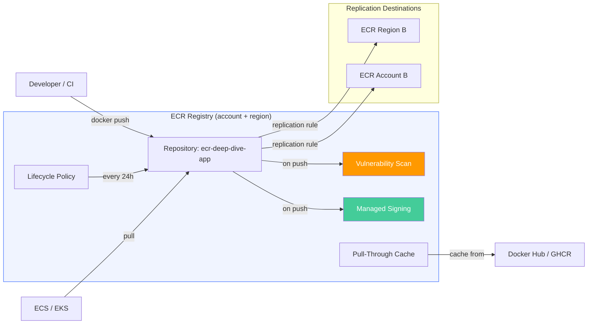
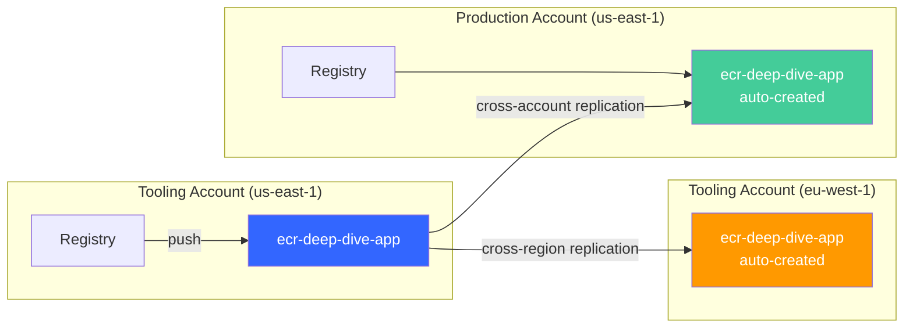
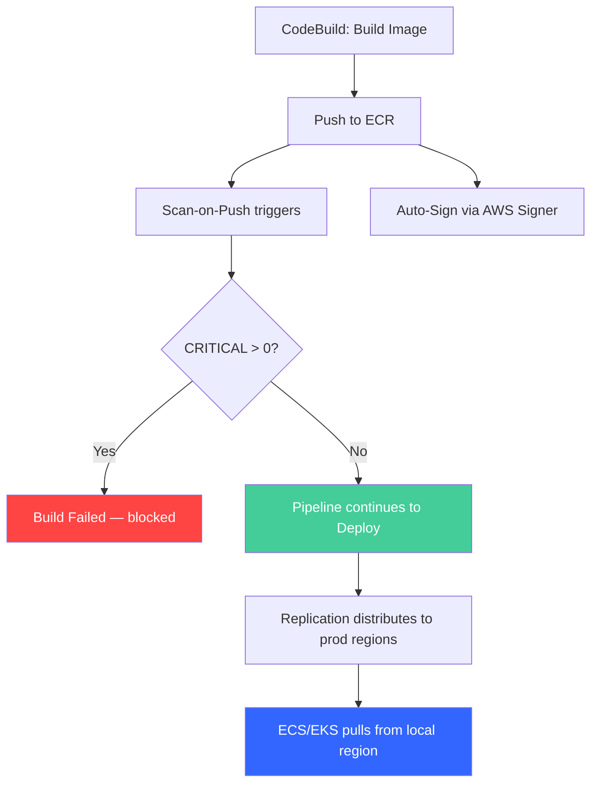

# Amazon ECR Beyond the Basics: Scanning, Lifecycle Policies, and Multi-Region Replication

Most teams interact with Amazon ECR through three commands: `get-login-password`, `docker push`, `docker pull`. Push an image, pull it somewhere else, done. But ECR has an entire operational and security layer that most accounts never touch — vulnerability scanning that catches CVEs before they reach production, lifecycle policies that prevent storage costs from spiraling, pull-through caching that shields your builds from upstream outages, image signing that proves provenance, and replication that distributes your images globally.

This post sets up each of these features hands-on. By the end you'll have a production-grade ECR configuration with automated scanning, cost-optimized retention, supply chain verification via image signing, and multi-region distribution — all from CLI commands you can run today.

## Architecture Overview

Before diving in, here's how ECR's features fit together. The registry is the top-level container (one per account per region), repositories live inside it, and most of the advanced features are configured at the registry level — not per repository:



Key hierarchy:

- **Registry** — one per account per region. Scanning, replication, pull-through cache, and managed signing are configured here.
- **Repository** — one per application/service. Lifecycle policies and tag immutability are configured here.
- **Image** — tagged or untagged. The actual container image layers and manifests.

## Prerequisites — CloudFormation Template

Before starting, make sure you have the [AWS CLI v2 installed and configured](https://docs.aws.amazon.com/cli/latest/userguide/getting-started-install.html) with permissions for CloudFormation, ECR, CodeBuild, S3, and IAM. An account with `AdministratorAccess` works for learning — scope it down for production.

You'll also need [Docker installed locally](https://docs.docker.com/get-docker/) if you want to build and push images manually. Alternatively, the CloudFormation template includes a CodeBuild project that handles builds for you.

All lab files (CloudFormation template, Dockerfile, buildspec, app code) are in the [companion repository](https://github.com/nuxero/ecr-deep-dive-lab). Clone it to follow along:

```bash
git clone https://github.com/nuxero/ecr-deep-dive-lab.git
cd ecr-deep-dive-lab
```

The [`prerequisites.yaml`](https://github.com/nuxero/ecr-deep-dive-lab/blob/main/prerequisites.yaml) template creates:

| Resource | Type | Purpose |
|----------|------|---------|
| ECRRepository | `AWS::ECR::Repository` | Image repository with scan-on-push, immutable tags, AES256 encryption, lifecycle policy |
| ArtifactBucket | `AWS::S3::Bucket` | Stores Dockerfile and build context for CodeBuild |
| CodeBuildServiceRole | `AWS::IAM::Role` | Grants CodeBuild permission to push to ECR, read from S3, write logs |
| CodeBuildProject | `AWS::CodeBuild::Project` | Builds Docker images and pushes them to ECR (privileged mode for Docker-in-Docker) |

The ECR repository is configured with security best practices from the start:

```yaml
ECRRepository:
  Type: AWS::ECR::Repository
  Properties:
    RepositoryName: ecr-deep-dive-app
    ImageScanningConfiguration:
      ScanOnPush: true
    ImageTagMutability: IMMUTABLE
    EncryptionConfiguration:
      EncryptionType: AES256
    LifecyclePolicy:
      LifecyclePolicyText: |
        {
          "rules": [
            {
              "rulePriority": 1,
              "description": "Expire untagged images after 7 days",
              "selection": {
                "tagStatus": "untagged",
                "countType": "sinceImagePushed",
                "countUnit": "days",
                "countNumber": 7
              },
              "action": { "type": "expire" }
            },
            {
              "rulePriority": 2,
              "description": "Keep only last 20 tagged images",
              "selection": {
                "tagStatus": "tagged",
                "tagPrefixList": ["v"],
                "countType": "imageCountMoreThan",
                "countNumber": 20
              },
              "action": { "type": "expire" }
            }
          ]
        }
```

Deploy the stack. The `--capabilities CAPABILITY_NAMED_IAM` flag is required because the template creates a named IAM role:

```bash
aws cloudformation deploy \
  --template-file prerequisites.yaml \
  --stack-name ecr-deep-dive-lab \
  --capabilities CAPABILITY_NAMED_IAM
```

Once complete, retrieve the outputs — you'll reference these throughout the post:

```bash
aws cloudformation describe-stacks \
  --stack-name ecr-deep-dive-lab \
  --query 'Stacks[0].Outputs[*].{Key:OutputKey,Value:OutputValue}' \
  --output table
```

### Building and Pushing the Sample Image

The repo includes a multi-stage [`Dockerfile`](https://github.com/nuxero/ecr-deep-dive-lab/blob/main/Dockerfile) that intentionally uses `node:18` from the [ECR Public Gallery](https://gallery.ecr.aws/docker/library/node) — Node 18's Debian base carries dozens of known vulnerabilities for the scanner to find. The [`buildspec.yml`](https://github.com/nuxero/ecr-deep-dive-lab/blob/main/buildspec.yml) handles building, pushing, and scan-gating (we'll explore the gating logic in detail later).

Package the files and upload them to S3 so CodeBuild can use them as source:

```bash
# Create a build context zip and upload to S3
npm install
zip build-context.zip Dockerfile app.js package.json package-lock.json buildspec.yml

BUCKET=$(aws cloudformation describe-stacks \
  --stack-name ecr-deep-dive-lab \
  --query 'Stacks[0].Outputs[?OutputKey==`BucketName`].OutputValue' \
  --output text)

aws s3 cp build-context.zip s3://$BUCKET/build-context.zip
```

Trigger a build to push your first image:

```bash
BUILD_ID=$(aws codebuild start-build \
  --project-name ecr-deep-dive-build \
  --query 'build.id' --output text)

echo "Build started: $BUILD_ID"

# Poll until complete
while true; do
  STATUS=$(aws codebuild batch-get-builds --ids "$BUILD_ID" \
    --query 'builds[0].buildStatus' --output text)
  echo "$(date +%H:%M:%S) Status: $STATUS"
  if [ "$STATUS" != "IN_PROGRESS" ]; then break; fi
  sleep 10
done
```

With an image in the repository, we can now explore each feature.

## Vulnerability Scanning — Basic vs. Enhanced

ECR can scan every image you push for known vulnerabilities. With `scanOnPush: true` (already enabled in our CloudFormation template), a scan triggers automatically every time an image lands in the repository.

### Basic Scanning

Basic scanning checks your image's OS packages against the Common Vulnerabilities and Exposures (CVE) database. It's free, triggers immediately on push, and covers packages installed via apt, yum, and apk.

Since we already pushed an image with `scanOnPush: true`, the scan has already run. Query the results to see what it found. This command retrieves the severity breakdown for our image:

```bash
# Check scan results for our pushed image
aws ecr describe-image-scan-findings \
  --repository-name ecr-deep-dive-app \
  --image-id imageTag=v1.0.0 \
  --query '{
    Status: imageScanStatus.status,
    SeverityCounts: imageScanFindings.findingSeverityCounts,
    TotalFindings: length(imageScanFindings.findings)
  }'
```

You'll see output like:

```json
{
  "Status": "COMPLETE",
  "SeverityCounts": {
    "HIGH": 24,
    "MEDIUM": 19,
    "LOW": 3,
    "CRITICAL": 3
  },
  "TotalFindings": 49
}
```

The numbers will vary depending on when you run this — new CVEs are published constantly. The important thing: basic scanning found OS-level vulnerabilities in our `node:18-slim` base image.

### Enhanced Scanning (Amazon Inspector)

Basic scanning covers OS packages only. If you also need to scan language-level dependencies (npm, pip, Maven, Go modules), ECR integrates with [Amazon Inspector](https://aws.amazon.com/inspector/) for enhanced scanning. Enhanced scanning adds:

- **Language package vulnerabilities** — finds CVEs in your `node_modules/`, Python packages, Java JARs, etc.
- **Continuous re-scanning** — images are re-evaluated when new CVEs are published, not just at push time

Enhanced scanning is configured at the registry level:

```bash
aws ecr put-registry-scanning-configuration \
  --scan-type ENHANCED \
  --rules '[{"scanFrequency": "CONTINUOUS_SCAN", "repositoryFilters": [{"filter": "*", "filterType": "WILDCARD"}]}]'
```

Trade-offs compared to basic:

- Costs money (per image/month)
- Requires additional IAM permissions (`inspector2:ListFindings`, `inspector2:ListCoverage`, `inspector2:ListAccountPermissions`)
- Scan registration is asynchronous — there's a delay between push and when findings are available, which adds complexity to CI/CD gating logic
- Switching between basic and enhanced invalidates previously established scans

You can limit enhanced scanning to specific repositories using filters — scan `prod-*` continuously, leave `dev-*` on basic to save cost.

| Capability | Basic | Enhanced |
|-----------|-------|----------|
| OS package vulnerabilities | ✅ | ✅ |
| Language package vulnerabilities (npm, pip, Maven, Go) | ❌ | ✅ |
| Continuous re-scanning | ❌ | ✅ |
| Inspector dashboard integration | ❌ | ✅ |
| Maps images to running ECS tasks / EKS pods | ❌ | ✅ |
| Cost | Free | Per image/month |
| Scan availability after push | Immediate | Delayed (seconds to minutes) |

### Pipeline Integration — Gating on Scan Results

The buildspec we created earlier includes a scan gate in `post_build`. The pattern: push the image, wait for the scan to complete, query findings, fail the build if critical vulnerabilities exist. Here's the key snippet isolated for clarity:

```bash
# Wait for scan to complete using the official ECR waiter
aws ecr wait image-scan-complete \
  --repository-name ecr-deep-dive-app \
  --image-id imageTag=v1.0.0

# Query CRITICAL count — --output text returns "None" if the key doesn't exist
CRITICAL=$(aws ecr describe-image-scan-findings \
  --repository-name ecr-deep-dive-app \
  --image-id imageTag=v1.0.0 \
  --query 'imageScanFindings.findingSeverityCounts.CRITICAL' \
  --output text)

if [ "$CRITICAL" = "None" ] || [ -z "$CRITICAL" ]; then CRITICAL=0; fi

# Fail the build if any CRITICAL vulnerabilities exist
if [ "$CRITICAL" -gt 0 ]; then
  echo "ERROR: $CRITICAL critical vulnerabilities found — blocking deployment"
  aws ecr describe-image-scan-findings \
    --repository-name ecr-deep-dive-app \
    --image-id imageTag=v1.0.0 \
    --query 'imageScanFindings.findings[?severity==`CRITICAL`].{CVE:name,Package:attributes[?key==`package_name`].value|[0],Description:description}' \
    --output table
  exit 1
fi

echo "Scan passed — no critical vulnerabilities"
```

**Why fail the build if the image is already pushed?** The image exists in ECR regardless — the scan gate doesn't prevent storage, it prevents *deployment*. In a CodePipeline (Source → Build → Deploy), a failed Build stage stops the Deploy stage from ever running. The vulnerable image sits in the registry undeployed until a lifecycle policy cleans it up. If you want to go further and prevent the image from being pullable at all, you'd need a separate EventBridge rule that deletes or quarantines images when Inspector reports critical findings — but most teams just let the pipeline gate handle it.

### Alternative Approaches

- **Scan before push with Trivy or Grype** — fastest feedback, no async timing issues, but requires a third-party tool in your build environment.
- **Event-driven gate with EventBridge + Lambda** — fully decoupled from the build; a Lambda evaluates findings on the `ECR Image Scan` completion event and approves or quarantines.
- **CodePipeline InspectorScan action** — native pipeline stage for scanning source code and container SBOMs without embedding logic in the buildspec.

For this post, we use the explicit `start-image-scan` + waiter pattern because it demonstrates ECR's built-in capabilities without external tooling.

## Lifecycle Policies — Automated Image Cleanup

Without lifecycle policies, repositories grow indefinitely. A busy CI pipeline pushing on every commit generates hundreds of images per week — most of which will never be pulled again. At $0.10/GB/month for standard storage, costs creep up silently.

### How Lifecycle Policies Work

Lifecycle policies are evaluated once every 24 hours (not in real-time). Each policy contains rules with priorities, and rules are evaluated in priority order (lower number = evaluated first). A rule matches images by tag status and applies an action — either **expire** (delete) or **transition** (move to archive storage class).

Selection criteria include:

- **`sinceImagePushed`** — match images older than N days since push
- **`imageCountMoreThan`** — match when total image count exceeds N (keeps newest, expires oldest)
- **`sinceImagePulled`** — match images not pulled in N days (usage-based, available with the transition action)

The CloudFormation template already set up a basic two-rule policy. Let's replace it with a more practical version that handles three scenarios: cleaning up untagged build artifacts quickly, capping the number of release images, and a safety net to prevent unbounded growth:

```bash
# Apply a multi-rule lifecycle policy covering common production scenarios
aws ecr put-lifecycle-policy \
  --repository-name ecr-deep-dive-app \
  --lifecycle-policy-text '{
    "rules": [
      {
        "rulePriority": 1,
        "description": "Expire untagged images after 1 day (build artifacts, failed pushes)",
        "selection": {
          "tagStatus": "untagged",
          "countType": "sinceImagePushed",
          "countUnit": "days",
          "countNumber": 1
        },
        "action": { "type": "expire" }
      },
      {
        "rulePriority": 2,
        "description": "Keep only last 30 release images",
        "selection": {
          "tagStatus": "tagged",
          "tagPatternList": ["v*"],
          "countType": "imageCountMoreThan",
          "countNumber": 30
        },
        "action": { "type": "expire" }
      },
      {
        "rulePriority": 10,
        "description": "Safety net: keep max 50 images total regardless of tag",
        "selection": {
          "tagStatus": "any",
          "countType": "imageCountMoreThan",
          "countNumber": 50
        },
        "action": { "type": "expire" }
      }
    ]
  }'
```

### Previewing Before Applying

In production, always preview a lifecycle policy before applying it. The preview dry-run shows exactly which images would be affected without actually deleting anything. This command starts a preview evaluation and returns the images that match each rule:

```bash
# Start a lifecycle policy preview (dry-run)
aws ecr start-lifecycle-policy-preview \
  --repository-name ecr-deep-dive-app \
  --lifecycle-policy-text '{...}'  # same JSON as above

# Check preview results (may take a few seconds to evaluate)
aws ecr get-lifecycle-policy-preview \
  --repository-name ecr-deep-dive-app \
  --query 'previewResults[*].{Tag:imageTags[0],Rule:appliedRulePriority,Action:action.type}'

# Once satisfied with the preview, apply the policy for real
aws ecr put-lifecycle-policy \
  --repository-name ecr-deep-dive-app \
  --lifecycle-policy-text '{...}'  # same JSON as above
```

### Archive Storage Class

For compliance-heavy environments where you need to retain images long-term but don't want to pay full storage costs, ECR offers an archive storage class. Instead of expiring images, you can transition them to cheaper archive storage using the `transition` action in lifecycle policies.

```bash
# Alternative: archive old images instead of deleting them
# (use this instead of the count-based expire rule, not alongside it)
aws ecr put-lifecycle-policy \
  --repository-name ecr-deep-dive-app \
  --lifecycle-policy-text '{
    "rules": [
      {
        "rulePriority": 1,
        "description": "Expire untagged images after 1 day",
        "selection": {
          "tagStatus": "untagged",
          "countType": "sinceImagePushed",
          "countUnit": "days",
          "countNumber": 1
        },
        "action": { "type": "expire" }
      },
      {
        "rulePriority": 2,
        "description": "Archive release images not pulled in 90 days",
        "selection": {
          "tagStatus": "tagged",
          "tagPatternList": ["v*"],
          "countType": "sinceImagePulled",
          "countUnit": "days",
          "countNumber": 90
        },
        "action": { "type": "transition", "targetStorageClass": "archive" }
      }
    ]
  }'
```

Key constraints:

- Archived images have a **90-day minimum storage duration** — you can't archive and immediately delete
- Archived images cannot be pulled directly — they must be restored to standard first
- Restoration takes time (minutes, not instant)
- Lifecycle policies can use `sinceImagePulled` as criteria specifically for the transition action — this lets you automatically archive images nobody is using

To manually archive or restore an image outside of lifecycle policies, use the `UpdateImageStorageClass` API:

```bash
# Manually archive a specific image
aws ecr update-image-storage-class \
  --repository-name ecr-deep-dive-app \
  --image-id imageTag=v0.5.0 \
  --target-storage-class ARCHIVE

# Restore an archived image back to standard storage
aws ecr update-image-storage-class \
  --repository-name ecr-deep-dive-app \
  --image-id imageTag=v0.5.0 \
  --target-storage-class STANDARD
```

### Tag Pattern Matching

Lifecycle rules support two ways to match tags:

- **`tagPrefixList`** — exact prefix matching: `["v", "release"]` matches tags starting with `v` or `release`
- **`tagPatternList`** — glob-style wildcards: `["v*", "release-*"]` gives you more flexibility

Use patterns when your tagging scheme is complex. For example, `prod-*` matches `prod-us-east-1`, `prod-eu-west-1` but not `dev-us-east-1`.

> **Key points:** Lifecycle policies evaluate every 24 hours, not immediately. Rules are evaluated in priority order. Untagged images accumulate fast and should always have a cleanup rule. `sinceImagePushed` is age-based, `imageCountMoreThan` is count-based. A rule with `tagStatus: any` must have the highest `rulePriority` value.

## Tag Immutability and Exceptions

Tag immutability prevents overwriting a tagged image. When enabled, pushing a `v1.2.3` tag that already exists fails with `ImageTagAlreadyExistsException` instead of silently replacing the previous image. This guarantees that a tag always points to the same image digest — critical for deployment traceability.

Our CloudFormation template already enabled immutability. Verify it:

```bash
# Check the current tag mutability setting
aws ecr describe-repositories \
  --repository-names ecr-deep-dive-app \
  --query 'repositories[0].imageTagMutability'
```

Output: `"IMMUTABLE"`

### The Problem Immutability Created

Before immutability exceptions existed, it was all-or-nothing. If you needed `latest` to be overwritable (a common pattern for "always pull the newest" in dev environments), you had to disable immutability for the entire repository — losing protection on release tags too.

### Tag Immutability Exceptions

ECR now supports exceptions — a list of tag filters that are exempt from the immutability rule. This lets you keep release tags locked while allowing convenience tags to be overwritten.

Enable immutability with exceptions for `latest` and any tag matching `dev-*`. This means release tags like `v1.0.0` are permanently locked, but `latest` and `dev-feature-xyz` can be overwritten on each push:

```bash
# Set immutable with exceptions for 'latest' and 'dev-*' tags
aws ecr put-image-tag-mutability \
  --repository-name ecr-deep-dive-app \
  --image-tag-mutability IMMUTABLE_WITH_EXCLUSION \
  --image-tag-mutability-exclusion-filters \
    filterType=WILDCARD,filter=latest \
    filterType=WILDCARD,filter="dev-*"
```

### When to Keep Mutability ON (Immutable = False)

Full mutability still makes sense for:

- **Development/scratch repositories** where images are rebuilt constantly with the same tag during iteration
- **Repositories where exceptions would be unpredictable** — dozens of dynamic environment tags generated by CI
- **Pull-through cache repositories** — cached images may need tag updates when the upstream publishes under the same tag

**Rule of thumb:** if the repository holds anything that goes to staging or production, use immutable + exceptions. If it's purely ephemeral development work, mutable is fine.

## Pull-Through Cache Rules

Pulling from Docker Hub, GitHub Container Registry, or Quay introduces an external dependency into your builds. Docker Hub's anonymous rate limit is 10 pulls per hour. An outage at any upstream registry can stop your entire CI pipeline. Pull-through cache eliminates this dependency.

### How It Works

Configure a cache rule that maps a local prefix (e.g., `docker-hub/`) to an upstream registry. When you pull `<your-ecr>/docker-hub/library/nginx:latest`, ECR checks if it has a cached copy:

- **First pull:** ECR fetches from the upstream, stores it in your private registry, then serves it to you
- **Subsequent pulls:** served directly from your ECR cache — no upstream call
- **Sync frequency:** ECR checks the upstream at least once every 24 hours for updates

Supported upstream registries: Docker Hub, GitHub Container Registry, Quay, Amazon ECR Public, Kubernetes registry (registry.k8s.io), Azure Container Registry, and private ECR (cross-account).

### Setting Up a Pull-Through Cache

The simplest setup uses ECR Public Gallery as the upstream — it's unauthenticated, so no credentials are needed. Create the cache rule mapping a local prefix to the ECR Public registry:

```bash
# Create a pull-through cache rule for ECR Public Gallery
# No credentials needed — ECR Public is unauthenticated
aws ecr create-pull-through-cache-rule \
  --ecr-repository-prefix ecr-public \
  --upstream-registry-url public.ecr.aws
```

Now pull an image through the cache. This first pull seeds the cache — ECR fetches nginx from ECR Public and stores it locally:

```bash
# Authenticate Docker to your ECR registry
aws ecr get-login-password --region <REGION> | \
  docker login --username AWS --password-stdin <ACCOUNT_ID>.dkr.ecr.<REGION>.amazonaws.com

# Pull nginx through the cache — first pull fetches from ECR Public, subsequent pulls are local
docker pull <ACCOUNT_ID>.dkr.ecr.<REGION>.amazonaws.com/ecr-public/nginx/nginx:latest
```

Verify the cached repository was auto-created by ECR:

```bash
# List repositories — you'll see 'ecr-public/nginx/nginx' was created automatically
aws ecr describe-repositories \
  --query 'repositories[?starts_with(repositoryName, `ecr-public`)].repositoryName'
```

For upstream registries that require authentication (Docker Hub, GitHub Container Registry), you'll need to store credentials in Secrets Manager first:

```bash
# Example: Docker Hub pull-through cache (requires credentials)
aws secretsmanager create-secret \
  --name ecr-pullthroughcache/docker-hub \
  --secret-string '{"username":"your-dockerhub-username","accessToken":"your-access-token"}'

aws ecr create-pull-through-cache-rule \
  --ecr-repository-prefix docker-hub \
  --upstream-registry-url registry-1.docker.io \
  --credential-arn arn:aws:secretsmanager:<REGION>:<ACCOUNT_ID>:secret:ecr-pullthroughcache/docker-hub-<RANDOM>
```

### Integration with Other ECR Features

Pull-through cached images are regular ECR images. They benefit from:

- **Lifecycle policies** — set up retention rules on pull-through repos to avoid unbounded growth. Without this, every unique image you pull gets cached forever.
- **Replication** — cached images can be replicated cross-region/cross-account like any other image.
- **Scanning** — cached images are scanned on pull (if basic scanning is enabled) or continuously (if enhanced scanning is active).

> **Key points:** Pull-through cache rules are configured at the registry level. They require Secrets Manager for authenticated upstream registries (Docker Hub, GHCR). Cached images are stored in your private registry and count toward your storage costs. ECR auto-creates repositories for cached images.

## Managed Image Signing

How do you know the image you're pulling is the same one your pipeline built? Without signing, anyone with push access could replace an image (if mutability is on) or push a malicious image to a different tag. Image signing provides cryptographic proof of provenance.

### How Managed Signing Works

ECR managed signing is configured at the registry level. Once enabled, every image pushed to ECR is automatically signed using [AWS Signer](https://docs.aws.amazon.com/signer/latest/developerguide/Welcome.html) — no client-side tooling required. The signature is stored as an [OCI referrer artifact](https://github.com/opencontainers/image-spec/blob/main/manifest.md#guidelines-for-referrers) attached to the image (leveraging OCI Image Spec 1.1 support).

Enable managed signing for your registry. This requires an [AWS Signer signing profile](https://docs.aws.amazon.com/signer/latest/developerguide/signing-profiles.html) — create one first, then configure ECR to use it for automatic signing:

```bash
# Create a signing profile in AWS Signer (one-time setup)
aws signer put-signing-profile \
  --profile-name ecr_image_signing \
  --platform-id Notation-OCI-SHA384-ECDSA

# Configure ECR to auto-sign all pushed images using this profile
aws ecr put-signing-configuration \
  --signing-configuration '{
    "rules": [
      {
        "signingProfileArn": "arn:aws:signer:<REGION>:<ACCOUNT_ID>:/signing-profiles/ecr_image_signing"
      }
    ]
  }'
```

The `rules` array supports repository filters if you only want to sign specific repos (e.g., `prod-*`). Without filters, all images pushed to any repository in the registry are signed.

**Important:** Once signing is configured, any IAM principal pushing images must have `signer:SignPayload` permission on the signing profile. Our CloudFormation template already includes this permission on the CodeBuild role.

After enabling, push a new image and verify the signature was created:

```bash
# Push a new version (this will be auto-signed). 
# Or trigger another CodeBuild job if you don't want to push the image yourself
docker build -t <REPOSITORY_URI>:v2.0.0 .
docker push <REPOSITORY_URI>:v2.0.0

# Check the signing configuration is active
aws ecr get-signing-configuration \
  --query 'signingConfiguration.rules'
```

### Verifying Signatures at Deployment

Signing is only useful if you verify. The typical verification points:

- **EKS:** Use admission controllers like [Kyverno](https://kyverno.io/) or [OPA Gatekeeper](https://github.com/open-policy-agent/gatekeeper) to reject pods that reference unsigned images. Kyverno has native support for AWS Signer signature verification.
- **General:** Use the [Notation CLI](https://notaryproject.dev/) with the AWS Signer plugin to verify signatures locally. This requires client-side setup: a trust policy (`trustpolicy.json`) defining which signing identities you trust, and the [AWS Signer Notation plugin](https://docs.aws.amazon.com/signer/latest/developerguide/image-signing-prerequisites.html) installed. See the [AWS Signer image verification docs](https://docs.aws.amazon.com/signer/latest/developerguide/image-verification.html) for the full setup walkthrough.

### Managed vs. Manual Signing

Before managed signing, you had to install Notation locally, configure the AWS Signer plugin, and manually sign after each push. Managed signing eliminates all of this — it happens automatically on push, centrally governed as a registry configuration. Use manual signing only if you need to sign images in registries other than ECR or need custom signing logic.

> **The big picture:** Image signing proves provenance (who built this image and was it tampered with). It complements scanning (which proves the image is safe from known vulnerabilities). Together they form the supply chain security story: build → scan → sign → verify at deploy.

## Cross-Region and Cross-Account Replication

Replication solves two problems:

- **Cross-Region:** reduces image pull latency for multi-region deployments and provides DR (if your primary region goes down, images exist in the secondary)
- **Cross-Account:** shares images between dev/staging/prod accounts without needing cross-account pull permissions at runtime — each account has its own copy

### How Replication Works

Replication is configured at the **registry level** (not per-repository) via `put-replication-configuration`. Key behaviors:
- Replication is near-real-time — images typically replicate within seconds of push
- **Only images pushed after replication is configured are replicated** — existing images are NOT backfilled
- Repositories are auto-created in the destination if they don't exist
- You can filter which repositories get replicated using prefix matching
- A single registry can have up to 10 replication rules with up to 25 destinations



### Cross-Region Replication (Same Account)

This is the simplest setup — replicate images to another region within the same account. Configure the replication rule with the destination region and your own account ID. The `repositoryFilters` field limits replication to repositories whose names start with "ecr-deep-dive" (prevents replicating everything):

```bash
# Configure cross-region replication to eu-west-1
# Only replicates repositories matching the "ecr-deep-dive" prefix
aws ecr put-replication-configuration \
  --replication-configuration '{
    "rules": [
      {
        "destinations": [
          {
            "region": "eu-west-1",
            "registryId": "<ACCOUNT_ID>"
          }
        ],
        "repositoryFilters": [
          {
            "filter": "ecr-deep-dive",
            "filterType": "PREFIX_MATCH"
          }
        ]
      }
    ]
  }'
```

After configuring replication, push a new image and verify it appears in the destination region:

```bash
# Push a new tagged image (triggers replication)
# or trigger a new codebuild job
docker tag <REPOSITORY_URI>:v1.0.0 <REPOSITORY_URI>:v1.0.1
docker push <REPOSITORY_URI>:v1.0.1

# Wait a few seconds, then check the destination region
aws ecr describe-images \
  --repository-name ecr-deep-dive-app \
  --region eu-west-1 \
  --query 'imageDetails[*].{Tags:imageTags,Pushed:imagePushedAt}'
```

### Cross-Account Replication

Cross-account requires configuration on both sides:

1. **Source account:** add the destination account ID to the replication rule
2. **Destination account:** add a registry permissions policy explicitly allowing the source to replicate

**In the source account** — configure replication targeting the production account. This tells ECR to replicate matching images to the specified account and region:

```bash
# Source account: replicate to production account in us-east-1
aws ecr put-replication-configuration \
  --replication-configuration '{
    "rules": [
      {
        "destinations": [
          {
            "region": "us-east-1",
            "registryId": "<PROD_ACCOUNT_ID>"
          }
        ],
        "repositoryFilters": [
          {
            "filter": "ecr-deep-dive",
            "filterType": "PREFIX_MATCH"
          }
        ]
      }
    ]
  }'
```

**In the destination (production) account** — add a registry permissions policy that allows the source account to replicate into it. Without this policy, replication silently fails. This is the destination account explicitly opting-in to receive replicated images:

```bash
# Destination account: allow the tooling account to replicate here
aws ecr put-registry-policy \
  --policy-text '{
    "Version": "2012-10-17",
    "Statement": [
      {
        "Sid": "AllowReplicationFromTooling",
        "Effect": "Allow",
        "Principal": {
          "AWS": "arn:aws:iam::<TOOLING_ACCOUNT_ID>:root"
        },
        "Action": [
          "ecr:CreateRepository",
          "ecr:ReplicateImage"
        ],
        "Resource": "*"
      }
    ]
  }'
```

Now push a new image tag and verify it exists on both AWS accounts

### Replication with KMS Encryption

If your repositories use KMS encryption (instead of the default AES256), cross-account replication requires the destination account to have decrypt access to the KMS key. This adds complexity — the simpler approach is to use AES256 encryption for repositories that will be replicated. If you must use KMS, you'll need to:

1. Add the destination account to the KMS key policy (grant `kms:Decrypt` + `kms:DescribeKey`)
2. Or configure the destination to use a different KMS key (ECR re-encrypts on replication)

For most teams, AES256 is the right default for replicated repos.

### Repository Filters

Filters use prefix matching only — no wildcards or regex. This means your repository naming convention matters. A common pattern:

- `prod-*` repositories → replicate to production account and DR region
- `shared-*` repositories → replicate to all accounts
- `dev-*` repositories → no replication (saves data transfer costs)

To replicate everything (no filter), omit the `repositoryFilters` field entirely.

## Putting It All Together — Pipeline Integration

Here's how all the features work together in a real CI/CD pipeline:



The flow: CodeBuild builds and pushes to ECR, which triggers both scan-on-push and managed signing in parallel. The `post_build` phase queries scan results and fails the build if CRITICAL vulnerabilities exist — blocking the deploy stage. If clean, replication distributes the image to production regions/accounts (near-real-time), and ECS/EKS pulls from the local region. Lifecycle policies run every 24 hours in the background, cleaning up old images and archiving stale ones.

Meanwhile, **pull-through cache** ensures that base images your Dockerfile references are cached locally — so builds don't depend on Docker Hub being available.

This is the complete picture: ECR handles security (scan + sign), distribution (replicate), cost management (lifecycle), and reliability (pull-through cache) — without external tooling.

## Clean Up

Remove everything in reverse order. Registry-level settings must be cleaned up before deleting the stack, since CloudFormation doesn't manage them:

```bash
# 1. Remove registry-level configurations (signing, replication, pull-through cache)
aws ecr delete-signing-configuration 2>/dev/null
aws signer cancel-signing-profile --profile-name ecr_image_signing 2>/dev/null
aws ecr put-replication-configuration --replication-configuration '{"rules": []}'
aws ecr put-replication-configuration --replication-configuration '{"rules": []}' --region eu-west-1 2>/dev/null
aws ecr delete-repository --repository-name ecr-deep-dive-app --region eu-west-1 --force 2>/dev/null

# 2. Remove pull-through cache rules and auto-created repositories
aws ecr delete-pull-through-cache-rule --ecr-repository-prefix ecr-public 2>/dev/null
aws ecr delete-pull-through-cache-rule --ecr-repository-prefix docker-hub 2>/dev/null
aws ecr delete-repository --repository-name ecr-public/nginx/nginx --force 2>/dev/null

# 3. Remove registry policy and secrets (if cross-account or Docker Hub cache was set up)
aws ecr delete-registry-policy 2>/dev/null
aws secretsmanager delete-secret --secret-id ecr-pullthroughcache/docker-hub --force-delete-without-recovery 2>/dev/null

# 4. Empty the S3 bucket (required before CloudFormation can delete it)
BUCKET=$(aws cloudformation describe-stacks \
  --stack-name ecr-deep-dive-lab \
  --query 'Stacks[0].Outputs[?OutputKey==`BucketName`].OutputValue' \
  --output text)

aws s3api list-object-versions --bucket $BUCKET --output json \
  | jq '{Objects: [.Versions[]?, .DeleteMarkers[]? | {Key, VersionId}]}' \
  | aws s3api delete-objects --bucket $BUCKET --delete file:///dev/stdin

# 5. Force-delete ECR repo and delete the CloudFormation stack
aws ecr delete-repository --repository-name ecr-deep-dive-app --force
aws cloudformation delete-stack --stack-name ecr-deep-dive-lab
aws cloudformation wait stack-delete-complete --stack-name ecr-deep-dive-lab
```

## Conclusion

ECR is a full container lifecycle management platform — not just storage. The features covered here break into two categories:

**Security:** vulnerability scanning catches CVEs before deployment (basic for free, enhanced for depth). Image signing proves provenance. Tag immutability prevents tampering. Together they form a verifiable supply chain: build → scan → sign → verify.
**Operations:** lifecycle policies control storage costs automatically. Pull-through cache eliminates external registry dependencies. Replication distributes images globally with near-zero latency at pull time. These features require minimal setup but prevent real incidents — registry outages, ballooning costs, slow deployments in distant regions.

The key architectural insight: most ECR features are configured at the **registry level**, not per-repository. Scanning, replication, pull-through cache, and signing are registry-wide settings. Only lifecycle policies and tag immutability are per-repository. Set them up once and every new repository benefits automatically.

Interested in taking advantage of ECR features for your containerized application? [Let's talk!](mailto:hector@agilityfeat.com)