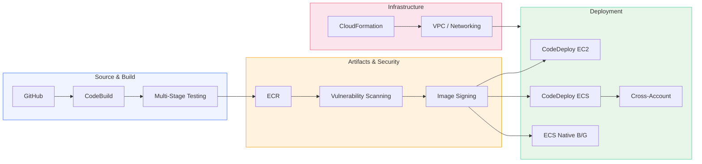

# AWS DevOps on Builder Center: A Complete Series for Production CI/CD

We spent the last several months building something we're proud of: a hands-on series covering AWS CI/CD pipelines and deployment automation, published on [AWS Builder Center](https://builder.aws.com/community/@hectorzelaya?tab=articles). Seven posts, each with working CloudFormation templates, CLI commands you can run today, and companion GitHub repositories. The series takes you from your first pipeline all the way through cross-account deployments and container image security.

Here's what we built, where to find each post, and what it takes to move these patterns from lab to production.

## The Series at a Glance

Each post focuses on a single service or deployment pattern. Together they cover the core building blocks of AWS-native CI/CD:

| # | Post | What You'll Build |
|---|------|-------------------|
| 1 | [Building a Complete CI/CD Pipeline in AWS: From GitHub to ECS Fargate](https://builder.aws.com/content/3GBJRfLDXs5B4CE3ZLwTb0EiQxw/building-a-complete-cicd-pipeline-in-aws-from-github-to-ecs-fargate) | End-to-end CodePipeline connecting GitHub → CodeBuild → manual approval → ECS Fargate |
| 2 | [Automated Testing in AWS CodeBuild: Building a Multi-Stage Quality Gate](https://builder.aws.com/content/3G8ZhRsDYxb4CdsRGiApmu2Bx9o/automated-testing-in-aws-codebuild-building-a-multi-stage-quality-gate) | Multi-phase buildspec with lint, unit, and integration tests gating deployments |
| 3 | [Amazon ECR Beyond the Basics: Scanning, Lifecycle Policies, and Multi-Region Replication](https://builder.aws.com/content/3H8xCUxPTiasfsnBiRFyjXwVttq/amazon-ecr-beyond-the-basics-scanning-lifecycle-policies-and-multi-region-replication) | Production-grade ECR with vulnerability scanning, lifecycle policies, pull-through cache, image signing, and cross-region replication |
| 4 | [CodeDeploy on EC2: From First Deployment to Blue/Green](https://builder.aws.com/content/3GVI2sV3qkRHBB8HMkGQdQi3Dh5/codedeploy-on-ec2-from-first-deployment-to-bluegreen) | EC2 deployments using AllAtOnce, OneAtATime, HalfAtATime, and Blue/Green with Auto Scaling Groups |
| 5 | [Cross-Account ECS Deployments with AWS CodePipeline](https://builder.aws.com/content/3GuYsjrLK7Mdh7mMsVlB0TgEM4C/cross-account-ecs-deployments-with-aws-codepipeline) | Pipeline in a tooling account deploying to a separate production account via KMS, S3 bucket policies, and IAM trust |
| 6 | [CloudFormation from Scratch: Building a Production-Ready VPC](https://builder.aws.com/content/3GamoTD5mMBFcWf2ORBQcEmKV4c/cloudformation-from-scratch-building-a-production-ready-vpc-step-by-step) | Full VPC template exercising Parameters, Mappings, Conditions, Outputs, and cross-stack exports |
| 7 | [ECS Deployment Strategies: CodeDeploy Blue/Green vs. Native Blue/Green, Canary, and Linear](https://builder.aws.com/content/3HFIk8fMtOXaBttZNk77BVjLcpe/ecs-deployment-strategies-codedeploy-bluegreen-vs-native-canary-and-linear) | Both CodeDeploy and ECS-native blue/green with test listeners, lifecycle hooks, and traffic shifting |

Every post includes a CloudFormation template for prerequisites, a companion GitHub repository, and step-by-step CLI commands. You can deploy the full lab environment, experiment, and tear it down cleanly when you're done.

Here's how the posts fit together in a typical production pipeline:

The posts cover the full path: source and build (posts 1–2), artifact security (post 3), deployment strategies across EC2, ECS, and cross-account (posts 4, 5, 7), and the networking foundation underneath (post 6).

Of course, deploying to a real environment brings additional concerns. Here are the areas we typically focus on when taking these patterns into production.

## Production Considerations

### Security and Access Control

- **Least-privilege IAM roles** — Scope CodeBuild roles to specific ECR repositories, CodeDeploy roles to specific services, and cross-account roles to the exact actions they need.
- **Secrets rotation** — Rotate credentials on a schedule using Secrets Manager automatic rotation, and ensure no values leak into build logs.
- **Network isolation** — Run CodeBuild projects in private subnets with VPC endpoints for ECR, S3, and CloudWatch Logs. Public internet access only when explicitly required.
- **Image provenance chain** — Combine ECR managed signing (Post 3) with admission controllers in EKS or task-level verification in ECS so only signed images reach production.

### Observability and Alerting

- **Pipeline-level metrics** — Track deployment frequency, lead time, change failure rate, and mean time to recovery (MTTR). CodePipeline publishes execution events to EventBridge — use them.
- **Deployment alarms** — Attach CloudWatch alarms to every deployment group and ECS service. Error rate spikes, latency increases, and 5xx counts should trigger automatic rollback.
- **Centralized logging** — Build logs, deployment events, and scan findings should flow into a single observability platform — CloudWatch Logs with cross-account subscriptions, or a third-party tool your org already uses.

### Cost Optimization

- **ECR lifecycle policies at scale** — With dozens of microservices pushing multiple times a day, untagged images accumulate fast. Deploy lifecycle policies across all accounts using CloudFormation StackSets, or enforce them with AWS Control Tower controls.
- **Build caching** — CodeBuild supports local caching and S3 caching for dependencies. A cold npm install adds 30-60 seconds per build — multiplied across 50 builds a day, that adds up.
- **Right-size Fargate tasks** — Use ECS Service Connect metrics and CloudWatch Container Insights to identify over-provisioned tasks. The deployment strategies from Post 7 make it safe to roll out resource changes gradually.

### Multi-Account and Governance

- **Account structure** — Tooling account for pipelines, shared-services account for ECR/artifacts, and separate workload accounts per environment. Post 5 covers the mechanics; a proper landing zone adds the organizational layer.
- **Guardrails** — Service Control Policies preventing manual deployments, Config rules enforcing tag compliance, and CloudFormation drift detection running on schedule.
- **Rollback strategy** — Define rollback criteria before deploying: what alarms trigger it, how long you bake, and who gets paged.

### Reliability

- **Multi-region deployments** — Post 3 covers ECR replication. Extend this with multi-region ECS services behind Route 53 failover routing for DR.
- **Pipeline resilience** — If your tooling account's region goes down, can you still deploy? Consider pipeline redundancy or at minimum, a documented manual deployment runbook.
- **Canary deployments for infrastructure** — Use CloudFormation change sets with manual approval for changes that affect networking or IAM, not just application code.

## How AgilityFeat Can Help

The series teaches you the building blocks. Assembling them into a production-grade platform that handles 20+ microservices across multiple accounts and regions is where the real engineering effort lives.

At [AgilityFeat](https://agilityfeat.com), our nearshore engineering teams specialize in exactly this:

- **CI/CD platform design and implementation** — Multi-account, multi-region pipelines with proper gating, observability, and rollback. We handle the deployment topology so your team ships features, not pipeline YAML.

- **Infrastructure as Code at scale** — From single-stack CloudFormation to CDK constructs shared across teams. StackSets for governance, custom resources for gaps, drift detection built into the pipeline.

- **Security and production hardening** — Image scanning gates, signing verification, least-privilege IAM, compliance-as-code with Config and Security Hub. Whether you're starting fresh or stabilizing something that works in dev but isn't production-ready, we get it there.

Our teams work in your timezone (Latin America nearshore), integrate with your existing workflows, and bring AWS expertise from day one.

## What's Next

This series focused on the CI/CD and deployment automation domain of AWS DevOps. We're continuing to publish on Builder Center, covering:

- Advanced CloudFormation patterns (cross-stack references, nested stacks, StackSets, custom resources)
- AWS CDK for teams outgrowing raw templates
- Monitoring, observability, and incident response automation

Follow the series on [AWS Builder Center](https://builder.aws.com/community/@hectorzelaya?tab=articles) for upcoming posts.

If you're ready to take these patterns from lab to production, [reach out to AgilityFeat](https://agilityfeat.com/contact-us/) — we're happy to talk through your deployment workflow and figure out where to start.
