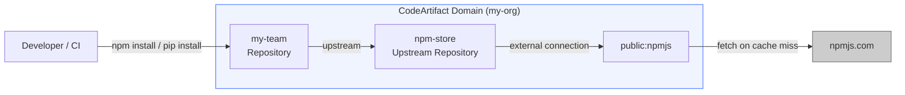
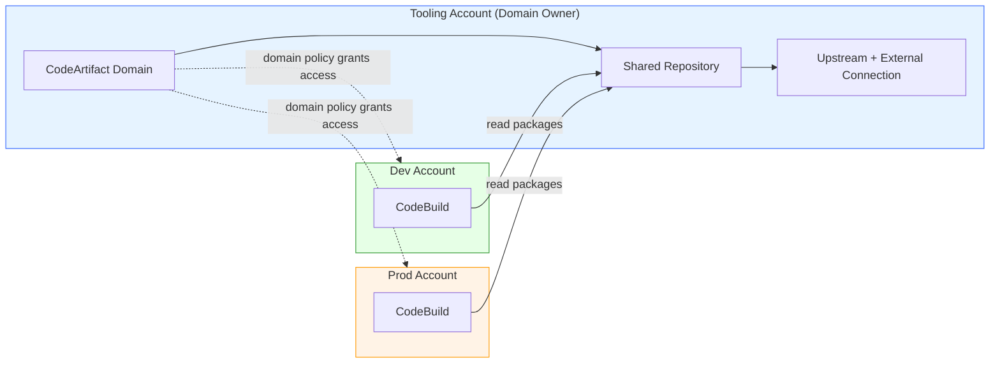

# Managing Your Software Supply Chain with AWS CodeArtifact

Every `npm install` in your CI pipeline depends on npmjs.com being up. Every `pip install` trusts that the package you're pulling is the one you intended, published by who you think published it. These are assumptions, not guarantees — and when they break, they break badly. npmjs.com outages halt deployments. Dependency confusion attacks inject malicious code through packages that impersonate internal libraries. And when something goes wrong, there's no audit trail showing what was pulled, when, or by whom.

AWS CodeArtifact solves these problems by sitting between your builds and the public internet. It acts as a managed proxy that caches packages from public registries (so builds survive upstream outages), hosts your private internal packages alongside public ones, enforces origin controls that block dependency confusion attacks, and logs every package operation through CloudTrail. One service, one authentication mechanism (IAM), and your entire dependency chain is under your control.

This post sets up a complete CodeArtifact workflow from scratch — creating the domain and repository hierarchy, connecting to public registries, configuring npm and pip, publishing internal packages, locking down the supply chain with origin controls, integrating with CodeBuild, and sharing packages across AWS accounts.

## Architecture Overview

Before touching the CLI, it helps to understand how CodeArtifact organizes things. The hierarchy has four levels, and the relationship between them determines how packages flow:



Key hierarchy:

- **Domain** — the organizational boundary. All package assets are stored once per domain, regardless of how many repositories reference them. A single KMS key encrypts everything in the domain. Cross-account access is controlled via domain resource policies. You can create up to 1,000 repositories per domain.
- **Repository** — what developers interact with. Each repository exposes endpoints for package managers (npm, pip, Maven, etc.) and can have one or more upstream repositories. This is where you point your `npm install` or `pip install`.
- **Upstream repository** — a repository that another repository pulls from when a requested package isn't found locally. This creates a resolution chain: your team repo → upstream repo → external connection → public registry.
- **External connection** — the bridge between CodeArtifact and a public registry like npmjs.com, PyPI, or Maven Central. AWS recommends one external connection per upstream repository — don't connect multiple public registries to the same upstream.

When you request a package, CodeArtifact walks the upstream chain. If found at any level, the package is cached at every repository in the chain. After the first resolution, subsequent requests are served directly from your team repository without traversing upstreams at all.

## Prerequisites

To follow along, you'll need:

- [AWS CLI v2](https://docs.aws.amazon.com/cli/latest/userguide/getting-started-install.html) configured with an IAM user or role that has permissions for CodeArtifact and IAM
- npm installed locally (the primary workflow demo uses npm)
- pip installed locally (optional — for the Python section)
- An AWS account — CodeArtifact costs are minimal ($0.05/GB/month storage, $0.05 per 10,000 requests)

## Setting Up CodeArtifact for npm

### Create a Domain

The domain is your top-level container. It provides storage deduplication (the same package version stored once regardless of how many repositories reference it), a single encryption boundary, and a policy attachment point for cross-account sharing. This command creates a domain named `my-org` — choose a name that represents your organization or team:

```bash
# Create the top-level domain — all repositories and packages live inside this
aws codeartifact create-domain --domain my-org
```

Note the `arn` in the output — you'll need it later for cross-account policies. The domain is created in whatever Region your CLI is configured for.

### Create an Upstream Repository with an External Connection

The recommended pattern is one dedicated upstream repository per public registry. This upstream repository holds the external connection (the proxy link to the public internet) and acts as the shared cache layer. First, create the repository, then attach the external connection that links it to npmjs.com:

```bash
# Create a repository that will serve as the upstream (proxy) for npmjs.com
aws codeartifact create-repository \
  --domain my-org \
  --repository npm-store \
  --description "Upstream proxy for npmjs.com"

# Attach the external connection — this makes npm-store a proxy for the public npm registry
aws codeartifact associate-external-connection \
  --domain my-org \
  --repository npm-store \
  --external-connection public:npmjs
```

At this point, `npm-store` can resolve any package from npmjs.com. But you don't point developers at this repository directly — you create a team-facing repository that uses it as an upstream.

### Create the Team-Facing Repository

This is the repository your developers interact with daily. It can hold both internal packages (published directly) and external packages (resolved through the upstream chain). Creating it and linking it to the upstream establishes the resolution chain:

```bash
# Create the repository developers will actually use
aws codeartifact create-repository \
  --domain my-org \
  --repository my-team \
  --description "Team packages — internal + cached npm"

# Link it to the upstream so unresolved packages flow through to npmjs.com
aws codeartifact update-repository \
  --domain my-org \
  --repository my-team \
  --upstreams repositoryName=npm-store
```

The chain is now: `my-team → npm-store → npmjs.com`. When a developer requests `lodash`, CodeArtifact checks `my-team` first, then `npm-store`, and only hits npmjs.com if neither has it cached.

### Configure npm to Use CodeArtifact

The `login` command generates a temporary auth token and configures your local npm client to use CodeArtifact as its registry. All subsequent `npm install` commands go through CodeArtifact instead of hitting npmjs.com directly:

```bash
# Authenticate npm to CodeArtifact — updates ~/.npmrc with the registry URL and token
aws codeartifact login \
  --tool npm \
  --domain my-org \
  --repository my-team
```

This does two things: sets the `registry` in your `.npmrc` to the CodeArtifact endpoint, and writes an auth token. The token expires after 12 hours by default (the maximum). After expiration, you'll need to run `login` again.

Now install a package to verify the setup works and observe the caching behavior:

```bash
# Install a package — this will be fetched from npmjs.com via the upstream chain
npm install lodash
```

Verify that the package was cached in CodeArtifact. This command lists all packages that have been resolved into your repository — you should see `lodash` after the install:

```bash
# List cached packages in the team repository
aws codeartifact list-packages \
  --domain my-org \
  --repository my-team \
  --query 'packages[*].{Name:package,Format:format}'
```

From now on, any subsequent `npm install lodash` — by you or anyone else pointed at this repository — is served directly from CodeArtifact without touching npmjs.com.

### Publish an Internal Package

CodeArtifact isn't just a cache — it's also a registry for your private packages. The `login` command already configured npm to publish to CodeArtifact, so any `npm publish` goes there instead of the public registry.

Create a minimal internal package to demonstrate. This creates a scoped package `@my-org/utils` with a single utility function:

```bash
# Create a directory for the internal package
mkdir -p my-org-utils && cd my-org-utils
```

Create `package.json` for the internal package. The `@my-org` scope namespaces it — this is important for origin controls later:

```json
{
  "name": "@my-org/utils",
  "version": "1.0.0",
  "description": "Internal shared utilities",
  "main": "index.js"
}
```

Create `index.js` — a simple function that the package exports:

```javascript
// A shared utility function used across internal services
function formatResponse(statusCode, body) {
  return {
    statusCode,
    headers: { 'Content-Type': 'application/json' },
    body: JSON.stringify(body)
  };
}

module.exports = { formatResponse };
```

Publish it to CodeArtifact:

```bash
# Publish the internal package — goes to CodeArtifact, not npmjs.com
npm publish
```

Verify it's available. This confirms the package and its version are stored in your team repository:

```bash
# Check the published package version
aws codeartifact list-package-versions \
  --domain my-org \
  --repository my-team \
  --package utils \
  --namespace my-org \
  --format npm
```

Now any team member can `npm install @my-org/utils` — internal and external packages come from the same registry, with a single authentication mechanism.

Return to the parent directory before continuing:

```bash
# Move back to the working directory for the remaining steps
cd ..
```

## Package Origin Controls — Preventing Dependency Confusion

Here's a real attack scenario: an attacker notices your internal packages use the namespace `@my-org`. They publish a package called `@my-org/utils` to the *public* npm registry with version `99.0.0`. Without protection, your builds might resolve the attacker's version (higher semver wins in some resolution strategies) instead of your internal `1.0.0`.

CodeArtifact defends against this with package origin controls — per-package rules that determine where new versions can come from.

Two controls exist for each package:

- **Publish:** `ALLOW` or `BLOCK` — can new versions be published directly to this repository?
- **Upstream:** `ALLOW` or `BLOCK` — can new versions be ingested from upstream/external connections?

The critical default behavior: when you publish a package for the first time, CodeArtifact automatically sets **Publish=ALLOW, Upstream=BLOCK**. This means the public registry can never inject versions of your internal packages — only direct publishes are allowed. This is the built-in defense against dependency confusion.

You can also explicitly set origin controls. This command blocks upstream ingestion for a specific package — even if someone removes the default protection accidentally:

```bash
# Explicitly block upstream ingestion for an internal package
aws codeartifact put-package-origin-configuration \
  --domain my-org \
  --repository my-team \
  --format npm \
  --namespace my-org \
  --package utils \
  --restrictions publish=ALLOW,upstream=BLOCK
```

### Package Groups — Origin Controls at Scale

Setting origin controls package-by-package doesn't scale. Package groups let you define origin controls for entire namespaces using glob patterns. This command creates a group that blocks all packages matching `@my-org/*` from being ingested from upstream — they must be published internally:

```bash
# Create a package group that protects all @my-org scoped packages
aws codeartifact create-package-group \
  --domain my-org \
  --format npm \
  --package-group "npm/@my-org/*" \
  --description "Internal packages — block upstream ingestion"

# Set origin controls on the group
aws codeartifact update-package-group-origin-configuration \
  --domain my-org \
  --package-group "npm/@my-org/*" \
  --restrictions "{\"publish\":{\"restrictionMode\":\"ALLOW\"},\"externalUpstream\":{\"restrictionMode\":\"BLOCK\"}}"
```

Now any new package published under `@my-org/` automatically inherits the BLOCK upstream rule. No one can inject a malicious version from the public registry, regardless of version numbers.

## Configuring pip (Python) — Same Domain, Different Format

CodeArtifact repositories are polyglot — a single repository can hold npm, pip, Maven, NuGet, Cargo, Ruby, Swift, and generic packages simultaneously. You can add multiple upstreams to one repository and serve every ecosystem from a single endpoint.

In practice, many teams create separate consumer repositories per language. This gives you independent access controls (your Python data team doesn't need visibility into frontend npm packages), cleaner package lists, and simpler upstream chains where each repository connects to one public registry. The domain still provides deduplication and shared governance across all of them.

Create a dedicated upstream repository for PyPI (same pattern as `npm-store` — one external connection per upstream), then create a team-facing repository for Python:

```bash
# Create the PyPI upstream repository
aws codeartifact create-repository \
  --domain my-org \
  --repository pypi-store \
  --description "Upstream proxy for PyPI"

# Attach the PyPI external connection
aws codeartifact associate-external-connection \
  --domain my-org \
  --repository pypi-store \
  --external-connection public:pypi

# Create a separate team repository for Python packages
aws codeartifact create-repository \
  --domain my-org \
  --repository my-team-python \
  --description "Team Python packages"

# Link it to the PyPI upstream
aws codeartifact update-repository \
  --domain my-org \
  --repository my-team-python \
  --upstreams repositoryName=pypi-store
```

Configure pip to use CodeArtifact. This updates your pip configuration to point at the Python repository's endpoint:

```bash
# Authenticate pip to CodeArtifact
aws codeartifact login \
  --tool pip \
  --domain my-org \
  --repository my-team-python
```

Install a package to verify:

```bash
# Install a Python package through CodeArtifact
pip install requests
```

Check that it was cached:

```bash
# Verify the package is cached in CodeArtifact
aws codeartifact list-packages \
  --domain my-org \
  --repository my-team-python \
  --format pypi \
  --query 'packages[*].{Name:package}'
```

The key insight: both repositories live in the same domain (`my-org`). Package assets are deduplicated at the domain level, and both teams benefit from the same encryption, audit logging, and cross-account sharing infrastructure — regardless of whether they share a repository or not.

## CI/CD Integration — Using CodeArtifact in CodeBuild

The real value of CodeArtifact shows up in CI/CD. When your builds authenticate to CodeArtifact instead of pulling directly from public registries, you get resilience (cached packages survive upstream outages), speed (packages served from within AWS), and auditability (every install logged in CloudTrail).

The pattern is straightforward: add `aws codeartifact login` to the `install` phase of your buildspec, before any package installation happens. This buildspec authenticates to CodeArtifact, installs dependencies from the private registry, then runs tests:

```yaml
version: 0.2

phases:
  install:
    runtime-versions:
      nodejs: 18
    commands:
      # Authenticate npm to CodeArtifact before any package installation
      - echo "=== Configuring CodeArtifact ==="
      - aws codeartifact login --tool npm --domain my-org --repository my-team
      - echo "npm registry set to CodeArtifact"

  pre_build:
    commands:
      # Dependencies are resolved from CodeArtifact (cached or fetched from upstream)
      - echo "=== Installing dependencies ==="
      - npm ci
      - echo "=== Running tests ==="
      - npm test

  build:
    commands:
      - echo "=== Building application ==="
      - npm run build
```

The CodeBuild service role needs specific permissions to authenticate with CodeArtifact. Add these to the role's IAM policy — they grant the ability to get an auth token and read packages from the repository:

```json
{
  "Version": "2012-10-17",
  "Statement": [
    {
      "Sid": "CodeArtifactAuth",
      "Effect": "Allow",
      "Action": [
        "codeartifact:GetAuthorizationToken",
        "codeartifact:GetRepositoryEndpoint",
        "codeartifact:ReadFromRepository"
      ],
      "Resource": "*"
    },
    {
      "Sid": "CodeArtifactToken",
      "Effect": "Allow",
      "Action": "sts:GetServiceBearerToken",
      "Resource": "*",
      "Condition": {
        "StringEquals": {
          "sts:AWSServiceName": "codeartifact.amazonaws.com"
        }
      }
    }
  ]
}
```

The `sts:GetServiceBearerToken` permission is required because `aws codeartifact login` uses STS to generate a bearer token for authenticating with the repository endpoint. Without it, the login command fails silently and npm falls back to the public registry.

**Token lifetime in CI:** the auth token generated by `login` lasts 12 hours — more than enough for any build job. You don't need to worry about token refresh in CI. For long-running processes (development containers, preview environments), you'd need a mechanism to periodically re-run the login command.

## Cross-Account Sharing — Domain Policies

In multi-account organizations, the typical pattern is: a central tooling account owns the CodeArtifact domain, and development, staging, and production accounts consume packages from it. This centralizes package management while allowing each account to operate independently.



To enable this, attach a resource policy to the domain that grants read access to the consuming accounts. This policy allows two accounts (dev and prod) to authenticate and read packages from any repository in the domain:

```bash
# Create the domain policy file
cat > domain-policy.json << 'EOF'
{
  "Version": "2012-10-17",
  "Statement": [
    {
      "Sid": "AllowCrossAccountRead",
      "Effect": "Allow",
      "Principal": {
        "AWS": [
          "arn:aws:iam::<DEV_ACCOUNT_ID>:root",
          "arn:aws:iam::<PROD_ACCOUNT_ID>:root"
        ]
      },
      "Action": [
        "codeartifact:GetAuthorizationToken",
        "codeartifact:GetRepositoryEndpoint",
        "codeartifact:ReadFromRepository",
        "codeartifact:List*",
        "codeartifact:DescribeRepository"
      ],
      "Resource": "*"
    }
  ]
}
EOF

# Attach the policy to the domain
aws codeartifact put-domain-permissions-policy \
  --domain my-org \
  --policy-document file://domain-policy.json
```

From the consuming account (dev or prod), the CodeBuild role authenticates to CodeArtifact by specifying the domain owner's account. This command targets the domain in the tooling account while running from the dev account:

```bash
# Run from the consuming account — targets the domain owner's account
aws codeartifact login \
  --tool npm \
  --domain my-org \
  --domain-owner <TOOLING_ACCOUNT_ID> \
  --repository my-team
```

For finer-grained control, you can also attach policies at the repository level — for example, giving prod accounts read-only access to only the `release` repository, not the `dev` repository.

## Operational Considerations

### Storage and Costs

Packages are deduplicated at the domain level. If 10 repositories reference `lodash@4.17.21`, the bytes are stored once — you pay for one copy. Pricing is $0.05/GB/month for storage and $0.05 per 10,000 requests. For most teams, this amounts to a few dollars per month. See the [CodeArtifact pricing page](https://aws.amazon.com/codeartifact/pricing/) for current rates and free tier details.

### Token Management

Auth tokens expire after a maximum of 12 hours. In CI/CD this isn't a problem — generate a fresh token at the start of each build. For local development, developers need to re-run `aws codeartifact login` daily (or whenever they get 401 errors). Some teams add a shell alias or git hook to automate this.

You can also generate a token directly for scripting. This gives you the raw token without modifying any config files:

```bash
# Get a raw token for scripting purposes (12-hour default, configurable)
CODEARTIFACT_AUTH_TOKEN=$(aws codeartifact get-authorization-token \
  --domain my-org \
  --query authorizationToken \
  --output text)
```

### VPC Endpoints

If your CodeBuild projects run in a VPC (common in security-sensitive environments), you need a VPC endpoint for CodeArtifact. Without it, the `login` command can't reach the CodeArtifact API, and package downloads fail. Create endpoints for both `codeartifact.api` and `codeartifact.repositories` in your VPC.

### CloudTrail Integration

Every CodeArtifact API call is logged in CloudTrail — `GetAuthorizationToken`, `GetPackageVersionAsset`, `PublishPackageVersion`, all of it. This gives you a complete audit trail: who published what, when, and who consumed which packages. For compliance-heavy environments, this alone justifies using CodeArtifact over pulling directly from public registries.

### Encryption

All packages are encrypted at rest using the domain's KMS key. If you don't specify a KMS key when creating the domain, CodeArtifact uses an AWS-managed key. Encryption is completely transparent — no client-side configuration needed, no performance impact.

## Clean Up

Remove everything in reverse order — repositories first, then the domain. Deleting the domain deletes all packages stored in it, so only do this for lab environments:

```bash
# Delete the repositories
aws codeartifact delete-repository --domain my-org --repository my-team
aws codeartifact delete-repository --domain my-org --repository npm-store
aws codeartifact delete-repository --domain my-org --repository my-team-python
aws codeartifact delete-repository --domain my-org --repository pypi-store

# Delete the domain (this is irreversible — all package data is lost)
aws codeartifact delete-domain --domain my-org

# Restore your local npm configuration to point back to the public registry
npm config delete registry

# Restore pip configuration
pip config unset global.index-url
```

## Conclusion

CodeArtifact sits between your source code and your builds — a single control point where you can enforce availability, security, and governance in one place. The three things it gives you:

1. **Availability** — packages are cached in your AWS account. Public registry outages don't break your builds.
2. **Security** — origin controls block dependency confusion attacks by default. Package groups scale this protection across your entire namespace.
3. **Governance** — every package operation is logged in CloudTrail. Cross-account sharing via domain policies gives you centralized control with distributed consumption.

The setup is minimal: a domain, an upstream repository with an external connection, and a team-facing repository. Point your package manager at it with `aws codeartifact login`, and everything else — caching, deduplication, encryption, audit logging — happens automatically.
